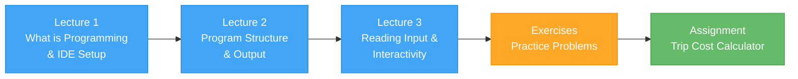

# Week 1 – Getting Started with C# and Programming

[← Back to Course Home](../../README.md)

---

## Overview

Welcome to your first week of programming! This week you will learn what programming is, set up your development tools, and write your first interactive C# programs. By the end of this week, you will be comfortable creating, running, and understanding simple console applications.

## Learning Objectives

By the end of this week, you will be able to:

- Explain what programming is and how computers execute code
- Set up and navigate Visual Studio or VS Code with the .NET SDK
- Understand the basic structure of a C# program
- Display output to the console using `Console.WriteLine()` and `Console.Write()`
- Read user input using `Console.ReadLine()`
- Convert string input to numbers with `int.Parse()` and `double.Parse()`
- Use comments to document your code
- Use string interpolation for cleaner output
- Build a small interactive console application

## Materials

| # | Material | Description |
|---|----------|-------------|
| 1 | [Lecture 1 – What is Programming & Setting Up](./lecture-1.md) | Programming concepts, how code runs, C#/.NET overview, IDE setup |
| 2 | [Lecture 2 – Program Structure & Output](./lecture-2.md) | Program anatomy, `Console.WriteLine`, escape characters, comments |
| 3 | [Lecture 3 – Reading Input & Your First Interactive Program](./lecture-3.md) | `Console.ReadLine`, type conversion, string interpolation |
| 4 | [Exercises](./exercises.md) | Practice problems covering all three lectures |
| 5 | [Assignment – Trip Cost Calculator](./assignment.md) | Weekly mini-project |

## Tools You Need

Before the first lecture, please install one of the following:

**Option A — Visual Studio 2022 Community (Recommended for Windows)**
1. Download from [visualstudio.microsoft.com/downloads](https://visualstudio.microsoft.com/downloads/)
2. During installation, select the **".NET desktop development"** workload

**Option B — VS Code (Windows / macOS / Linux)**
1. Download VS Code from [code.visualstudio.com](https://code.visualstudio.com/)
2. Download the .NET SDK from [dotnet.microsoft.com/download](https://dotnet.microsoft.com/download)
3. Install the **C# Dev Kit** extension in VS Code

**Verify your installation** by opening a terminal and typing:

```bash
dotnet --version
```

You should see a version number (e.g., `8.0.100` or higher).

## Week at a Glance



---

[← Back to Course Home](../../README.md) | [Start Lecture 1 →](./lecture-1.md)
