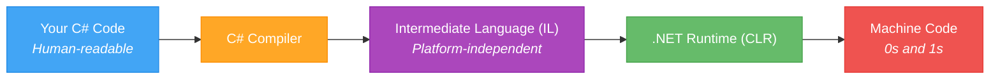
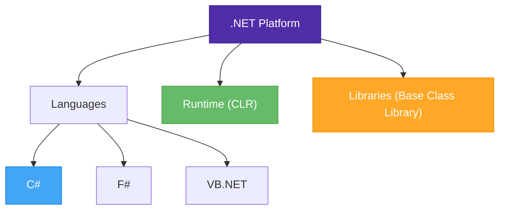
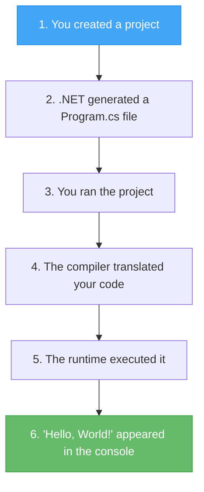

# Lecture 1: What is Programming & Setting Up

[← Back to Week 1 Overview](./README.md) | [Next: Lecture 2 – Program Structure & Output →](./lecture-2.md)

---

## Lecture Overview

| Item | Detail |
|------|--------|
| Duration | 45 minutes |
| Topics | What is programming, how code runs, C#/.NET, IDE setup, first project |
| Preparation | Install Visual Studio or VS Code (see Week 1 README) |

---

## 1. What is Programming?

**Programming** is the process of writing instructions that tell a computer what to do. These instructions are written in a **programming language** — a structured language that both humans and computers can understand (after translation).

Think of it like writing a recipe:

- A **recipe** gives step-by-step instructions to a cook
- A **program** gives step-by-step instructions to a computer

The key difference: computers follow instructions **exactly and literally**. They don't guess, assume, or improvise. If your instructions are unclear or wrong, the computer will either do the wrong thing or refuse to proceed.

### Real-World Examples of Programs

Programs are everywhere:

- A **calculator app** takes numbers and operations, then computes results
- A **weather app** fetches data from the internet and displays it
- A **video game** processes player input, updates the game world, and renders graphics
- A **website** responds to user clicks and displays content

All of these are just sets of instructions written by programmers.

---

## 2. How Computers Execute Code

Computers only understand **machine code** — sequences of 0s and 1s. Since writing in binary is impractical, we use **high-level programming languages** like C# that are closer to human language.

But the computer cannot directly run C# code. It needs to be **translated** first. This translation process is called **compilation**.



**The process:**
1. You write code in **C#** (a high-level language)
2. The **C# compiler** translates your code into **Intermediate Language (IL)** — a lower-level format
3. The **.NET Runtime (CLR)** takes the IL and converts it to **machine code** that your specific computer understands
4. The computer executes the machine code

> **You don't need to memorize this process.** Just understand that your C# code goes through a translation step before the computer can run it.

---

## 3. Where C# Fits In

C# (pronounced "C sharp") is a **general-purpose, object-oriented programming language** developed by Microsoft as part of the .NET platform. It is widely used for building desktop applications, web applications, games (Unity), mobile apps, and more.

### Why C# for This Course?

- **Readable syntax** — C# reads close to English, making it a good first language
- **Strongly typed** — it catches many errors before your program runs
- **Widely used** — large community, lots of jobs, extensive documentation
- **Versatile** — from console apps to web APIs to games

### How C# Relates to .NET



**.NET** is the platform. **C#** is one of the languages you can use on that platform. The platform provides the runtime that executes your code and a large library of pre-built functionality you can use.

---

## 4. Setting Up Your Development Environment

A **development environment** (or IDE — Integrated Development Environment) is the application where you write, run, and debug your code.

### Option A: Visual Studio 2022 Community (Recommended for Windows)

1. Go to [visualstudio.microsoft.com/downloads](https://visualstudio.microsoft.com/downloads/)
2. Download **Visual Studio 2022 Community Edition** (free)
3. Run the installer
4. When prompted to select workloads, check **".NET desktop development"**
5. Click **Install** and wait for it to complete

### Option B: VS Code (Windows / macOS / Linux)

1. Download VS Code from [code.visualstudio.com](https://code.visualstudio.com/)
2. Download the .NET SDK from [dotnet.microsoft.com/download](https://dotnet.microsoft.com/download)
3. Open VS Code and install the **C# Dev Kit** extension from the Extensions panel

### Verifying Your Installation

Open a terminal (Command Prompt, PowerShell, or Terminal on macOS/Linux) and type:

```bash
dotnet --version
```

You should see a version number like `8.0.100` or higher. If you see an error, the .NET SDK is not installed correctly.

---

## 5. Creating Your First Project

Let's create a project and see it run — even before we understand every line of code.

### Using the Terminal (Works for Both IDEs)

```bash
dotnet new console -n HelloWorld
cd HelloWorld
dotnet run
```

You should see the output:

```
Hello, World!
```

### Using Visual Studio

1. Open Visual Studio
2. Click **"Create a new project"**
3. Search for **"Console App"** and select **Console App** (make sure it says C# and .NET)
4. Name your project `HelloWorld` and choose a location
5. Click **Create**
6. Visual Studio generates a project with a `Program.cs` file
7. Click the green **Run** button (or press `F5`)

### What Just Happened?



When you open `Program.cs`, you'll see:

```csharp
// See https://aka.ms/new-console-template for more information
Console.WriteLine("Hello, World!");
```

This single line of code is a complete program. It tells the computer to display the text `Hello, World!` on the screen. We'll break down exactly how this works in Lecture 2.

---

## 6. Navigating Your IDE

Before moving on, familiarize yourself with these key parts of your IDE:

### Visual Studio

- **Solution Explorer** (right panel) — shows your project files
- **Editor** (center) — where you write code
- **Output/Terminal** (bottom) — where your program's output appears
- **Error List** (bottom) — shows compilation errors
- **Run button** (green arrow, or `F5`) — runs your program

### VS Code

- **Explorer** (left panel) — shows your project files
- **Editor** (center) — where you write code
- **Terminal** (bottom, open with `` Ctrl+` ``) — where you run commands and see output
- **Problems panel** (bottom) — shows errors and warnings

---

## Key Takeaways

- Programming is writing step-by-step instructions for a computer
- C# code is compiled (translated) before the computer can run it
- C# is part of the .NET platform — the platform provides the runtime and libraries
- An IDE (Visual Studio or VS Code) is where you write, run, and debug code
- `dotnet new console` creates a new console project
- `dotnet run` compiles and runs your project
- Every C# program starts with a `Program.cs` file

---

## Hands-On Exercises

### Exercise 1 — Create and Run
Create a new console project called `MyFirstApp` using the terminal:
```bash
dotnet new console -n MyFirstApp
cd MyFirstApp
dotnet run
```
Run it and confirm you see `Hello, World!` in the terminal.

### Exercise 2 — Modify the Output
Open `Program.cs` and change the message from `"Hello, World!"` to `"My name is [your name] and I'm learning C#!"`. Run the program again.

### Exercise 3 — Explore the IDE
Practice the following actions in your IDE:
1. Find the Solution Explorer / Explorer and locate your `Program.cs` file
2. Open the built-in terminal
3. Run your program using both the IDE button and the `dotnet run` command
4. Introduce a deliberate error (e.g., remove a semicolon) and observe the error message

---

[← Back to Week 1 Overview](./README.md) | [Next: Lecture 2 – Program Structure & Output →](./lecture-2.md)
