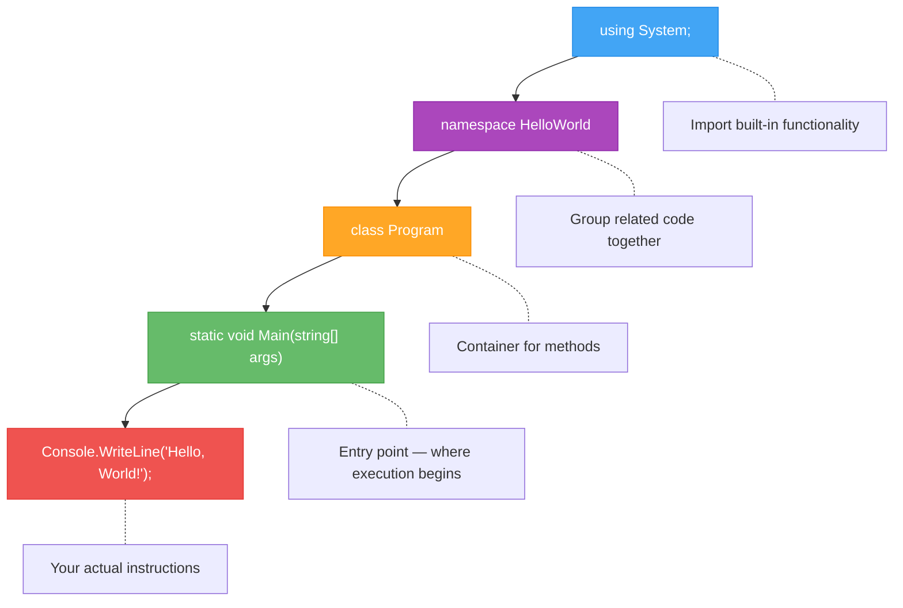
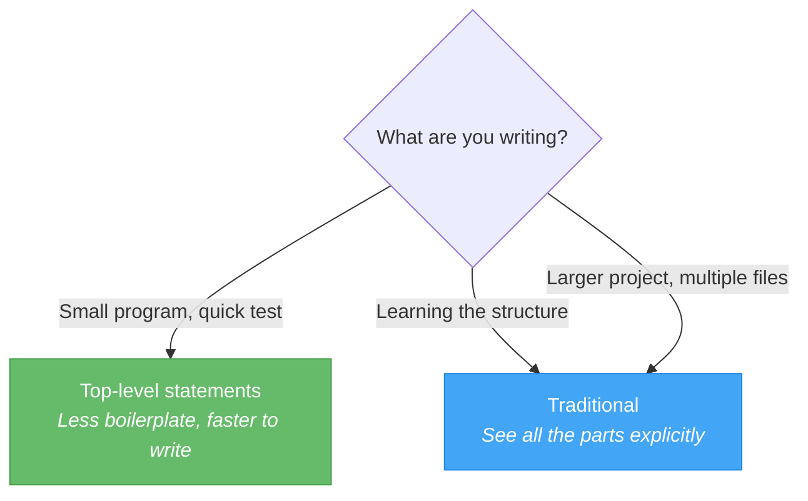
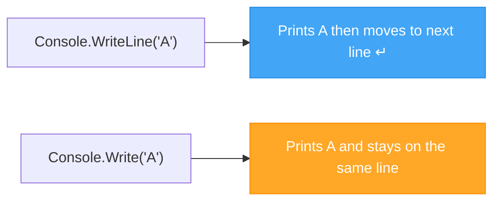

# Lecture 2: Structure of a C# Program & Output

[← Previous: Lecture 1 – What is Programming](./lecture-1.md) | [Back to Week 1 Overview](./README.md) | [Next: Lecture 3 – Reading Input →](./lecture-3.md)

---

## Lecture Overview

| Item | Detail |
|------|--------|
| Duration | 45 minutes |
| Topics | Program anatomy, Main method, `Console.WriteLine`, `Console.Write`, escape characters, comments |
| Preparation | Completed Lecture 1 exercises, IDE ready |

---

## 1. The Full Structure of a C# Program

In Lecture 1, you saw a single line of code in `Program.cs`:

```csharp
Console.WriteLine("Hello, World!");
```

This works because modern C# supports **top-level statements** — a shorthand that hides the surrounding structure. But behind the scenes, every C# program has a specific structure. Understanding it now will make everything else in this course easier.

### The Traditional Structure

```csharp
using System;

namespace HelloWorld
{
    class Program
    {
        static void Main(string[] args)
        {
            Console.WriteLine("Hello, World!");
        }
    }
}
```

Let's break this down piece by piece.

### Anatomy of a C# Program



### `using System;`

This line tells C# to include the **System** library, which contains fundamental classes like `Console`. Without this, you would need to write `System.Console.WriteLine(...)` every time.

```csharp
using System;    // Now we can use Console, Math, String, etc. directly
```

> In modern C# with top-level statements, this is automatically included. But in the traditional structure, you need it explicitly.

### `namespace HelloWorld`

A **namespace** groups related code together, like a folder for your classes. It helps avoid naming conflicts when projects get large.

```csharp
namespace HelloWorld    // Our namespace — the name usually matches the project
{
    // Classes go here
}
```

### `class Program`

A **class** is a container for related code. Every piece of code in C# must live inside a class. We will explore classes in depth during the OOP block (Weeks 7–11), but for now, think of it as a required wrapper around your code.

```csharp
class Program    // Our class is called "Program" — the name is a convention
{
    // Methods (functions) go here
}
```

### `static void Main(string[] args)`

This is the **entry point** of your program — the first method the computer runs when you start the application. Every traditional C# console application needs a `Main` method.

Let's decode each word:

| Keyword | Meaning |
|---------|---------|
| `static` | Can be called without creating an object (more on this later) |
| `void` | This method does not return a value |
| `Main` | Special name — the runtime looks for this method to start |
| `string[] args` | An array of command-line arguments (you can ignore this for now) |

```csharp
static void Main(string[] args)
{
    // Your program instructions go here
    // Code runs from top to bottom
}
```

---

## 2. Top-Level Statements vs. Traditional Structure

Starting with C# 9 and .NET 6+, you can write programs without the full ceremony:

### Top-Level Statements (Modern)

```csharp
Console.WriteLine("Hello, World!");
```

### Traditional (Explicit)

```csharp
using System;

namespace HelloWorld
{
    class Program
    {
        static void Main(string[] args)
        {
            Console.WriteLine("Hello, World!");
        }
    }
}
```

Both produce **exactly the same result**. The top-level version is just shorter — the compiler generates the missing parts automatically.

### Which Should You Use?



In this course, we will primarily use **top-level statements** for simplicity but reference the traditional structure so you understand what is happening underneath.

---

## 3. Displaying Output with `Console.WriteLine()`

The most fundamental thing a program can do is display information to the user. In C#, we use the `Console` class for this.

### `Console.WriteLine()` — Print with a New Line

```csharp
Console.WriteLine("Hello, World!");
Console.WriteLine("Welcome to C# programming.");
Console.WriteLine("This is line three.");
```

**Output:**
```
Hello, World!
Welcome to C# programming.
This is line three.
```

Each `Console.WriteLine()` prints its content and then moves the cursor to the **next line**.

### `Console.Write()` — Print Without a New Line

```csharp
Console.Write("Hello, ");
Console.Write("World");
Console.Write("!");
Console.WriteLine();   // Just moves to the next line
Console.WriteLine("This is on a new line.");
```

**Output:**
```
Hello, World!
This is on a new line.
```

### The Difference at a Glance



### Printing Numbers and Mixing Types

You can print numbers directly, and you can combine text and numbers:

```csharp
Console.WriteLine(42);
Console.WriteLine(3.14);
Console.WriteLine("The answer is " + 42);
Console.WriteLine("Pi is approximately " + 3.14);
```

**Output:**
```
42
3.14
The answer is 42
Pi is approximately 3.14
```

### Printing an Empty Line

```csharp
Console.WriteLine("Line one.");
Console.WriteLine();              // Prints nothing, just an empty line
Console.WriteLine("Line three.");
```

**Output:**
```
Line one.

Line three.
```

---

## 4. Escape Characters

Sometimes you need to include special characters in your text — like a new line inside a string, a tab, or a quotation mark. C# uses **escape characters** (starting with `\`) for this.

| Escape Character | Meaning | Example Output |
|-----------------|---------|----------------|
| `\n` | New line | Line 1↵Line 2 |
| `\t` | Tab | Name→Value |
| `\\` | Backslash | C:\Users |
| `\"` | Double quote | He said "hi" |

### Examples

```csharp
Console.WriteLine("First line\nSecond line");
Console.WriteLine("Name:\tAlice");
Console.WriteLine("Path: C:\\Users\\Alice");
Console.WriteLine("She said \"hello\" to me.");
```

**Output:**
```
First line
Second line
Name:	Alice
Path: C:\Users\Alice
She said "hello" to me.
```

---

## 5. Comments

Comments are notes you write in your code that the computer **ignores completely**. They are for humans — to explain what the code does, why it does it, or to leave reminders.

### Single-Line Comments (`//`)

```csharp
// This is a comment — the computer ignores this line
Console.WriteLine("Hello!");   // This comment is at the end of a line
```

### Multi-Line Comments (`/* ... */`)

```csharp
/* 
   This is a multi-line comment.
   It can span as many lines as you need.
   Useful for longer explanations.
*/
Console.WriteLine("Hello!");
```

### When to Use Comments

Comments are useful when they explain **why** something is done, not **what** is done. Compare:

```csharp
// BAD COMMENT — states the obvious
Console.WriteLine("Hello");   // Print Hello

// GOOD COMMENT — explains the purpose
Console.WriteLine("Hello");   // Greet the user before asking for input
```

> **Rule of thumb:** If the code is clear on its own, you don't need a comment. Use comments to explain decisions, assumptions, or complex logic.

---

## 6. Putting It All Together

Here is a complete program that uses everything from this lecture:

```csharp
// Student Introduction Card Generator
// This program displays a formatted card with student information

/* 
   We are using Console.WriteLine for lines that need to end with a newline
   and Console.Write when we want to stay on the same line.
*/

Console.WriteLine("╔════════════════════════════════╗");
Console.WriteLine("║   Student Introduction Card    ║");
Console.WriteLine("╠════════════════════════════════╣");
Console.WriteLine("║ Name:\tAlice Smith              ║");
Console.WriteLine("║ Course:\tIntro to C#          ║");
Console.WriteLine("║ Hobby:\tReading              ║");
Console.WriteLine("╚════════════════════════════════╝");

Console.WriteLine();   // Empty line for spacing

Console.Write("This program was written ");
Console.Write("using C# ");
Console.WriteLine("top-level statements.");

// Next lecture: we'll make this interactive by reading user input!
```

**Output:**
```
╔════════════════════════════════╗
║   Student Introduction Card    ║
╠════════════════════════════════╣
║ Name:	Alice Smith              ║
║ Course:	Intro to C#          ║
║ Hobby:	Reading              ║
╚════════════════════════════════╝

This program was written using C# top-level statements.
```

---

## Key Takeaways

- Every C# program has a structure: `using`, `namespace`, `class`, `Main` — even if top-level statements hide it
- `Console.WriteLine()` prints text and moves to a new line
- `Console.Write()` prints text and stays on the same line
- Escape characters (`\n`, `\t`, `\\`, `\"`) let you include special characters in strings
- Comments (`//` and `/* */`) document your code for humans — the computer ignores them
- Good comments explain **why**, not **what**

---

## Hands-On Exercises

### Exercise 1 — Write vs. WriteLine
Predict the output of this program, then run it to check your answer:

```csharp
Console.Write("A");
Console.Write("B");
Console.Write("C");
Console.WriteLine();
Console.WriteLine("D");
Console.Write("E");
Console.Write("F");
```

### Exercise 2 — Escape Characters
Write a program that produces this exact output (pay attention to tabs and quotes):

```
Product:	"C# Handbook"
Price:		$29.99
In Stock:	Yes
File Path:	C:\Books\CSharp\handbook.pdf
```

### Exercise 3 — Your Introduction Card
Write a program that displays a bordered introduction card using your own information. Include at least one use of `\t` for alignment and at least two comments.

---

[← Previous: Lecture 1 – What is Programming](./lecture-1.md) | [Back to Week 1 Overview](./README.md) | [Next: Lecture 3 – Reading Input →](./lecture-3.md)
