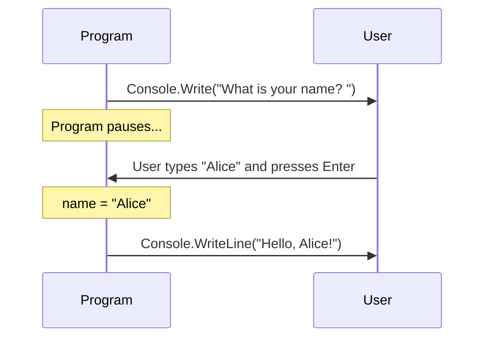
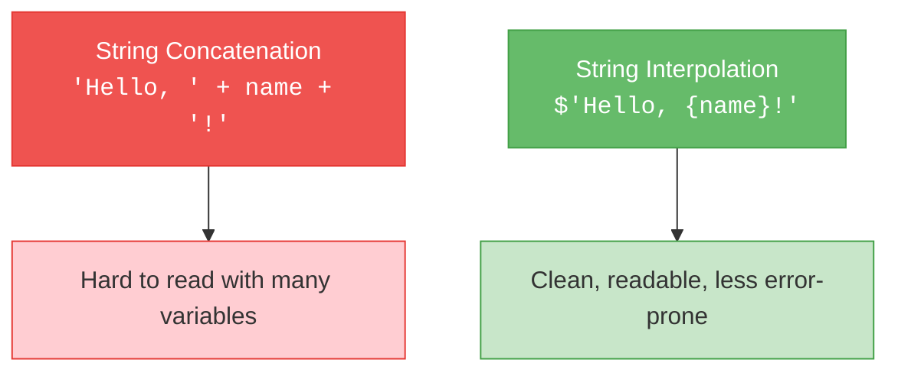
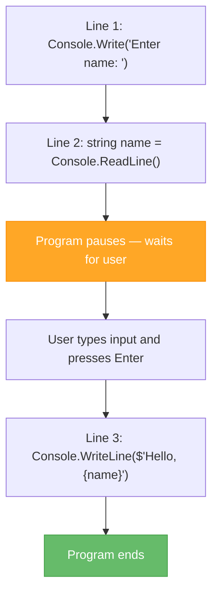

# Lecture 3: Reading Input & Your First Interactive Program

[← Previous: Lecture 2 – Program Structure & Output](./lecture-2.md) | [Back to Week 1 Overview](./README.md)

---

## Lecture Overview

| Item | Detail |
|------|--------|
| Duration | 45 minutes |
| Topics | `Console.ReadLine`, type conversion, string concatenation vs interpolation, interactive programs |
| Preparation | Completed Lecture 1 & 2 exercises |

---

## 1. Reading Input with `Console.ReadLine()`

So far, our programs have only **displayed** information. Now it's time to make them **interactive** by reading input from the user.

### Basic Usage

`Console.ReadLine()` pauses the program and waits for the user to type something and press **Enter**. It returns whatever the user typed as a **string** (text).

```csharp
Console.Write("What is your name? ");
string name = Console.ReadLine();
Console.WriteLine("Hello, " + name + "!");
```

**Sample run:**
```
What is your name? Alice
Hello, Alice!
```

### How It Works — Step by Step



### Important: `ReadLine()` Always Returns a String

No matter what the user types — even if they type a number — `Console.ReadLine()` gives you a **string**. This distinction becomes critical in the next section.

```csharp
Console.Write("Enter a number: ");
string input = Console.ReadLine();    // Even "42" is stored as the text "42"
```

---

## 2. Converting Input to Numbers

Since `Console.ReadLine()` always returns a string, you cannot do math with it directly. You need to **convert** (parse) the string into a number.

### `int.Parse()` — Convert to a Whole Number

```csharp
Console.Write("Enter your age: ");
string input = Console.ReadLine();
int age = int.Parse(input);           // Convert string "25" to number 25
Console.WriteLine("Next year you will be " + (age + 1));
```

You can also combine the two lines:

```csharp
Console.Write("Enter your age: ");
int age = int.Parse(Console.ReadLine());    // Read and convert in one line
```

### `double.Parse()` — Convert to a Decimal Number

```csharp
Console.Write("Enter a price: ");
double price = double.Parse(Console.ReadLine());
Console.WriteLine("With tax: " + (price * 1.1));
```

### What Happens If the User Types Invalid Input?

If the user types something that isn't a valid number (like "hello" when you expect a number), the program will **crash** with an error. We will learn how to handle this gracefully in Week 12 (Exception Handling). For now, assume the user enters valid input.

### Example: Simple Calculator

```csharp
Console.Write("Enter first number: ");
int a = int.Parse(Console.ReadLine());

Console.Write("Enter second number: ");
int b = int.Parse(Console.ReadLine());

int sum = a + b;
Console.WriteLine("The sum is: " + sum);
```

**Sample run:**
```
Enter first number: 12
Enter second number: 8
The sum is: 20
```

---

## 3. String Concatenation vs. String Interpolation

We have been joining strings together using the `+` operator. This is called **concatenation**. It works, but it gets messy fast.

### Concatenation (the `+` approach)

```csharp
string name = "Alice";
int age = 25;
string city = "Amsterdam";

Console.WriteLine("My name is " + name + ", I am " + age + " years old, and I live in " + city + ".");
```

This is hard to read — lots of quotes, plus signs, and spaces to manage.

### String Interpolation (the `$` approach)

String interpolation lets you embed variables directly inside a string by prefixing it with `$` and wrapping variables in `{}`:

```csharp
string name = "Alice";
int age = 25;
string city = "Amsterdam";

Console.WriteLine($"My name is {name}, I am {age} years old, and I live in {city}.");
```

**Both produce exactly the same output:**
```
My name is Alice, I am 25 years old, and I live in Amsterdam.
```

### Why Interpolation is Better



### You Can Put Expressions Inside `{}`

Interpolation is not limited to simple variables — you can put any expression inside the braces:

```csharp
int age = 25;
Console.WriteLine($"Next year you will be {age + 1}.");
Console.WriteLine($"Double your age is {age * 2}.");
Console.WriteLine($"Five plus three is {5 + 3}.");
```

**Output:**
```
Next year you will be 26.
Double your age is 50.
Five plus three is 8.
```

---

## 4. Complete Example: Interactive Program

Let's combine everything from this lecture into one program:

```csharp
// Interactive greeting program
Console.WriteLine("=== Personal Info Card Generator ===");
Console.WriteLine();

// Gather information
Console.Write("Enter your first name: ");
string firstName = Console.ReadLine();

Console.Write("Enter your last name: ");
string lastName = Console.ReadLine();

Console.Write("Enter your age: ");
int age = int.Parse(Console.ReadLine());

Console.Write("Enter your city: ");
string city = Console.ReadLine();

// Calculate some fun facts
int birthYear = 2025 - age;   // Approximate
int ageIn10Years = age + 10;

// Display the results using string interpolation
Console.WriteLine();
Console.WriteLine("╔══════════════════════════════════╗");
Console.WriteLine("║       PERSONAL INFO CARD         ║");
Console.WriteLine("╠══════════════════════════════════╣");
Console.WriteLine($"║ Name:     {firstName} {lastName}");
Console.WriteLine($"║ Age:      {age}");
Console.WriteLine($"║ City:     {city}");
Console.WriteLine($"║ Born:     ~{birthYear}");
Console.WriteLine($"║ Age in 10 years: {ageIn10Years}");
Console.WriteLine("╚══════════════════════════════════╝");
```

**Sample run:**
```
=== Personal Info Card Generator ===

Enter your first name: Alice
Enter your last name: Smith
Enter your age: 25
Enter your city: Amsterdam

╔══════════════════════════════════╗
║       PERSONAL INFO CARD         ║
╠══════════════════════════════════╣
║ Name:     Alice Smith
║ Age:      25
║ City:     Amsterdam
║ Born:     ~2000
║ Age in 10 years: 35
╚══════════════════════════════════╝
```

---

## 5. Program Flow — How Your Code Runs

Before we move on, let's make sure you understand the **flow of execution**. Code in C# runs **from top to bottom**, one line at a time:



There are no jumps or skips (yet — those come in Week 3 with conditions and Week 4 with loops). For now, every line runs exactly once, in order.

---

## Key Takeaways

- `Console.ReadLine()` reads user input and always returns a **string**
- Use `int.Parse()` or `double.Parse()` to convert strings to numbers
- String interpolation (`$"Hello, {name}"`) is cleaner than concatenation (`"Hello, " + name`)
- You can put expressions inside `{}` in interpolated strings
- Code runs from top to bottom, one line at a time
- Combining input, processing, and output is the foundation of all programs

---

## Hands-On Exercises

### Exercise 1 — Echo Program
Write a program that asks the user for a word and prints it 3 times on the same line, separated by spaces. Use `Console.Write()`.

### Exercise 2 — Age Calculator
Ask the user for their birth year, calculate their approximate age, and display it using string interpolation.

### Exercise 3 — Rectangle Area
Ask the user for the width and height of a rectangle (as whole numbers), calculate the area, and display the result.

---

## What's Next?

You've completed Week 1! You can now write interactive console programs that read input, do calculations, and display formatted output. 

**Before moving on**, complete the [Week 1 Exercises](./exercises.md) and the [Trip Cost Calculator Assignment](./assignment.md) to practice everything you've learned.

In **Week 2**, we'll dive deeper into variables, explore all the data types C# offers, and learn about type conversion in detail.

---

[← Previous: Lecture 2 – Program Structure & Output](./lecture-2.md) | [Back to Week 1 Overview](./README.md)
