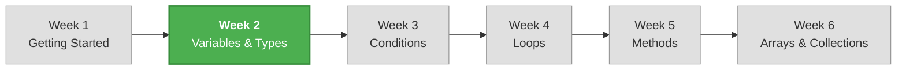

# Week 2 – Variables, Data Types, and Operators

## 📋 Overview

Now that you can write and run C# programs, it's time to learn how programs store and work with data. This week you'll learn about **variables** (named containers for data), **data types** (what kind of data a variable holds), and **operators** (how to perform calculations and manipulate values). These concepts are the building blocks for everything you'll write from here on.

## 🎯 Learning Objectives

By the end of this week, you will be able to:

- Declare and initialize variables using appropriate data types
- Explain the difference between `int`, `double`, `float`, `decimal`, `char`, `string`, and `bool`
- Convert between data types using implicit conversion, explicit casting, `Convert`, and `Parse`
- Perform arithmetic calculations using C# operators
- Use assignment operators to update variable values
- Format output using string concatenation and string interpolation
- Choose the right data type for a given scenario

## 📚 Lectures

| #   | Lecture                                                                  | Topics                                                          |
| --- | ------------------------------------------------------------------------ | --------------------------------------------------------------- |
| 1   | [Variables and Data Types](./lecture-01-variables-and-data-types.md)      | Declaring variables, primitive types, choosing the right type    |
| 2   | [Type Conversion and Casting](./lecture-02-type-conversion.md)            | Implicit/explicit conversion, Convert class, Parse, TryParse    |
| 3   | [Operators and Expressions](./lecture-03-operators-and-expressions.md)    | Arithmetic, assignment, operator precedence, string formatting   |

## 📝 Practice & Assessment

| Resource | Description |
| -------- | ----------- |
| [Exercises](./exercises.md) | Practice problems to reinforce each lecture's concepts |
| [Assignment](./assignment.md) | Weekly mini-project: **Personal Finance Calculator** |

## 🔗 Prerequisites

Make sure you're comfortable with everything from Week 1:

- [x] Creating and running a C# console project
- [x] Using `Console.WriteLine()` and `Console.ReadLine()`
- [x] Basic use of `int.Parse()` and string interpolation (introduced briefly)

## 🗺️ How This Week Fits Into the Course

## ✅ Week 2 Checklist

- [ ] Can declare variables of different types (`int`, `double`, `string`, `bool`, etc.)
- [ ] Understand the difference between integer and floating-point types
- [ ] Can convert between types safely (casting, `Convert`, `Parse`)
- [ ] Can use arithmetic and assignment operators
- [ ] Can format output with string interpolation
- [ ] Completed the exercises for each lecture
- [ ] Completed the weekly assignment (Personal Finance Calculator)

---

[← Previous Week: Week 1 – Getting Started](../week-01/README.md) | [Next Week: Week 3 – Conditional Statements →](../week-03/README.md)
