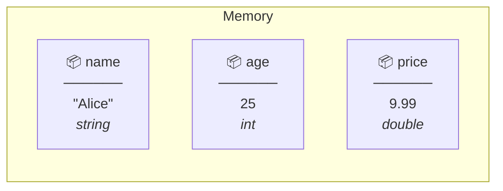
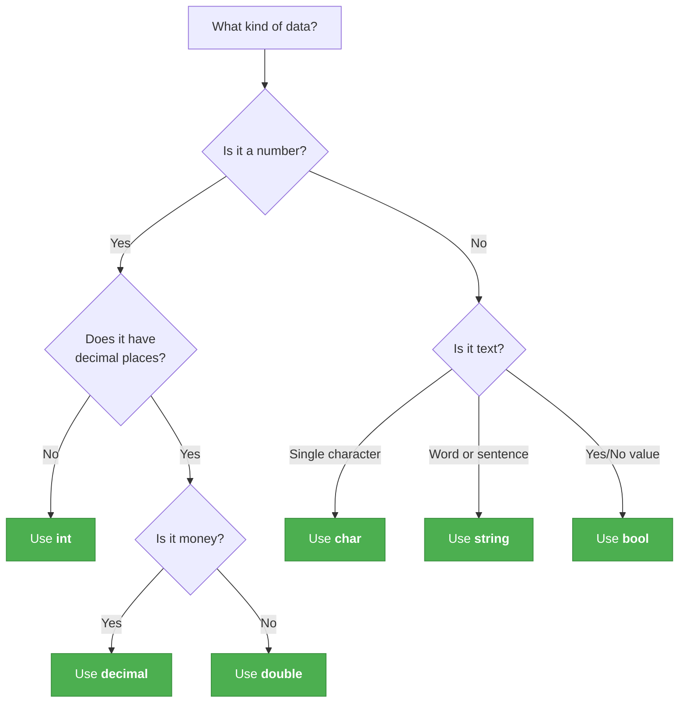

# Lecture 1: Variables and Data Types

[← Back to Week 2 Overview](./README.md) | [Next: Lecture 2 – Type Conversion and Casting →](./lecture-02-type-conversion.md)

---

## 📋 Lecture Overview

| Item        | Detail                                                      |
| ----------- | ----------------------------------------------------------- |
| Duration    | 45 minutes                                                  |
| Topics      | Variables, primitive data types, choosing types              |
| Preparation | Week 1 completed, IDE set up and working                    |

---

## 1. What is a Variable?

In Week 1, you used `Console.ReadLine()` to read user input and stored it in a variable called `name`. But what exactly is a variable?

A **variable** is a named storage location in your computer's memory that holds a value. Think of it as a labeled box — the label is the variable's name, and the contents inside the box is its value.

```csharp
string name = "Alice";
int age = 25;
```

In this example, `name` is a box labeled "name" containing the text `"Alice"`, and `age` is a box labeled "age" containing the number `25`.



## 2. Declaring Variables

To create a variable in C#, you need three things: a **type**, a **name**, and (optionally) an initial **value**.

### Syntax

```csharp
type name = value;
```

### Examples

```csharp
int studentCount = 30;         // an integer number
double temperature = 36.6;     // a decimal number
string greeting = "Hello!";    // text
bool isLoggedIn = true;        // true or false
```

### Declaration vs. Initialization

You can declare a variable without giving it a value right away, then assign it later:

```csharp
int score;              // declaration — the box exists but is empty
score = 100;            // assignment — now it has a value
```

Or you can do both at once:

```csharp
int score = 100;        // declaration + initialization in one step
```

> ⚠️ **Important:** If you declare a variable without initializing it, you **must** assign it a value before you try to use it. Otherwise, the compiler will give you an error.

```csharp
int score;
Console.WriteLine(score);   // ❌ Error: Use of unassigned local variable 'score'
```

### Naming Rules and Conventions

Variable names in C# must follow these rules:

| Rule | Valid | Invalid |
|------|-------|---------|
| Must start with a letter or underscore | `age`, `_count` | `2ndPlace`, `#total` |
| Can contain letters, digits, and underscores | `student1`, `total_price` | `my-variable`, `my variable` |
| Cannot be a C# keyword | `myClass` | `class`, `int`, `string` |
| Case-sensitive | `age` and `Age` are different variables | |

**C# convention:** Use **camelCase** for local variables — start with a lowercase letter, capitalize each subsequent word:

```csharp
int studentCount = 30;
string firstName = "Alice";
double averageScore = 85.5;
bool isEnrolled = true;
```

## 3. Primitive Data Types

C# is a **strongly typed** language, which means every variable must have a specific type, and that type determines what kind of data it can hold. Here are the most common types you'll use:

### Numeric Types — Integers (Whole Numbers)

| Type   | Size     | Range                                          | Example Use              |
|--------|----------|-------------------------------------------------|--------------------------|
| `int`  | 4 bytes  | -2.1 billion to 2.1 billion                    | Age, count, quantity     |
| `long` | 8 bytes  | ±9.2 quintillion                                | Population, large IDs    |

```csharp
int age = 25;
int population = 1500000;
long worldPopulation = 8000000000L;   // suffix L for long literals
```

> 💡 **In this course**, `int` is your go-to integer type. You'll rarely need `long` unless dealing with very large numbers.

### Numeric Types — Floating Point (Decimal Numbers)

| Type      | Size     | Precision         | Example Use                |
|-----------|----------|---------------------|----------------------------|
| `float`   | 4 bytes  | ~6-7 digits         | Game physics, graphics     |
| `double`  | 8 bytes  | ~15-16 digits       | Scientific calculations    |
| `decimal` | 16 bytes | ~28-29 digits       | Money, financial data      |

```csharp
float temperature = 36.6f;         // suffix f required for float
double pi = 3.141592653589793;     // default for decimal literals
decimal price = 29.99m;            // suffix m required for decimal
```

> 💡 **Which one should you use?**
> - **`double`** is the default and most commonly used — good for general math
> - **`decimal`** when dealing with money — it avoids the tiny rounding errors that `float` and `double` can have
> - **`float`** is rarely used in business applications — mainly for game development or graphics

### Why `decimal` for Money?

This is a subtle but important point:

```csharp
double result = 0.1 + 0.2;
Console.WriteLine(result);          // Output: 0.30000000000000004 😱

decimal result2 = 0.1m + 0.2m;
Console.WriteLine(result2);         // Output: 0.3 ✅
```

Floating-point types (`float`, `double`) store numbers in binary, which can't perfectly represent some decimal fractions. `decimal` uses base-10 storage, making it exact for financial calculations.

### Text Types

| Type     | Size       | Holds                | Example                |
|----------|------------|----------------------|------------------------|
| `char`   | 2 bytes    | A single character   | `'A'`, `'7'`, `'@'`   |
| `string` | Varies     | Text (sequence of characters) | `"Hello"`, `""` |

```csharp
char grade = 'A';                  // single quotes for char
char symbol = '@';
string fullName = "Alice Smith";   // double quotes for string
string empty = "";                 // an empty string is valid
```

> ⚠️ **Common mistake:** Using double quotes for `char` or single quotes for `string`:
> ```csharp
> char letter = "A";    // ❌ Error — "A" is a string, not a char
> string name = 'Bob';  // ❌ Error — 'Bob' is not a valid char
> ```

### Boolean Type

| Type   | Size    | Values           | Example Use             |
|--------|---------|-------------------|-------------------------|
| `bool` | 1 byte  | `true` or `false` | Flags, conditions, yes/no |

```csharp
bool isStudent = true;
bool hasGraduated = false;
```

Booleans become essential next week when we learn about **conditional statements** (if/else). For now, know that they represent yes/no decisions.

## 4. The `var` Keyword

C# can sometimes figure out the type for you. When you use `var`, the compiler looks at the value on the right side and determines the type automatically:

```csharp
var name = "Alice";       // compiler knows this is a string
var age = 25;             // compiler knows this is an int
var price = 9.99;         // compiler knows this is a double
var isActive = true;      // compiler knows this is a bool
```

This is called **type inference**. The variable still has a fixed type — the compiler just figures it out for you.

> ⚠️ **You can only use `var` when you assign a value immediately:**
> ```csharp
> var score;              // ❌ Error — compiler can't infer the type without a value
> var score = 100;        // ✅ Works
> ```

> 💡 **In this course**, we'll mostly use explicit types so you always know exactly what type each variable is. As you gain experience, you'll develop a feel for when `var` makes code cleaner.

## 5. Constants

If you have a value that should **never change**, declare it as a constant using the `const` keyword:

```csharp
const double Pi = 3.14159;
const int MaxStudents = 30;
const string CourseName = "Intro to Programming";
```

If you try to change a constant, the compiler will give you an error:

```csharp
const int MaxStudents = 30;
MaxStudents = 35;            // ❌ Error: cannot assign to a constant
```

Use constants for values that are fixed and meaningful — they make your code more readable than "magic numbers."

```csharp
// ❌ What does 100 mean?
if (speed > 100) { ... }

// ✅ Much clearer
const int SpeedLimit = 100;
if (speed > SpeedLimit) { ... }
```

## 6. Choosing the Right Type

Here's a quick decision guide:



### Common Scenarios

| Scenario | Best Type | Why |
|----------|-----------|-----|
| A student's age | `int` | Whole numbers, no decimals needed |
| A product's price | `decimal` | Money needs exact precision |
| A person's name | `string` | Text data |
| Is the user logged in? | `bool` | Yes/no answer |
| A letter grade | `char` | Single character |
| Distance in kilometers | `double` | Decimal number, not money |
| Number of items in stock | `int` | Whole number count |

---

## 🏋️ Exercises

### Exercise 1 — Declare and Display
Declare variables for the following information about a book, then display them using `Console.WriteLine`:
- Title (text)
- Author (text)
- Pages (whole number)
- Price (money)
- Is available (yes/no)

### Exercise 2 — Type Detective
For each value below, write down what C# type you would use and why:
1. `42`
2. `3.14`
3. `"Hello"`
4. `'X'`
5. `true`
6. `19.99` (a price)
7. `8000000000` (world population)

### Exercise 3 — Swap Two Variables
Declare two `int` variables `a = 5` and `b = 10`. Write code to swap their values so that `a` becomes `10` and `b` becomes `5`. Display the values before and after the swap.

> 💡 **Hint:** You'll need a third variable to temporarily hold one of the values.

---

## 📌 Key Takeaways

- Variables are named containers that store data in memory
- Every variable has a **type** that determines what data it can hold
- Use `int` for whole numbers, `double` for general decimals, `decimal` for money
- Use `string` for text, `char` for single characters, `bool` for true/false
- Follow **camelCase** naming convention for local variables
- Use `const` for values that never change

---

[← Back to Week 2 Overview](./README.md) | [Next: Lecture 2 – Type Conversion and Casting →](./lecture-02-type-conversion.md)
