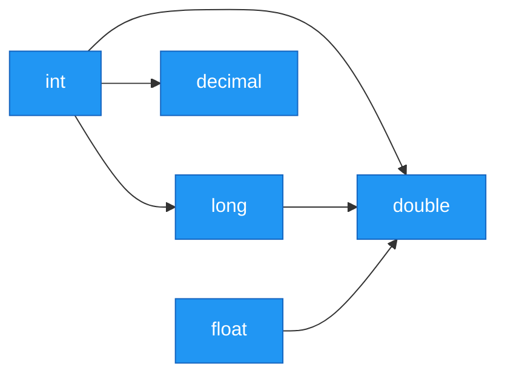
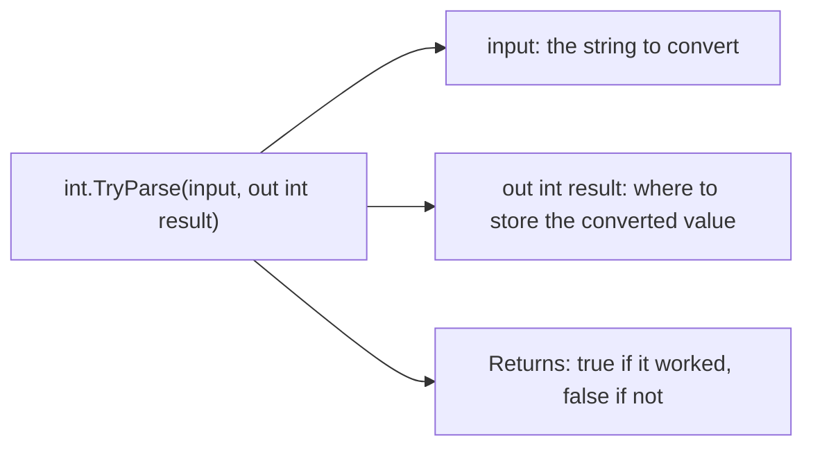
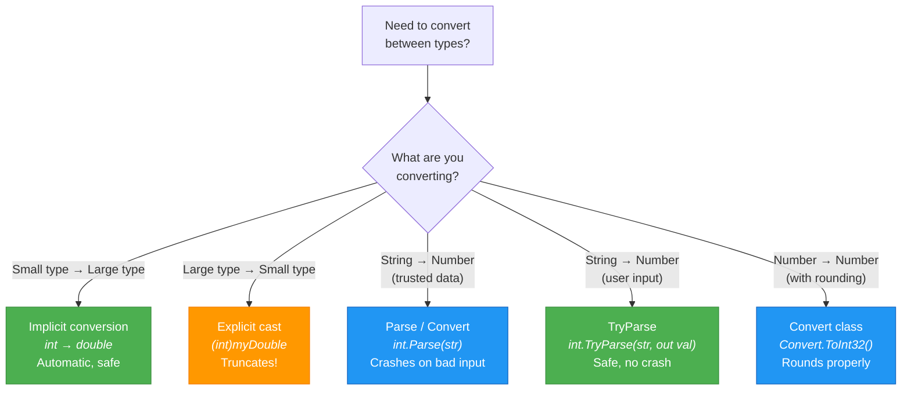

# Lecture 2: Type Conversion and Casting

[← Previous: Lecture 1 – Variables and Data Types](./lecture-01-variables-and-data-types.md) | [Back to Week 2 Overview](./README.md) | [Next: Lecture 3 – Operators and Expressions →](./lecture-03-operators-and-expressions.md)

---

## 📋 Lecture Overview

| Item        | Detail                                                          |
| ----------- | --------------------------------------------------------------- |
| Duration    | 45 minutes                                                      |
| Topics      | Implicit/explicit conversion, Convert class, Parse, TryParse    |
| Preparation | Completed Lecture 1, comfortable with data types                |

---

## 1. Why Do We Need Type Conversion?

In real programs, data doesn't always arrive in the type you need. A user types a number, but `Console.ReadLine()` gives you a `string`. You want to combine an `int` with a `double` in a calculation. You need to display a number inside a sentence.

**Type conversion** is the process of changing data from one type to another. C# provides several ways to do this, from automatic to manual.


## 2. Implicit Conversion (Automatic)

When you assign a value of a smaller type to a larger type, C# converts it **automatically** because there's no risk of losing data. This is called **implicit conversion** or **widening conversion**.

```csharp
int whole = 42;
double decimal1 = whole;    // ✅ int → double (automatic)
Console.WriteLine(decimal1); // Output: 42
```

This works because a `double` can hold any value an `int` can hold, plus decimals. No information is lost.

### Implicit Conversion Paths



The arrow means "can be automatically converted to." Smaller types can flow into larger types without any explicit action from you.

```csharp
int a = 100;
long b = a;          // ✅ int → long
double c = a;        // ✅ int → double
decimal d = a;       // ✅ int → decimal

float f = 3.14f;
double g = f;        // ✅ float → double
```

## 3. Explicit Conversion (Casting)

What about going the other direction — from a larger type to a smaller type? This could **lose data**, so C# does NOT do it automatically. You must explicitly tell the compiler you want to do it using a **cast**.

```csharp
double price = 9.99;
int rounded = (int)price;       // explicit cast: double → int
Console.WriteLine(rounded);     // Output: 9  (decimal part is lost!)
```

> ⚠️ **Casting truncates — it doesn't round!** The decimal part is simply chopped off.

```csharp
double value1 = 9.99;
double value2 = 9.01;
double value3 = 9.50;

Console.WriteLine((int)value1);  // Output: 9
Console.WriteLine((int)value2);  // Output: 9
Console.WriteLine((int)value3);  // Output: 9
```

### When Casting Can Be Dangerous

```csharp
int big = 300;
byte small = (byte)big;         // byte can only hold 0-255
Console.WriteLine(small);       // Output: 44 (overflow — unexpected result!)
```

The value wraps around because `300` doesn't fit in a `byte`. The compiler allows it because you used an explicit cast, but the result is wrong. This is why C# requires the cast — it's your way of saying "I know this might lose data, and I'm okay with it."

### Cast Syntax Summary

```csharp
(targetType)expression
```

```csharp
double d = 3.7;
int i = (int)d;           // 3 — truncated, not rounded

long big = 1000L;
int smaller = (int)big;   // 1000 — fits fine in an int
```

## 4. The Convert Class

The `Convert` class provides methods that convert between types with **rounding** (unlike casting, which truncates):

```csharp
double price = 9.99;

int cast = (int)price;                  // 9  — truncated
int converted = Convert.ToInt32(price); // 10 — rounded
```

### Common Convert Methods

| Method | Converts To | Example |
|--------|-------------|---------|
| `Convert.ToInt32()` | `int` | `Convert.ToInt32(3.7)` → `4` |
| `Convert.ToDouble()` | `double` | `Convert.ToDouble("3.14")` → `3.14` |
| `Convert.ToDecimal()` | `decimal` | `Convert.ToDecimal("19.99")` → `19.99m` |
| `Convert.ToBoolean()` | `bool` | `Convert.ToBoolean(1)` → `true` |
| `Convert.ToString()` | `string` | `Convert.ToString(42)` → `"42"` |

```csharp
// Converting from string (user input)
string input = "42";
int number = Convert.ToInt32(input);
Console.WriteLine(number + 10);       // Output: 52

// Converting numbers
double value = 7.6;
int rounded = Convert.ToInt32(value);
Console.WriteLine(rounded);           // Output: 8
```

> ⚠️ **If the string doesn't contain a valid number, `Convert` will crash:**
> ```csharp
> int bad = Convert.ToInt32("hello");  // 💥 FormatException!
> ```

## 5. Parse and TryParse

### Parse — Convert Strings to Numbers

You've seen `int.Parse()` briefly in Week 1. Each numeric type has a `Parse` method that converts a string to that type:

```csharp
string ageText = "25";
int age = int.Parse(ageText);           // string → int

string priceText = "19.99";
double price = double.Parse(priceText); // string → double

string balanceText = "1500.50";
decimal balance = decimal.Parse(balanceText); // string → decimal
```

### Parse vs Convert — What's the Difference?

Both convert strings to numbers, but they handle `null` differently:

```csharp
string text = null;

// int.Parse(text);           // 💥 ArgumentNullException
// Convert.ToInt32(text);     // Returns 0 (no crash)
```

In practice, both are commonly used. `Parse` is more explicit about what it expects.

### TryParse — The Safe Option

What if the user types "abc" when you expect a number? Both `Parse` and `Convert` will crash. `TryParse` solves this by returning `true` or `false` to tell you whether the conversion succeeded:

```csharp
string input = Console.ReadLine();
bool success = int.TryParse(input, out int result);

if (success)
{
    Console.WriteLine($"You entered: {result}");
}
else
{
    Console.WriteLine("That's not a valid number!");
}
```

Let's break down the syntax:



`TryParse` is the best approach for handling user input because your program won't crash if the user enters something unexpected.

```csharp
Console.Write("Enter your age: ");
string input = Console.ReadLine();

if (int.TryParse(input, out int age))
{
    Console.WriteLine($"Next year you'll be {age + 1}");
}
else
{
    Console.WriteLine("Please enter a valid number for your age.");
}
```

> 💡 **In this course**, we'll use `int.Parse()` and `double.Parse()` for simplicity in early exercises. But know that `TryParse` is the professional approach and we'll use it more as we progress.

## 6. Conversion Summary

Here's when to use each approach:



---

## 🏋️ Exercises

### Exercise 1 — Implicit or Explicit?
For each conversion below, determine if it's implicit (automatic) or if it requires an explicit cast. Write the code and test it:

1. `int` → `double`
2. `double` → `int`
3. `int` → `long`
4. `long` → `int`
5. `float` → `double`

### Exercise 2 — Cast vs Convert
Given `double temperature = 36.7;`, write code that:
1. Casts it to an `int` and prints the result
2. Uses `Convert.ToInt32()` and prints the result
3. Explain why the outputs differ

### Exercise 3 — Safe Input
Write a program that asks the user for their age using `TryParse`. If they enter a valid number, display "You were born around [year]." If they enter invalid input, display a friendly error message. Calculate the birth year using the current year.

### Exercise 4 — Type Conversion Chain
Start with the string `"123.456"`. Convert it through the following chain and display the result at each step:
1. `string` → `double`
2. `double` → `int` (using cast)
3. `int` → `string`

---

## 📌 Key Takeaways

- **Implicit conversion** happens automatically when going from smaller to larger types (safe)
- **Explicit casting** uses `(type)` syntax and can lose data (truncates decimals)
- **Convert class** methods round properly when converting between numeric types
- **Parse** converts strings to numbers but crashes on invalid input
- **TryParse** is the safest way to convert user input — it never crashes
- Always think about what could go wrong when converting between types

---

[← Previous: Lecture 1 – Variables and Data Types](./lecture-01-variables-and-data-types.md) | [Back to Week 2 Overview](./README.md) | [Next: Lecture 3 – Operators and Expressions →](./lecture-03-operators-and-expressions.md)
