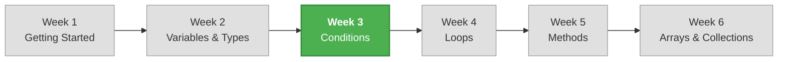

# Week 3 – Conditional Statements and Decision Making

## 📋 Overview

This week your programs learn to **make decisions**. Until now, every line of code ran in order, every time. With conditional statements, your programs can choose different paths depending on the data they receive. This is one of the most fundamental concepts in programming — the ability to say "if this, then do that."

## 🎯 Learning Objectives

By the end of this week, you will be able to:

- Use comparison operators to compare values
- Combine conditions using logical operators (`&&`, `||`, `!`)
- Write `if`, `if-else`, and `else if` chains to control program flow
- Handle complex decisions with nested conditions
- Use the ternary operator for simple inline conditions
- Use `switch` statements and switch expressions for multi-value matching
- Understand variable scope inside code blocks

## 📚 Lectures

| # | Lecture | Topics |
|---|---------|--------|
| 1 | [Comparison Operators, Logical Operators & if Statements](./lecture-01-if-statements.md) | Comparison operators, logical operators, `if`, `if-else`, `else if` chains |
| 2 | [Nested Conditions & the Ternary Operator](./lecture-02-nested-and-ternary.md) | Nested `if` statements, the ternary operator `? :`, introduction to scope |
| 3 | [Switch Statements & Decision-Making Patterns](./lecture-03-switch-statements.md) | `switch` statement, `switch` expression, when to use switch vs if |

## 📝 Practice & Assessment

| Resource | Description |
|----------|-------------|
| [Exercises](./exercises.md) | Practice problems to reinforce each lecture's concepts |
| [Assignment](./assignment.md) | Weekly mini-project: **Student Grade Report Generator** |

## 🗺️ How This Week Fits Into the Course

## 🔗 Prerequisites

Before starting this week, make sure you are comfortable with:

- Declaring variables of different types (`int`, `double`, `string`, `bool`)
- Reading user input with `Console.ReadLine()` and converting with `Parse`
- Using string interpolation for formatted output

## ✅ Week 3 Checklist

- [ ] Can use all six comparison operators (`==`, `!=`, `<`, `>`, `<=`, `>=`)
- [ ] Can combine conditions with `&&`, `||`, and `!`
- [ ] Can write `if`, `if-else`, and `else if` chains
- [ ] Can use nested conditions for complex decisions
- [ ] Can use the ternary operator for simple conditions
- [ ] Can write `switch` statements and switch expressions
- [ ] Understand that variables declared inside `{}` are not accessible outside
- [ ] Completed the weekly assignment

---

[← Previous Week: Week 2 – Variables, Data Types, and Operators](../week-02/README.md) | [Next Week: Week 4 – Loops and Iteration →](../week-04/README.md)
