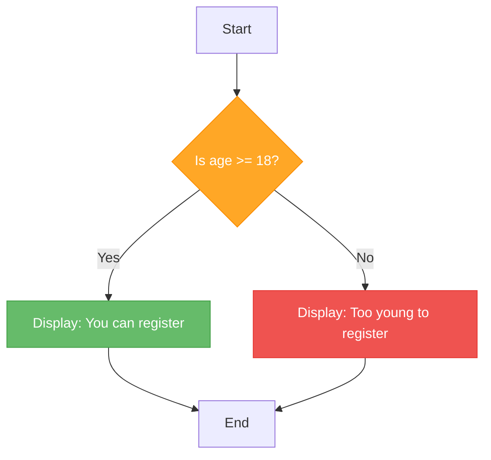
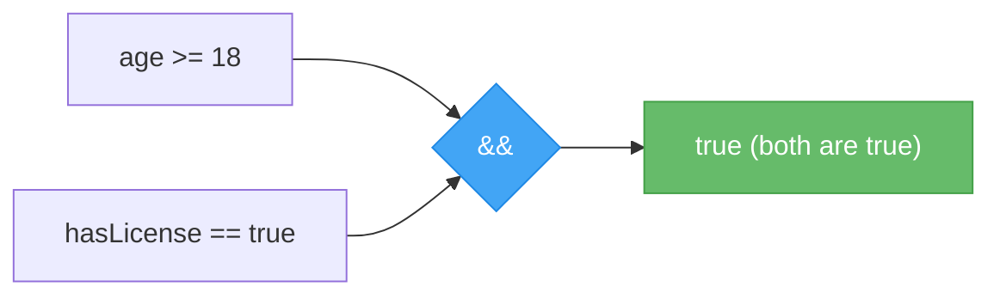
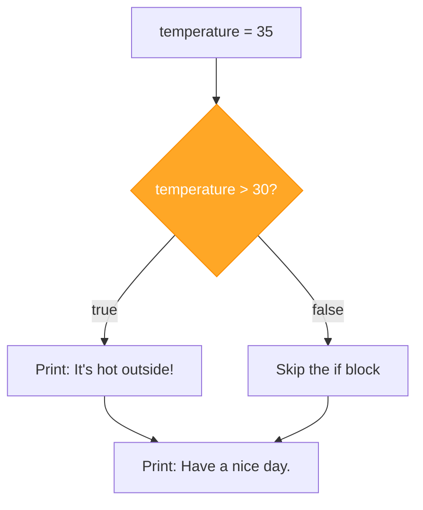
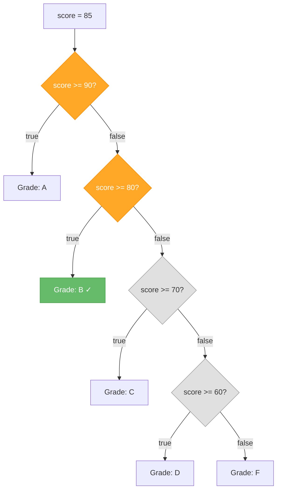

# Lecture 1: Comparison Operators, Logical Operators & if Statements

[← Back to Week 3 Overview](./README.md) | [Next: Lecture 2 – Nested Conditions & Ternary Operator →](./lecture-02-nested-and-ternary.md)

---

## 📋 Lecture Overview

| Item | Detail |
|------|--------|
| Duration | 45 minutes |
| Topics | Comparison operators, logical operators, `if`, `if-else`, `else if` |
| Preparation | Comfortable with variables, data types, and reading input (Weeks 1–2) |

---

## 1. Why Do Programs Need to Make Decisions?

Every program you have written so far runs every line of code, in order, every time. But real programs need to **react differently** depending on the situation:

- Is the user old enough to register?
- Did the student pass or fail?
- Is the bank balance sufficient for a withdrawal?

This is where **conditional statements** come in — they let your program choose which code to run based on a **condition** (something that is either `true` or `false`).



---

## 2. The `bool` Type — True or False

Before we write conditions, remember the `bool` data type from Week 2. A `bool` can only hold one of two values: `true` or `false`.

```csharp
bool isRaining = true;
bool hasUmbrella = false;

Console.WriteLine(isRaining);    // True
Console.WriteLine(hasUmbrella);  // False
```

Every condition you write in C# evaluates to a `bool` — it is either `true` or `false`. This is the foundation of all decision-making in programming.

---

## 3. Comparison Operators

Comparison operators compare two values and produce a `bool` result.

| Operator | Meaning | Example | Result |
|----------|---------|---------|--------|
| `==` | Equal to | `5 == 5` | `true` |
| `!=` | Not equal to | `5 != 3` | `true` |
| `<` | Less than | `3 < 5` | `true` |
| `>` | Greater than | `5 > 3` | `true` |
| `<=` | Less than or equal to | `5 <= 5` | `true` |
| `>=` | Greater than or equal to | `3 >= 5` | `false` |

### Examples in Code

```csharp
int age = 20;
int price = 50;
string name = "Alice";

Console.WriteLine(age == 20);      // True
Console.WriteLine(age != 20);      // False
Console.WriteLine(price < 100);    // True
Console.WriteLine(price >= 50);    // True
Console.WriteLine(name == "Alice"); // True
Console.WriteLine(name == "alice"); // False — comparison is case-sensitive!
```

> ⚠️ **Common Mistake:** Do not confuse `=` (assignment) with `==` (comparison). `age = 20` *sets* the value. `age == 20` *checks* whether the value is 20.

### Storing Comparison Results

Since comparisons produce a `bool`, you can store them in a variable:

```csharp
int temperature = 35;
bool isHot = temperature > 30;

Console.WriteLine(isHot);  // True
```

---

## 4. Logical Operators

Sometimes a single comparison is not enough. Logical operators let you **combine** multiple conditions.

| Operator | Meaning | Description |
|----------|---------|-------------|
| `&&` | AND | Both conditions must be `true` |
| `\|\|` | OR | At least one condition must be `true` |
| `!` | NOT | Reverses the condition |

### AND (`&&`) — Both Must Be True

```csharp
int age = 25;
bool hasLicense = true;

bool canDrive = age >= 18 && hasLicense;
Console.WriteLine($"Can drive: {canDrive}");  // Can drive: True
```



If **either** condition is `false`, the whole result is `false`:

```csharp
int age = 16;
bool hasLicense = true;

bool canDrive = age >= 18 && hasLicense;
Console.WriteLine($"Can drive: {canDrive}");  // Can drive: False
```

### OR (`||`) — At Least One Must Be True

```csharp
bool isWeekend = true;
bool isHoliday = false;

bool dayOff = isWeekend || isHoliday;
Console.WriteLine($"Day off: {dayOff}");  // Day off: True
```

With OR, the result is `false` only when **both** conditions are `false`:

```csharp
bool isWeekend = false;
bool isHoliday = false;

bool dayOff = isWeekend || isHoliday;
Console.WriteLine($"Day off: {dayOff}");  // Day off: False
```

### NOT (`!`) — Reverses the Value

```csharp
bool isLoggedIn = false;

Console.WriteLine(!isLoggedIn);  // True  (NOT false = true)
```

A common use is checking for the **opposite** of a condition:

```csharp
string input = "";
bool isEmpty = input == "";
bool hasValue = !isEmpty;

Console.WriteLine($"Has value: {hasValue}");  // Has value: False
```

### Combining Multiple Operators

You can combine `&&`, `||`, and `!` in a single expression. Use parentheses to make the logic clear:

```csharp
int age = 25;
bool isStudent = true;
bool isSenior = false;

// Discount if student OR senior, AND at least 18
bool getsDiscount = (isStudent || isSenior) && age >= 18;
Console.WriteLine($"Gets discount: {getsDiscount}");  // Gets discount: True
```

> 💡 **Tip:** Always use parentheses when combining `&&` and `||` to make your intent clear. Without parentheses, `&&` is evaluated before `||`, which can cause unexpected results.

---

## 5. The `if` Statement

The `if` statement is the simplest way to make a decision. It runs a block of code **only if** a condition is `true`.

### Syntax

```csharp
if (condition)
{
    // Code to run when condition is true
}
```

### Example

```csharp
int temperature = 35;

if (temperature > 30)
{
    Console.WriteLine("It's hot outside!");
}

Console.WriteLine("Have a nice day.");
```

**Output:**
```
It's hot outside!
Have a nice day.
```

If the temperature were 20, the output would be just:
```
Have a nice day.
```

The `if` block is **skipped** when the condition is `false`, but the code after it runs regardless.

### How It Works



---

## 6. The `if-else` Statement

Often you want to do **one thing** if a condition is true and **another thing** if it is false. This is what `if-else` provides.

### Syntax

```csharp
if (condition)
{
    // Code when condition is true
}
else
{
    // Code when condition is false
}
```

### Example: Pass or Fail

```csharp
Console.Write("Enter your score: ");
int score = int.Parse(Console.ReadLine());

if (score >= 50)
{
    Console.WriteLine("You passed!");
}
else
{
    Console.WriteLine("You failed. Better luck next time.");
}
```

**Sample runs:**
```
Enter your score: 75
You passed!
```
```
Enter your score: 40
You failed. Better luck next time.
```

Exactly one of the two blocks will always run — never both, never neither.

---

## 7. The `else if` Chain

When you have **more than two possibilities**, use `else if` to check multiple conditions in sequence.

### Syntax

```csharp
if (condition1)
{
    // Runs if condition1 is true
}
else if (condition2)
{
    // Runs if condition1 is false AND condition2 is true
}
else if (condition3)
{
    // Runs if condition1 and condition2 are false AND condition3 is true
}
else
{
    // Runs if ALL above conditions are false
}
```

### Example: Grade Calculator

```csharp
Console.Write("Enter your score (0-100): ");
int score = int.Parse(Console.ReadLine());

if (score >= 90)
{
    Console.WriteLine("Grade: A");
}
else if (score >= 80)
{
    Console.WriteLine("Grade: B");
}
else if (score >= 70)
{
    Console.WriteLine("Grade: C");
}
else if (score >= 60)
{
    Console.WriteLine("Grade: D");
}
else
{
    Console.WriteLine("Grade: F");
}
```

**Sample run:**
```
Enter your score (0-100): 85
Grade: B
```

### How the Chain Works

The conditions are checked **from top to bottom**. The first one that is `true` runs, and **all remaining conditions are skipped**.



> 💡 **Key Insight:** Because the conditions are checked in order, by the time we reach `else if (score >= 80)`, we already know that `score < 90` (otherwise the first condition would have been `true`). This is why we do not need to write `score >= 80 && score < 90`.

### Common Mistake: Using `if` Instead of `else if`

```csharp
// ❌ WRONG — These are separate, independent checks
int score = 95;

if (score >= 90)
    Console.WriteLine("Grade: A");
if (score >= 80)
    Console.WriteLine("Grade: B");  // This ALSO prints because 95 >= 80!
if (score >= 70)
    Console.WriteLine("Grade: C");  // This ALSO prints because 95 >= 70!
```

```csharp
// ✅ CORRECT — Using else if, only one block runs
int score = 95;

if (score >= 90)
    Console.WriteLine("Grade: A");
else if (score >= 80)
    Console.WriteLine("Grade: B");
else if (score >= 70)
    Console.WriteLine("Grade: C");
```

---

## 8. Practical Example: Ticket Pricing

Let's put everything together in a realistic example:

```csharp
Console.Write("Enter your age: ");
int age = int.Parse(Console.ReadLine());

Console.Write("Are you a student? (yes/no): ");
string studentInput = Console.ReadLine();
bool isStudent = studentInput == "yes";

double price;

if (age < 5)
{
    price = 0;
    Console.WriteLine("Free entry for children under 5!");
}
else if (age <= 12)
{
    price = 5.00;
    Console.WriteLine("Child ticket.");
}
else if (isStudent)
{
    price = 8.00;
    Console.WriteLine("Student discount applied.");
}
else if (age >= 65)
{
    price = 7.00;
    Console.WriteLine("Senior discount applied.");
}
else
{
    price = 12.00;
    Console.WriteLine("Standard adult ticket.");
}

Console.WriteLine($"Ticket price: ${price:F2}");
```

**Sample run:**
```
Enter your age: 20
Are you a student? (yes/no): yes
Student discount applied.
Ticket price: $8.00
```

---

## 🔑 Key Takeaways

- Comparison operators (`==`, `!=`, `<`, `>`, `<=`, `>=`) compare values and return `true` or `false`
- Logical operators (`&&`, `||`, `!`) combine or invert conditions
- `if` runs code only when a condition is true
- `if-else` provides two paths — one for true, one for false
- `else if` chains handle multiple possible conditions — only the first match runs
- Use `else if` (not multiple `if`) when conditions are mutually exclusive
- Always use `==` for comparison, not `=` (which is assignment)

---

## ✏️ Try It Yourself

### Quick Exercise 1 — Even or Odd
Ask the user for a number. Display whether it is even or odd. (Hint: use `number % 2 == 0` to check if a number is even.)

### Quick Exercise 2 — Login Check
Ask the user for a username and password. If the username is `"admin"` AND the password is `"1234"`, print "Login successful." Otherwise, print "Invalid credentials."

### Quick Exercise 3 — Weather Advice
Ask the user for the temperature. Display:
- Below 0: "Freezing! Stay indoors."
- 0–15: "Cold. Wear a jacket."
- 16–25: "Nice weather. Enjoy!"
- Above 25: "Hot! Stay hydrated."

---

[← Back to Week 3 Overview](./README.md) | [Next: Lecture 2 – Nested Conditions & Ternary Operator →](./lecture-02-nested-and-ternary.md)
