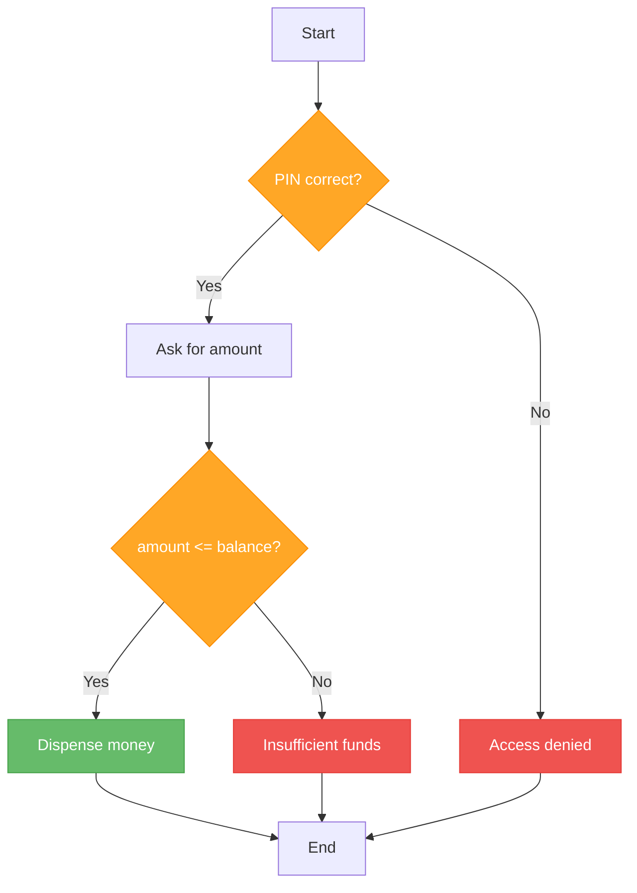
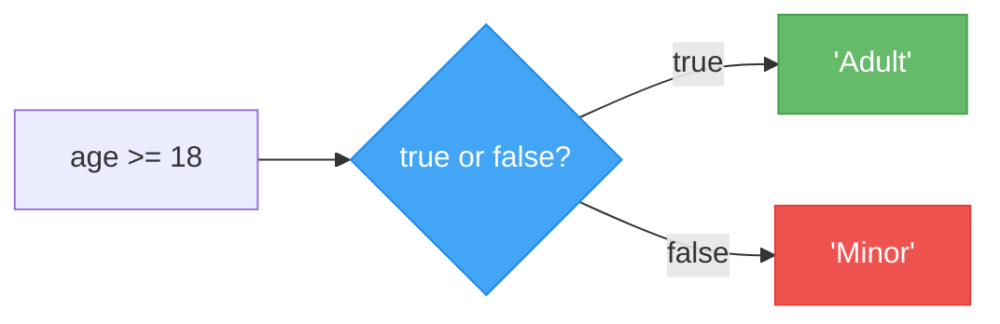
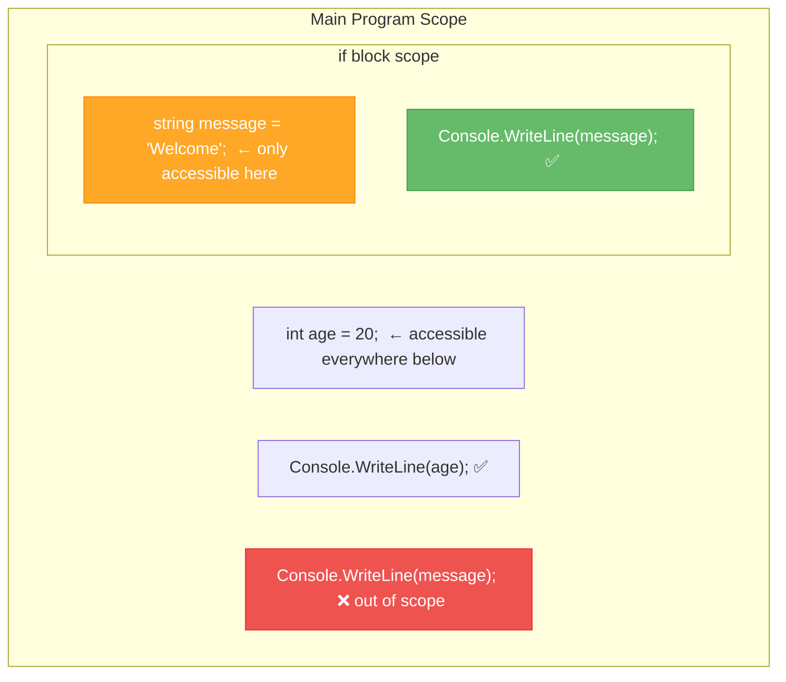

# Lecture 2: Nested Conditions & the Ternary Operator

[← Previous: Lecture 1 – if Statements](./lecture-01-if-statements.md) | [Back to Week 3 Overview](./README.md) | [Next: Lecture 3 – Switch Statements →](./lecture-03-switch-statements.md)

---

## 📋 Lecture Overview

| Item | Detail |
|------|--------|
| Duration | 45 minutes |
| Topics | Nested `if` statements, ternary operator, introduction to scope |
| Preparation | Completed Lecture 1 exercises |

---

## 1. Nested Conditions

Sometimes a decision depends on **another decision that came before it**. You can place an `if` statement inside another `if` statement — this is called **nesting**.

### Example: ATM Withdrawal

An ATM needs to check two things before dispensing money: (1) is the PIN correct? and (2) is the balance sufficient?

```csharp
string correctPin = "1234";
double balance = 500.00;

Console.Write("Enter your PIN: ");
string enteredPin = Console.ReadLine();

if (enteredPin == correctPin)
{
    Console.Write("Enter withdrawal amount: $");
    double amount = double.Parse(Console.ReadLine());

    if (amount <= balance)
    {
        balance -= amount;
        Console.WriteLine($"Dispensing ${amount:F2}");
        Console.WriteLine($"Remaining balance: ${balance:F2}");
    }
    else
    {
        Console.WriteLine("Insufficient funds.");
    }
}
else
{
    Console.WriteLine("Incorrect PIN. Access denied.");
}
```

### The Flow of Nested Conditions



Notice that the inner `if` (checking the amount) only runs when the outer `if` (checking the PIN) is `true`. This is the power of nesting — it lets you create a **chain of dependent decisions**.

### Another Example: Shipping Calculator

```csharp
Console.Write("Enter order total: $");
double total = double.Parse(Console.ReadLine());

Console.Write("Are you a member? (yes/no): ");
bool isMember = Console.ReadLine() == "yes";

if (total > 0)
{
    if (isMember)
    {
        if (total >= 50)
        {
            Console.WriteLine("Free shipping for members!");
        }
        else
        {
            Console.WriteLine("Member shipping: $2.99");
        }
    }
    else
    {
        if (total >= 100)
        {
            Console.WriteLine("Free shipping on orders over $100!");
        }
        else
        {
            Console.WriteLine("Standard shipping: $5.99");
        }
    }
}
else
{
    Console.WriteLine("Invalid order total.");
}
```

### When Nesting Gets Too Deep — Flatten It

Deeply nested code becomes hard to read. When you find yourself nesting three or more levels deep, consider whether you can **flatten** the logic using `else if` or combined conditions.

```csharp
// ❌ Too deeply nested
if (age >= 18)
{
    if (hasLicense)
    {
        if (!isSuspended)
        {
            Console.WriteLine("You can drive.");
        }
    }
}

// ✅ Flattened with combined conditions
if (age >= 18 && hasLicense && !isSuspended)
{
    Console.WriteLine("You can drive.");
}
```

> 💡 **Rule of Thumb:** If all the nested conditions lead to a single outcome, combine them with `&&`. If different nesting levels lead to different outcomes (like the ATM example), nesting is appropriate.

---

## 2. The Ternary Operator (`? :`)

The **ternary operator** is a shorthand for a simple `if-else` that assigns a value. It is called "ternary" because it has three parts.

### Syntax

```
variable = condition ? valueIfTrue : valueIfFalse;
```

### Example: Comparing if-else and Ternary

**Using if-else (4 lines):**
```csharp
int age = 20;
string status;

if (age >= 18)
{
    status = "Adult";
}
else
{
    status = "Minor";
}

Console.WriteLine(status);
```

**Using the ternary operator (1 line):**
```csharp
int age = 20;
string status = age >= 18 ? "Adult" : "Minor";

Console.WriteLine(status);
```

Both produce the same result: `Adult`

### How to Read It



Read it as: "Is `age >= 18`? If yes, use `"Adult"`. If no, use `"Minor"`."

### More Examples

```csharp
// Determine ticket price
double price = age < 12 ? 5.00 : 12.00;

// Choose a greeting based on time
int hour = 14;
string greeting = hour < 12 ? "Good morning" : "Good afternoon";
Console.WriteLine(greeting);  // Good afternoon

// Display pass/fail
int score = 72;
Console.WriteLine(score >= 50 ? "PASS" : "FAIL");  // PASS
```

### Using Ternary Directly in String Interpolation

You can embed a ternary expression inside `$""` strings — just wrap it in parentheses:

```csharp
int items = 3;
Console.WriteLine($"You have {items} item{(items == 1 ? "" : "s")} in your cart.");
// Output: You have 3 items in your cart.
```

```csharp
int items = 1;
Console.WriteLine($"You have {items} item{(items == 1 ? "" : "s")} in your cart.");
// Output: You have 1 item in your cart.
```

### When to Use the Ternary Operator

| Use Ternary When... | Use if-else When... |
|---------------------|---------------------|
| You need to **assign a value** based on a condition | You need to run **multiple lines** of code |
| The condition is simple and readable | The logic is complex or involves side effects |
| It fits on one line comfortably | Readability would suffer |

> ⚠️ **Do not nest ternary operators.** While C# allows it, nested ternaries are very hard to read:
> ```csharp
> // ❌ Avoid this — hard to read
> string result = score >= 90 ? "A" : score >= 80 ? "B" : score >= 70 ? "C" : "F";
>
> // ✅ Use else-if instead for multiple conditions
> ```

---

## 3. Introduction to Scope

When you declare a variable inside curly braces `{}`, that variable **only exists inside those braces**. This is called **scope**.

### Example: Variable Scope

```csharp
int age = 20;

if (age >= 18)
{
    string message = "Welcome, adult!";
    Console.WriteLine(message);  // ✅ Works — message exists here
}

// Console.WriteLine(message);  // ❌ ERROR — message does not exist here
```

The variable `message` was declared inside the `if` block, so it only exists within those curly braces. Once the block ends, the variable is gone.

### Visualizing Scope



### The Solution: Declare Before the Block

If you need a variable after the `if-else`, declare it **before** the block:

```csharp
int age = 20;
string message;  // Declared here — accessible everywhere below

if (age >= 18)
{
    message = "Welcome, adult!";
}
else
{
    message = "Welcome, young one!";
}

Console.WriteLine(message);  // ✅ Works — message is in scope
```

### Scope Rules Summary

| Rule | Example |
|------|---------|
| Variables are accessible from where they are declared to the end of their enclosing `{}` | Declared in `if` → only accessible inside that `if` |
| Outer variables are accessible inside inner blocks | Variable declared before `if` → accessible inside `if` |
| Inner variables are NOT accessible in outer blocks | Variable declared inside `if` → NOT accessible after `}` |

---

## 4. Complete Example: Movie Ticket System

Let's combine nesting, ternary, and scope in a practical example:

```csharp
Console.WriteLine("=== Movie Ticket System ===");
Console.WriteLine();

// Get user information
Console.Write("Enter your age: ");
int age = int.Parse(Console.ReadLine());

Console.Write("Is it a 3D movie? (yes/no): ");
bool is3D = Console.ReadLine() == "yes";

Console.Write("Day of the week (Mon-Sun): ");
string day = Console.ReadLine();

// Determine base price by age
double basePrice;

if (age < 5)
{
    basePrice = 0;
}
else if (age <= 12)
{
    basePrice = 6.00;
}
else if (age >= 65)
{
    basePrice = 7.50;
}
else
{
    basePrice = 12.00;
}

// Apply 3D surcharge
double surcharge = is3D ? 3.50 : 0;

// Apply Tuesday discount
bool isTuesday = day == "Tue";
double discount = isTuesday ? basePrice * 0.25 : 0;

// Calculate final price
double finalPrice = basePrice + surcharge - discount;

// Display receipt
Console.WriteLine();
Console.WriteLine("--- Receipt ---");
Console.WriteLine($"Age group:    {(age < 5 ? "Infant (Free)" : age <= 12 ? "Child" : age >= 65 ? "Senior" : "Adult")}");
Console.WriteLine($"Base price:   ${basePrice:F2}");

if (is3D)
{
    Console.WriteLine($"3D surcharge: ${surcharge:F2}");
}

if (isTuesday)
{
    Console.WriteLine($"Tue discount: -${discount:F2}");
}

Console.WriteLine($"Total:        ${finalPrice:F2}");
```

**Sample run:**
```
=== Movie Ticket System ===

Enter your age: 30
Is it a 3D movie? (yes/no): yes
Day of the week (Mon-Sun): Tue

--- Receipt ---
Age group:    Adult
Base price:   $12.00
3D surcharge: $3.50
Tue discount: -$3.00
Total:        $12.50
```

---

## 🔑 Key Takeaways

- Nested `if` statements handle decisions that depend on previous decisions
- Avoid nesting too deeply — flatten with `&&` when possible
- The ternary operator `condition ? valueIfTrue : valueIfFalse` is a shorthand for simple `if-else` assignments
- Do not nest ternary operators — use `else if` chains for multiple conditions
- Variables declared inside `{}` only exist within those braces (scope)
- Declare variables before `if-else` blocks if you need them after the block ends

---

## ✏️ Try It Yourself

### Quick Exercise 1 — Absolute Value
Ask the user for a number. Use the ternary operator to calculate and display the absolute value. (Hint: if the number is negative, multiply by -1.)

### Quick Exercise 2 — Shipping Tier
Ask the user for their order total and whether they are a premium member. Calculate the shipping cost:
- Premium members: free shipping on orders over $25, otherwise $2.99
- Regular customers: free shipping on orders over $75, otherwise $5.99

### Quick Exercise 3 — Scope Fix
This code has a scope error. Fix it so it works correctly:
```csharp
Console.Write("Enter a number: ");
int number = int.Parse(Console.ReadLine());

if (number > 0)
{
    string sign = "positive";
}
else if (number < 0)
{
    string sign = "negative";
}
else
{
    string sign = "zero";
}

Console.WriteLine($"The number is {sign}.");
```

---

[← Previous: Lecture 1 – if Statements](./lecture-01-if-statements.md) | [Back to Week 3 Overview](./README.md) | [Next: Lecture 3 – Switch Statements →](./lecture-03-switch-statements.md)
