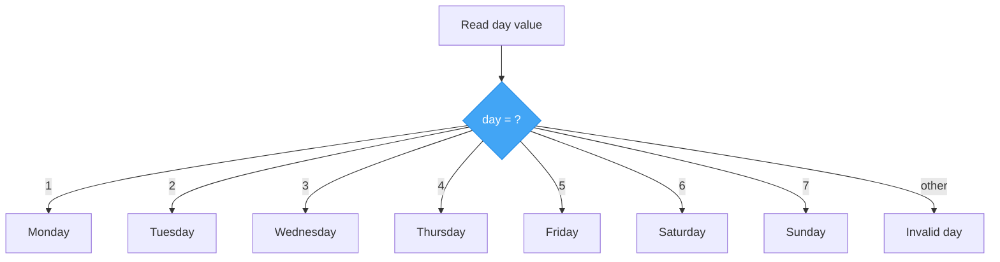
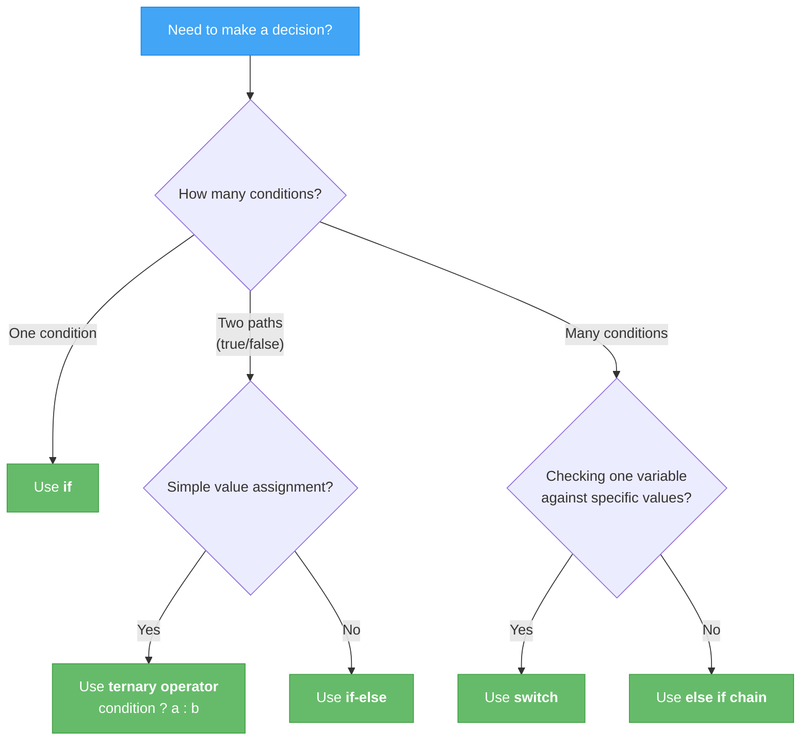

# Lecture 3: Switch Statements & Decision-Making Patterns

[← Previous: Lecture 2 – Nested Conditions & Ternary](./lecture-02-nested-and-ternary.md) | [Back to Week 3 Overview](./README.md)

---

## 📋 Lecture Overview

| Item | Detail |
|------|--------|
| Duration | 45 minutes |
| Topics | `switch` statement, `switch` expression, choosing the right tool |
| Preparation | Completed Lectures 1 & 2 exercises |

---

## 1. When `if-else` Gets Repetitive

Imagine you need to check a single variable against many possible values:

```csharp
Console.Write("Enter a day number (1-7): ");
int day = int.Parse(Console.ReadLine());

if (day == 1)
    Console.WriteLine("Monday");
else if (day == 2)
    Console.WriteLine("Tuesday");
else if (day == 3)
    Console.WriteLine("Wednesday");
else if (day == 4)
    Console.WriteLine("Thursday");
else if (day == 5)
    Console.WriteLine("Friday");
else if (day == 6)
    Console.WriteLine("Saturday");
else if (day == 7)
    Console.WriteLine("Sunday");
else
    Console.WriteLine("Invalid day number.");
```

This works, but it is repetitive — every line checks `day ==` something. When you are comparing **one variable** against **multiple specific values**, there is a cleaner tool: the `switch` statement.

---

## 2. The `switch` Statement

A `switch` statement takes a single value and jumps directly to the matching `case`.

### Syntax

```csharp
switch (variable)
{
    case value1:
        // Code for value1
        break;
    case value2:
        // Code for value2
        break;
    default:
        // Code if no case matches
        break;
}
```

### Example: Day of the Week

```csharp
Console.Write("Enter a day number (1-7): ");
int day = int.Parse(Console.ReadLine());

switch (day)
{
    case 1:
        Console.WriteLine("Monday");
        break;
    case 2:
        Console.WriteLine("Tuesday");
        break;
    case 3:
        Console.WriteLine("Wednesday");
        break;
    case 4:
        Console.WriteLine("Thursday");
        break;
    case 5:
        Console.WriteLine("Friday");
        break;
    case 6:
        Console.WriteLine("Saturday");
        break;
    case 7:
        Console.WriteLine("Sunday");
        break;
    default:
        Console.WriteLine("Invalid day number.");
        break;
}
```

### How It Works



### Key Rules

| Rule | Explanation |
|------|-------------|
| Every `case` needs a `break` | Without `break`, C# gives a compilation error (unlike C/C++ where it "falls through") |
| `default` is optional but recommended | It handles any value that does not match a `case` |
| Case values must be **constants** | You cannot use variables or expressions as case values |
| Works with `int`, `string`, `char`, `bool`, and enums | Does not work with `double` or `float` |

### The `break` Statement

`break` tells the program to **exit the switch block**. In C#, every case must end with `break`, `return`, or another statement that exits the block.

> ⚠️ **Important:** In C#, you cannot accidentally "fall through" from one case to the next (unlike some other languages). The compiler will give an error if you forget `break`.

---

## 3. Grouping Cases

Sometimes multiple values should produce the same result. You can **stack cases** together:

```csharp
Console.Write("Enter a day number (1-7): ");
int day = int.Parse(Console.ReadLine());

switch (day)
{
    case 1:
    case 2:
    case 3:
    case 4:
    case 5:
        Console.WriteLine("Weekday");
        break;
    case 6:
    case 7:
        Console.WriteLine("Weekend");
        break;
    default:
        Console.WriteLine("Invalid day number.");
        break;
}
```

Cases 1 through 5 all share the same code block. This is much cleaner than writing five separate `else if` conditions.

---

## 4. Switch with Strings

`switch` works with strings, making it great for menu-driven programs:

```csharp
Console.WriteLine("=== Calculator ===");
Console.Write("Enter first number: ");
double a = double.Parse(Console.ReadLine());

Console.Write("Enter operator (+, -, *, /): ");
string op = Console.ReadLine();

Console.Write("Enter second number: ");
double b = double.Parse(Console.ReadLine());

double result;

switch (op)
{
    case "+":
        result = a + b;
        Console.WriteLine($"{a} + {b} = {result}");
        break;
    case "-":
        result = a - b;
        Console.WriteLine($"{a} - {b} = {result}");
        break;
    case "*":
        result = a * b;
        Console.WriteLine($"{a} * {b} = {result}");
        break;
    case "/":
        if (b != 0)
        {
            result = a / b;
            Console.WriteLine($"{a} / {b} = {result}");
        }
        else
        {
            Console.WriteLine("Error: Cannot divide by zero.");
        }
        break;
    default:
        Console.WriteLine($"Unknown operator: {op}");
        break;
}
```

**Sample run:**
```
=== Calculator ===
Enter first number: 10
Enter operator (+, -, *, /): *
Enter second number: 5
10 * 5 = 50
```

---

## 5. Switch Expressions (Modern C#)

C# 8.0 introduced **switch expressions** — a more concise way to write switch logic when you want to **assign a value** based on a match. Think of it as the ternary operator's big sibling.

### Syntax

```csharp
var result = variable switch
{
    value1 => result1,
    value2 => result2,
    value3 => result3,
    _ => defaultResult
};
```

> The `_` symbol is called the **discard pattern** — it matches anything, like `default` in a regular switch.

### Example: Day Name

```csharp
Console.Write("Enter a day number (1-7): ");
int day = int.Parse(Console.ReadLine());

string dayName = day switch
{
    1 => "Monday",
    2 => "Tuesday",
    3 => "Wednesday",
    4 => "Thursday",
    5 => "Friday",
    6 => "Saturday",
    7 => "Sunday",
    _ => "Invalid day"
};

Console.WriteLine(dayName);
```

### Comparing Statement vs Expression

**Switch Statement (more verbose, more flexibility):**
```csharp
string category;
switch (score / 10)
{
    case 10:
    case 9:
        category = "Excellent";
        break;
    case 8:
        category = "Very Good";
        break;
    case 7:
        category = "Good";
        break;
    default:
        category = "Needs Improvement";
        break;
}
```

**Switch Expression (concise, returns a value):**
```csharp
string category = (score / 10) switch
{
    10 or 9 => "Excellent",
    8 => "Very Good",
    7 => "Good",
    _ => "Needs Improvement"
};
```

> Note the `or` keyword in the switch expression — it replaces stacked cases from the switch statement.

### When to Use Which

| Use Switch **Statement** When... | Use Switch **Expression** When... |
|----------------------------------|-----------------------------------|
| You need to run multiple lines of code per case | You need to assign a single value |
| Cases have different side effects (printing, modifying state) | The result is clean and concise |
| You need complex logic inside a case | Each case maps to one value |

---

## 6. Choosing the Right Decision Tool

You now have several tools for making decisions. Here is when to use each:



### Quick Reference

| Tool | Best For | Example |
|------|----------|---------|
| `if` | Single condition check | `if (age >= 18)` |
| `if-else` | Two-way decision | Pass or fail |
| `else if` | Multiple conditions with ranges or complex logic | Grade calculator (A, B, C, D, F) |
| Ternary `? :` | Simple inline value assignment | `string s = x > 0 ? "pos" : "neg";` |
| `switch` statement | One variable matched against many specific values | Day of week, menu selection |
| `switch` expression | One variable → one result value | Mapping numbers to names |

---

## 7. Complete Example: Interactive Menu

Let's build a complete example that uses multiple decision-making tools:

```csharp
Console.WriteLine("╔══════════════════════════════╗");
Console.WriteLine("║    Unit Converter Menu       ║");
Console.WriteLine("╠══════════════════════════════╣");
Console.WriteLine("║  1. Celsius → Fahrenheit     ║");
Console.WriteLine("║  2. Fahrenheit → Celsius     ║");
Console.WriteLine("║  3. Kilometers → Miles       ║");
Console.WriteLine("║  4. Miles → Kilometers       ║");
Console.WriteLine("║  5. Kilograms → Pounds       ║");
Console.WriteLine("║  6. Pounds → Kilograms       ║");
Console.WriteLine("╚══════════════════════════════╝");
Console.WriteLine();

Console.Write("Choose an option (1-6): ");
int choice = int.Parse(Console.ReadLine());

Console.Write("Enter the value to convert: ");
double value = double.Parse(Console.ReadLine());

// Determine conversion category using ternary
string category = choice <= 2 ? "Temperature" : choice <= 4 ? "Distance" : "Weight";

double result;
string fromUnit;
string toUnit;

switch (choice)
{
    case 1:
        result = (value * 9.0 / 5.0) + 32;
        fromUnit = "°C";
        toUnit = "°F";
        break;
    case 2:
        result = (value - 32) * 5.0 / 9.0;
        fromUnit = "°F";
        toUnit = "°C";
        break;
    case 3:
        result = value * 0.621371;
        fromUnit = "km";
        toUnit = "mi";
        break;
    case 4:
        result = value * 1.60934;
        fromUnit = "mi";
        toUnit = "km";
        break;
    case 5:
        result = value * 2.20462;
        fromUnit = "kg";
        toUnit = "lb";
        break;
    case 6:
        result = value * 0.453592;
        fromUnit = "lb";
        toUnit = "kg";
        break;
    default:
        Console.WriteLine("Invalid option.");
        return;  // Exit the program
}

Console.WriteLine();
Console.WriteLine($"Category: {category}");
Console.WriteLine($"Result: {value} {fromUnit} = {result:F2} {toUnit}");
```

**Sample run:**
```
╔══════════════════════════════╗
║    Unit Converter Menu       ║
╠══════════════════════════════╣
║  1. Celsius → Fahrenheit     ║
║  2. Fahrenheit → Celsius     ║
║  3. Kilometers → Miles       ║
║  4. Miles → Kilometers       ║
║  5. Kilograms → Pounds       ║
║  6. Pounds → Kilograms       ║
╚══════════════════════════════╝

Choose an option (1-6): 3
Enter the value to convert: 42

Category: Distance
Result: 42 km = 26.10 mi
```

---

## 🔑 Key Takeaways

- `switch` statements match one variable against multiple specific values — cleaner than long `else if` chains
- Every `case` must end with `break` (C# enforces this)
- Stack cases together to share code between multiple values
- Switch expressions (`=>`) are a concise way to map a value to a result
- Use the `_` discard pattern as a default in switch expressions
- Choose the right tool: `if` for simple checks, `else if` for ranges, `switch` for matching specific values, ternary for inline assignments

---

## ✏️ Try It Yourself

### Quick Exercise 1 — Month Name
Ask the user for a month number (1–12). Use a `switch` statement to display the month name. Handle invalid input with `default`.

### Quick Exercise 2 — Season Finder
Ask the user for a month number. Use a `switch` with grouped cases to display the season:
- 12, 1, 2 → Winter
- 3, 4, 5 → Spring
- 6, 7, 8 → Summer
- 9, 10, 11 → Autumn

### Quick Exercise 3 — Switch Expression Practice
Rewrite the month name exercise using a **switch expression** instead of a switch statement. Store the result in a `string` variable and print it.

---

## 📝 Week 3 Summary

Over three lectures, you have learned:

| Lecture | What You Learned |
|---------|-----------------|
| 1 | Comparison operators, logical operators, `if`, `if-else`, `else if` chains |
| 2 | Nested conditions, ternary operator, variable scope |
| 3 | `switch` statements, switch expressions, choosing the right decision tool |

Your programs can now **make decisions** — choosing different paths based on user input, calculations, or any condition you define. This is a huge step forward.

**Next week** we will learn about **loops** — making your programs repeat actions, which combined with conditions gives you incredible power over program flow.

---

[← Previous: Lecture 2 – Nested Conditions & Ternary](./lecture-02-nested-and-ternary.md) | [Back to Week 3 Overview](./README.md) | [Next Week: Week 4 – Loops and Iteration →](../week-04/README.md)
