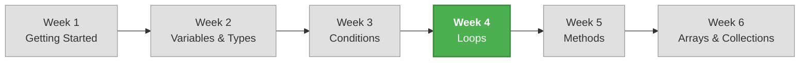

# Week 4 – Loops and Iteration

## 📋 Overview

This week your programs learn to **repeat**. Until now, every line of code runs exactly once. With loops, you can execute a block of code over and over — whether that's 5 times, 1000 times, or until the user decides to stop. Loops are one of the most powerful tools in programming, and you'll use them in nearly every program you write from here on.

## 🎯 Learning Objectives

By the end of this week, you will be able to:

- Use `while`, `do-while`, and `for` loops to repeat actions
- Use `foreach` to iterate through collections
- Control loop execution with `break` and `continue`
- Write nested loops for multi-dimensional patterns
- Implement common loop patterns: counters, accumulators, sentinels, and input validation
- Choose the right loop type for a given problem

## 📚 Lecture Index

| # | Lecture | Topics |
|---|---------|--------|
| 1 | [While and Do-While Loops](./lecture-01-while-loops.md) | `while` loop, `do-while` loop, infinite loops, input validation |
| 2 | [For Loops and Foreach](./lecture-02-for-loops.md) | `for` loop, `foreach` introduction, choosing the right loop |
| 3 | [Loop Control and Patterns](./lecture-03-loop-control.md) | `break`, `continue`, nested loops, common patterns |

## 📝 Practice & Assessment

| Resource | Description |
|----------|-------------|
| [Exercises](./exercises.md) | Practice problems for each lecture topic |
| [Assignment](./assignment.md) | Weekly mini-project: **Number Guessing Game** |

## 🔗 Prerequisites

Before starting this week, make sure you are comfortable with:

- Variables and data types (Week 2)
- Comparison and logical operators (Week 3)
- `if`/`else` statements (Week 3)
- Reading user input with `Console.ReadLine()` and converting types

## 🗺️ How This Week Fits Into the Course

## ✅ Week 4 Checklist

- [ ] Can write a `while` loop with a clear condition
- [ ] Can write a `do-while` loop and explain when to use it
- [ ] Can write a `for` loop with counter variable
- [ ] Can use `foreach` to iterate through a collection
- [ ] Can use `break` to exit a loop early
- [ ] Can use `continue` to skip an iteration
- [ ] Can write nested loops for patterns or grids
- [ ] Can implement input validation using a loop
- [ ] Can implement accumulator and counter patterns
- [ ] Completed the Number Guessing Game assignment

---

[← Previous Week: Week 3 – Conditional Statements](../week-03/README.md) | [Next Week: Week 5 – Methods and Modular Code →](../week-05/README.md)
