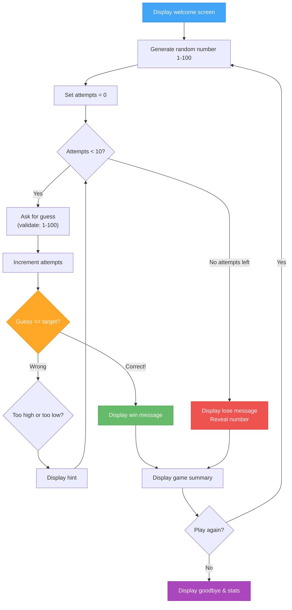

# Week 4 – Assignment: Number Guessing Game

[← Back to Week 4 Overview](./README.md)

---

## 🎯 Project Brief

Build a **Number Guessing Game** — an interactive console game where the computer picks a random number and the player tries to guess it. This project brings together all the loop concepts from this week: `while`/`do-while` for the game loop, `for` for limited attempts, `break` for early exits, input validation, and accumulators for tracking statistics.

---

## 📋 Requirements

### Core Features

Your program must:

1. **Display a welcome screen** with the game title and rules
2. **Generate a random number** between 1 and 100
3. **Give the player 10 attempts** to guess the number
4. **After each guess**, provide feedback:
   - "Too high!" if the guess is above the target
   - "Too low!" if the guess is below the target
   - "Correct!" if they guessed it
5. **Show the attempt number** with each prompt (e.g., "Attempt 3/10")
6. **Validate input** — only accept numbers between 1 and 100
7. **After the game ends** (win or lose), display a summary:
   - Whether they won or lost
   - The correct number (if they lost)
   - How many attempts they used
8. **Ask "Play again?"** — loop the entire game if the user says yes

### Game Flow



---

## 💻 Example Output

```
╔═══════════════════════════════════╗
║      NUMBER GUESSING GAME         ║
╠═══════════════════════════════════╣
║  I'm thinking of a number        ║
║  between 1 and 100.              ║
║  You have 10 attempts to         ║
║  guess it!                        ║
╚═══════════════════════════════════╝

--- Round 1 ---

Attempt 1/10 — Enter your guess: 50
Too high! Try a lower number.

Attempt 2/10 — Enter your guess: 25
Too low! Try a higher number.

Attempt 3/10 — Enter your guess: 37
Too low! Try a higher number.

Attempt 4/10 — Enter your guess: 43
🎉 Correct! The number was 43!

=== Game Summary ===
Result:   WIN
Attempts: 4 out of 10
Rating:   Excellent!

Play again? (yes/no): yes

--- Round 2 ---

Attempt 1/10 — Enter your guess: 200
Invalid! Please enter a number between 1 and 100.
Attempt 1/10 — Enter your guess: 50
Too low! Try a higher number.

...

Attempt 10/10 — Enter your guess: 73
Too high!

Sorry! You ran out of attempts.
The number was: 71

=== Game Summary ===
Result:   LOSE
Attempts: 10 out of 10

Play again? (yes/no): no

Thanks for playing! 🎮
Total rounds played: 2
Rounds won: 1
Rounds lost: 1
Win rate: 50.0%
```

---

## 🛠️ Starter Template

Here's a skeleton to get you started. Fill in the parts marked with `// TODO`:

```csharp
Random random = new Random();
bool playAgain = true;
int totalRounds = 0;
int totalWins = 0;

// Display welcome screen
Console.WriteLine("╔═══════════════════════════════════╗");
Console.WriteLine("║      NUMBER GUESSING GAME         ║");
Console.WriteLine("╠═══════════════════════════════════╣");
Console.WriteLine("║  I'm thinking of a number        ║");
Console.WriteLine("║  between 1 and 100.              ║");
Console.WriteLine("║  You have 10 attempts to         ║");
Console.WriteLine("║  guess it!                        ║");
Console.WriteLine("╚═══════════════════════════════════╝");

while (playAgain)
{
    // TODO: Generate a random number between 1 and 100
    // Hint: int target = random.Next(1, 101);

    int attempts = 0;
    int maxAttempts = 10;
    bool won = false;
    totalRounds++;

    Console.WriteLine($"\n--- Round {totalRounds} ---\n");

    // TODO: Create a loop that runs up to maxAttempts times
    // Inside the loop:
    //   1. Ask for the user's guess
    //   2. Validate the input (must be 1-100)
    //   3. Increment attempts
    //   4. Check if the guess is correct, too high, or too low
    //   5. If correct, set won = true and break

    // TODO: After the loop, display the game summary
    // If won: congratulate and show attempts used
    // If lost: reveal the number

    // TODO: Ask if they want to play again
    // Validate the response (accept "yes" or "no")
}

// TODO: Display final statistics
// Total rounds, wins, losses, win rate
```

---

## ⭐ Rating System

Add a rating based on how many attempts the player used:

| Attempts | Rating |
|----------|--------|
| 1 | 🏆 Impossible! Are you psychic? |
| 2–3 | 🌟 Outstanding! |
| 4–5 | ⭐ Excellent! |
| 6–7 | 👍 Good job! |
| 8–9 | 😅 Close call! |
| 10 | 😤 Just barely! |
| Lost | 💀 Better luck next time! |

---

## 📊 Grading Rubric

| Criteria | Weight |
|----------|--------|
| Random number generation works correctly | 10% |
| Game loop runs for correct number of attempts | 15% |
| Correct higher/lower feedback | 15% |
| Input validation (1–100 range) | 15% |
| Win/lose detection and messaging | 15% |
| Play-again loop works | 10% |
| Game statistics tracking across rounds | 10% |
| Code quality (naming, comments, organization) | 10% |

---

## 💡 Hints

- Use `Random random = new Random();` once at the top and `random.Next(1, 101)` to generate numbers (the upper bound is exclusive, so 101 gives you 1–100)
- Use a `for` loop for the attempt counting — it naturally handles the counter
- Nest a `do-while` inside the `for` loop for input validation
- Use `break` to exit the `for` loop early when the player guesses correctly
- Track `totalRounds` and `totalWins` outside the main game loop for the final statistics
- Use `int.TryParse()` for safer input handling (bonus if you implement this instead of `int.Parse()`)

---

## 🚀 Bonus Challenges

1. **Difficulty Levels:** Ask the player to choose Easy (1–50, 15 attempts), Medium (1–100, 10 attempts), or Hard (1–200, 7 attempts)
2. **Hint System:** Every 3 wrong guesses, offer a hint like "The number is even/odd" or "The number is between X and Y" (narrowing the range)
3. **High Score:** Track the best (lowest) number of attempts across all rounds and display it
4. **Hot/Cold Indicator:** In addition to "higher/lower", show how close they are: "🔥 Burning hot!" (within 5), "🌡️ Warm" (within 15), "❄️ Cold" (more than 15 away)
5. **Two-Player Mode:** Player 1 enters a secret number, the screen clears, and Player 2 tries to guess it

---

[← Back to Week 4 Overview](./README.md)
