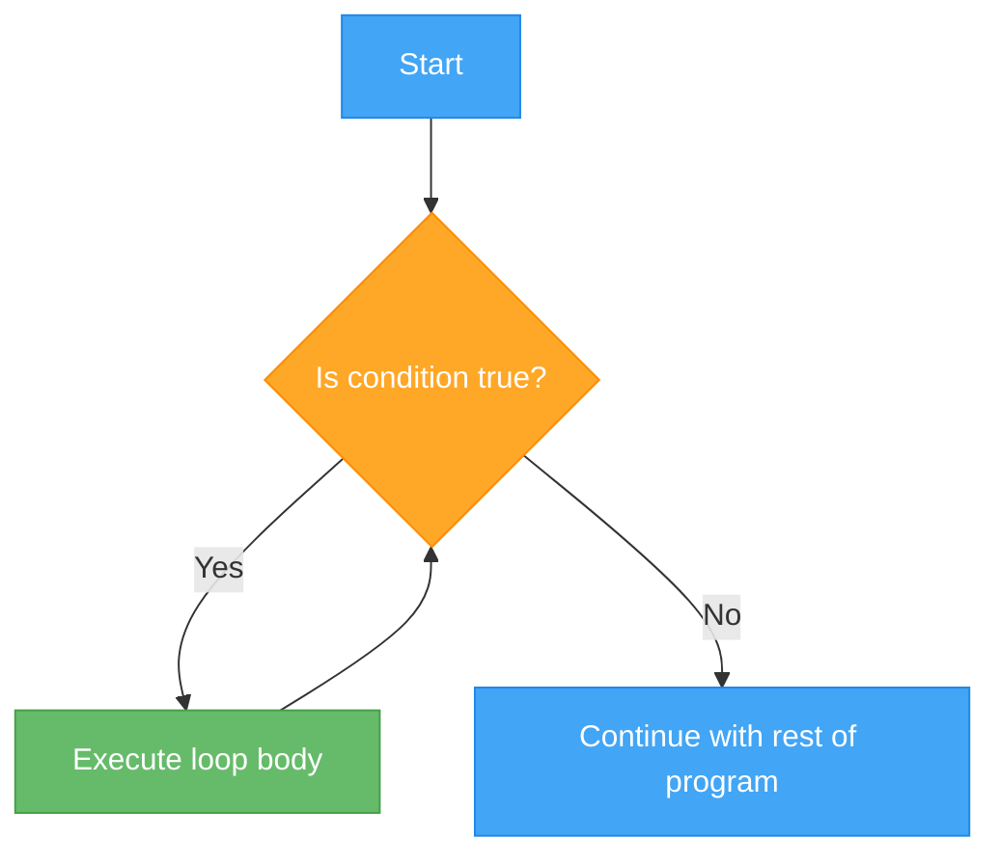
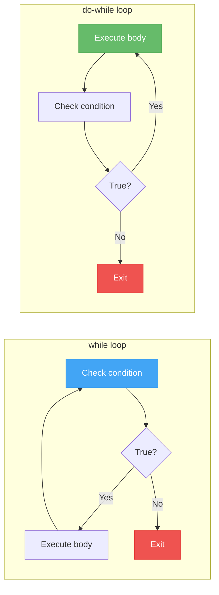

# Lecture 1: While and Do-While Loops

[← Back to Week 4 Overview](./README.md) | [Next: Lecture 2 – For Loops and Foreach →](./lecture-02-for-loops.md)

---

## 📋 Lecture Overview

| Item | Detail |
|------|--------|
| Duration | 45 minutes |
| Topics | `while` loop, `do-while` loop, infinite loops, input validation |
| Preparation | Comfortable with `if`/`else` and comparison operators (Week 3) |

---

## 1. Why Do We Need Loops?

Imagine you want to print "Hello!" five times. Without loops, you would write:

```csharp
Console.WriteLine("Hello!");
Console.WriteLine("Hello!");
Console.WriteLine("Hello!");
Console.WriteLine("Hello!");
Console.WriteLine("Hello!");
```

This works, but what if you want to print it 100 times? Or 10,000 times? What if you don't know how many times until the program is running?

**Loops** solve this problem. A loop lets you write a block of code once and have the computer repeat it as many times as needed.



---

## 2. The `while` Loop

The `while` loop repeats a block of code **as long as a condition is true**. The condition is checked **before** each iteration.

### Syntax

```csharp
while (condition)
{
    // Code to repeat
}
```

### How It Works

1. Check the condition
2. If `true` → execute the body, then go back to step 1
3. If `false` → skip the body and move on

### Example: Counting to 5

```csharp
int count = 1;

while (count <= 5)
{
    Console.WriteLine($"Count: {count}");
    count++;
}

Console.WriteLine("Done!");
```

**Output:**
```
Count: 1
Count: 2
Count: 3
Count: 4
Count: 5
Done!
```

### Tracing Through the Loop

Let's trace what happens step by step:

| Iteration | `count` Value | Condition `count <= 5` | Action |
|-----------|---------------|----------------------|--------|
| 1 | 1 | `true` | Print "Count: 1", count becomes 2 |
| 2 | 2 | `true` | Print "Count: 2", count becomes 3 |
| 3 | 3 | `true` | Print "Count: 3", count becomes 4 |
| 4 | 4 | `true` | Print "Count: 4", count becomes 5 |
| 5 | 5 | `true` | Print "Count: 5", count becomes 6 |
| 6 | 6 | `false` | Loop ends |

> 💡 **Key insight:** The loop ran 5 times, but the condition was checked 6 times (the last check returned `false` and ended the loop).

### Example: Countdown

```csharp
int seconds = 5;

Console.WriteLine("Countdown:");
while (seconds > 0)
{
    Console.WriteLine($"  {seconds}...");
    seconds--;
}
Console.WriteLine("  Liftoff! 🚀");
```

**Output:**
```
Countdown:
  5...
  4...
  3...
  2...
  1...
  Liftoff! 🚀
```

---

## 3. Common Mistake: Infinite Loops

If the condition never becomes `false`, the loop runs forever. This is called an **infinite loop**.

```csharp
// ⚠️ DANGER: This loop never ends!
int x = 1;
while (x <= 5)
{
    Console.WriteLine(x);
    // Forgot to increment x!
}
```

The variable `x` stays at `1` forever, so `x <= 5` is always `true`. The program will print `1` endlessly until you force it to stop.

**How to stop a runaway program:**
- In Visual Studio: Click the **Stop** button (red square)
- In the terminal: Press `Ctrl + C`

### Checklist to Avoid Infinite Loops

Before writing a loop, ask yourself:

1. ✅ Does the condition eventually become false?
2. ✅ Is something inside the loop changing the condition variable?
3. ✅ Is the change moving **toward** making the condition false?

---

## 4. The `do-while` Loop

The `do-while` loop is similar to `while`, but with one key difference: it checks the condition **after** executing the body. This means the body always runs **at least once**.

### Syntax

```csharp
do
{
    // Code to repeat
} while (condition);  // Note the semicolon!
```

### How It Differs from `while`



### Example: Comparing `while` vs `do-while`

```csharp
// while — body may never execute
int a = 10;
while (a < 5)
{
    Console.WriteLine($"while: {a}");
    a++;
}
// Nothing prints! The condition was false from the start.

// do-while — body always executes at least once
int b = 10;
do
{
    Console.WriteLine($"do-while: {b}");
    b++;
} while (b < 5);
// Prints "do-while: 10" — the body ran once before the condition was checked.
```

**Output:**
```
do-while: 10
```

---

## 5. Input Validation with `do-while`

The `do-while` loop is perfect for **input validation** — asking the user for input and repeating until they give a valid answer. You need to ask at least once (you can't validate input you haven't received yet).

### Example: Require a Positive Number

```csharp
int number;

do
{
    Console.Write("Enter a positive number: ");
    number = int.Parse(Console.ReadLine());

    if (number <= 0)
    {
        Console.WriteLine("That's not positive! Try again.");
    }
} while (number <= 0);

Console.WriteLine($"You entered: {number}");
```

**Sample run:**
```
Enter a positive number: -3
That's not positive! Try again.
Enter a positive number: 0
That's not positive! Try again.
Enter a positive number: 7
You entered: 7
```

### Example: Menu System

```csharp
string choice;

do
{
    Console.WriteLine("\n=== Main Menu ===");
    Console.WriteLine("1. Say Hello");
    Console.WriteLine("2. Show Date");
    Console.WriteLine("3. Exit");
    Console.Write("Choose an option: ");
    choice = Console.ReadLine();

    switch (choice)
    {
        case "1":
            Console.WriteLine("Hello there!");
            break;
        case "2":
            Console.WriteLine($"Today is {DateTime.Now.ToShortDateString()}");
            break;
        case "3":
            Console.WriteLine("Goodbye!");
            break;
        default:
            Console.WriteLine("Invalid option. Please try again.");
            break;
    }
} while (choice != "3");
```

This is a very common pattern — the menu keeps showing until the user chooses to exit.

---

## 6. Accumulator Pattern

An **accumulator** is a variable that collects (accumulates) a value across multiple loop iterations. This is one of the most common loop patterns.

### Example: Sum of Numbers

```csharp
Console.Write("How many numbers do you want to add? ");
int count = int.Parse(Console.ReadLine());

int sum = 0;  // Accumulator — starts at 0

int i = 1;
while (i <= count)
{
    Console.Write($"Enter number {i}: ");
    int number = int.Parse(Console.ReadLine());
    sum += number;  // Add to the accumulator
    i++;
}

Console.WriteLine($"\nThe total is: {sum}");
```

**Sample run:**
```
How many numbers do you want to add? 3
Enter number 1: 10
Enter number 2: 25
Enter number 3: 15

The total is: 50
```

---

## 7. Sentinel Value Pattern

A **sentinel** is a special value that signals the end of input. Instead of asking "how many numbers?", you let the user keep entering numbers until they type a stop value.

### Example: Enter Numbers Until -1

```csharp
Console.WriteLine("Enter numbers to add (type -1 to stop):");

int sum = 0;
int count = 0;

Console.Write("Enter a number: ");
int number = int.Parse(Console.ReadLine());

while (number != -1)
{
    sum += number;
    count++;
    Console.Write("Enter a number: ");
    number = int.Parse(Console.ReadLine());
}

if (count > 0)
{
    double average = (double)sum / count;
    Console.WriteLine($"\nYou entered {count} numbers.");
    Console.WriteLine($"Sum: {sum}");
    Console.WriteLine($"Average: {average:F2}");
}
else
{
    Console.WriteLine("\nNo numbers were entered.");
}
```

**Sample run:**
```
Enter numbers to add (type -1 to stop):
Enter a number: 10
Enter a number: 20
Enter a number: 30
Enter a number: -1

You entered 3 numbers.
Sum: 60
Average: 20.00
```

---

## 🔑 Key Takeaways

| Concept | Key Point |
|---------|-----------|
| `while` | Checks condition **before** each iteration — body may never run |
| `do-while` | Checks condition **after** each iteration — body runs **at least once** |
| Infinite loop | Happens when the condition never becomes `false` — always update your loop variable |
| Input validation | `do-while` is ideal — ask for input, then check if it's valid |
| Accumulator | A variable that collects values across iterations (e.g., running sum) |
| Sentinel | A special value that signals "stop" (e.g., enter -1 to quit) |

---

## ✏️ Quick Exercises

### Exercise 1 — Counting Down
Write a program that asks the user for a starting number and counts down to 1 using a `while` loop.

### Exercise 2 — Password Check
Use a `do-while` loop to ask the user for a password. Keep asking until they type "secret123". Display how many attempts it took.

### Exercise 3 — Running Total
Write a program that keeps asking the user for numbers (using a sentinel value of 0 to stop) and displays the running total after each entry.

---

[← Back to Week 4 Overview](./README.md) | [Next: Lecture 2 – For Loops and Foreach →](./lecture-02-for-loops.md)
