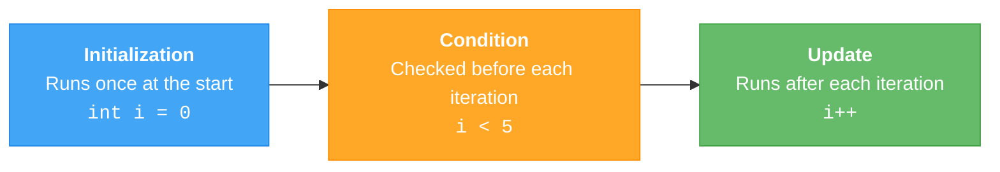
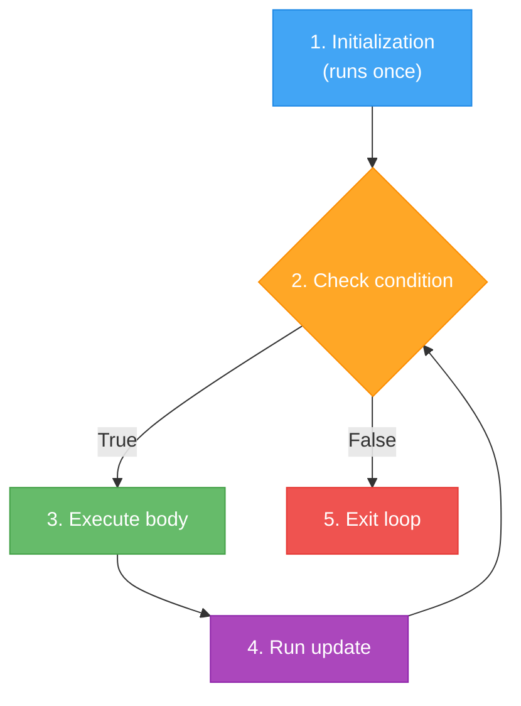
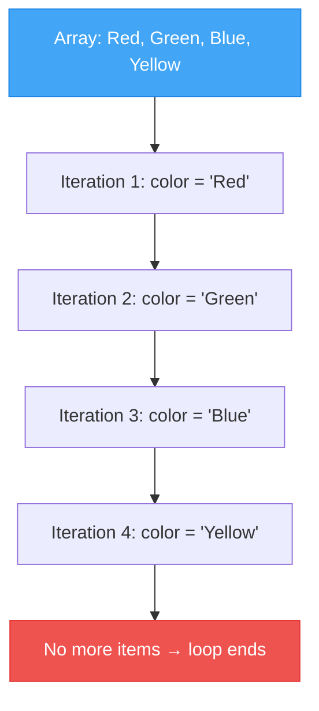
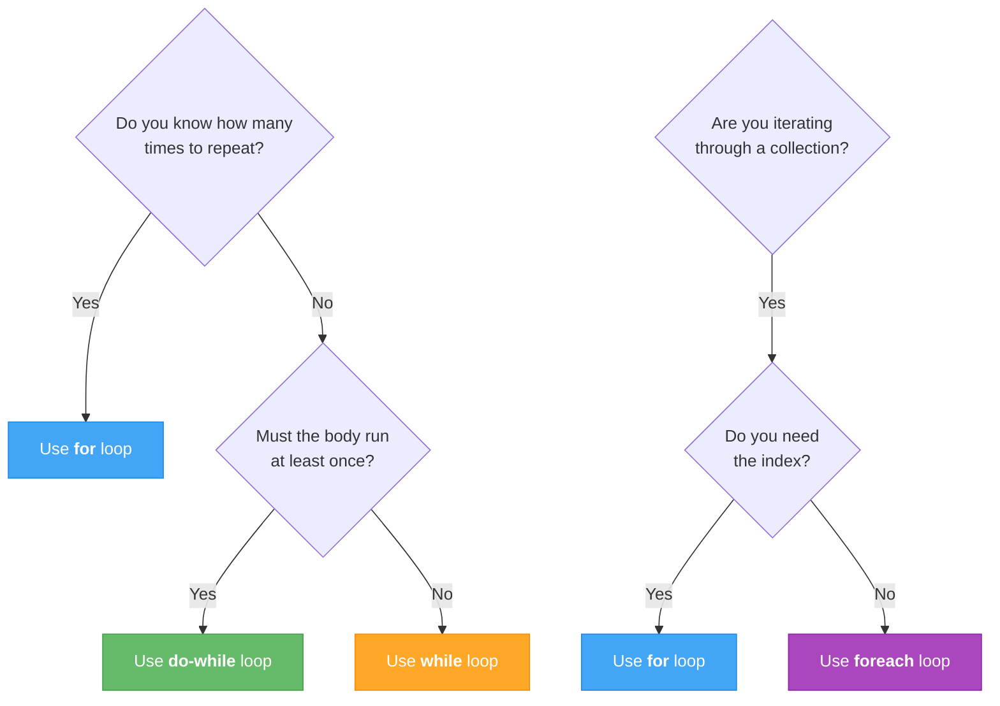

# Lecture 2: For Loops and Foreach

[← Previous: Lecture 1 – While and Do-While Loops](./lecture-01-while-loops.md) | [Back to Week 4 Overview](./README.md) | [Next: Lecture 3 – Loop Control and Patterns →](./lecture-03-loop-control.md)

---

## 📋 Lecture Overview

| Item | Detail |
|------|--------|
| Duration | 45 minutes |
| Topics | `for` loop, `foreach` introduction, choosing the right loop |
| Preparation | Completed Lecture 1 exercises |

---

## 1. The `for` Loop

The `for` loop is the most compact loop in C#. It's designed for situations where you **know how many times** you want to repeat, or when you need a **counter variable**.

### Syntax

```csharp
for (initialization; condition; update)
{
    // Code to repeat
}
```

The three parts inside the parentheses are:



### How It Executes



### Example: Print Numbers 1 to 5

```csharp
for (int i = 1; i <= 5; i++)
{
    Console.WriteLine($"Number: {i}");
}
```

**Output:**
```
Number: 1
Number: 2
Number: 3
Number: 4
Number: 5
```

### Tracing the Execution

| Step | `i` | Condition `i <= 5` | Action |
|------|-----|-------------------|--------|
| Init | 1 | — | `i` is created and set to 1 |
| Check | 1 | `true` | Print "Number: 1" |
| Update | 2 | — | `i++` makes `i` = 2 |
| Check | 2 | `true` | Print "Number: 2" |
| Update | 3 | — | `i++` makes `i` = 3 |
| Check | 3 | `true` | Print "Number: 3" |
| Update | 4 | — | `i++` makes `i` = 4 |
| Check | 4 | `true` | Print "Number: 4" |
| Update | 5 | — | `i++` makes `i` = 5 |
| Check | 5 | `true` | Print "Number: 5" |
| Update | 6 | — | `i++` makes `i` = 6 |
| Check | 6 | `false` | Loop ends |

---

## 2. `for` Loop Variations

### Counting Down

```csharp
for (int i = 10; i >= 1; i--)
{
    Console.Write($"{i} ");
}
Console.WriteLine("Go!");
```

**Output:**
```
10 9 8 7 6 5 4 3 2 1 Go!
```

### Stepping by 2 (Even Numbers)

```csharp
Console.WriteLine("Even numbers from 2 to 20:");
for (int i = 2; i <= 20; i += 2)
{
    Console.Write($"{i} ");
}
```

**Output:**
```
Even numbers from 2 to 20:
2 4 6 8 10 12 14 16 18 20
```

### Using the Counter in Calculations

```csharp
Console.WriteLine("Multiplication Table for 7:");
for (int i = 1; i <= 10; i++)
{
    int result = 7 * i;
    Console.WriteLine($"7 x {i} = {result}");
}
```

**Output:**
```
Multiplication Table for 7:
7 x 1 = 7
7 x 2 = 14
7 x 3 = 21
...
7 x 10 = 70
```

---

## 3. `for` vs `while` — Same Logic, Different Style

A `for` loop is really just a `while` loop with the initialization and update built in. These two blocks do exactly the same thing:

```csharp
// Using while
int i = 1;
while (i <= 5)
{
    Console.WriteLine(i);
    i++;
}

// Using for — same thing, more compact
for (int j = 1; j <= 5; j++)
{
    Console.WriteLine(j);
}
```

The `for` loop is generally preferred when you have a counter because everything related to the counter is in one line, making it easier to read and less likely to cause infinite loops.

---

## 4. Introduction to `foreach`

The `foreach` loop is designed to iterate through a **collection** of items — like an array or a list. You don't need a counter variable; the loop automatically gives you each element one at a time.

### Syntax

```csharp
foreach (type variableName in collection)
{
    // Use variableName
}
```

### Example with an Array

An **array** is a fixed-size collection of values of the same type. We'll cover arrays in depth in Week 6, but here's a preview to show how `foreach` works:

```csharp
string[] colors = { "Red", "Green", "Blue", "Yellow" };

foreach (string color in colors)
{
    Console.WriteLine($"Color: {color}");
}
```

**Output:**
```
Color: Red
Color: Green
Color: Blue
Color: Yellow
```

### How `foreach` Works



The `foreach` loop automatically moves through the collection from start to finish. You don't need to manage an index or worry about going out of bounds.

### Example with Numbers

```csharp
int[] scores = { 85, 92, 78, 95, 88 };

int sum = 0;
foreach (int score in scores)
{
    sum += score;
}

double average = (double)sum / scores.Length;
Console.WriteLine($"Average score: {average:F1}");
```

**Output:**
```
Average score: 87.6
```

> 💡 `scores.Length` gives you the number of elements in the array. We'll explore this more in Week 6.

### `for` vs `foreach` with Arrays

```csharp
string[] fruits = { "Apple", "Banana", "Cherry" };

// Using for — you manage the index
for (int i = 0; i < fruits.Length; i++)
{
    Console.WriteLine($"{i + 1}. {fruits[i]}");
}

// Using foreach — simpler, but no index
foreach (string fruit in fruits)
{
    Console.WriteLine($"- {fruit}");
}
```

Use `for` when you **need the index** (position number). Use `foreach` when you just need each **value**.

---

## 5. Choosing the Right Loop

Here's a decision guide to help you pick the best loop for the job:



### Quick Reference

| Loop | Best For | Example Use Case |
|------|----------|-----------------|
| `while` | Unknown iterations, condition-based | Keep reading input until user types "quit" |
| `do-while` | Must execute at least once | Menu systems, input validation |
| `for` | Known count, need a counter | Print numbers 1–100, multiplication table |
| `foreach` | Iterating through collections | Process each item in an array |

---

## 6. Complete Example: Grade Statistics

Let's combine `for` and arrays to build something practical:

```csharp
Console.Write("How many students? ");
int studentCount = int.Parse(Console.ReadLine());

int[] grades = new int[studentCount];

// Collect grades using a for loop
for (int i = 0; i < studentCount; i++)
{
    Console.Write($"Enter grade for student {i + 1}: ");
    grades[i] = int.Parse(Console.ReadLine());
}

// Calculate statistics using foreach
int sum = 0;
int highest = grades[0];
int lowest = grades[0];

foreach (int grade in grades)
{
    sum += grade;
    if (grade > highest) highest = grade;
    if (grade < lowest) lowest = grade;
}

double average = (double)sum / studentCount;

// Display results
Console.WriteLine("\n=== Grade Statistics ===");
Console.WriteLine($"Students:  {studentCount}");
Console.WriteLine($"Highest:   {highest}");
Console.WriteLine($"Lowest:    {lowest}");
Console.WriteLine($"Average:   {average:F1}");
```

**Sample run:**
```
How many students? 4
Enter grade for student 1: 85
Enter grade for student 2: 92
Enter grade for student 3: 78
Enter grade for student 4: 95

=== Grade Statistics ===
Students:  4
Highest:   95
Lowest:    78
Average:   87.5
```

---

## 🔑 Key Takeaways

| Concept | Key Point |
|---------|-----------|
| `for` loop | Best when you know how many iterations — initialization, condition, and update in one line |
| `foreach` | Simplest way to iterate through a collection — no index needed |
| Counter variable | The `i` in a `for` loop — use it to track position or count |
| Stepping | Change `i++` to `i += 2`, `i--`, etc. to control how the counter changes |
| `for` vs `foreach` | Use `for` when you need the index, `foreach` when you just need values |

---

## ✏️ Quick Exercises

### Exercise 1 — Multiplication Table
Use a `for` loop to print the multiplication table for any number the user enters (from 1 to 12).

### Exercise 2 — Sum of Even Numbers
Use a `for` loop to calculate the sum of all even numbers from 1 to 100.

### Exercise 3 — Favorite Foods
Create a string array with 5 of your favorite foods. Use `foreach` to display them in a numbered format. (Hint: you'll need a separate counter variable.)

---

[← Previous: Lecture 1 – While and Do-While Loops](./lecture-01-while-loops.md) | [Back to Week 4 Overview](./README.md) | [Next: Lecture 3 – Loop Control and Patterns →](./lecture-03-loop-control.md)
