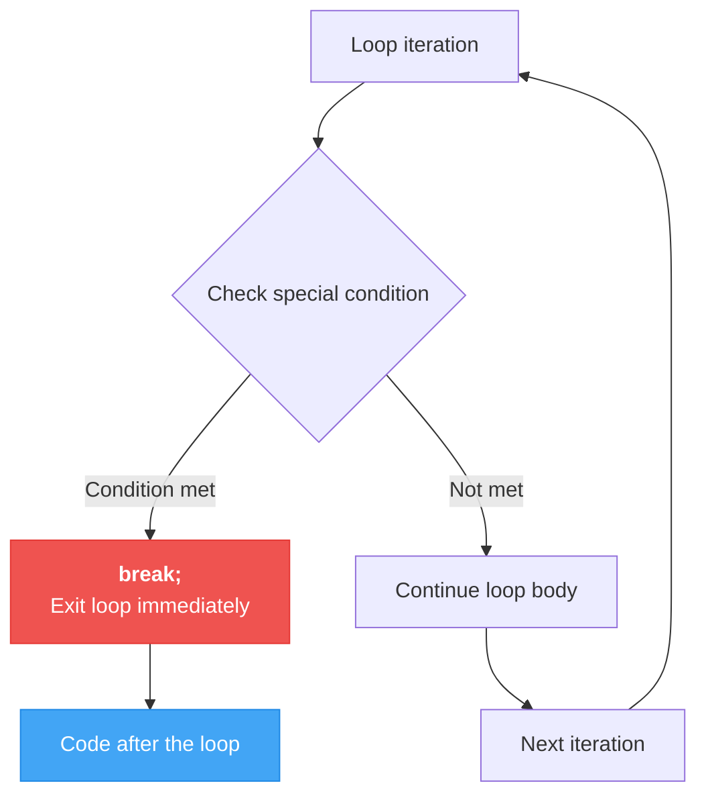
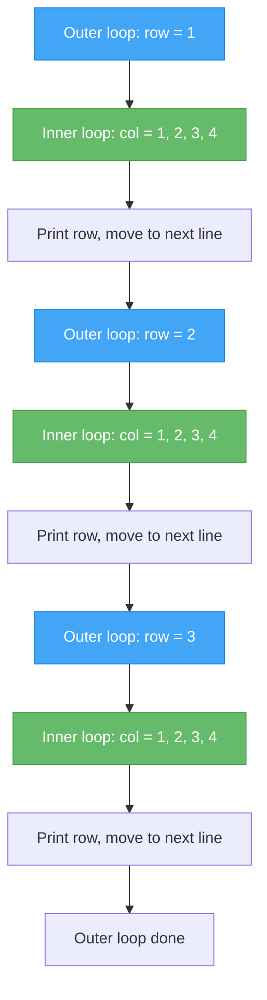

# Lecture 3: Loop Control and Patterns

[← Previous: Lecture 2 – For Loops and Foreach](./lecture-02-for-loops.md) | [Back to Week 4 Overview](./README.md)

---

## 📋 Lecture Overview

| Item | Detail |
|------|--------|
| Duration | 45 minutes |
| Topics | `break`, `continue`, nested loops, common patterns |
| Preparation | Comfortable with `while`, `do-while`, `for`, and `foreach` |

---

## 1. Controlling Loop Flow with `break`

Sometimes you need to **exit a loop early** — before the condition naturally becomes `false`. The `break` statement immediately stops the loop and jumps to the code after it.

### Example: Search for a Number

```csharp
int[] numbers = { 4, 8, 15, 16, 23, 42 };
int target = 16;
bool found = false;

for (int i = 0; i < numbers.Length; i++)
{
    if (numbers[i] == target)
    {
        Console.WriteLine($"Found {target} at position {i}!");
        found = true;
        break;  // No need to keep searching
    }
}

if (!found)
{
    Console.WriteLine($"{target} was not found.");
}
```

**Output:**
```
Found 16 at position 3!
```

Without `break`, the loop would continue checking the remaining elements even after finding the target — wasted effort.

### `break` in a `while` Loop

```csharp
Console.WriteLine("Type messages (type 'quit' to stop):");

while (true)  // Intentional "infinite" loop
{
    Console.Write("> ");
    string input = Console.ReadLine();

    if (input == "quit")
    {
        break;  // Exit the loop
    }

    Console.WriteLine($"You said: {input}");
}

Console.WriteLine("Chat ended.");
```

**Sample run:**
```
Type messages (type 'quit' to stop):
> Hello
You said: Hello
> How are loops?
You said: How are loops?
> quit
Chat ended.
```

> 💡 `while (true)` creates an intentional infinite loop. The only way to exit is through `break`. This is a common pattern when the exit condition is checked **inside** the loop body.

### How `break` Works — Visual



---

## 2. Skipping Iterations with `continue`

The `continue` statement skips the **rest of the current iteration** and jumps to the next one. The loop itself keeps running.

### Example: Skip Odd Numbers

```csharp
for (int i = 1; i <= 10; i++)
{
    if (i % 2 != 0)
    {
        continue;  // Skip odd numbers
    }

    Console.Write($"{i} ");
}
```

**Output:**
```
2 4 6 8 10
```

When `i` is odd (1, 3, 5, 7, 9), `continue` skips the `Console.Write` and moves to the next value of `i`.

### Example: Process Valid Grades Only

```csharp
int[] grades = { 85, -1, 92, 150, 78, 95, -5, 88 };

int sum = 0;
int validCount = 0;

foreach (int grade in grades)
{
    if (grade < 0 || grade > 100)
    {
        Console.WriteLine($"  Skipping invalid grade: {grade}");
        continue;  // Skip this grade
    }

    sum += grade;
    validCount++;
}

Console.WriteLine($"\nValid grades: {validCount}");
Console.WriteLine($"Average: {(double)sum / validCount:F1}");
```

**Output:**
```
  Skipping invalid grade: -1
  Skipping invalid grade: 150
  Skipping invalid grade: -5

Valid grades: 5
Average: 87.6
```

### `break` vs `continue`

| Statement | What It Does | Loop Continues? |
|-----------|-------------|-----------------|
| `break` | Exits the **entire loop** | No — loop is done |
| `continue` | Skips to the **next iteration** | Yes — loop keeps going |

---

## 3. Nested Loops

A **nested loop** is a loop inside another loop. The inner loop runs completely for **each iteration** of the outer loop.

### Example: Simple Grid

```csharp
for (int row = 1; row <= 3; row++)
{
    for (int col = 1; col <= 4; col++)
    {
        Console.Write($"({row},{col}) ");
    }
    Console.WriteLine();  // New line after each row
}
```

**Output:**
```
(1,1) (1,2) (1,3) (1,4) 
(2,1) (2,2) (2,3) (2,4) 
(3,1) (3,2) (3,3) (3,4) 
```

### How Nested Loops Execute



The total number of iterations is **outer × inner**. A 3×4 nested loop runs the inner body 12 times.

### Example: Multiplication Table

```csharp
Console.WriteLine("    1   2   3   4   5   6   7   8   9  10");
Console.WriteLine("  ────────────────────────────────────────");

for (int row = 1; row <= 10; row++)
{
    Console.Write($"{row,2}|");
    for (int col = 1; col <= 10; col++)
    {
        Console.Write($"{row * col,4}");
    }
    Console.WriteLine();
}
```

**Output:**
```
    1   2   3   4   5   6   7   8   9  10
  ────────────────────────────────────────
 1|   1   2   3   4   5   6   7   8   9  10
 2|   2   4   6   8  10  12  14  16  18  20
 3|   3   6   9  12  15  18  21  24  27  30
...
10|  10  20  30  40  50  60  70  80  90 100
```

---

## 4. Pattern Printing with Nested Loops

Nested loops are often used to print patterns. These exercises strengthen your understanding of how inner and outer loops interact.

### Right Triangle

```csharp
int height = 5;

for (int row = 1; row <= height; row++)
{
    for (int col = 1; col <= row; col++)
    {
        Console.Write("* ");
    }
    Console.WriteLine();
}
```

**Output:**
```
* 
* * 
* * * 
* * * * 
* * * * * 
```

Notice how the inner loop's limit (`col <= row`) depends on the outer loop's variable. On row 1, it prints 1 star. On row 3, it prints 3 stars.

### Inverted Triangle

```csharp
int height = 5;

for (int row = height; row >= 1; row--)
{
    for (int col = 1; col <= row; col++)
    {
        Console.Write("* ");
    }
    Console.WriteLine();
}
```

**Output:**
```
* * * * * 
* * * * 
* * * 
* * 
* 
```

### Number Triangle

```csharp
for (int row = 1; row <= 5; row++)
{
    for (int col = 1; col <= row; col++)
    {
        Console.Write($"{col} ");
    }
    Console.WriteLine();
}
```

**Output:**
```
1 
1 2 
1 2 3 
1 2 3 4 
1 2 3 4 5 
```

---

## 5. Common Loop Patterns — Summary

Here's a reference of the patterns we've covered across all three lectures:

### Counter Pattern
Track how many times something happens.

```csharp
int count = 0;
for (int i = 1; i <= 100; i++)
{
    if (i % 3 == 0)
        count++;
}
Console.WriteLine($"Numbers divisible by 3: {count}");
```

### Accumulator Pattern
Build up a total value.

```csharp
double total = 0;
for (int i = 1; i <= 5; i++)
{
    Console.Write($"Enter price {i}: ");
    total += double.Parse(Console.ReadLine());
}
Console.WriteLine($"Total: {total:C}");
```

### Min/Max Pattern
Track the highest or lowest value seen.

```csharp
Console.Write("Enter first number: ");
int max = int.Parse(Console.ReadLine());

for (int i = 2; i <= 5; i++)
{
    Console.Write($"Enter number {i}: ");
    int num = int.Parse(Console.ReadLine());
    if (num > max)
        max = num;
}
Console.WriteLine($"Largest number: {max}");
```

### Input Validation Pattern
Repeat until valid input is received.

```csharp
int age;
do
{
    Console.Write("Enter your age (1-120): ");
    age = int.Parse(Console.ReadLine());
} while (age < 1 || age > 120);
```

### Search Pattern
Look for a specific value and stop when found.

```csharp
string[] names = { "Alice", "Bob", "Charlie", "Diana" };
string target = "Charlie";

foreach (string name in names)
{
    if (name == target)
    {
        Console.WriteLine($"Found: {name}");
        break;
    }
}
```

---

## 6. Complete Example: Simple ATM

Let's bring together many patterns into one program:

```csharp
double balance = 1000.00;
string choice;

Console.WriteLine("╔══════════════════════════╗");
Console.WriteLine("║    Welcome to SimpleATM   ║");
Console.WriteLine("╚══════════════════════════╝");

do
{
    Console.WriteLine($"\nBalance: {balance:C}");
    Console.WriteLine("1. Deposit");
    Console.WriteLine("2. Withdraw");
    Console.WriteLine("3. Exit");
    Console.Write("Choose: ");
    choice = Console.ReadLine();

    switch (choice)
    {
        case "1":
            double deposit;
            do
            {
                Console.Write("Amount to deposit: ");
                deposit = double.Parse(Console.ReadLine());
                if (deposit <= 0)
                    Console.WriteLine("Amount must be positive!");
            } while (deposit <= 0);

            balance += deposit;
            Console.WriteLine($"Deposited {deposit:C}. New balance: {balance:C}");
            break;

        case "2":
            double withdrawal;
            do
            {
                Console.Write("Amount to withdraw: ");
                withdrawal = double.Parse(Console.ReadLine());
                if (withdrawal <= 0)
                    Console.WriteLine("Amount must be positive!");
                else if (withdrawal > balance)
                    Console.WriteLine("Insufficient funds!");
            } while (withdrawal <= 0 || withdrawal > balance);

            balance -= withdrawal;
            Console.WriteLine($"Withdrew {withdrawal:C}. New balance: {balance:C}");
            break;

        case "3":
            Console.WriteLine("Thank you for using SimpleATM!");
            break;

        default:
            Console.WriteLine("Invalid option.");
            break;
    }
} while (choice != "3");
```

This program uses: a `do-while` loop for the menu, nested `do-while` loops for input validation, `switch` for menu options, and the accumulator pattern for the balance.

---

## 🔑 Key Takeaways

| Concept | Key Point |
|---------|-----------|
| `break` | Exits the entire loop immediately |
| `continue` | Skips to the next iteration |
| Nested loops | Inner loop runs completely for each outer iteration |
| Pattern printing | Vary the inner loop limit based on the outer loop variable |
| Common patterns | Counter, accumulator, min/max, validation, search |

---

## ✏️ Quick Exercises

### Exercise 1 — FizzBuzz
Print numbers 1 to 30. For multiples of 3, print "Fizz" instead. For multiples of 5, print "Buzz". For multiples of both, print "FizzBuzz". (Use `continue` creatively or `if-else`.)

### Exercise 2 — Diamond Pattern
Using nested loops, print a diamond pattern with a height of 5:
```
    *
   ***
  *****
 *******
*********
 *******
  *****
   ***
    *
```

### Exercise 3 — Prime Checker
Ask the user for a number and determine if it's prime. A prime number is only divisible by 1 and itself. Use a `for` loop and `break`.

---

[← Previous: Lecture 2 – For Loops and Foreach](./lecture-02-for-loops.md) | [Back to Week 4 Overview](./README.md)
