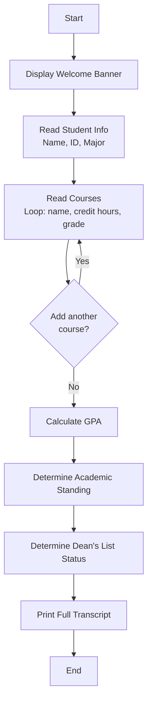

# Week 5 – Assignment: Student Transcript Generator

[← Back to Week 5 Overview](./README.md)

---

## 📋 Overview

Build a **Student Transcript Generator** — a modular console application that collects student information and course grades, calculates academic results, and produces a formatted transcript. The entire program must be organized into well-named methods, demonstrating everything you've learned about methods, parameters, and return values.

---

## 🎯 Learning Goals

- Decompose a complex program into small, focused methods
- Use methods with parameters and return values effectively
- Apply method overloading where appropriate
- Write a `Main()` method that reads like a high-level program description
- Combine methods with loops, conditions, and formatted output

---

## 📐 Program Flow



---

## 📝 Requirements

### Part 1: Student Information
Collect the following from the user:
- **Student name** (first and last)
- **Student ID** (e.g., "STU-2025-001")
- **Major** (e.g., "Computer Science")

### Part 2: Course Entry
Allow the user to enter multiple courses. For each course, collect:
- **Course name** (e.g., "Introduction to Programming")
- **Credit hours** (1–5, must be validated)
- **Grade** as a letter: A, B+, B, C+, C, D+, D, F

Keep asking "Add another course? (y/n)" until the user says no. Require at least 1 course.

### Part 3: GPA Calculation
Convert letter grades to grade points:

| Grade | Points | Grade | Points |
|-------|--------|-------|--------|
| A | 4.0 | C+ | 2.5 |
| B+ | 3.5 | C | 2.0 |
| B | 3.0 | D+ | 1.5 |
|  |  | D | 1.0 |
|  |  | F | 0.0 |

**GPA Formula:**
```
GPA = Sum(credit hours × grade points) / Total credit hours
```

### Part 4: Academic Standing
Based on GPA:

| GPA Range | Standing |
|-----------|----------|
| 3.5 – 4.0 | Excellent |
| 3.0 – 3.49 | Very Good |
| 2.5 – 2.99 | Good |
| 2.0 – 2.49 | Satisfactory |
| Below 2.0 | Academic Probation |

### Part 5: Dean's List
A student qualifies for the Dean's List if:
- GPA is 3.5 or higher **AND**
- No grade below "C" **AND**
- At least 12 total credit hours

### Part 6: Transcript Output
Print a formatted transcript that includes all information.

---

## 🖥️ Expected Output

```
╔══════════════════════════════════════════════════════╗
║           STUDENT TRANSCRIPT GENERATOR               ║
╚══════════════════════════════════════════════════════╝

--- Student Information ---
Enter first name: Sara
Enter last name: Ahmad
Enter student ID: STU-2025-042
Enter major: Computer Science

--- Course Entry ---
Course 1:
  Course name: Introduction to Programming
  Credit hours (1-5): 3
  Grade (A/B+/B/C+/C/D+/D/F): A

Add another course? (y/n): y

Course 2:
  Course name: Calculus I
  Credit hours (1-5): 4
  Grade (A/B+/B/C+/C/D+/D/F): B+

Add another course? (y/n): y

Course 3:
  Course name: English Composition
  Credit hours (1-5): 3
  Grade (A/B+/B/C+/C/D+/D/F): A

Add another course? (y/n): y

Course 4:
  Course name: Physics I
  Credit hours (1-5): 4
  Grade (A/B+/B/C+/C/D+/D/F): B

Add another course? (y/n): n

══════════════════════════════════════════════════════
              OFFICIAL ACADEMIC TRANSCRIPT
══════════════════════════════════════════════════════

  Student: Sara Ahmad
  ID:      STU-2025-042
  Major:   Computer Science

──────────────────────────────────────────────────────
  Course                        Credits  Grade  Points
──────────────────────────────────────────────────────
  Introduction to Programming       3      A      12.0
  Calculus I                         4      B+     14.0
  English Composition                3      A      12.0
  Physics I                          4      B      12.0
──────────────────────────────────────────────────────
  Total Credits: 14
  Total Points:  50.0
  GPA:           3.57

  Academic Standing: Excellent
  ⭐ Dean's List: YES
══════════════════════════════════════════════════════
```

---

## 🔧 Required Methods

Your program **must** include at least the following methods. You may add more as needed.

| Method | Purpose |
|--------|---------|
| `PrintBanner()` | Displays the welcome header |
| `ReadStudentName()` | Reads and returns first + last name |
| `ReadStudentId()` | Reads and returns the student ID |
| `ReadMajor()` | Reads and returns the major |
| `ReadCourseName()` | Reads and returns a course name |
| `ReadCreditHours()` | Reads, validates (1–5), and returns credit hours |
| `ReadGrade()` | Reads, validates, and returns a letter grade |
| `GradeToPoints(string grade)` | Converts a letter grade to its point value |
| `CalculateGPA(...)` | Calculates and returns the GPA |
| `GetAcademicStanding(double gpa)` | Returns the standing string |
| `IsOnDeansList(...)` | Returns true/false for Dean's List eligibility |
| `PrintTranscript(...)` | Displays the full formatted transcript |

---

## 💡 Hints & Tips

1. **Start with method signatures:** Before writing any method body, write out all the method signatures first. This helps you plan what each method needs and returns.

2. **Store courses using parallel arrays or simple variables:** Since we haven't covered arrays in depth yet, you can use parallel variables for up to a maximum number of courses, or store running totals:
   ```csharp
   // Option A: Track running totals (simpler)
   double totalPoints = 0;
   int totalCredits = 0;
   int courseCount = 0;
   // Add to these as each course is entered

   // Option B: If you've worked ahead on arrays
   string[] courseNames = new string[20];
   int[] creditHours = new int[20];
   string[] grades = new string[20];
   ```

3. **Validate in a loop:**
   ```csharp
   static int ReadCreditHours()
   {
       int credits;
       do
       {
           Console.Write("  Credit hours (1-5): ");
           credits = int.Parse(Console.ReadLine());
           if (credits < 1 || credits > 5)
               Console.WriteLine("  Invalid! Must be between 1 and 5.");
       } while (credits < 1 || credits > 5);
       return credits;
   }
   ```

4. **For the Dean's List "no grade below C" check**, you'll need to track the lowest grade. You can compare grade points: any grade point below 2.0 disqualifies.

5. **Main should read like a story:**
   ```csharp
   static void Main(string[] args)
   {
       PrintBanner();
       string name = ReadStudentName();
       string id = ReadStudentId();
       string major = ReadMajor();
       // ... course entry loop ...
       double gpa = CalculateGPA(...);
       string standing = GetAcademicStanding(gpa);
       bool deansList = IsOnDeansList(...);
       PrintTranscript(...);
   }
   ```

---

## 📊 Grading Rubric

| Criteria | Points |
|----------|--------|
| **Method Structure** — Program uses at least 10 well-named methods | 25 |
| **Parameters & Returns** — Methods use appropriate parameters and return types | 20 |
| **Input Validation** — Credit hours and grades are validated | 15 |
| **GPA Calculation** — Correct weighted GPA calculation | 15 |
| **Academic Standing & Dean's List** — Correct logic for both | 10 |
| **Formatted Output** — Clean, readable transcript display | 10 |
| **Code Quality** — Meaningful names, consistent style, no code duplication | 5 |
| **Total** | **100** |

---

## 🌟 Bonus Challenges

1. **Course Validation:** Don't allow duplicate course names. If the student enters a course they've already added, show a warning and ask again.

2. **GPA Prediction:** After displaying the transcript, ask "What GPA are you targeting?" and calculate how many credit hours of A grades the student would need to reach that target GPA.

3. **Overloaded GPA Display:** Create overloaded `FormatGPA` methods:
   - `FormatGPA(double gpa)` → returns "3.57"
   - `FormatGPA(double gpa, bool showScale)` → returns "3.57 / 4.00"
   - `FormatGPA(double gpa, bool showScale, bool showLetter)` → returns "3.57 / 4.00 (B+)"

4. **Multiple Students:** Wrap the entire program in a loop that processes multiple students and at the end displays a class summary (highest GPA, lowest GPA, average GPA, number of students on Dean's List).

5. **Save to File:** Write the transcript to a text file. Use `System.IO.File.WriteAllText()` to save the output.
   > Hint: Build the transcript as a string first using a method that returns `string` instead of printing directly.

---

[← Back to Week 5 Overview](./README.md)
