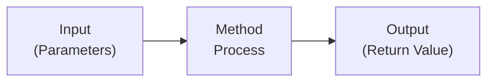
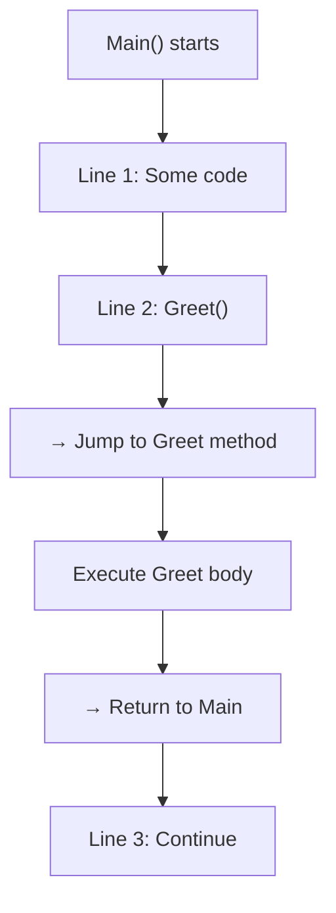
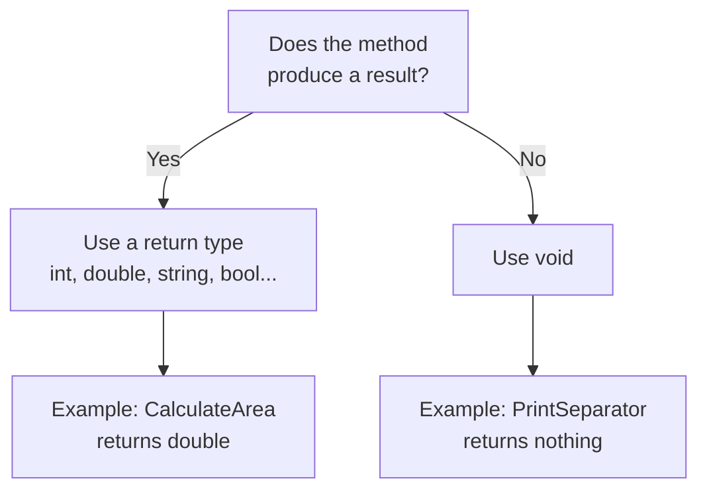

# Lecture 1 – Why Methods Matter & Defining Methods

[← Back to Week 5 Overview](./README.md)

---

## Table of Contents

- [Why Methods?](#why-methods)
- [What Is a Method?](#what-is-a-method)
- [Defining Your First Method](#defining-your-first-method)
- [Calling a Method](#calling-a-method)
- [Methods with Parameters](#methods-with-parameters)
- [Return Values vs Void](#return-values-vs-void)
- [Method Naming Conventions](#method-naming-conventions)
- [Key Takeaways](#key-takeaways)

---

## Why Methods?

Imagine you're writing a program that calculates the area of a rectangle in three different places. Without methods, you'd write the same calculation three times:

```csharp
// Calculate area for room 1
double area1 = length1 * width1;
Console.WriteLine($"Room 1 area: {area1}");

// Calculate area for room 2
double area2 = length2 * width2;
Console.WriteLine($"Room 2 area: {area2}");

// Calculate area for room 3
double area3 = length3 * width3;
Console.WriteLine($"Room 3 area: {area3}");
```

This has three problems:

1. **Repetition** — The same logic appears three times
2. **Maintenance risk** — If the formula changes, you must update it everywhere
3. **Readability** — The `Main()` method becomes long and hard to follow

Methods solve all three problems. With a method, you write the logic **once** and **call it** whenever you need it.

---

## What Is a Method?

A **method** is a named block of code that performs a specific task. You can think of it as a mini-program within your program.



Every method has:

| Part | Description | Example |
|------|-------------|---------|
| **Return type** | What the method gives back | `double`, `string`, `void` |
| **Name** | What you call it | `CalculateArea` |
| **Parameters** | What it needs to work | `(double length, double width)` |
| **Body** | The code that runs | `{ return length * width; }` |

---

## Defining Your First Method

Let's start with the simplest possible method — one that takes no parameters and returns nothing:

```csharp
using System;

class Program
{
    static void Main(string[] args)
    {
        Greet();  // Calling the method
        Greet();  // Calling it again!
    }

    static void Greet()
    {
        Console.WriteLine("============================");
        Console.WriteLine("  Welcome to My Program!");
        Console.WriteLine("============================");
    }
}
```

**Output:**
```
============================
  Welcome to My Program!
============================
============================
  Welcome to My Program!
============================
```

Let's break down the method definition:

```
static void Greet()
│      │    │    │
│      │    │    └── () = No parameters
│      │    └─────── Method name
│      └──────────── void = Returns nothing
└─────────────────── static (required for now — we'll explain in OOP weeks)
```

> **📝 Note:** We use `static` on all our methods for now because `Main` is static, and static methods can only call other static methods directly. You'll learn why when we cover classes in Week 7.

---

## Calling a Method

To **call** (or **invoke**) a method, you write its name followed by parentheses:

```csharp
Greet();           // Call with no arguments
```

When the program reaches a method call, it:

1. **Jumps** to the method's code
2. **Executes** the method body
3. **Returns** back to where it was called
4. **Continues** with the next line



---

## Methods with Parameters

Most methods need **input** to do their work. Parameters let you pass data into a method.

### One Parameter

```csharp
static void GreetUser(string name)
{
    Console.WriteLine($"Hello, {name}! Welcome aboard.");
}
```

```csharp
// In Main:
GreetUser("Raed");     // Output: Hello, Raed! Welcome aboard.
GreetUser("Sara");     // Output: Hello, Sara! Welcome aboard.
```

### Multiple Parameters

```csharp
static void DisplayTotal(string item, int quantity, double price)
{
    double total = quantity * price;
    Console.WriteLine($"{item}: {quantity} x {price:C} = {total:C}");
}
```

```csharp
// In Main:
DisplayTotal("Notebook", 3, 4.99);
DisplayTotal("Pen", 10, 1.50);
```

**Output:**
```
Notebook: 3 x $4.99 = $14.97
Pen: 10 x $1.50 = $15.00
```

### Parameters vs Arguments — What's the Difference?

| Term | Where | What |
|------|-------|------|
| **Parameter** | In the method definition | The variable name: `string name` |
| **Argument** | In the method call | The actual value: `"Raed"` |

```csharp
//                  parameter
//                     ↓
static void Greet(string name)     // Definition
{
    Console.WriteLine($"Hi, {name}!");
}

//           argument
//              ↓
Greet("Sara");                      // Call
```

> Think of it this way: **parameters** are the parking spots, **arguments** are the cars that park in them.

---

## Return Values vs Void

Methods come in two flavors:

### Void Methods — Do Something, Return Nothing

```csharp
static void PrintSeparator()
{
    Console.WriteLine("─────────────────────────");
}
```

A `void` method performs an action (like printing) but doesn't give a value back. You **cannot** use it in an expression:

```csharp
// ❌ This does NOT work
string result = PrintSeparator();  // Error! void doesn't return anything
```

### Value-Returning Methods — Calculate and Return a Result

```csharp
static double CalculateArea(double length, double width)
{
    return length * width;
}
```

The `return` keyword does two things:
1. **Sends the value** back to the caller
2. **Exits the method** immediately

```csharp
// In Main:
double area = CalculateArea(5.0, 3.0);
Console.WriteLine($"Area: {area}");           // Area: 15

// You can also use it directly in expressions:
Console.WriteLine($"Area: {CalculateArea(8.0, 4.5)}");  // Area: 36
```

### Choosing Between Void and Return



### More Return Type Examples

```csharp
// Returns an int
static int Add(int a, int b)
{
    return a + b;
}

// Returns a bool
static bool IsAdult(int age)
{
    return age >= 18;
}

// Returns a string
static string FormatFullName(string first, string last)
{
    return $"{first} {last}";
}
```

```csharp
// In Main:
int sum = Add(10, 25);                  // sum = 35
bool canVote = IsAdult(16);             // canVote = false
string name = FormatFullName("Ali", "Hassan");  // name = "Ali Hassan"

// Using return values in conditions:
if (IsAdult(20))
{
    Console.WriteLine("You can vote!");
}
```

---

## Method Naming Conventions

Good method names make your code read almost like English:

| Convention | Example | Why |
|------------|---------|-----|
| Use **PascalCase** | `CalculateTotal` | C# standard for methods |
| Start with a **verb** | `GetName`, `PrintReport`, `ValidateInput` | Methods *do* things |
| Be **descriptive** | `CalculateMonthlyPayment` | Clear intent |
| Avoid abbreviations | `CalculateAverage` not `CalcAvg` | Readability |

### Good vs Poor Names

| ❌ Poor | ✅ Good | Why Better |
|---------|---------|-----------|
| `DoStuff()` | `CalculateTax()` | Says what it does |
| `Process()` | `ValidateEmail()` | Specific action |
| `x()` | `ConvertToFahrenheit()` | Self-documenting |
| `calc()` | `CalculateDiscount()` | No guessing |

---

## Putting It Together — Complete Example

Let's build a **Temperature Converter** using methods:

```csharp
using System;

class Program
{
    static void Main(string[] args)
    {
        PrintHeader();

        Console.Write("Enter temperature in Celsius: ");
        double celsius = Convert.ToDouble(Console.ReadLine());

        double fahrenheit = CelsiusToFahrenheit(celsius);
        string description = GetTemperatureDescription(celsius);

        PrintResult(celsius, fahrenheit, description);
    }

    static void PrintHeader()
    {
        Console.WriteLine("╔═══════════════════════════════╗");
        Console.WriteLine("║   Temperature Converter       ║");
        Console.WriteLine("╚═══════════════════════════════╝");
        Console.WriteLine();
    }

    static double CelsiusToFahrenheit(double celsius)
    {
        return (celsius * 9.0 / 5.0) + 32;
    }

    static string GetTemperatureDescription(double celsius)
    {
        if (celsius <= 0)
            return "Freezing";
        else if (celsius <= 15)
            return "Cold";
        else if (celsius <= 25)
            return "Comfortable";
        else if (celsius <= 35)
            return "Hot";
        else
            return "Extreme heat";
    }

    static void PrintResult(double celsius, double fahrenheit, string description)
    {
        Console.WriteLine();
        Console.WriteLine($"  {celsius}°C = {fahrenheit:F1}°F");
        Console.WriteLine($"  Condition: {description}");
    }
}
```

**Example Run:**
```
╔═══════════════════════════════╗
║   Temperature Converter       ║
╚═══════════════════════════════╝

Enter temperature in Celsius: 22

  22°C = 71.6°F
  Condition: Comfortable
```

**Notice how readable `Main()` is now:** You can understand the entire program flow just by reading the method names — `PrintHeader`, `CelsiusToFahrenheit`, `GetTemperatureDescription`, `PrintResult`. That's the power of methods.

---

## Key Takeaways

| Concept | Summary |
|---------|---------|
| **Method** | A named block of code that performs a specific task |
| **Parameters** | Input values the method needs to do its work |
| **Return value** | The result the method sends back to the caller |
| **`void`** | A return type meaning "returns nothing" |
| **`return`** | Sends a value back and exits the method |
| **`static`** | Required for now — all methods called from `Main` must be static |
| **Naming** | PascalCase, start with a verb, be descriptive |

---

### What's Next?

In [Lecture 2](./lecture-02-parameters-and-returns.md), we'll go deeper into how parameters work, explore methods that call other methods, and learn techniques for writing effective return logic.

---

[← Back to Week 5 Overview](./README.md) · [Next: Lecture 2 →](./lecture-02-parameters-and-returns.md)
