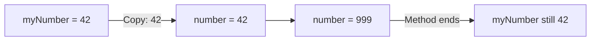
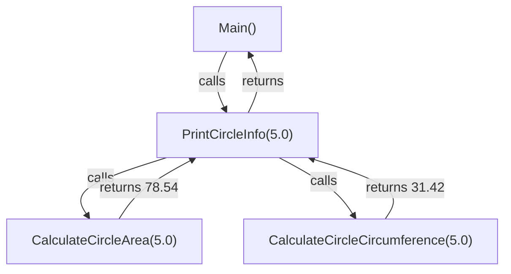

# Lecture 2 – Method Parameters and Return Values

[← Back to Week 5 Overview](./README.md) · [← Previous: Lecture 1](./lecture-01-defining-methods.md)

---

## Table of Contents

- [How Parameters Work — Value Types](#how-parameters-work--value-types)
- [Multiple Parameters](#multiple-parameters)
- [Methods Calling Other Methods](#methods-calling-other-methods)
- [Multiple Return Paths](#multiple-return-paths)
- [Methods with Boolean Returns](#methods-with-boolean-returns)
- [Common Mistakes with Return](#common-mistakes-with-return)
- [Practical Example: Grade Calculator](#practical-example-grade-calculator)
- [Key Takeaways](#key-takeaways)

---

## How Parameters Work — Value Types

When you pass a value to a method, C# makes a **copy** of that value. The method works with the copy, not the original variable.

```csharp
static void TryToChange(int number)
{
    number = 999;  // Changes the copy, not the original
    Console.WriteLine($"Inside method: {number}");
}
```

```csharp
// In Main:
int myNumber = 42;
TryToChange(myNumber);
Console.WriteLine($"After method call: {myNumber}");
```

**Output:**
```
Inside method: 999
After method call: 42     ← Original unchanged!
```

### Execution Trace

| Step | `myNumber` (Main) | `number` (TryToChange) | Action |
|------|-------------------|----------------------|--------|
| 1 | `42` | — | Declared in Main |
| 2 | `42` | `42` | Copy passed to method |
| 3 | `42` | `999` | Method changes its copy |
| 4 | `42` | — | Method ends, copy destroyed |



> **Key insight:** With value types (int, double, bool, char, etc.), the original variable is **never affected** by what happens inside the method. This is called **pass by value**.

---

## Multiple Parameters

Methods can accept as many parameters as needed. Each parameter has its own type and name:

```csharp
static double CalculateDiscount(double price, double discountPercent)
{
    double discountAmount = price * (discountPercent / 100);
    return price - discountAmount;
}
```

```csharp
// In Main:
double finalPrice = CalculateDiscount(120.00, 15);
Console.WriteLine($"Final price: {finalPrice:C}");  // Final price: $102.00
```

### Parameter Order Matters

Arguments are matched to parameters **by position**:

```csharp
static void PrintInfo(string name, int age, string city)
{
    Console.WriteLine($"{name}, age {age}, from {city}");
}
```

```csharp
// ✅ Correct order:
PrintInfo("Layla", 22, "Amman");    // Layla, age 22, from Amman

// ❌ Wrong order — compiles but gives wrong results:
// PrintInfo(22, "Layla", "Amman"); // Error: can't convert int to string
```

### Practical Guideline: How Many Parameters?

| Count | Guideline |
|-------|-----------|
| 0–3 | Ideal — easy to understand and call |
| 4–5 | Acceptable — consider if some belong together |
| 6+ | Too many — the method might be doing too much |

If a method needs many parameters, it's often a sign that it should be split into smaller methods or that the parameters should be grouped (you'll learn how with classes in Week 7).

---

## Methods Calling Other Methods

Methods can call other methods. This is how you build **layers of abstraction** — simple methods combine into more complex ones.

```csharp
static double CalculateCircleArea(double radius)
{
    return Math.PI * radius * radius;
}

static double CalculateCircleCircumference(double radius)
{
    return 2 * Math.PI * radius;
}

static void PrintCircleInfo(double radius)
{
    double area = CalculateCircleArea(radius);
    double circumference = CalculateCircleCircumference(radius);

    Console.WriteLine($"Circle with radius {radius}:");
    Console.WriteLine($"  Area:          {area:F2}");
    Console.WriteLine($"  Circumference: {circumference:F2}");
}
```

```csharp
// In Main — clean and simple:
PrintCircleInfo(5.0);
PrintCircleInfo(10.0);
```

**Output:**
```
Circle with radius 5:
  Area:          78.54
  Circumference: 31.42
Circle with radius 10:
  Area:          314.16
  Circumference: 62.83
```

### Execution Flow



### Using Return Values Directly

You don't always need to store a return value in a variable. You can use it directly:

```csharp
// Stored in variable first (clearer for complex logic):
double area = CalculateCircleArea(5.0);
Console.WriteLine($"Area: {area:F2}");

// Used directly (shorter, fine for simple cases):
Console.WriteLine($"Area: {CalculateCircleArea(5.0):F2}");

// Used in a condition:
if (CalculateCircleArea(radius) > 100)
{
    Console.WriteLine("That's a big circle!");
}

// Used in another calculation:
double totalArea = CalculateCircleArea(5.0) + CalculateCircleArea(3.0);
```

---

## Multiple Return Paths

A method can have multiple `return` statements. The first one reached **exits the method immediately**:

```csharp
static string GetLetterGrade(double score)
{
    if (score >= 90)
        return "A";
    else if (score >= 80)
        return "B";
    else if (score >= 70)
        return "C";
    else if (score >= 60)
        return "D";
    else
        return "F";
}
```

```csharp
// In Main:
Console.WriteLine(GetLetterGrade(85));   // B
Console.WriteLine(GetLetterGrade(72));   // C
Console.WriteLine(GetLetterGrade(55));   // F
```

### Execution Trace for `GetLetterGrade(85)`

| Step | Condition | Result | Action |
|------|-----------|--------|--------|
| 1 | `85 >= 90` | `false` | Skip |
| 2 | `85 >= 80` | `true` | **Return "B"** — method exits |
| — | Remaining conditions | — | Never evaluated |

> **Important Rule:** Every path through a value-returning method **must** reach a `return` statement. The compiler will give you an error if any path is missing one.

### Early Return Pattern

Sometimes it's cleaner to handle special cases first:

```csharp
static double CalculateDiscount(double price, int customerYears)
{
    // Handle invalid input immediately
    if (price <= 0)
        return 0;

    // Normal logic
    if (customerYears >= 10)
        return price * 0.20;    // 20% off for loyal customers
    else if (customerYears >= 5)
        return price * 0.10;    // 10% off
    else
        return price * 0.05;    // 5% off for new customers
}
```

This pattern — checking for edge cases first and returning early — is called a **guard clause**. It keeps the main logic clean and easy to read.

---

## Methods with Boolean Returns

Methods that return `bool` are great for making your conditions readable:

```csharp
static bool IsValidAge(int age)
{
    return age >= 0 && age <= 150;
}

static bool IsEligibleForDiscount(int age, bool isMember)
{
    return (age < 12 || age > 65) || isMember;
}

static bool IsStrongPassword(string password)
{
    if (password.Length < 8)
        return false;

    bool hasUpper = false;
    bool hasDigit = false;

    foreach (char c in password)
    {
        if (char.IsUpper(c)) hasUpper = true;
        if (char.IsDigit(c)) hasDigit = true;
    }

    return hasUpper && hasDigit;
}
```

```csharp
// In Main — look how readable this is:
Console.Write("Enter age: ");
int age = int.Parse(Console.ReadLine());

if (!IsValidAge(age))
{
    Console.WriteLine("Invalid age entered.");
}
else if (IsEligibleForDiscount(age, true))
{
    Console.WriteLine("You qualify for a discount!");
}

Console.Write("Enter password: ");
string pwd = Console.ReadLine();

if (IsStrongPassword(pwd))
    Console.WriteLine("Password accepted.");
else
    Console.WriteLine("Password too weak. Need 8+ chars, uppercase, and digit.");
```

> **Naming tip:** Boolean methods often start with `Is`, `Has`, `Can`, or `Should` — for example: `IsValid`, `HasPermission`, `CanProceed`, `ShouldRetry`.

---

## Common Mistakes with Return

### Mistake 1: Code After Return

```csharp
static int GetMax(int a, int b)
{
    return a > b ? a : b;
    Console.WriteLine("Done!");  // ⚠️ Warning: unreachable code
}
```

`return` exits the method **immediately**. Any code after it will never run.

### Mistake 2: Not All Paths Return

```csharp
// ❌ Compiler error: not all code paths return a value
static string GetCategory(int age)
{
    if (age < 18)
        return "Minor";
    else if (age < 65)
        return "Adult";
    // What if age >= 65? No return statement!
}
```

**Fix:**
```csharp
static string GetCategory(int age)
{
    if (age < 18)
        return "Minor";
    else if (age < 65)
        return "Adult";
    else
        return "Senior";  // ✅ All paths covered
}
```

### Mistake 3: Ignoring the Return Value

```csharp
static double CalculateTotal(double price, int qty)
{
    return price * qty;
}

// In Main:
CalculateTotal(9.99, 3);  // ⚠️ Result is calculated but thrown away!

// ✅ Fix: Use the return value
double total = CalculateTotal(9.99, 3);
Console.WriteLine($"Total: {total:C}");
```

---

## Practical Example: Grade Calculator

Let's combine everything into a complete program:

```csharp
using System;

class Program
{
    static void Main(string[] args)
    {
        Console.WriteLine("=== Grade Calculator ===\n");

        double exam1 = ReadScore("Exam 1");
        double exam2 = ReadScore("Exam 2");
        double exam3 = ReadScore("Exam 3");

        double average = CalculateAverage(exam1, exam2, exam3);
        string grade = GetLetterGrade(average);
        bool passing = IsPassing(average);

        PrintReport(exam1, exam2, exam3, average, grade, passing);
    }

    static double ReadScore(string examName)
    {
        double score;
        do
        {
            Console.Write($"Enter {examName} score (0-100): ");
            score = Convert.ToDouble(Console.ReadLine());

            if (!IsValidScore(score))
                Console.WriteLine("  Invalid! Score must be between 0 and 100.");

        } while (!IsValidScore(score));

        return score;
    }

    static bool IsValidScore(double score)
    {
        return score >= 0 && score <= 100;
    }

    static double CalculateAverage(double s1, double s2, double s3)
    {
        return (s1 + s2 + s3) / 3.0;
    }

    static string GetLetterGrade(double average)
    {
        if (average >= 90) return "A";
        if (average >= 80) return "B";
        if (average >= 70) return "C";
        if (average >= 60) return "D";
        return "F";
    }

    static bool IsPassing(double average)
    {
        return average >= 60;
    }

    static void PrintReport(double e1, double e2, double e3,
                            double avg, string grade, bool passing)
    {
        Console.WriteLine("\n╔═══════════════════════════╗");
        Console.WriteLine("║     Grade Report          ║");
        Console.WriteLine("╠═══════════════════════════╣");
        Console.WriteLine($"║  Exam 1:   {e1,8:F1}        ║");
        Console.WriteLine($"║  Exam 2:   {e2,8:F1}        ║");
        Console.WriteLine($"║  Exam 3:   {e3,8:F1}        ║");
        Console.WriteLine("╠═══════════════════════════╣");
        Console.WriteLine($"║  Average:  {avg,8:F1}        ║");
        Console.WriteLine($"║  Grade:    {grade,8}        ║");
        Console.WriteLine($"║  Status:   {(passing ? "PASS" : "FAIL"),8}        ║");
        Console.WriteLine("╚═══════════════════════════╝");
    }
}
```

**Example Run:**
```
=== Grade Calculator ===

Enter Exam 1 score (0-100): 88
Enter Exam 2 score (0-100): 76
Enter Exam 3 score (0-100): 92

╔═══════════════════════════╗
║     Grade Report          ║
╠═══════════════════════════╣
║  Exam 1:       88.0        ║
║  Exam 2:       76.0        ║
║  Exam 3:       92.0        ║
╠═══════════════════════════╣
║  Average:      85.3        ║
║  Grade:           B        ║
║  Status:       PASS        ║
╚═══════════════════════════╝
```

**Notice the design:** Each method has a single clear purpose. `Main()` reads like a high-level description of the program. You could understand what this program does without reading any method body — just by reading the method names.

---

## Key Takeaways

| Concept | Summary |
|---------|---------|
| **Pass by value** | Value types are copied — the original is never changed |
| **Parameter order** | Arguments match parameters by position |
| **Method composition** | Methods can call other methods to build complex behavior |
| **Multiple returns** | A method can have several `return` statements; the first one reached exits |
| **Guard clauses** | Handle edge cases early with immediate returns |
| **Boolean methods** | Name with `Is`/`Has`/`Can` — make conditions extremely readable |

---

### What's Next?

In [Lecture 3](./lecture-03-overloading-and-organization.md), we'll learn how to create multiple versions of the same method using overloading, understand how the call stack works, and practice refactoring messy code into clean methods.

---

[← Back to Week 5 Overview](./README.md) · [← Previous: Lecture 1](./lecture-01-defining-methods.md) · [Next: Lecture 3 →](./lecture-03-overloading-and-organization.md)
