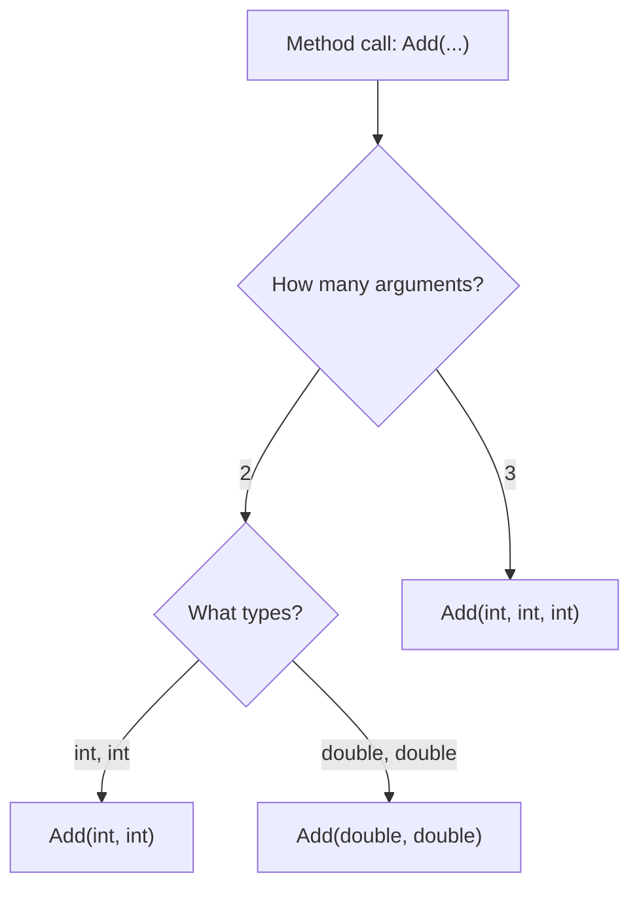

# Lecture 3 – Overloading, Call Stack, and Code Organization

[← Back to Week 5 Overview](./README.md) · [← Previous: Lecture 2](./lecture-02-parameters-and-returns.md)

---

## Table of Contents

- [Method Overloading](#method-overloading)
- [The Call Stack](#the-call-stack)
- [Refactoring: From Messy to Methods](#refactoring-from-messy-to-methods)
- [Method Design Guidelines](#method-design-guidelines)
- [Complete Example: Simple Calculator](#complete-example-simple-calculator)
- [Key Takeaways](#key-takeaways)

---

## Method Overloading

**Overloading** means creating multiple methods with the **same name** but **different parameter lists**. C# knows which version to call based on the arguments you pass.

### Basic Overloading

```csharp
static int Add(int a, int b)
{
    return a + b;
}

static double Add(double a, double b)
{
    return a + b;
}

static int Add(int a, int b, int c)
{
    return a + b + c;
}
```

```csharp
// In Main:
Console.WriteLine(Add(5, 3));           // Calls Add(int, int) → 8
Console.WriteLine(Add(2.5, 3.7));       // Calls Add(double, double) → 6.2
Console.WriteLine(Add(1, 2, 3));        // Calls Add(int, int, int) → 6
```

### How C# Chooses the Right Method

C# looks at the **number and types** of arguments to find the best match:



### What Can Be Different

| Can Differ | Example | Valid? |
|------------|---------|--------|
| Number of parameters | `Print(string)` vs `Print(string, int)` | ✅ |
| Types of parameters | `Add(int, int)` vs `Add(double, double)` | ✅ |
| Order of parameter types | `Log(string, int)` vs `Log(int, string)` | ✅ |
| **Return type only** | `int Get()` vs `double Get()` | ❌ |

> **Important:** You cannot overload by return type alone. The parameters **must** be different.

### Practical Example: Formatting Output

```csharp
static string FormatCurrency(double amount)
{
    return $"{amount:C}";
}

static string FormatCurrency(double amount, string currencySymbol)
{
    return $"{currencySymbol}{amount:F2}";
}

static string FormatCurrency(double amount, string currencySymbol, int decimals)
{
    return $"{currencySymbol}{amount.ToString($"F{decimals}")}";
}
```

```csharp
// In Main:
Console.WriteLine(FormatCurrency(49.99));                    // $49.99
Console.WriteLine(FormatCurrency(49.99, "€"));               // €49.99
Console.WriteLine(FormatCurrency(49.99, "¥", 0));            // ¥50
```

This pattern is common in real C# code — the simplest version uses defaults, while more specific versions give the caller more control.

---

## The Call Stack

When your program calls a method, it needs to remember **where to come back to** when that method finishes. It does this using a data structure called the **call stack**.

### How the Call Stack Works

Think of it like a stack of plates:
- When a method is **called**, a new plate (called a **stack frame**) is placed on top
- When a method **returns**, the top plate is removed
- You can only access the plate on top — the currently running method

### Visual Example

```csharp
static void Main(string[] args)
{
    double result = CalculateFinalPrice(100, 15);
    Console.WriteLine($"Final: {result:C}");
}

static double CalculateFinalPrice(double price, double discountPercent)
{
    double discounted = ApplyDiscount(price, discountPercent);
    double total = AddTax(discounted);
    return total;
}

static double ApplyDiscount(double price, double percent)
{
    return price - (price * percent / 100);
}

static double AddTax(double price)
{
    return price * 1.10;  // 10% tax
}
```

**Call stack evolution during execution:**

```
Step 1: Main() calls CalculateFinalPrice()
┌──────────────────────────┐
│ CalculateFinalPrice()    │  ← Top (currently running)
│   price=100, discount=15 │
├──────────────────────────┤
│ Main()                   │
│   (waiting for result)   │
└──────────────────────────┘

Step 2: CalculateFinalPrice() calls ApplyDiscount()
┌──────────────────────────┐
│ ApplyDiscount()          │  ← Top (currently running)
│   price=100, percent=15  │
├──────────────────────────┤
│ CalculateFinalPrice()    │
│   (waiting for result)   │
├──────────────────────────┤
│ Main()                   │
│   (waiting for result)   │
└──────────────────────────┘

Step 3: ApplyDiscount() returns 85 → removed from stack
┌──────────────────────────┐
│ CalculateFinalPrice()    │  ← Top (continues running)
│   discounted = 85        │
├──────────────────────────┤
│ Main()                   │
│   (waiting for result)   │
└──────────────────────────┘

Step 4: CalculateFinalPrice() calls AddTax()
┌──────────────────────────┐
│ AddTax()                 │  ← Top (currently running)
│   price=85               │
├──────────────────────────┤
│ CalculateFinalPrice()    │
│   (waiting for result)   │
├──────────────────────────┤
│ Main()                   │
│   (waiting for result)   │
└──────────────────────────┘

Step 5: AddTax() returns 93.50 → removed from stack
┌──────────────────────────┐
│ CalculateFinalPrice()    │  ← Top (continues)
│   total = 93.50          │
├──────────────────────────┤
│ Main()                   │
│   (waiting for result)   │
└──────────────────────────┘

Step 6: CalculateFinalPrice() returns 93.50 → removed
┌──────────────────────────┐
│ Main()                   │  ← Top (continues)
│   result = 93.50         │
└──────────────────────────┘
```

### Why Does This Matter?

1. **Each method gets its own variables** — `price` in `ApplyDiscount` is separate from `price` in `CalculateFinalPrice`
2. **Variables are destroyed** when the method returns (its stack frame is removed)
3. **Stack overflow** happens if methods call too deeply (e.g., infinite recursion) — the stack runs out of space

> **For now, understanding the basic idea is enough:** Methods pile up on a stack as they call each other, and each one returns back to where it was called from. You'll see this in action when debugging — Visual Studio shows you the call stack!

---

## Refactoring: From Messy to Methods

**Refactoring** means improving code structure without changing what it does. Let's take a long, messy `Main()` and organize it into methods.

### Before: Everything in Main

```csharp
static void Main(string[] args)
{
    // Get student name
    Console.Write("Enter student name: ");
    string name = Console.ReadLine();

    // Get scores
    Console.Write("Enter math score: ");
    double math = Convert.ToDouble(Console.ReadLine());
    Console.Write("Enter science score: ");
    double science = Convert.ToDouble(Console.ReadLine());
    Console.Write("Enter english score: ");
    double english = Convert.ToDouble(Console.ReadLine());

    // Calculate average
    double average = (math + science + english) / 3.0;

    // Determine grade
    string grade;
    if (average >= 90) grade = "A";
    else if (average >= 80) grade = "B";
    else if (average >= 70) grade = "C";
    else if (average >= 60) grade = "D";
    else grade = "F";

    // Determine pass/fail
    string status = average >= 60 ? "PASSED" : "FAILED";

    // Print report
    Console.WriteLine("\n--- Student Report ---");
    Console.WriteLine($"Name:    {name}");
    Console.WriteLine($"Math:    {math}");
    Console.WriteLine($"Science: {science}");
    Console.WriteLine($"English: {english}");
    Console.WriteLine($"Average: {average:F1}");
    Console.WriteLine($"Grade:   {grade}");
    Console.WriteLine($"Status:  {status}");
    Console.WriteLine("---------------------");
}
```

This works, but it's all one big block. Hard to test, hard to reuse, hard to read.

### After: Organized with Methods

```csharp
using System;

class Program
{
    static void Main(string[] args)
    {
        string name = ReadStudentName();
        double math = ReadScore("Math");
        double science = ReadScore("Science");
        double english = ReadScore("English");

        double average = CalculateAverage(math, science, english);
        string grade = GetLetterGrade(average);
        string status = GetPassStatus(average);

        PrintReport(name, math, science, english, average, grade, status);
    }

    static string ReadStudentName()
    {
        Console.Write("Enter student name: ");
        return Console.ReadLine();
    }

    static double ReadScore(string subject)
    {
        Console.Write($"Enter {subject} score: ");
        return Convert.ToDouble(Console.ReadLine());
    }

    static double CalculateAverage(double s1, double s2, double s3)
    {
        return (s1 + s2 + s3) / 3.0;
    }

    static string GetLetterGrade(double average)
    {
        if (average >= 90) return "A";
        if (average >= 80) return "B";
        if (average >= 70) return "C";
        if (average >= 60) return "D";
        return "F";
    }

    static string GetPassStatus(double average)
    {
        return average >= 60 ? "PASSED" : "FAILED";
    }

    static void PrintReport(string name, double math, double science,
                            double english, double average, string grade,
                            string status)
    {
        Console.WriteLine("\n--- Student Report ---");
        Console.WriteLine($"Name:    {name}");
        Console.WriteLine($"Math:    {math}");
        Console.WriteLine($"Science: {science}");
        Console.WriteLine($"English: {english}");
        Console.WriteLine($"Average: {average:F1}");
        Console.WriteLine($"Grade:   {grade}");
        Console.WriteLine($"Status:  {status}");
        Console.WriteLine("---------------------");
    }
}
```

### What Improved?

| Aspect | Before | After |
|--------|--------|-------|
| **Readability** | Must read all 35 lines to understand | `Main()` tells the story in 8 lines |
| **Reusability** | Can't reuse grade logic elsewhere | `GetLetterGrade()` works anywhere |
| **Testing** | Must run entire program | Can test each method independently |
| **Maintenance** | Grade thresholds buried in Main | Clearly isolated in `GetLetterGrade()` |
| **Duplication** | Score reading repeated 3 times | `ReadScore()` handles it once with a parameter |

---

## Method Design Guidelines

### The Single Responsibility Principle

Each method should do **one thing** well. If you can't describe what a method does in one short sentence, it's probably doing too much.

| ❌ Doing Too Much | ✅ Single Responsibility |
|-------------------|------------------------|
| `ProcessStudentData()` | `ReadScore()`, `CalculateAverage()`, `PrintReport()` |
| `HandleEverything()` | `ValidateInput()`, `CalculateResult()`, `DisplayOutput()` |

### How Long Should a Method Be?

There's no strict rule, but a good guideline:

- **Ideal:** 5–15 lines
- **Acceptable:** Up to 25 lines
- **Warning sign:** Over 30 lines — consider splitting

### Method Organization in a File

Place methods in a logical order:

```csharp
class Program
{
    // 1. Main — the entry point (top of file)
    static void Main(string[] args) { ... }

    // 2. Input methods
    static string ReadName() { ... }
    static double ReadScore(string subject) { ... }

    // 3. Calculation methods
    static double CalculateAverage(double s1, double s2, double s3) { ... }
    static string GetLetterGrade(double average) { ... }

    // 4. Output methods
    static void PrintReport(...) { ... }
    static void PrintSeparator() { ... }
}
```

---

## Complete Example: Simple Calculator

Let's build a calculator that demonstrates overloading, method composition, and good organization:

```csharp
using System;

class Program
{
    static void Main(string[] args)
    {
        PrintWelcome();

        bool running = true;
        while (running)
        {
            char operation = ReadOperation();

            if (operation == 'Q')
            {
                running = false;
                continue;
            }

            double num1 = ReadNumber("first");
            double num2 = ReadNumber("second");

            double result = Calculate(num1, num2, operation);
            PrintResult(num1, num2, operation, result);

            Console.WriteLine();
        }

        PrintGoodbye();
    }

    // ─── Display Methods ──────────────────────

    static void PrintWelcome()
    {
        Console.WriteLine("╔══════════════════════════╗");
        Console.WriteLine("║   Simple Calculator      ║");
        Console.WriteLine("║   +  -  *  /  Q(uit)     ║");
        Console.WriteLine("╚══════════════════════════╝");
        Console.WriteLine();
    }

    static void PrintGoodbye()
    {
        Console.WriteLine("Thanks for calculating! Goodbye.");
    }

    static void PrintResult(double num1, double num2, char op, double result)
    {
        Console.WriteLine($"\n  {num1} {op} {num2} = {FormatNumber(result)}");
    }

    // ─── Input Methods ────────────────────────

    static char ReadOperation()
    {
        Console.Write("Operation (+, -, *, /, Q): ");
        string input = Console.ReadLine().Trim().ToUpper();

        if (input.Length == 0)
            return '?';

        return input[0];
    }

    static double ReadNumber(string label)
    {
        Console.Write($"Enter {label} number: ");
        return Convert.ToDouble(Console.ReadLine());
    }

    // ─── Calculation Methods ──────────────────

    static double Calculate(double a, double b, char operation)
    {
        switch (operation)
        {
            case '+': return Add(a, b);
            case '-': return Subtract(a, b);
            case '*': return Multiply(a, b);
            case '/': return Divide(a, b);
            default:  return 0;
        }
    }

    static double Add(double a, double b)
    {
        return a + b;
    }

    static double Subtract(double a, double b)
    {
        return a - b;
    }

    static double Multiply(double a, double b)
    {
        return a * b;
    }

    static double Divide(double a, double b)
    {
        if (b == 0)
        {
            Console.WriteLine("  ⚠ Cannot divide by zero!");
            return 0;
        }
        return a / b;
    }

    // ─── Formatting Methods ───────────────────

    // Overloaded: format with default 2 decimals
    static string FormatNumber(double number)
    {
        return FormatNumber(number, 2);
    }

    // Overloaded: format with specific decimal places
    static string FormatNumber(double number, int decimals)
    {
        if (number == Math.Floor(number) && decimals <= 0)
            return ((int)number).ToString();

        return number.ToString($"F{decimals}");
    }
}
```

**Example Run:**
```
╔══════════════════════════╗
║   Simple Calculator      ║
║   +  -  *  /  Q(uit)     ║
╚══════════════════════════╝

Operation (+, -, *, /, Q): +
Enter first number: 15.5
Enter second number: 4.5

  15.5 + 4.5 = 20.00

Operation (+, -, *, /, Q): /
Enter first number: 100
Enter second number: 3

  100 / 3 = 33.33

Operation (+, -, *, /, Q): /
Enter first number: 10
Enter second number: 0
  ⚠ Cannot divide by zero!

  10 / 0 = 0.00

Operation (+, -, *, /, Q): Q
Thanks for calculating! Goodbye.
```

**This example demonstrates:**
- **Overloading:** `FormatNumber` with different parameter counts
- **Method composition:** `Calculate` calls `Add`, `Subtract`, etc.
- **Single responsibility:** Each method does one thing
- **Guard clause:** `Divide` checks for zero first
- **Clean Main:** Reads like a high-level description

---

## Key Takeaways

| Concept | Summary |
|---------|---------|
| **Overloading** | Same method name, different parameters — C# picks the right one |
| **Call stack** | Methods stack up as they call each other; each returns to its caller |
| **Refactoring** | Restructure code into methods without changing behavior |
| **Single responsibility** | Each method does one thing well |
| **Method organization** | Group related methods, keep Main at the top |

---

## Week 5 Summary

Over these three lectures, you've learned to:

1. **Define and call methods** with parameters and return values
2. **Understand pass-by-value** — methods get copies of value types
3. **Use overloading** to create flexible method APIs
4. **Visualize the call stack** to understand method execution flow
5. **Refactor messy code** into clean, organized methods

Methods are one of the most important tools in programming. From now on, every program you write should be organized into clear, well-named methods. This habit will serve you well as you move into arrays (Week 6) and eventually classes and objects (Week 7+).

---

[← Back to Week 5 Overview](./README.md) · [← Previous: Lecture 2](./lecture-02-parameters-and-returns.md)
