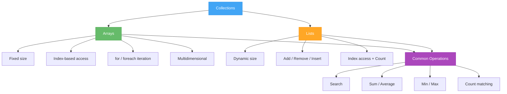
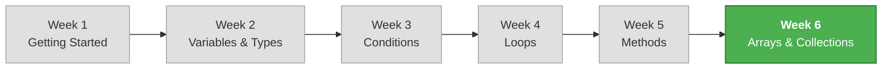

# Week 6 – Arrays and Introduction to Collections

[← Back to Course Home](../../README.md) | [← Previous: Week 5 – Methods and Modular Code](../week-05/README.md) | [Next: Week 7 – Classes and Objects →](../week-07/README.md)

---

## 📋 Overview

Until now, every piece of data in your programs lived in its own separate variable. Need five test scores? That's five variables. Ten student names? Ten variables. What about a thousand? That approach doesn't scale.

This week you'll learn about **arrays** and **lists** — structures that let you store **collections of related data** under a single name. Instead of `score1`, `score2`, `score3`, you'll have one `scores` array that holds them all. This is a game-changer for how you write programs.

> **Analogy:** Think of an array like a row of mailboxes in an apartment building. Each mailbox has a number (index), they're all the same type (mailbox), and you can go directly to any one by its number. A `List` is like that same row of mailboxes, but the building can add or remove mailboxes as needed.

---

## 🎯 Learning Objectives

By the end of this week, you will be able to:

- Declare, initialize, and access elements of arrays
- Use `for` and `foreach` loops to iterate through arrays
- Perform common array operations: search, sum, min, max, count
- Work with multidimensional arrays for grid-like data
- Use `List<T>` to work with dynamically-sized collections
- Choose between arrays and lists based on the problem requirements

---

## 📚 Materials

| # | Material | Topics |
|---|----------|--------|
| 1 | [Lecture 1 – Arrays: Storing and Accessing Data](./lecture-1.md) | Declaring arrays, indexing, iteration with `for` and `foreach`, common operations |
| 2 | [Lecture 2 – Array Patterns and Multidimensional Arrays](./lecture-2.md) | Search, min/max, counting, sorting, multidimensional arrays |
| 3 | [Lecture 3 – Lists and Choosing the Right Collection](./lecture-3.md) | `List<T>`, Add/Remove/Insert, arrays vs lists, practical guidelines |
| 4 | [Exercises – Practice Problems](./exercises.md) | Progressive exercises covering arrays, lists, and combined operations |
| 5 | [Assignment – Student Gradebook Manager](./assignment.md) | Capstone mini-project integrating all Week 6 concepts |

---

## 🔑 Key Concepts This Week

---

## 🗺️ How This Week Fits Into the Course

> 🎉 **This is the final week of Block 1: Language Fundamentals!** After this week, you'll have all the core tools — variables, conditions, loops, methods, and collections — that form the foundation for everything in Blocks 2 and 3.

---

## ⚡ Prerequisites

Before starting this week, make sure you're comfortable with:

- **Variables and data types** (Week 2) — arrays store specific types
- **Loops** (Week 4) — you'll use `for` and `foreach` extensively
- **Methods** (Week 5) — you'll write methods that take arrays/lists as parameters

---

## ✅ Week 6 Checklist

- [ ] Can declare and initialize arrays using different syntax styles
- [ ] Can access and modify array elements by index
- [ ] Can iterate arrays with both `for` and `foreach`
- [ ] Can implement common operations: search, sum, min, max, count
- [ ] Understand what multidimensional arrays are and when to use them
- [ ] Can use `List<T>` with Add, Remove, Insert, Count, and Contains
- [ ] Know when to choose an array vs a list
- [ ] Completed the exercises
- [ ] Completed the Student Gradebook Manager assignment

---

[Start Lecture 1 →](./lecture-1.md)
