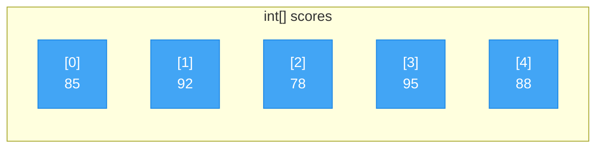
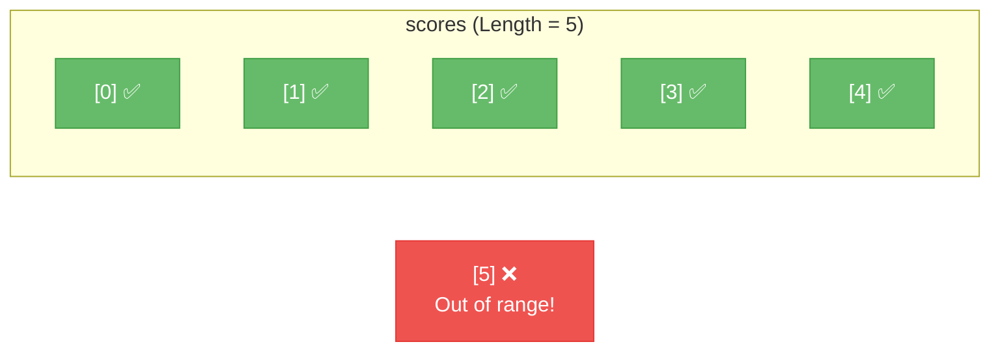

# Lecture 1: Arrays — Storing and Accessing Data

[← Back to Week 6 Overview](./README.md) | [Next: Lecture 2 – Array Patterns and Multidimensional Arrays →](./lecture-2.md)

---

## Lecture Overview

| Item | Detail |
|------|--------|
| Duration | 45 minutes |
| Topics | What arrays are, declaring and initializing, indexing, iteration with `for` and `foreach`, common operations |
| Preparation | Comfortable with loops (Week 4) and methods (Week 5) |

---

## 1. The Problem: Too Many Variables

Imagine you're building a program that tracks test scores for a class. With what we know so far, you'd write:

```csharp
int score1 = 85;
int score2 = 92;
int score3 = 78;
int score4 = 95;
int score5 = 88;
```

This works for 5 students. But what about 30? Or 300? You'd need 300 separate variables, 300 lines of input code, and you couldn't easily loop through them. There has to be a better way.

**There is — arrays.**

---

## 2. What is an Array?

An **array** is a collection of values, all of the **same type**, stored together under a single name. Each value sits at a numbered position called an **index**.



Key facts about arrays:

- **Fixed size** — once created, the number of elements cannot change
- **Zero-indexed** — the first element is at index `0`, not `1`
- **Same type** — all elements must be the same data type
- **Direct access** — you can jump to any element instantly by its index

> **Why zero-indexed?** This comes from how computers calculate memory addresses. The index represents the *offset* from the beginning of the array. The first element has an offset of 0.

---

## 3. Declaring and Initializing Arrays

There are several ways to create an array in C#:

### Method 1: Declare Size, Then Fill

```csharp
int[] scores = new int[5];  // Creates an array of 5 integers, all initialized to 0

scores[0] = 85;
scores[1] = 92;
scores[2] = 78;
scores[3] = 95;
scores[4] = 88;
```

### Method 2: Declare and Initialize Together

```csharp
int[] scores = new int[] { 85, 92, 78, 95, 88 };
```

### Method 3: Shorthand (Most Common)

```csharp
int[] scores = { 85, 92, 78, 95, 88 };
```

### Other Data Types

Arrays work with any data type:

```csharp
string[] names = { "Alice", "Bob", "Charlie", "Diana" };
double[] prices = { 9.99, 24.50, 3.75, 15.00 };
bool[] attendance = { true, true, false, true, true };
char[] vowels = { 'a', 'e', 'i', 'o', 'u' };
```

### Default Values

When you create an array with `new` but don't assign values, each element gets a **default value**:

| Type | Default Value |
|------|--------------|
| `int`, `double`, `decimal` | `0` |
| `bool` | `false` |
| `string` | `null` |
| `char` | `'\0'` (null character) |

```csharp
int[] numbers = new int[3];
Console.WriteLine(numbers[0]);  // Output: 0
Console.WriteLine(numbers[1]);  // Output: 0
Console.WriteLine(numbers[2]);  // Output: 0
```

---

## 4. Accessing and Modifying Elements

Use the **index** (position number) inside square brackets to read or change any element:

```csharp
string[] fruits = { "Apple", "Banana", "Cherry", "Date" };

// Reading elements
Console.WriteLine(fruits[0]);  // Output: Apple
Console.WriteLine(fruits[2]);  // Output: Cherry

// Modifying elements
fruits[1] = "Blueberry";
Console.WriteLine(fruits[1]);  // Output: Blueberry (was Banana)
```

### The `.Length` Property

Every array knows its own size:

```csharp
int[] scores = { 85, 92, 78, 95, 88 };
Console.WriteLine(scores.Length);  // Output: 5
```

### ⚠️ Common Pitfall: IndexOutOfRangeException

Trying to access an index that doesn't exist crashes your program:

```csharp
int[] scores = { 85, 92, 78, 95, 88 };  // Valid indices: 0-4

Console.WriteLine(scores[5]);  // 💥 IndexOutOfRangeException!
```

**The valid range is always `0` to `Length - 1`.**



---

## 5. Iterating Through Arrays

This is where arrays become truly powerful — combining them with the loops you learned in Week 4.

### Using a `for` Loop

The `for` loop is ideal when you need the **index** (to know which position you're at) or need to **modify** elements:

```csharp
string[] students = { "Alice", "Bob", "Charlie", "Diana" };

for (int i = 0; i < students.Length; i++)
{
    Console.WriteLine($"Student {i + 1}: {students[i]}");
}
```

**Output:**
```
Student 1: Alice
Student 2: Bob
Student 3: Charlie
Student 4: Diana
```

**Execution Trace:**

| Iteration | `i` | `i < students.Length` | `students[i]` | Output |
|-----------|-----|-----------------------|----------------|--------|
| 1 | 0 | `0 < 4` → true | "Alice" | Student 1: Alice |
| 2 | 1 | `1 < 4` → true | "Bob" | Student 2: Bob |
| 3 | 2 | `2 < 4` → true | "Charlie" | Student 3: Charlie |
| 4 | 3 | `3 < 4` → true | "Diana" | Student 4: Diana |
| 5 | 4 | `4 < 4` → false | — | Loop ends |

> **Best Practice:** Always use `i < array.Length` as your condition, never hardcode a number like `i < 4`. If the array size changes, your loop will still work correctly.

### Using a `foreach` Loop

The `foreach` loop is cleaner when you just need to **read** each element and don't need the index:

```csharp
double[] prices = { 9.99, 24.50, 3.75, 15.00 };

foreach (double price in prices)
{
    Console.WriteLine($"${price:F2}");
}
```

**Output:**
```
$9.99
$24.50
$3.75
$15.00
```

### `for` vs `foreach` — When to Use Each

| Situation | Best Loop | Why |
|-----------|-----------|-----|
| Need the index number | `for` | `foreach` doesn't provide the index |
| Need to modify elements | `for` | `foreach` gives a read-only copy |
| Just reading all elements | `foreach` | Cleaner, less error-prone |
| Need to go backwards | `for` | `foreach` only goes forward |
| Need to skip elements | `for` | More control with `i += 2` etc. |

---

## 6. Common Array Operations

Let's build some essential operations you'll use frequently. These combine arrays, loops, and the methods from Week 5.

### Calculating the Sum and Average

```csharp
int[] scores = { 85, 92, 78, 95, 88 };

int sum = 0;
foreach (int score in scores)
{
    sum += score;
}

double average = (double)sum / scores.Length;

Console.WriteLine($"Sum: {sum}");         // Output: Sum: 438
Console.WriteLine($"Average: {average:F1}"); // Output: Average: 87.6
```

> **Note:** We cast `sum` to `double` before dividing to avoid integer division (remember Week 2!).

### Finding the Maximum Value

```csharp
int[] scores = { 85, 92, 78, 95, 88 };

int max = scores[0];  // Start with the first element

for (int i = 1; i < scores.Length; i++)
{
    if (scores[i] > max)
    {
        max = scores[i];
    }
}

Console.WriteLine($"Highest score: {max}");  // Output: Highest score: 95
```

**Why start with `scores[0]` instead of `0`?** If all values were negative, starting with `0` would give the wrong answer. Always initialize `max` with an actual element from the array.

### Finding the Minimum Value

```csharp
int[] scores = { 85, 92, 78, 95, 88 };

int min = scores[0];

for (int i = 1; i < scores.Length; i++)
{
    if (scores[i] < min)
    {
        min = scores[i];
    }
}

Console.WriteLine($"Lowest score: {min}");  // Output: Lowest score: 78
```

### Counting Elements That Match a Condition

```csharp
int[] scores = { 85, 92, 78, 95, 88 };
int passingCount = 0;

foreach (int score in scores)
{
    if (score >= 80)
    {
        passingCount++;
    }
}

Console.WriteLine($"Students who passed (80+): {passingCount}");  // Output: 4
```

---

## 7. Building an Array from User Input

A very common pattern is reading data from the user into an array:

```csharp
Console.Write("How many scores do you want to enter? ");
int count = int.Parse(Console.ReadLine());

int[] scores = new int[count];

for (int i = 0; i < scores.Length; i++)
{
    Console.Write($"Enter score {i + 1}: ");
    scores[i] = int.Parse(Console.ReadLine());
}

// Now process the array
int sum = 0;
foreach (int score in scores)
{
    sum += score;
}

double average = (double)sum / scores.Length;
Console.WriteLine($"\nAverage score: {average:F1}");
```

**Sample Run:**
```
How many scores do you want to enter? 3
Enter score 1: 85
Enter score 2: 92
Enter score 3: 78

Average score: 85.0
```

> **Improvement:** In a real program, you'd use `int.TryParse` for safe input handling (remember Week 2). For clarity, we're using `int.Parse` in these examples.

---

## 8. Passing Arrays to Methods

Arrays work naturally with the methods you learned in Week 5. You can pass an entire array as a parameter:

```csharp
static double CalculateAverage(int[] numbers)
{
    int sum = 0;
    foreach (int num in numbers)
    {
        sum += num;
    }
    return (double)sum / numbers.Length;
}

static int FindMax(int[] numbers)
{
    int max = numbers[0];
    for (int i = 1; i < numbers.Length; i++)
    {
        if (numbers[i] > max)
            max = numbers[i];
    }
    return max;
}

static void PrintArray(int[] numbers)
{
    Console.Write("[ ");
    foreach (int num in numbers)
    {
        Console.Write($"{num} ");
    }
    Console.WriteLine("]");
}

// Using the methods
int[] scores = { 85, 92, 78, 95, 88 };

PrintArray(scores);
Console.WriteLine($"Average: {CalculateAverage(scores):F1}");
Console.WriteLine($"Highest: {FindMax(scores)}");
```

**Output:**
```
[ 85 92 78 95 88 ]
Average: 87.6
Highest: 95
```

> **Important:** When you pass an array to a method, you're passing a **reference** to the same array — not a copy. If the method modifies an element, the original array is changed too. We'll explore this concept more in Block 2 (OOP).

---

## 9. Searching in an Array

### Linear Search — Finding a Value

```csharp
static int FindIndex(string[] array, string target)
{
    for (int i = 0; i < array.Length; i++)
    {
        if (array[i] == target)
        {
            return i;  // Found it! Return the index
        }
    }
    return -1;  // Not found (convention: return -1)
}

// Using the method
string[] cities = { "London", "Paris", "Tokyo", "Cairo", "Sydney" };

int index = FindIndex(cities, "Tokyo");
if (index != -1)
    Console.WriteLine($"Found 'Tokyo' at index {index}");  // Output: Found 'Tokyo' at index 2
else
    Console.WriteLine("City not found");
```

> **Why return `-1` for "not found"?** Since valid array indices start at `0`, `-1` is a safe value that can never be a real index. This is a widely used convention in programming.

### Checking if a Value Exists

```csharp
static bool Contains(int[] array, int target)
{
    foreach (int item in array)
    {
        if (item == target)
            return true;
    }
    return false;
}

int[] luckyNumbers = { 7, 13, 21, 42, 88 };
Console.WriteLine(Contains(luckyNumbers, 42));  // Output: True
Console.WriteLine(Contains(luckyNumbers, 5));   // Output: False
```

---

## 10. Complete Example: Grade Report

Let's put everything together in a practical program:

```csharp
Console.WriteLine("=== Grade Report Generator ===\n");

Console.Write("How many students? ");
int count = int.Parse(Console.ReadLine());

string[] names = new string[count];
int[] grades = new int[count];

// Input
for (int i = 0; i < count; i++)
{
    Console.Write($"\nStudent {i + 1} name: ");
    names[i] = Console.ReadLine();

    Console.Write($"Student {i + 1} grade: ");
    grades[i] = int.Parse(Console.ReadLine());
}

// Calculate statistics
int sum = 0;
int max = grades[0];
int min = grades[0];
int passCount = 0;

for (int i = 0; i < grades.Length; i++)
{
    sum += grades[i];
    if (grades[i] > max) max = grades[i];
    if (grades[i] < min) min = grades[i];
    if (grades[i] >= 60) passCount++;
}

double average = (double)sum / grades.Length;

// Display report
Console.WriteLine("\n╔══════════════════════════════╗");
Console.WriteLine("║       CLASS GRADE REPORT     ║");
Console.WriteLine("╠══════════════════════════════╣");

for (int i = 0; i < count; i++)
{
    string status = grades[i] >= 60 ? "Pass" : "Fail";
    Console.WriteLine($"║ {names[i],-15} {grades[i],3}  {status,-4} ║");
}

Console.WriteLine("╠══════════════════════════════╣");
Console.WriteLine($"║ Average:       {average,6:F1}       ║");
Console.WriteLine($"║ Highest:       {max,6}       ║");
Console.WriteLine($"║ Lowest:        {min,6}       ║");
Console.WriteLine($"║ Pass Rate:  {passCount}/{count} students   ║");
Console.WriteLine("╚══════════════════════════════╝");
```

**Sample Run:**
```
=== Grade Report Generator ===

How many students? 3

Student 1 name: Alice
Student 1 grade: 85

Student 2 name: Bob
Student 2 grade: 55

Student 3 name: Charlie
Student 3 grade: 92

╔══════════════════════════════╗
║       CLASS GRADE REPORT     ║
╠══════════════════════════════╣
║ Alice            85  Pass ║
║ Bob              55  Fail ║
║ Charlie          92  Pass ║
╠══════════════════════════════╣
║ Average:          77.3       ║
║ Highest:            92       ║
║ Lowest:             55       ║
║ Pass Rate:  2/3 students   ║
╚══════════════════════════════╝
```

---

## Key Takeaways

- An **array** stores multiple values of the same type under one name
- Arrays are **fixed size** and **zero-indexed** (first element at `[0]`)
- Use `for` when you need the index; use `foreach` when you just need the values
- Always use `.Length` instead of hardcoded numbers for loop bounds
- Common patterns: sum, average, min, max, count, search — learn them, you'll use them constantly
- Arrays can be passed to and returned from methods
- Accessing an invalid index causes `IndexOutOfRangeException`

---

## Hands-On Exercises

### Exercise 1 — Array Creation
Create an array of 7 day names (Monday through Sunday). Print each day with its index number.

### Exercise 2 — Sum and Average
Write a program that reads 5 numbers from the user into an array, then displays their sum and average.

### Exercise 3 — Max Finder
Write a method `static int FindMax(int[] numbers)` that returns the largest value. Test it with the array `{ 34, 67, 23, 89, 12, 56 }`.

---

[← Back to Week 6 Overview](./README.md) | [Next: Lecture 2 – Array Patterns and Multidimensional Arrays →](./lecture-2.md)
