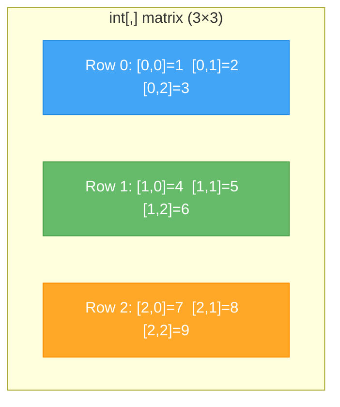

# Lecture 2: Array Patterns and Multidimensional Arrays

[← Previous: Lecture 1 – Arrays: Storing and Accessing Data](./lecture-1.md) | [Back to Week 6 Overview](./README.md) | [Next: Lecture 3 – Lists and Choosing the Right Collection →](./lecture-3.md)

---

## Lecture Overview

| Item | Detail |
|------|--------|
| Duration | 45 minutes |
| Topics | Reversing, sorting, parallel arrays, `Array` class methods, multidimensional arrays |
| Preparation | Completed Lecture 1 exercises |

---

## 1. Reversing an Array

Sometimes you need to process data in reverse order. Here are two approaches:

### Approach 1: Iterate Backwards

```csharp
int[] numbers = { 10, 20, 30, 40, 50 };

Console.WriteLine("Reversed:");
for (int i = numbers.Length - 1; i >= 0; i--)
{
    Console.Write($"{numbers[i]} ");
}
// Output: 50 40 30 20 10
```

### Approach 2: Reverse In-Place (Swap Technique)

```csharp
static void ReverseArray(int[] array)
{
    int left = 0;
    int right = array.Length - 1;

    while (left < right)
    {
        // Swap elements
        int temp = array[left];
        array[left] = array[right];
        array[right] = temp;

        left++;
        right--;
    }
}

int[] numbers = { 10, 20, 30, 40, 50 };
ReverseArray(numbers);
// numbers is now { 50, 40, 30, 20, 10 }
```

**Execution Trace (Swap Technique):**

| Step | `left` | `right` | Swap | Array State |
|------|--------|---------|------|-------------|
| Start | 0 | 4 | — | { 10, 20, 30, 40, 50 } |
| 1 | 0 | 4 | 10 ↔ 50 | { **50**, 20, 30, 40, **10** } |
| 2 | 1 | 3 | 20 ↔ 40 | { 50, **40**, 30, **20**, 10 } |
| 3 | 2 | 2 | left = right, stop | { 50, 40, 30, 20, 10 } |

---

## 2. Sorting Arrays

Sorting is one of the most common operations in programming. C# gives you a built-in way to sort:

### Using `Array.Sort()`

```csharp
int[] scores = { 78, 95, 62, 88, 71 };

Array.Sort(scores);

foreach (int score in scores)
{
    Console.Write($"{score} ");
}
// Output: 62 71 78 88 95
```

Strings sort alphabetically:

```csharp
string[] names = { "Charlie", "Alice", "Bob", "Diana" };

Array.Sort(names);

foreach (string name in names)
{
    Console.Write($"{name} ");
}
// Output: Alice Bob Charlie Diana
```

> **Important:** `Array.Sort()` modifies the original array. If you need to keep the original order, make a copy first.

### Making a Copy Before Sorting

```csharp
int[] original = { 78, 95, 62, 88, 71 };
int[] sorted = new int[original.Length];
Array.Copy(original, sorted, original.Length);

Array.Sort(sorted);

Console.Write("Original: ");
foreach (int n in original) Console.Write($"{n} ");
// Output: Original: 78 95 62 88 71

Console.Write("\nSorted:   ");
foreach (int n in sorted) Console.Write($"{n} ");
// Output: Sorted:   62 71 78 88 95
```

---

## 3. Useful `Array` Class Methods

C# provides several built-in methods through the `Array` class:

| Method | Purpose | Example |
|--------|---------|---------|
| `Array.Sort(arr)` | Sort ascending | `Array.Sort(scores)` |
| `Array.Reverse(arr)` | Reverse the order | `Array.Reverse(scores)` |
| `Array.Copy(src, dest, len)` | Copy elements | `Array.Copy(a, b, a.Length)` |
| `Array.IndexOf(arr, val)` | Find index of value | `Array.IndexOf(names, "Bob")` → `1` |
| `Array.Exists(arr, predicate)` | Check if any match | `Array.Exists(scores, s => s > 90)` |
| `Array.Clear(arr, index, len)` | Reset to defaults | `Array.Clear(scores, 0, scores.Length)` |

```csharp
string[] colors = { "Red", "Green", "Blue", "Yellow" };

// Find an element's index
int index = Array.IndexOf(colors, "Blue");
Console.WriteLine($"Blue is at index {index}");  // Output: Blue is at index 2

// Reverse
Array.Reverse(colors);
// colors is now { "Yellow", "Blue", "Green", "Red" }

// Sort then Reverse = Descending order
Array.Sort(colors);
Array.Reverse(colors);
// colors is now { "Yellow", "Red", "Green", "Blue" }
```

> **Note:** `Array.Exists` uses a **lambda expression** — don't worry about the `s => s > 90` syntax for now. We'll cover this in detail in Week 14. For now, just know it exists as a useful shortcut.

---

## 4. Parallel Arrays

Sometimes you need to track multiple pieces of information about the same items. One approach (before we learn classes in Week 7) is **parallel arrays** — multiple arrays where the same index represents the same item:

```csharp
string[] products = { "Laptop", "Mouse", "Keyboard", "Monitor" };
double[] prices = { 999.99, 29.99, 79.99, 349.99 };
int[] quantities = { 5, 50, 30, 12 };

Console.WriteLine("╔════════════════════════════════════════╗");
Console.WriteLine("║         INVENTORY REPORT               ║");
Console.WriteLine("╠════════════╦════════╦══════╦═══════════╣");
Console.WriteLine("║ Product    ║ Price  ║ Qty  ║ Value     ║");
Console.WriteLine("╠════════════╬════════╬══════╬═══════════╣");

double totalValue = 0;

for (int i = 0; i < products.Length; i++)
{
    double value = prices[i] * quantities[i];
    totalValue += value;
    Console.WriteLine($"║ {products[i],-10} ║ {prices[i],6:F2} ║ {quantities[i],4} ║ {value,9:F2} ║");
}

Console.WriteLine("╠════════════╩════════╩══════╬═══════════╣");
Console.WriteLine($"║ Total Inventory Value:     ║ {totalValue,9:F2} ║");
Console.WriteLine("╚════════════════════════════╩═══════════╝");
```

**Output:**
```
╔════════════════════════════════════════╗
║         INVENTORY REPORT               ║
╠════════════╦════════╦══════╦═══════════╣
║ Product    ║ Price  ║ Qty  ║ Value     ║
╠════════════╬════════╬══════╬═══════════╣
║ Laptop     ║ 999.99 ║    5 ║   4999.95 ║
║ Mouse      ║  29.99 ║   50 ║   1499.50 ║
║ Keyboard   ║  79.99 ║   30 ║   2399.70 ║
║ Monitor    ║ 349.99 ║   12 ║   4199.88 ║
╠════════════╩════════╩══════╬═══════════╣
║ Total Inventory Value:     ║  13099.03 ║
╚════════════════════════════╩═══════════╝
```

> **Heads up:** Parallel arrays work but are fragile — if you sort one array, the others get out of sync. In Week 7, you'll learn about **classes**, which solve this problem elegantly by bundling related data together.

---

## 5. Multidimensional Arrays

Sometimes data naturally comes in a **grid** — rows and columns, like a spreadsheet or a game board. C# supports **2D arrays** for this.

### Declaring a 2D Array

```csharp
// 3 rows × 4 columns
int[,] grid = new int[3, 4];

// With initial values
int[,] matrix = {
    { 1, 2, 3 },
    { 4, 5, 6 },
    { 7, 8, 9 }
};
```

### Visualizing a 2D Array



### Accessing Elements

Use two indices — `[row, column]`:

```csharp
int[,] matrix = {
    { 1, 2, 3 },
    { 4, 5, 6 },
    { 7, 8, 9 }
};

Console.WriteLine(matrix[0, 0]);  // Output: 1 (row 0, col 0)
Console.WriteLine(matrix[1, 2]);  // Output: 6 (row 1, col 2)
Console.WriteLine(matrix[2, 1]);  // Output: 8 (row 2, col 1)

// Modify
matrix[1, 1] = 99;
Console.WriteLine(matrix[1, 1]);  // Output: 99
```

### Getting Dimensions

```csharp
int rows = matrix.GetLength(0);     // Number of rows → 3
int columns = matrix.GetLength(1);  // Number of columns → 3
```

### Iterating a 2D Array (Nested Loops)

```csharp
int[,] scores = {
    { 85, 92, 78 },  // Student 0's scores
    { 90, 88, 95 },  // Student 1's scores
    { 72, 68, 81 }   // Student 2's scores
};

string[] students = { "Alice", "Bob", "Charlie" };
string[] subjects = { "Math", "Science", "English" };

for (int row = 0; row < scores.GetLength(0); row++)
{
    Console.Write($"{students[row],-10}");
    for (int col = 0; col < scores.GetLength(1); col++)
    {
        Console.Write($"{subjects[col]}: {scores[row, col],3}   ");
    }
    Console.WriteLine();
}
```

**Output:**
```
Alice     Math:  85   Science:  92   English:  78   
Bob       Math:  90   Science:  88   English:  95   
Charlie   Math:  72   Science:  68   English:  81   
```

---

## 6. Practical Example: Tic-Tac-Toe Board

A 2D array is perfect for representing a game board:

```csharp
char[,] board = {
    { ' ', ' ', ' ' },
    { ' ', ' ', ' ' },
    { ' ', ' ', ' ' }
};

static void PrintBoard(char[,] board)
{
    Console.WriteLine("  0   1   2");
    for (int row = 0; row < 3; row++)
    {
        Console.Write($"{row} ");
        for (int col = 0; col < 3; col++)
        {
            Console.Write($" {board[row, col]} ");
            if (col < 2) Console.Write("|");
        }
        Console.WriteLine();
        if (row < 2) Console.WriteLine("  ---+---+---");
    }
}

// Place some moves
board[0, 0] = 'X';
board[1, 1] = 'O';
board[0, 2] = 'X';

PrintBoard(board);
```

**Output:**
```
  0   1   2
0  X |   | X 
  ---+---+---
1    | O |   
  ---+---+---
2    |   |   
```

---

## 7. When to Use Multidimensional Arrays

| Use Case | Example |
|----------|---------|
| Game boards | Chess, Tic-Tac-Toe, Minesweeper |
| Spreadsheet-like data | Grades per student per subject |
| Images | Pixel grids (each cell = a color) |
| Seating charts | Rows and seats in a theater |
| Maps/grids | Navigation, mazes |

> **Keep it brief:** For this course, understanding 2D arrays is sufficient. C# also supports 3D and higher-dimensional arrays, but these are rarely needed in everyday programming.

---

## Key Takeaways

- **Reversing** arrays can be done by iterating backwards or swapping elements
- `Array.Sort()`, `Array.Reverse()`, `Array.IndexOf()`, and `Array.Copy()` are your go-to built-in tools
- **Parallel arrays** track related data at matching indices — useful but fragile (classes are better, coming in Week 7)
- **2D arrays** use `[row, column]` syntax and `GetLength(0)` / `GetLength(1)` for dimensions
- Nested `for` loops are the standard way to traverse a 2D array
- Multidimensional arrays are great for grid-like data: game boards, tables, seating charts

---

## Hands-On Exercises

### Exercise 1 — Sort and Display
Create an array of 6 random numbers. Display them in original order, then sorted ascending, then sorted descending.

### Exercise 2 — Matrix Sum
Create a 3×3 2D array of integers. Write a program that calculates and displays the sum of each row, each column, and the total sum.

### Exercise 3 — Seat Finder
Create a 5×8 2D array representing a theater (0 = empty, 1 = occupied). Write a method that counts the number of empty seats.

---

[← Previous: Lecture 1 – Arrays: Storing and Accessing Data](./lecture-1.md) | [Back to Week 6 Overview](./README.md) | [Next: Lecture 3 – Lists and Choosing the Right Collection →](./lecture-3.md)
