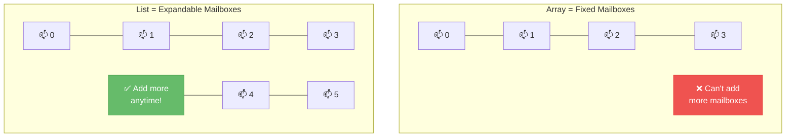
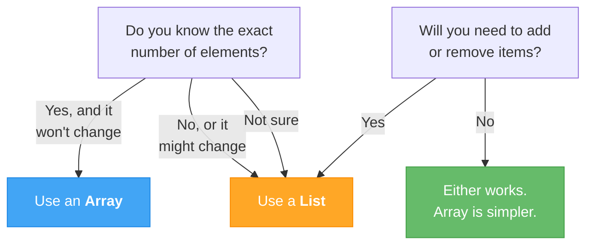

# Lecture 3: Lists and Choosing the Right Collection

[← Previous: Lecture 2 – Array Patterns and Multidimensional Arrays](./lecture-2.md) | [Back to Week 6 Overview](./README.md)

---

## Lecture Overview

| Item | Detail |
|------|--------|
| Duration | 45 minutes |
| Topics | `List<T>`, Add/Remove/Insert, arrays vs lists, when to use each, practical guidelines |
| Preparation | Completed Lecture 1 & 2 exercises |

---

## 1. The Limitation of Arrays

Arrays are powerful, but they have one major limitation: **their size is fixed at creation**. You can't add or remove elements.

```csharp
string[] students = new string[3];
students[0] = "Alice";
students[1] = "Bob";
students[2] = "Charlie";

// A 4th student enrolls... now what?
// students[3] = "Diana";  // 💥 IndexOutOfRangeException!
```

In real applications, you often don't know how many items you'll have. A shopping cart could have 1 item or 20. A contact list grows and shrinks. You need something that can **resize dynamically**.

**Enter `List<T>`.**

---

## 2. What is `List<T>`?

`List<T>` is a **dynamic collection** that grows and shrinks as needed. The `<T>` is a placeholder for the data type — you'll learn more about this "generics" syntax in Week 13, but for now just think of it as telling the list what type of data it holds.

```csharp
List<string> names = new List<string>();    // A list of strings
List<int> scores = new List<int>();          // A list of integers
List<double> prices = new List<double>();    // A list of doubles
```

> **Required:** You need `using System.Collections.Generic;` at the top of your file to use `List<T>`. With top-level statements in modern C#, this is usually included automatically.

### Analogy: Array vs List



---

## 3. Creating and Initializing Lists

### Empty List

```csharp
List<string> fruits = new List<string>();
```

### List with Initial Values

```csharp
List<string> fruits = new List<string> { "Apple", "Banana", "Cherry" };
```

### Using `var` (the type is inferred)

```csharp
var numbers = new List<int> { 10, 20, 30, 40 };
```

---

## 4. Essential List Operations

### Adding Elements

```csharp
List<string> students = new List<string>();

students.Add("Alice");        // Add to end
students.Add("Bob");
students.Add("Charlie");
// students: ["Alice", "Bob", "Charlie"]

students.Insert(1, "Diana");  // Insert at specific index
// students: ["Alice", "Diana", "Bob", "Charlie"]
```

### Removing Elements

```csharp
students.Remove("Bob");          // Remove by value (first occurrence)
// students: ["Alice", "Diana", "Charlie"]

students.RemoveAt(0);            // Remove by index
// students: ["Diana", "Charlie"]
```

### Accessing Elements

```csharp
List<int> scores = new List<int> { 85, 92, 78, 95 };

Console.WriteLine(scores[0]);     // Output: 85 (same as arrays!)
Console.WriteLine(scores[2]);     // Output: 78

scores[1] = 100;                  // Modify by index
Console.WriteLine(scores[1]);     // Output: 100
```

### Count vs Length

```csharp
List<int> scores = new List<int> { 85, 92, 78, 95 };
Console.WriteLine(scores.Count);   // Output: 4

// Arrays use .Length — Lists use .Count
// int[] arr = { 1, 2, 3 };
// arr.Length → 3
```

---

## 5. List Methods Reference

Here are the most commonly used `List<T>` methods:

| Method | Purpose | Example |
|--------|---------|---------|
| `Add(item)` | Add to end | `list.Add("Alice")` |
| `Insert(index, item)` | Insert at position | `list.Insert(0, "First")` |
| `Remove(item)` | Remove first match | `list.Remove("Bob")` |
| `RemoveAt(index)` | Remove at position | `list.RemoveAt(2)` |
| `Contains(item)` | Check if exists | `list.Contains("Alice")` → `true` |
| `IndexOf(item)` | Find position | `list.IndexOf("Bob")` → `1` |
| `Count` | Number of elements | `list.Count` → `4` |
| `Clear()` | Remove all elements | `list.Clear()` |
| `Sort()` | Sort ascending | `list.Sort()` |
| `Reverse()` | Reverse order | `list.Reverse()` |
| `ToArray()` | Convert to array | `int[] arr = list.ToArray()` |

---

## 6. Iterating Through Lists

Lists support the same iteration patterns as arrays:

### Using `for`

```csharp
List<string> colors = new List<string> { "Red", "Green", "Blue" };

for (int i = 0; i < colors.Count; i++)
{
    Console.WriteLine($"{i}: {colors[i]}");
}
```

### Using `foreach`

```csharp
foreach (string color in colors)
{
    Console.WriteLine(color);
}
```

> **⚠️ Important Rule:** You **cannot modify a list** (add or remove items) while iterating over it with `foreach`. This causes an `InvalidOperationException`. Use a `for` loop iterating **backwards** if you need to remove items during iteration.

### Removing Items During Iteration

```csharp
List<int> numbers = new List<int> { 1, 2, 3, 4, 5, 6, 7, 8 };

// Remove all even numbers — iterate BACKWARDS
for (int i = numbers.Count - 1; i >= 0; i--)
{
    if (numbers[i] % 2 == 0)
    {
        numbers.RemoveAt(i);
    }
}
// numbers: [1, 3, 5, 7]
```

**Why backwards?** When you remove an item, all elements after it shift down by one index. Going backwards means you've already processed the shifted elements.

---

## 7. Building a List from User Input

One of the biggest advantages of lists: you don't need to know the size upfront.

```csharp
List<string> shoppingList = new List<string>();

Console.WriteLine("Enter items for your shopping list (type 'done' to finish):");

while (true)
{
    Console.Write("> ");
    string input = Console.ReadLine();

    if (input.ToLower() == "done")
        break;

    shoppingList.Add(input);
    Console.WriteLine($"  Added! ({shoppingList.Count} items so far)");
}

Console.WriteLine($"\n--- Your Shopping List ({shoppingList.Count} items) ---");
for (int i = 0; i < shoppingList.Count; i++)
{
    Console.WriteLine($"  {i + 1}. {shoppingList[i]}");
}
```

**Sample Run:**
```
Enter items for your shopping list (type 'done' to finish):
> Milk
  Added! (1 items so far)
> Bread
  Added! (2 items so far)
> Eggs
  Added! (3 items so far)
> done

--- Your Shopping List (3 items) ---
  1. Milk
  2. Bread
  3. Eggs
```

Compare this to arrays — with an array, you'd need to ask "how many items?" before the user even starts typing!

---

## 8. Passing Lists to Methods

Just like arrays, lists can be passed to methods:

```csharp
static double CalculateAverage(List<int> numbers)
{
    int sum = 0;
    foreach (int num in numbers)
    {
        sum += num;
    }
    return (double)sum / numbers.Count;
}

static int FindMax(List<int> numbers)
{
    int max = numbers[0];
    for (int i = 1; i < numbers.Count; i++)
    {
        if (numbers[i] > max)
            max = numbers[i];
    }
    return max;
}

static void PrintList(List<string> items, string title)
{
    Console.WriteLine($"\n--- {title} ---");
    foreach (string item in items)
    {
        Console.WriteLine($"  • {item}");
    }
}

// Usage
List<int> scores = new List<int> { 85, 92, 78, 95, 88 };
Console.WriteLine($"Average: {CalculateAverage(scores):F1}");
Console.WriteLine($"Highest: {FindMax(scores)}");

List<string> tasks = new List<string> { "Buy groceries", "Finish homework", "Call dentist" };
PrintList(tasks, "My To-Do List");
```

---

## 9. Arrays vs Lists — When to Use Each

This is one of the most common questions beginners have. Here's a clear decision guide:

### Comparison Table

| Feature | Array (`int[]`) | List (`List<int>`) |
|---------|-----------------|---------------------|
| Size | Fixed at creation | Grows and shrinks dynamically |
| Performance | Slightly faster for fixed data | Small overhead for dynamic resizing |
| Add/Remove | Not possible | `Add()`, `Remove()`, `Insert()` |
| Syntax | `int[] arr = new int[5]` | `List<int> list = new List<int>()` |
| Length/Count | `.Length` | `.Count` |
| Index access | `arr[0]` | `list[0]` |
| Iteration | `for` / `foreach` | `for` / `foreach` |
| Best for | Fixed-size data, performance-critical | Dynamic data, most everyday use |

### Decision Flowchart



### Practical Guidelines

**Use an array when:**
- The size is known and fixed (days of the week, months, a game board)
- You're working with a grid/matrix (2D data)
- Performance is critical and the size won't change

**Use a list when:**
- Items will be added or removed over time
- You don't know how many items there will be
- You're building a collection from user input
- **When in doubt, use a `List<T>`** — it's more flexible and the performance difference is negligible for most programs

---

## 10. Converting Between Arrays and Lists

You can freely convert between the two:

```csharp
// Array → List
int[] scoresArray = { 85, 92, 78, 95 };
List<int> scoresList = new List<int>(scoresArray);
// or: List<int> scoresList = scoresArray.ToList();  (needs using System.Linq)

// List → Array
List<string> namesList = new List<string> { "Alice", "Bob", "Charlie" };
string[] namesArray = namesList.ToArray();
```

---

## 11. Complete Example: Contact Manager

Let's build a practical program that uses a list with a menu-driven interface:

```csharp
List<string> contacts = new List<string>();
bool running = true;

while (running)
{
    Console.WriteLine("\n=== Contact Manager ===");
    Console.WriteLine("1. Add contact");
    Console.WriteLine("2. Remove contact");
    Console.WriteLine("3. Search contacts");
    Console.WriteLine("4. View all contacts");
    Console.WriteLine("5. Sort contacts");
    Console.WriteLine("6. Exit");
    Console.Write("Choice: ");

    string choice = Console.ReadLine();

    switch (choice)
    {
        case "1":
            Console.Write("Enter name: ");
            string name = Console.ReadLine();
            contacts.Add(name);
            Console.WriteLine($"'{name}' added! ({contacts.Count} contacts total)");
            break;

        case "2":
            Console.Write("Enter name to remove: ");
            string toRemove = Console.ReadLine();
            if (contacts.Remove(toRemove))
                Console.WriteLine($"'{toRemove}' removed.");
            else
                Console.WriteLine($"'{toRemove}' not found.");
            break;

        case "3":
            Console.Write("Search for: ");
            string search = Console.ReadLine().ToLower();
            Console.WriteLine("Results:");
            bool found = false;
            foreach (string contact in contacts)
            {
                if (contact.ToLower().Contains(search))
                {
                    Console.WriteLine($"  • {contact}");
                    found = true;
                }
            }
            if (!found) Console.WriteLine("  No matches found.");
            break;

        case "4":
            if (contacts.Count == 0)
            {
                Console.WriteLine("No contacts yet.");
            }
            else
            {
                Console.WriteLine($"All Contacts ({contacts.Count}):");
                for (int i = 0; i < contacts.Count; i++)
                {
                    Console.WriteLine($"  {i + 1}. {contacts[i]}");
                }
            }
            break;

        case "5":
            contacts.Sort();
            Console.WriteLine("Contacts sorted alphabetically.");
            break;

        case "6":
            running = false;
            Console.WriteLine("Goodbye!");
            break;

        default:
            Console.WriteLine("Invalid choice. Try again.");
            break;
    }
}
```

This program combines:
- **Lists** with Add, Remove, Contains, Sort, Count
- **Loops** (while for the menu, foreach for searching)
- **Conditions** (switch for menu, if for validation)
- **Methods concepts** (could be refactored into methods as a challenge)

---

## 12. Looking Ahead

This week completes **Block 1: Language Fundamentals**. You now have all the core tools:

| Week | Tool | What It Does |
|------|------|--------------|
| 1 | Input/Output | Communicate with the user |
| 2 | Variables & Types | Store and work with data |
| 3 | Conditions | Make decisions |
| 4 | Loops | Repeat operations |
| 5 | Methods | Organize code into reusable pieces |
| **6** | **Collections** | **Store groups of related data** |

Starting next week (Block 2), you'll learn **Object-Oriented Programming** — how to bundle data and behavior into **classes** and **objects**. The parallel arrays pattern from this week? You'll replace it with something much better: classes that keep related data together naturally.

---

## Key Takeaways

- `List<T>` is a dynamic collection — it grows and shrinks as needed
- Lists support `Add`, `Remove`, `Insert`, `Contains`, `IndexOf`, `Sort`, and more
- Use `.Count` for lists (not `.Length` — that's for arrays)
- You **cannot** add/remove items during a `foreach` loop — use a backwards `for` loop instead
- **When in doubt, use a `List<T>`** — it handles most situations well
- Arrays and lists are convertible: `list.ToArray()` and `new List<T>(array)`
- This completes your fundamental toolkit — next week: classes and objects!

---

## Hands-On Exercises

### Exercise 1 — Dynamic Name List
Create a program that lets the user add names to a list one at a time (type "stop" to finish), then displays the list sorted alphabetically.

### Exercise 2 — Remove Duplicates
Given a `List<int>` with duplicate values, create a new list that contains only unique values.

### Exercise 3 — List Statistics
Write methods that take a `List<double>` and return: the sum, the average, the min, and the max. Test with user-entered values.

---

[← Previous: Lecture 2 – Array Patterns and Multidimensional Arrays](./lecture-2.md) | [Back to Week 6 Overview](./README.md)
