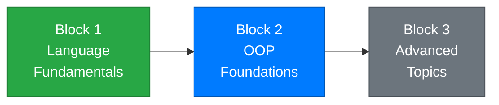

# Week 7 – Introduction to Classes and Objects

[← Back to Course Home](../../README.md)

---

## 📋 Overview

Welcome to **Block 2: OOP Foundations** — a turning point in this course. Until now, you've stored data in variables and organized logic into methods. That works well for small programs, but as programs grow, you need a better way to **bundle related data and behavior together**. That's exactly what classes and objects do.

Think of it this way: in previous weeks, you had separate variables for a student's name, age, and grade — and separate methods to work with them. This week, you'll learn to create a `Student` **class** that keeps all of that together in one neat package. This is the foundation of **Object-Oriented Programming (OOP)**, and it's how professional software is built.

---

## 🎯 Learning Objectives

By the end of this week, you will be able to:

1. Explain what OOP is and why it's used in modern software development
2. Understand the difference between a **class** (blueprint) and an **object** (instance)
3. Define classes with **fields** and **properties**
4. Create objects using the `new` keyword
5. Write **constructors** (default and parameterized) to initialize objects
6. Use the `this` keyword to refer to the current object
7. Use **auto-implemented properties** as a shorthand
8. Organize a project with multiple classes

---

## 📚 Materials

| # | Material | Topic |
|---|----------|-------|
| 1 | [Lecture 1 – What is OOP? Classes vs Objects](./lecture-1.md) | OOP concepts, defining your first class, fields, creating objects |
| 2 | [Lecture 2 – Properties and Constructors](./lecture-2.md) | Properties (get/set), auto-properties, default and parameterized constructors |
| 3 | [Lecture 3 – The `this` Keyword, Overloading Constructors, and Multi-Class Projects](./lecture-3.md) | `this` keyword, constructor overloading, organizing classes in a project |
| 4 | [Exercises](./exercises.md) | Practice problems for each lecture |
| 5 | [Assignment](./assignment.md) | 📝 Contact Manager — mini-project |

---

## 🗺️ Where Are We?



```
✅ Week 1 – Getting Started          ✅ Week 5 – Methods
✅ Week 2 – Variables & Types         ✅ Week 6 – Arrays & Collections
✅ Week 3 – Conditionals              👉 Week 7 – Classes & Objects ← YOU ARE HERE
✅ Week 4 – Loops                     ⬜ Week 8 – Encapsulation
```

---

## 🔗 Prerequisites

Before starting this week, make sure you're comfortable with:

- **Variables and data types** (Week 2) — you'll use these as fields and properties
- **Methods** (Week 5) — classes contain methods; you need to know parameters, return types, and overloading
- **Arrays and Lists** (Week 6) — you'll store objects in collections

---

## ✅ Week Checklist

- [ ] Complete Lecture 1 — understand classes vs objects, create your first class
- [ ] Complete Lecture 2 — use properties, write constructors
- [ ] Complete Lecture 3 — use `this`, overload constructors, work with multiple classes
- [ ] Work through the practice exercises
- [ ] Complete the **Contact Manager** assignment

---

[← Week 6: Arrays & Collections](../week-06/README.md) | [Week 8: Encapsulation & Behavior →](../week-08/README.md)
