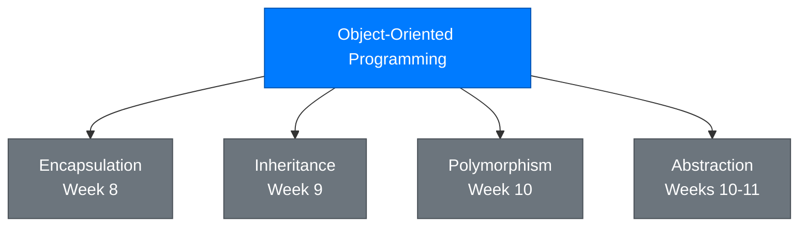
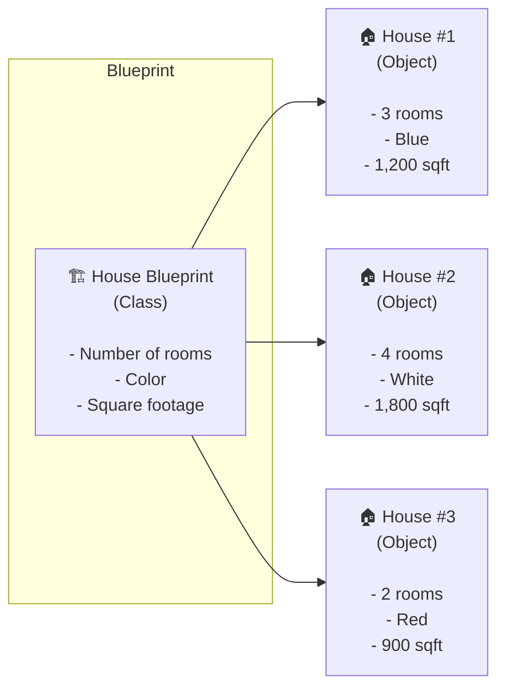
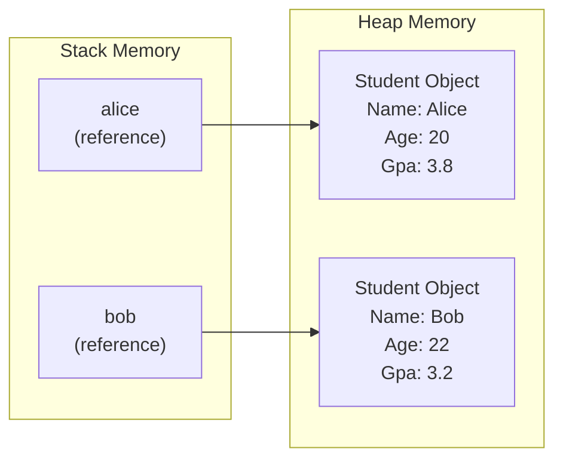
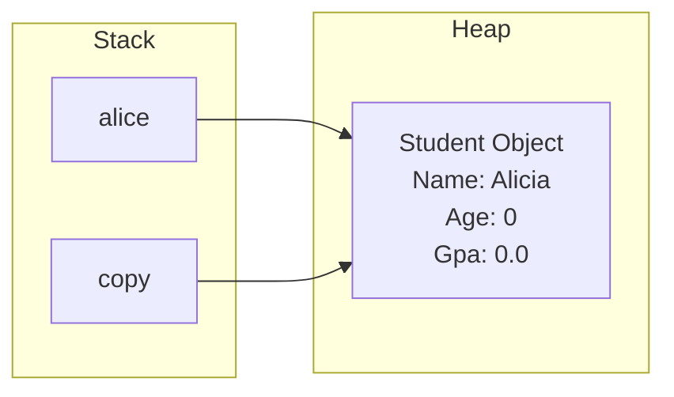

# Lecture 1: What is OOP? Classes vs Objects

[Back to Week 7 Overview](./README.md) | [Next: Lecture 2 – Properties and Constructors →](./lecture-2.md)

---

## Lecture Overview

| Item | Detail |
|------|--------|
| Duration | 45 minutes |
| Topics | What is OOP, classes vs objects, defining a class, fields, creating objects with `new` |
| Preparation | Comfortable with variables, methods, and arrays from Weeks 1–6 |

---

## 1. The Problem: Data Is Scattered Everywhere

Let's say you're building a program that manages students. With what you know so far, you might write something like this:

```csharp
// Student 1
string student1Name = "Alice";
int student1Age = 20;
double student1Gpa = 3.8;

// Student 2
string student2Name = "Bob";
int student2Age = 22;
double student2Gpa = 3.2;

// A method that works with student data
void PrintStudent(string name, int age, double gpa)
{
    Console.WriteLine($"{name}, Age: {age}, GPA: {gpa}");
}

PrintStudent(student1Name, student1Age, student1Gpa);
PrintStudent(student2Name, student2Age, student2Gpa);
```

This works, but it has problems:

- **No grouping** — the name, age, and GPA are separate variables with no formal connection
- **Easy to mix up** — nothing stops you from passing `student1Name` with `student2Age`
- **Doesn't scale** — what happens when you have 50 students? 200?
- **No protection** — anyone can set a GPA to -999.0 and nothing complains

> 💡 **The core insight:** We need a way to **bundle related data together** and **attach behavior to it**. That's exactly what OOP provides.

---

## 2. What is Object-Oriented Programming (OOP)?

**Object-Oriented Programming** is a way of organizing code around **objects** — things that combine **data** (what they know) and **behavior** (what they can do).

Instead of having scattered variables and separate functions, OOP lets you create **blueprints** for things in your program, then create **instances** of those blueprints.

### The Four Pillars of OOP

OOP is built on four key principles. We'll learn them one at a time over the coming weeks:



This week, we focus on the most fundamental concept: **classes and objects**.

---

## 3. Classes vs Objects: The Blueprint Analogy

The relationship between a class and an object is like the relationship between a **blueprint** and a **house**:



| Concept | Blueprint Analogy | Programming |
|---------|-------------------|-------------|
| **Class** | The architectural blueprint | A definition of what data and behavior a thing has |
| **Object** | An actual house built from the blueprint | A specific instance created from the class |
| **Fields** | The blanks on the blueprint (rooms: ___, color: ___) | Variables inside the class |

Key differences:
- A **class** is a *definition* — it describes *what* a student has (name, age, GPA) but doesn't contain actual values
- An **object** is an *instance* — it's a specific student with actual values ("Alice", 20, 3.8)
- You write the class **once** but can create **many** objects from it

---

## 4. Defining Your First Class

Let's create a `Student` class. In C#, a class definition looks like this:

```csharp
class Student
{
    // Fields — the data each Student object will hold
    public string Name;
    public int Age;
    public double Gpa;
}
```

That's it! You've defined a blueprint. Let's break it down:

| Part | Meaning |
|------|---------|
| `class` | Keyword that starts a class definition |
| `Student` | The name of the class (PascalCase by convention) |
| `{ }` | The body of the class — everything inside belongs to `Student` |
| `public` | Access modifier — means "anyone can access this" (more on this in Week 8) |
| `string Name;` | A **field** — a variable that belongs to each `Student` object |

### Naming Conventions

| Thing | Convention | Example |
|-------|-----------|---------|
| Class names | PascalCase | `Student`, `BankAccount`, `ShoppingCart` |
| Field names | camelCase (or PascalCase for public) | `name`, `balance`, `Name`, `Balance` |
| Method names | PascalCase | `PrintInfo()`, `CalculateGpa()` |

> ⚠️ **Note:** Using `public` fields directly (like `public string Name;`) is fine for learning, but in professional code, we use **properties** instead. We'll cover that in Lecture 2.

---

## 5. Creating Objects with `new`

A class by itself doesn't do anything — it's just a blueprint. To use it, you need to create an **object** (also called an **instance**):

```csharp
Student alice = new Student();
```

Let's break this down:

```
Student alice = new Student();
───┬─── ──┬── ─── ───┬──────
   │      │    │      │
   │      │    │      └── Calls the constructor (creates the object)
   │      │    └── Keyword that allocates memory for the object
   │      └── Variable name (reference to the object)
   └── The type (which class this object is)
```

### Setting Field Values

Once you've created an object, you access its fields using the **dot operator** (`.`):

```csharp
Student alice = new Student();
alice.Name = "Alice";
alice.Age = 20;
alice.Gpa = 3.8;

Console.WriteLine($"Name: {alice.Name}");
Console.WriteLine($"Age: {alice.Age}");
Console.WriteLine($"GPA: {alice.Gpa}");
```

**Output:**
```
Name: Alice
Age: 20
GPA: 3.8
```

### Creating Multiple Objects

The power of classes is that you can create as many objects as you need from the same blueprint:

```csharp
Student alice = new Student();
alice.Name = "Alice";
alice.Age = 20;
alice.Gpa = 3.8;

Student bob = new Student();
bob.Name = "Bob";
bob.Age = 22;
bob.Gpa = 3.2;

Student charlie = new Student();
charlie.Name = "Charlie";
charlie.Age = 19;
charlie.Gpa = 3.9;

Console.WriteLine($"{alice.Name}: GPA {alice.Gpa}");
Console.WriteLine($"{bob.Name}: GPA {bob.Gpa}");
Console.WriteLine($"{charlie.Name}: GPA {charlie.Gpa}");
```

**Output:**
```
Alice: GPA 3.8
Bob: GPA 3.2
Charlie: GPA 3.9
```

---

## 6. Objects in Memory

When you create an object with `new`, C# allocates space in memory for it. The variable you create is a **reference** (a pointer) to that memory location:



This is different from simple variables like `int` or `double`, which store their value directly. Objects are **reference types** — the variable holds a reference to where the object lives in memory.

### What Happens with Assignment?

When you assign one object variable to another, you copy the **reference**, not the object:

```csharp
Student alice = new Student();
alice.Name = "Alice";

Student copy = alice;  // copy now points to the SAME object
copy.Name = "Alicia";  // This changes the original too!

Console.WriteLine(alice.Name);  // Output: Alicia
```

> ⚠️ **Important:** Both `alice` and `copy` point to the same object in memory. Changing one affects the other. This is a common source of bugs for beginners.



---

## 7. Default Values

When you create an object with `new Student()`, all fields start with **default values**:

| Type | Default Value |
|------|---------------|
| `int`, `double`, `float` | `0` / `0.0` |
| `bool` | `false` |
| `string` | `null` (no value) |
| `char` | `'\0'` (null character) |

```csharp
Student empty = new Student();
Console.WriteLine(empty.Name);  // Output: (nothing — null)
Console.WriteLine(empty.Age);   // Output: 0
Console.WriteLine(empty.Gpa);   // Output: 0
```

---

## 8. Adding Methods to a Class

Classes aren't just about data — they can also have **methods** (behavior). Let's add a method to our `Student` class:

```csharp
class Student
{
    public string Name;
    public int Age;
    public double Gpa;

    public void PrintInfo()
    {
        Console.WriteLine($"Student: {Name}, Age: {Age}, GPA: {Gpa}");
    }

    public bool IsHonorRoll()
    {
        return Gpa >= 3.5;
    }
}
```

Now each student object can describe itself and answer questions:

```csharp
Student alice = new Student();
alice.Name = "Alice";
alice.Age = 20;
alice.Gpa = 3.8;

alice.PrintInfo();
// Output: Student: Alice, Age: 20, GPA: 3.8

if (alice.IsHonorRoll())
{
    Console.WriteLine($"{alice.Name} is on the honor roll! 🎉");
}
// Output: Alice is on the honor roll! 🎉
```

Notice how `PrintInfo()` uses `Name`, `Age`, and `Gpa` directly — when a method is inside a class, it can access all the fields of that class without needing them as parameters.

> 💡 **Key insight:** The method `PrintInfo()` doesn't need parameters like `PrintStudent(string name, int age, double gpa)` did in our old code. The data lives *inside* the object, so the method already has access to it. This is the power of bundling data and behavior together.

---

## 9. A Complete Example: Book Class

Let's put everything together with a different example:

```csharp
class Book
{
    public string Title;
    public string Author;
    public int Pages;
    public double Price;

    public void DisplayInfo()
    {
        Console.WriteLine($"\"{Title}\" by {Author}");
        Console.WriteLine($"  Pages: {Pages}, Price: {Price:C}");
    }

    public bool IsLongBook()
    {
        return Pages > 300;
    }
}
```

Using it in the main program:

```csharp
Book book1 = new Book();
book1.Title = "Clean Code";
book1.Author = "Robert C. Martin";
book1.Pages = 464;
book1.Price = 39.99;

Book book2 = new Book();
book2.Title = "The Pragmatic Programmer";
book2.Author = "David Thomas & Andrew Hunt";
book2.Pages = 352;
book2.Price = 49.99;

book1.DisplayInfo();
Console.WriteLine(book1.IsLongBook() ? "  📚 This is a long book" : "  📖 Quick read");

Console.WriteLine();

book2.DisplayInfo();
Console.WriteLine(book2.IsLongBook() ? "  📚 This is a long book" : "  📖 Quick read");
```

**Output:**
```
"Clean Code" by Robert C. Martin
  Pages: 464, Price: $39.99
  📚 This is a long book

"The Pragmatic Programmer" by David Thomas & Andrew Hunt
  Pages: 352, Price: $49.99
  📚 This is a long book
```

---

## 10. Storing Objects in Collections

Since objects are just like any other type, you can store them in arrays and lists (from Week 6):

```csharp
// Array of students
Student[] students = new Student[3];

students[0] = new Student();
students[0].Name = "Alice";
students[0].Gpa = 3.8;

students[1] = new Student();
students[1].Name = "Bob";
students[1].Gpa = 3.2;

students[2] = new Student();
students[2].Name = "Charlie";
students[2].Gpa = 3.9;

// Loop through and display
foreach (Student s in students)
{
    s.PrintInfo();
}
```

Or using a `List<T>`:

```csharp
List<Student> roster = new List<Student>();

Student s1 = new Student();
s1.Name = "Alice";
s1.Gpa = 3.8;
roster.Add(s1);

Student s2 = new Student();
s2.Name = "Bob";
s2.Gpa = 3.2;
roster.Add(s2);

Console.WriteLine($"Total students: {roster.Count}");
foreach (Student s in roster)
{
    s.PrintInfo();
}
```

> 💡 This is how real applications work — a school system doesn't have `student1Name`, `student2Name`, etc. It has a `List<Student>` with hundreds or thousands of student objects.

---

## Key Takeaways

- **OOP** organizes code around objects that bundle data and behavior together
- A **class** is a blueprint; an **object** is a specific instance created from that blueprint
- Use the `new` keyword to create objects: `Student alice = new Student();`
- Access fields and methods with the **dot operator**: `alice.Name`, `alice.PrintInfo()`
- Objects are **reference types** — assigning one variable to another copies the reference, not the object
- Fields get **default values** when an object is created (`0`, `false`, `null`)
- Methods inside a class can access the class's fields directly
- Objects can be stored in arrays and lists just like any other type

---

## Hands-On Exercises

### Exercise 1 — Car Class
Define a `Car` class with fields: `Make` (string), `Model` (string), `Year` (int), `Mileage` (double). Add a `DisplayInfo()` method. Create two car objects and display their info.

### Exercise 2 — Reference Test
Predict the output before running:
```csharp
Student a = new Student();
a.Name = "Alice";
a.Age = 20;

Student b = a;
b.Name = "Bob";

Console.WriteLine(a.Name);
Console.WriteLine(b.Name);
```

### Exercise 3 — Product List
Create a `Product` class with `Name`, `Price`, and `Quantity` fields. Add a `GetTotalValue()` method that returns `Price * Quantity`. Create a list of 3 products and print the total value of all inventory.

---

[Back to Week 7 Overview](./README.md) | [Next: Lecture 2 – Properties and Constructors →](./lecture-2.md)
