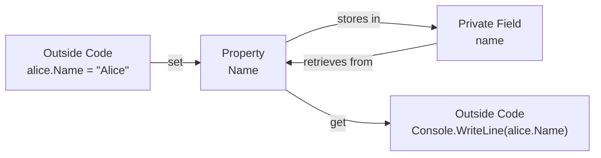

# Lecture 2: Properties and Constructors

[← Previous: Lecture 1 – What is OOP? Classes vs Objects](./lecture-1.md) | [Back to Week 7 Overview](./README.md) | [Next: Lecture 3 – `this`, Constructor Overloading, Multi-Class Projects →](./lecture-3.md)

---

## Lecture Overview

| Item | Detail |
|------|--------|
| Duration | 45 minutes |
| Topics | Properties (get/set), auto-implemented properties, default constructors, parameterized constructors |
| Preparation | Completed Lecture 1 — comfortable creating classes with fields and objects with `new` |

---

## 1. The Problem with Public Fields

In Lecture 1, we used public fields:

```csharp
class Student
{
    public string Name;
    public int Age;
    public double Gpa;
}
```

This works, but there's no **protection**. Anyone can set invalid values:

```csharp
Student s = new Student();
s.Age = -5;       // Negative age? No error!
s.Gpa = 99.9;     // GPA of 99.9? No error!
s.Name = "";       // Empty name? No error!
```

In real applications, you want to **control** how data gets set. That's where **properties** come in.

---

## 2. Properties: The Gatekeepers

A **property** looks like a field from the outside but has built-in **get** and **set** methods that control how data is read and written:

```csharp
class Student
{
    private string name;     // Private field — hidden from outside

    public string Name       // Public property — controlled access
    {
        get { return name; }             // What happens when you READ
        set { name = value; }            // What happens when you WRITE
    }
}
```



### Using the Property

From the outside, a property looks exactly like a field:

```csharp
Student alice = new Student();
alice.Name = "Alice";              // This calls the SET accessor
Console.WriteLine(alice.Name);      // This calls the GET accessor
```

The magic keyword `value` inside `set` represents whatever value is being assigned.

### Adding Validation

The real power of properties is that you can add **validation logic** in the setter:

```csharp
class Student
{
    private string name;
    private int age;
    private double gpa;

    public string Name
    {
        get { return name; }
        set
        {
            if (string.IsNullOrWhiteSpace(value))
            {
                Console.WriteLine("Warning: Name cannot be empty. Setting to 'Unknown'.");
                name = "Unknown";
            }
            else
            {
                name = value;
            }
        }
    }

    public int Age
    {
        get { return age; }
        set
        {
            if (value < 0 || value > 120)
            {
                Console.WriteLine($"Warning: Age {value} is invalid. Setting to 0.");
                age = 0;
            }
            else
            {
                age = value;
            }
        }
    }

    public double Gpa
    {
        get { return gpa; }
        set
        {
            if (value < 0.0 || value > 4.0)
            {
                Console.WriteLine($"Warning: GPA {value} is out of range. Setting to 0.0.");
                gpa = 0.0;
            }
            else
            {
                gpa = value;
            }
        }
    }
}
```

Now invalid values are caught:

```csharp
Student s = new Student();
s.Name = "";        // Warning: Name cannot be empty. Setting to 'Unknown'.
s.Age = -5;         // Warning: Age -5 is invalid. Setting to 0.
s.Gpa = 99.9;       // Warning: GPA 99.9 is out of range. Setting to 0.0.

Console.WriteLine(s.Name);  // Unknown
Console.WriteLine(s.Age);   // 0
Console.WriteLine(s.Gpa);   // 0
```

> 💡 **This is the beginning of encapsulation** — one of the four pillars of OOP. We'll explore it deeply in Week 8. For now, just understand that properties let you protect your data.

---

## 3. Auto-Implemented Properties

Writing the full get/set with a backing field every time is verbose. If you don't need any validation logic, C# offers a shorthand called **auto-implemented properties**:

```csharp
class Student
{
    public string Name { get; set; }
    public int Age { get; set; }
    public double Gpa { get; set; }
}
```

This is **equivalent** to writing a private field with a simple get/set property — C# creates the hidden backing field for you behind the scenes.

### Comparison

```csharp
// Full property (when you need validation)
private string name;
public string Name
{
    get { return name; }
    set { name = value; }
}

// Auto-implemented property (when you don't need validation)
public string Name { get; set; }
```

### When to Use Which?

| Scenario | Use |
|----------|-----|
| Simple data storage, no validation needed | Auto-implemented property |
| Need to validate or transform data on set | Full property with backing field |
| Need to compute a value on get | Full property with custom get |
| Read-only from outside the class | `public string Name { get; private set; }` |

### Read-Only Properties

You can make a property that can only be set from inside the class:

```csharp
class Student
{
    public string Name { get; set; }
    public int Age { get; set; }
    public double Gpa { get; private set; }  // Can only be set inside the class

    public void UpdateGpa(double newGpa)
    {
        if (newGpa >= 0.0 && newGpa <= 4.0)
        {
            Gpa = newGpa;  // This works — we're inside the class
        }
    }
}

// In Main:
Student s = new Student();
s.Name = "Alice";          // Works
// s.Gpa = 3.8;            // ERROR — can't set from outside
s.UpdateGpa(3.8);           // Works — goes through the method
```

---

## 4. Constructors: Initializing Objects

Right now, creating and setting up a student takes multiple lines:

```csharp
Student alice = new Student();
alice.Name = "Alice";
alice.Age = 20;
alice.Gpa = 3.8;
```

A **constructor** is a special method that runs when an object is created with `new`. It lets you set up the object in one step.

### The Default Constructor

Every class automatically has a **default constructor** (also called a parameterless constructor) — that's what `new Student()` calls. It sets all fields/properties to their default values.

You can write it explicitly if you want to set specific defaults:

```csharp
class Student
{
    public string Name { get; set; }
    public int Age { get; set; }
    public double Gpa { get; set; }

    // Default constructor
    public Student()
    {
        Name = "Unknown";
        Age = 18;
        Gpa = 0.0;
    }
}
```

```csharp
Student s = new Student();
Console.WriteLine(s.Name);  // Unknown
Console.WriteLine(s.Age);   // 18
Console.WriteLine(s.Gpa);   // 0
```

### The Parameterized Constructor

A **parameterized constructor** accepts values when the object is created:

```csharp
class Student
{
    public string Name { get; set; }
    public int Age { get; set; }
    public double Gpa { get; set; }

    // Parameterized constructor
    public Student(string name, int age, double gpa)
    {
        Name = name;
        Age = age;
        Gpa = gpa;
    }
}
```

Now you can create a fully initialized student in one line:

```csharp
Student alice = new Student("Alice", 20, 3.8);
Student bob = new Student("Bob", 22, 3.2);

Console.WriteLine($"{alice.Name}: GPA {alice.Gpa}");
Console.WriteLine($"{bob.Name}: GPA {bob.Gpa}");
```

**Output:**
```
Alice: GPA 3.8
Bob: GPA 3.2
```

Much cleaner than setting each property separately!

### Constructor Rules

| Rule | Details |
|------|---------|
| Same name as the class | `public Student(...)` for a `Student` class |
| No return type | Not even `void` — constructors never return anything |
| Called automatically with `new` | You never call a constructor directly |
| Can have parameters | Just like a method |
| If you write a parameterized constructor, the default one disappears | Unless you explicitly add it back |

### ⚠️ The "Disappearing Default Constructor" Gotcha

This is a common trap for beginners:

```csharp
class Student
{
    public string Name { get; set; }
    public int Age { get; set; }

    // Parameterized constructor
    public Student(string name, int age)
    {
        Name = name;
        Age = age;
    }
}

// This now FAILS:
Student s = new Student();  // ERROR! No parameterless constructor exists
```

If you want **both** constructors, you must write them both:

```csharp
class Student
{
    public string Name { get; set; }
    public int Age { get; set; }

    // Default constructor
    public Student()
    {
        Name = "Unknown";
        Age = 18;
    }

    // Parameterized constructor
    public Student(string name, int age)
    {
        Name = name;
        Age = age;
    }
}

// Now both work:
Student s1 = new Student();                // Uses default constructor
Student s2 = new Student("Alice", 20);     // Uses parameterized constructor
```

---

## 5. Constructor with Validation

You can add validation inside constructors, just like in property setters:

```csharp
class BankAccount
{
    public string Owner { get; set; }
    public double Balance { get; private set; }

    public BankAccount(string owner, double initialBalance)
    {
        Owner = owner;

        if (initialBalance < 0)
        {
            Console.WriteLine("Warning: Initial balance cannot be negative. Setting to 0.");
            Balance = 0;
        }
        else
        {
            Balance = initialBalance;
        }
    }
}
```

```csharp
BankAccount acc1 = new BankAccount("Alice", 1000);
BankAccount acc2 = new BankAccount("Bob", -500);
// Warning: Initial balance cannot be negative. Setting to 0.

Console.WriteLine($"{acc1.Owner}: {acc1.Balance:C}");  // Alice: $1,000.00
Console.WriteLine($"{acc2.Owner}: {acc2.Balance:C}");   // Bob: $0.00
```

---

## 6. Object Initializer Syntax

C# provides another way to set properties when creating an object — the **object initializer syntax**:

```csharp
Student alice = new Student
{
    Name = "Alice",
    Age = 20,
    Gpa = 3.8
};
```

This calls the default constructor first, then sets each property. It's equivalent to:

```csharp
Student alice = new Student();
alice.Name = "Alice";
alice.Age = 20;
alice.Gpa = 3.8;
```

You can also combine it with a parameterized constructor:

```csharp
Student alice = new Student("Alice", 20) { Gpa = 3.8 };
```

> 💡 Object initializer syntax is especially handy when a class has many optional properties that you don't want to put in the constructor.

---

## 7. Complete Example: Product Class

```csharp
class Product
{
    public string Name { get; set; }
    public double Price { get; set; }
    public int Stock { get; set; }

    // Default constructor
    public Product()
    {
        Name = "Unnamed Product";
        Price = 0.0;
        Stock = 0;
    }

    // Parameterized constructor
    public Product(string name, double price, int stock)
    {
        Name = name;
        Price = price;
        Stock = stock;
    }

    public double GetInventoryValue()
    {
        return Price * Stock;
    }

    public void DisplayInfo()
    {
        Console.WriteLine($"{Name} — {Price:C} (Stock: {Stock})");
        Console.WriteLine($"  Inventory Value: {GetInventoryValue():C}");
    }
}
```

Using it:

```csharp
Product p1 = new Product("Keyboard", 49.99, 150);
Product p2 = new Product("Mouse", 29.99, 200);
Product p3 = new Product();  // Unnamed Product, $0.00, Stock: 0

p1.DisplayInfo();
p2.DisplayInfo();
p3.DisplayInfo();

Console.WriteLine();

double totalValue = p1.GetInventoryValue() + p2.GetInventoryValue();
Console.WriteLine($"Total inventory value: {totalValue:C}");
```

**Output:**
```
Keyboard — $49.99 (Stock: 150)
  Inventory Value: $7,498.50
Mouse — $29.99 (Stock: 200)
  Inventory Value: $5,998.00
Unnamed Product — $0.00 (Stock: 0)
  Inventory Value: $0.00

Total inventory value: $13,496.50
```

---

## Key Takeaways

- **Properties** provide controlled access to data with `get` and `set` accessors
- **Auto-implemented properties** (`public string Name { get; set; }`) are a shorthand for simple properties
- Use full properties with backing fields when you need **validation logic**
- `private set` makes a property read-only from outside the class
- A **constructor** is a special method that initializes an object when created with `new`
- A **default constructor** takes no parameters; a **parameterized constructor** takes values
- If you write any parameterized constructor, the automatic default constructor disappears — add it back explicitly if needed
- **Object initializer syntax** (`new Student { Name = "Alice" }`) is a convenient alternative for setting properties

---

## Hands-On Exercises

### Exercise 1 — Rectangle with Properties
Create a `Rectangle` class with `Width` and `Height` auto-properties. Add a parameterized constructor and methods `GetArea()` and `GetPerimeter()`. Create two rectangles and display their areas and perimeters.

### Exercise 2 — Validated Temperature
Create a `Temperature` class with a `Celsius` property that validates the value (must be ≥ -273.15, absolute zero). Add a read-only property `Fahrenheit` that converts on the fly: `get { return Celsius * 9.0 / 5.0 + 32; }`. Test with valid and invalid temperatures.

### Exercise 3 — Constructor Gotcha
What happens if you try to compile this code? Explain why.
```csharp
class Dog
{
    public string Name { get; set; }
    public string Breed { get; set; }

    public Dog(string name, string breed)
    {
        Name = name;
        Breed = breed;
    }
}

// In Main:
Dog d = new Dog();
```

---

[← Previous: Lecture 1 – What is OOP? Classes vs Objects](./lecture-1.md) | [Back to Week 7 Overview](./README.md) | [Next: Lecture 3 – `this`, Constructor Overloading, Multi-Class Projects →](./lecture-3.md)
