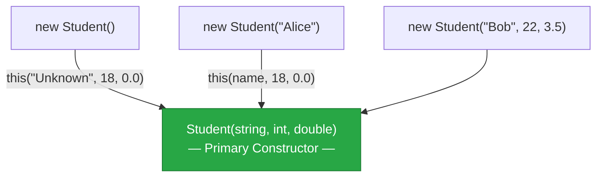
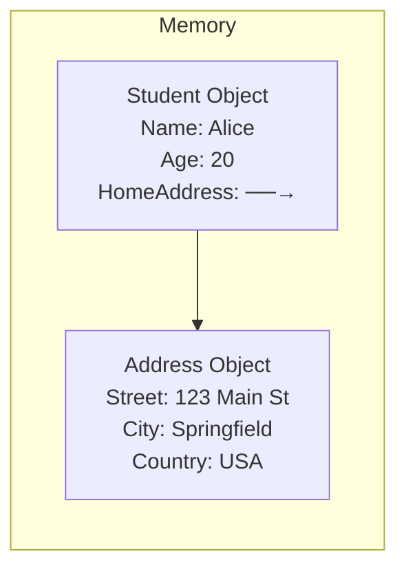

# Lecture 3: The `this` Keyword, Constructor Overloading, and Multi-Class Projects

[← Previous: Lecture 2 – Properties and Constructors](./lecture-2.md) | [Back to Week 7 Overview](./README.md)

---

## Lecture Overview

| Item | Detail |
|------|--------|
| Duration | 45 minutes |
| Topics | The `this` keyword, constructor overloading, constructor chaining, organizing multiple classes in a project |
| Preparation | Completed Lectures 1 & 2 — can create classes with properties and constructors |

---

## 1. The `this` Keyword

The `this` keyword refers to **the current object** — the specific instance that's running the code. It's most commonly used in two situations.

### Situation 1: Resolving Name Conflicts

When a constructor parameter has the same name as a property or field, `this` clarifies which is which:

```csharp
class Student
{
    public string Name { get; set; }
    public int Age { get; set; }

    public Student(string name, int age)
    {
        this.Name = name;   // this.Name = the property, name = the parameter
        this.Age = age;     // this.Age = the property, age = the parameter
    }
}
```

Without `this`, C# would see `name = name` and think you're assigning the parameter to itself — a useless operation.

> 💡 **Common convention:** Many C# developers name parameters with lowercase and properties with PascalCase. When the names match exactly, `this` resolves the ambiguity.

### Situation 2: Passing the Current Object

Sometimes a method needs to pass the current object to another method or return it:

```csharp
class Student
{
    public string Name { get; set; }
    public int Age { get; set; }

    public void PrintInfo()
    {
        Console.WriteLine($"Name: {this.Name}, Age: {this.Age}");
        // "this" is optional here since there's no ambiguity
        // Same as: Console.WriteLine($"Name: {Name}, Age: {Age}");
    }
}
```

### When is `this` Optional?

| Situation | `this` Required? |
|-----------|-----------------|
| Parameter name matches property name | ✅ Yes — needed to resolve ambiguity |
| Accessing property/field with no name conflict | ❌ Optional — but some developers prefer it for clarity |
| Passing the current object to another method | ✅ Yes — `SomeMethod(this)` |

> 💡 **Style tip:** Using `this` even when optional can make your code more readable by explicitly showing "this is a member of the class, not a local variable." Some teams require it; others don't. Both are valid.

---

## 2. Constructor Overloading

Just like methods (Week 5), constructors can be **overloaded** — you can have multiple constructors with different parameter lists:

```csharp
class Student
{
    public string Name { get; set; }
    public int Age { get; set; }
    public double Gpa { get; set; }

    // Constructor 1: No parameters (default)
    public Student()
    {
        Name = "Unknown";
        Age = 18;
        Gpa = 0.0;
    }

    // Constructor 2: Name only
    public Student(string name)
    {
        Name = name;
        Age = 18;
        Gpa = 0.0;
    }

    // Constructor 3: All parameters
    public Student(string name, int age, double gpa)
    {
        Name = name;
        Age = age;
        Gpa = gpa;
    }
}
```

Each `new` call uses the constructor that matches the arguments:

```csharp
Student s1 = new Student();                     // Constructor 1
Student s2 = new Student("Alice");              // Constructor 2
Student s3 = new Student("Bob", 22, 3.5);       // Constructor 3

Console.WriteLine($"{s1.Name}, {s1.Age}, {s1.Gpa}");  // Unknown, 18, 0
Console.WriteLine($"{s2.Name}, {s2.Age}, {s2.Gpa}");  // Alice, 18, 0
Console.WriteLine($"{s3.Name}, {s3.Age}, {s3.Gpa}");  // Bob, 22, 3.5
```

---

## 3. Constructor Chaining with `this()`

Notice the problem with the constructors above — we're repeating the default values (`Age = 18`, `Gpa = 0.0`) in multiple places. If we need to change a default, we'd have to change it everywhere.

**Constructor chaining** solves this by having one constructor call another using `: this(...)`:

```csharp
class Student
{
    public string Name { get; set; }
    public int Age { get; set; }
    public double Gpa { get; set; }

    // "Primary" constructor — does all the actual work
    public Student(string name, int age, double gpa)
    {
        Name = name;
        Age = age;
        Gpa = gpa;
    }

    // Chains to the primary constructor with default values
    public Student() : this("Unknown", 18, 0.0)
    {
    }

    // Chains to the primary constructor with default age and GPA
    public Student(string name) : this(name, 18, 0.0)
    {
    }
}
```



Now the initialization logic lives in **one place**. If you need to change the default age from 18 to 17, you only change it in the chaining calls.

### How Constructor Chaining Executes

When you write `new Student("Alice")`:
1. C# sees the `Student(string name)` constructor
2. Before running its body, it calls `this(name, 18, 0.0)` → which is `Student(string, int, double)`
3. The primary constructor runs first: sets `Name = "Alice"`, `Age = 18`, `Gpa = 0.0`
4. Then the chaining constructor's body runs (empty in this case, but could add more logic)

---

## 4. Working with Multiple Classes in One Project

So far, all our examples have had just one class plus the main program. Real programs have **many classes**. Let's see how to organize them.

### Option 1: Multiple Classes in One File

For small programs, you can put multiple classes in the same file:

```csharp
// Program.cs

// --- Main Program ---
Student alice = new Student("Alice", 20, 3.8);
Course csharp = new Course("Intro to C#", "CS101");

csharp.DisplayInfo();
Console.WriteLine($"Student: {alice.Name}");

// --- Student Class ---
class Student
{
    public string Name { get; set; }
    public int Age { get; set; }
    public double Gpa { get; set; }

    public Student(string name, int age, double gpa)
    {
        Name = name;
        Age = age;
        Gpa = gpa;
    }
}

// --- Course Class ---
class Course
{
    public string Title { get; set; }
    public string Code { get; set; }

    public Course(string title, string code)
    {
        Title = title;
        Code = code;
    }

    public void DisplayInfo()
    {
        Console.WriteLine($"[{Code}] {Title}");
    }
}
```

### Option 2: One Class Per File (Recommended)

For any project with more than 2-3 classes, put each class in its own file. This is the **industry standard** and makes code much easier to find and maintain.

```
MyProject/
├── Program.cs          ← Main program (entry point)
├── Student.cs          ← Student class
├── Course.cs           ← Course class
└── MyProject.csproj    ← Project file
```

**Student.cs:**
```csharp
class Student
{
    public string Name { get; set; }
    public int Age { get; set; }
    public double Gpa { get; set; }

    public Student(string name, int age, double gpa)
    {
        Name = name;
        Age = age;
        Gpa = gpa;
    }

    public void PrintInfo()
    {
        Console.WriteLine($"{Name}, Age: {Age}, GPA: {Gpa}");
    }
}
```

**Course.cs:**
```csharp
class Course
{
    public string Title { get; set; }
    public string Code { get; set; }

    public Course(string title, string code)
    {
        Title = title;
        Code = code;
    }

    public void DisplayInfo()
    {
        Console.WriteLine($"[{Code}] {Title}");
    }
}
```

**Program.cs:**
```csharp
Student alice = new Student("Alice", 20, 3.8);
Course csharp = new Course("Intro to C#", "CS101");

alice.PrintInfo();
csharp.DisplayInfo();
```

> 💡 **How does this work?** All `.cs` files in the same project are compiled together automatically. You don't need `import` or `include` statements — C# finds all classes in the project.

### Creating a New Class File in Visual Studio

1. Right-click on the project in **Solution Explorer**
2. Select **Add → Class...**
3. Enter the class name (e.g., `Student.cs`)
4. Click **Add**

Visual Studio creates a file with a starter template:

```csharp
namespace MyProject
{
    internal class Student
    {
    }
}
```

> You can simplify this by removing the `namespace` wrapper for now and using `class` directly. We'll discuss namespaces in a later course.

---

## 5. Objects Using Other Objects

One of the most powerful aspects of OOP is having objects **interact with each other**. A class can have properties whose types are other classes:

```csharp
class Address
{
    public string Street { get; set; }
    public string City { get; set; }
    public string Country { get; set; }

    public Address(string street, string city, string country)
    {
        Street = street;
        City = city;
        Country = country;
    }

    public string GetFullAddress()
    {
        return $"{Street}, {City}, {Country}";
    }
}

class Student
{
    public string Name { get; set; }
    public int Age { get; set; }
    public Address HomeAddress { get; set; }  // An object inside another object!

    public Student(string name, int age, Address address)
    {
        Name = name;
        Age = age;
        HomeAddress = address;
    }

    public void PrintInfo()
    {
        Console.WriteLine($"{Name}, Age: {Age}");
        Console.WriteLine($"  Address: {HomeAddress.GetFullAddress()}");
    }
}
```

Using it:

```csharp
Address addr = new Address("123 Main St", "Springfield", "USA");
Student alice = new Student("Alice", 20, addr);

alice.PrintInfo();
```

**Output:**
```
Alice, Age: 20
  Address: 123 Main St, Springfield, USA
```



> 💡 This is called **composition** — a Student "has an" Address. We'll explore this pattern more in Week 11.

---

## 6. Complete Example: Library System

Let's put everything together in a mini library system:

```csharp
// --- Book Class ---
class Book
{
    public string Title { get; set; }
    public string Author { get; set; }
    public int Pages { get; set; }
    public bool IsAvailable { get; set; }

    public Book(string title, string author, int pages)
    {
        Title = title;
        Author = author;
        Pages = pages;
        IsAvailable = true;  // New books start as available
    }

    public Book() : this("Untitled", "Unknown", 0)
    {
    }

    public void DisplayInfo()
    {
        string status = IsAvailable ? "Available ✅" : "Checked Out ❌";
        Console.WriteLine($"  \"{Title}\" by {Author} ({Pages} pages) — {status}");
    }
}

// --- Library Class ---
class Library
{
    public string Name { get; set; }
    public List<Book> Books { get; set; }

    public Library(string name)
    {
        Name = name;
        Books = new List<Book>();
    }

    public void AddBook(Book book)
    {
        Books.Add(book);
        Console.WriteLine($"Added \"{book.Title}\" to {Name}.");
    }

    public void DisplayCatalog()
    {
        Console.WriteLine($"\n📚 {Name} — Catalog ({Books.Count} books):");
        Console.WriteLine(new string('-', 50));
        foreach (Book book in Books)
        {
            book.DisplayInfo();
        }
    }

    public int CountAvailable()
    {
        int count = 0;
        foreach (Book book in Books)
        {
            if (book.IsAvailable)
                count++;
        }
        return count;
    }
}
```

**Program.cs:**
```csharp
Library myLibrary = new Library("City Public Library");

myLibrary.AddBook(new Book("Clean Code", "Robert C. Martin", 464));
myLibrary.AddBook(new Book("The Pragmatic Programmer", "David Thomas", 352));
myLibrary.AddBook(new Book("Code Complete", "Steve McConnell", 960));

// Check out a book
myLibrary.Books[0].IsAvailable = false;

myLibrary.DisplayCatalog();
Console.WriteLine($"\nAvailable books: {myLibrary.CountAvailable()}");
```

**Output:**
```
Added "Clean Code" to City Public Library.
Added "The Pragmatic Programmer" to City Public Library.
Added "Code Complete" to City Public Library.

📚 City Public Library — Catalog (3 books):
--------------------------------------------------
  "Clean Code" by Robert C. Martin (464 pages) — Checked Out ❌
  "The Pragmatic Programmer" by David Thomas (352 pages) — Available ✅
  "Code Complete" by Steve McConnell (960 pages) — Available ✅

Available books: 2
```

This example shows:
- **Constructor overloading** (`Book` has two constructors)
- **Constructor chaining** (default Book chains to parameterized)
- **Objects using other objects** (Library has a `List<Book>`)
- **Multiple classes** working together
- **Methods that operate on the object's data** (`CountAvailable`, `DisplayCatalog`)

---

## Key Takeaways

- `this` refers to the current object — use it to resolve naming conflicts between parameters and properties
- **Constructor overloading** lets you have multiple constructors with different parameter lists
- **Constructor chaining** (`: this(...)`) avoids repeating initialization code by having constructors call each other
- Put each class in its **own file** for better organization (industry standard)
- Objects can **contain other objects** as properties (composition)
- Classes should be designed so that related data and behavior live together

---

## Hands-On Exercises

### Exercise 1 — Employee with Constructor Chaining
Create an `Employee` class with properties: `Name`, `Department`, `Salary`. Write three constructors:
- Default: sets name to "New Hire", department to "Unassigned", salary to 30000
- Name only: sets department to "Unassigned", salary to 30000
- All parameters

Use constructor chaining so the initialization logic lives in one place. Test all three.

### Exercise 2 — Recipe and Ingredient
Create an `Ingredient` class with `Name` and `Quantity` (string). Create a `Recipe` class with a `Name`, `List<Ingredient>` and an `AddIngredient()` method. Add a `PrintRecipe()` method that displays the recipe name and all ingredients. Create a recipe with at least 4 ingredients.

### Exercise 3 — Multi-File Practice
Take the Library System example from this lecture and split it into separate files:
- `Book.cs`
- `Library.cs`
- `Program.cs`

Run it and verify everything still works. Then add a `CheckOut(string title)` method to the `Library` class that finds a book by title and sets `IsAvailable` to `false`.

---

[← Previous: Lecture 2 – Properties and Constructors](./lecture-2.md) | [Back to Week 7 Overview](./README.md)
