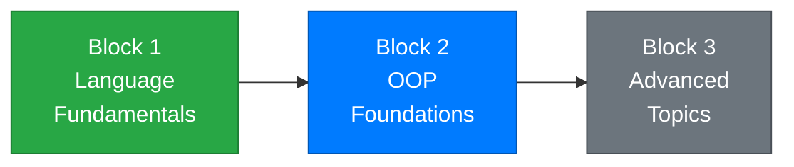

# Week 8 – Encapsulation and Object Behavior

[← Back to Course Home](../../README.md) | [← Previous: Week 7 – Classes and Objects](../week-07/README.md) | [Next: Week 9 – Inheritance →](../week-09/README.md)

---

## 📋 Overview

Last week you learned how to create classes and objects — bundling data into neat packages. But there's a problem: anyone can reach into your objects and set any value they want, even invalid ones. A student with an age of -5? A bank account with a negative balance? Nothing stops it.

This week is about **designing classes that protect themselves**. You'll learn **encapsulation** — the practice of hiding internal details and controlling how the outside world interacts with your objects. You'll also add **behavior** to your classes through well-designed methods, making your objects do things rather than just hold data.

> **Analogy:** Think of a vending machine. You can press buttons and insert money (the public interface), but you can't reach inside and grab items directly (the private internals). The machine controls what happens when you interact with it — that's encapsulation.

---

## 🎯 Learning Objectives

By the end of this week, you will be able to:

1. **Explain** what encapsulation is and why it's a core principle of OOP
2. **Use** access modifiers (`public`, `private`, `protected`, `internal`) appropriately
3. **Design** classes with private fields and public properties that validate data
4. **Add** meaningful methods that give objects behavior
5. **Override** `ToString()` to control how objects display themselves
6. **Create** objects that interact with each other through their public interfaces
7. **Distinguish** between good and poor class design

---

## 📚 Lectures

| # | Topic | Key Concepts |
|---|-------|-------------|
| 1 | [Access Modifiers and Encapsulation](./lecture-1.md) | `public`, `private`, `protected`, `internal`, why encapsulation matters, private fields with public properties |
| 2 | [Property Validation and Object Behavior](./lecture-2.md) | Validation logic in setters, adding methods to classes, computed properties, `ToString()` override |
| 3 | [Object Interaction and Design](./lecture-3.md) | Objects using other objects, designing clean interfaces, complete example with multiple interacting classes |

---

## 🗺️ Where You Are

```
✅ Week 1 – Getting Started          ✅ Week 5 – Methods
✅ Week 2 – Variables & Types         ✅ Week 6 – Arrays & Collections
✅ Week 3 – Conditionals              ✅ Week 7 – Classes & Objects
✅ Week 4 – Loops                     👉 Week 8 – Encapsulation ← YOU ARE HERE
```



---

## 🔗 Prerequisites

Before starting this week, make sure you're comfortable with:

- **Classes and objects** (Week 7) — defining classes, properties, constructors, creating objects with `new`
- **Methods** (Week 5) — parameters, return values, method overloading
- **Arrays and Lists** (Week 6) — storing and iterating collections of data

---

## ✅ Week Checklist

- [ ] Complete Lecture 1 — understand access modifiers and the principle of encapsulation
- [ ] Complete Lecture 2 — add validation to properties, write methods that give objects behavior
- [ ] Complete Lecture 3 — build programs where multiple objects work together
- [ ] Work through the practice exercises
- [ ] Complete the **Bank Account System** assignment

---

[← Week 7: Classes & Objects](../week-07/README.md) | [Week 9: Inheritance →](../week-09/README.md)
