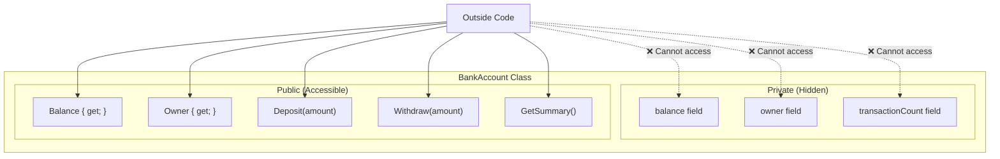

# Lecture 1: Access Modifiers and Encapsulation

[Back to Week 8 Overview](./README.md) | [Next: Lecture 2 – Property Validation and Object Behavior →](./lecture-2.md)

---

## Lecture Overview

| Item | Detail |
|------|--------|
| Duration | 45 minutes |
| Topics | Access modifiers, why encapsulation matters, private fields with public properties, designing protected classes |
| Preparation | Completed Week 7 — comfortable creating classes with properties and constructors |

---

## 1. The Problem: Wide Open Objects

In Week 7, we created classes like this:

```csharp
class BankAccount
{
    public string Owner { get; set; }
    public decimal Balance { get; set; }

    public BankAccount(string owner, decimal balance)
    {
        Owner = owner;
        Balance = balance;
    }
}
```

Everything is `public`. That means anyone can do this:

```csharp
BankAccount account = new BankAccount("Alice", 1000m);

account.Balance = -999999m;   // Negative balance? Sure!
account.Owner = "";           // Empty name? Why not!
account.Balance = 0;          // Wiped out, no record of what happened
```

There's **nothing stopping** invalid data from getting into your objects. In a real banking system, this would be catastrophic. The problem is that our class has no boundaries — everything is exposed.

---

## 2. Access Modifiers — Controlling Visibility

C# gives you **access modifiers** — keywords that control who can see and use your class members. Think of them as different levels of locks on doors.

### The Four Main Access Modifiers

| Modifier | Who Can Access | Analogy |
|----------|---------------|---------|
| `public` | Anyone, from anywhere | Front door — open to everyone |
| `private` | Only code inside the same class | Personal safe — only you have the key |
| `protected` | The class itself + any class that inherits from it | Family heirloom — passed to children (Week 9) |
| `internal` | Any code in the same project/assembly | Office building — employees only |

### The Most Important Two (For Now)

For this course, you'll primarily use:

- **`public`** — for things the outside world needs to access
- **`private`** — for things only the class itself should touch

We'll revisit `protected` in Week 9 when we cover inheritance. `internal` becomes important in larger multi-project solutions.

### Default Access Levels

If you don't write an access modifier, C# uses these defaults:

```csharp
class Student           // internal (class default)
{
    string name;        // private (member default)
    
    void PrintInfo()    // private (member default)
    {
    }
}
```

> 💡 **Best practice:** Always write access modifiers explicitly. Don't rely on defaults — make your intent clear.

---

## 3. What Is Encapsulation?

**Encapsulation** is the practice of:
1. **Hiding** the internal details of a class (making fields `private`)
2. **Exposing** a controlled interface (making properties and methods `public`)

It's one of the **four pillars of OOP** (along with inheritance, polymorphism, and abstraction — all coming in the next weeks).



### Why Does This Matter?

1. **Data protection** — Invalid values can't sneak in
2. **Controlled changes** — All modifications go through methods you design
3. **Freedom to change internals** — You can rewrite how the class works internally without breaking code that uses it
4. **Easier debugging** — If `Balance` is wrong, you know it was changed through `Deposit()` or `Withdraw()` — not randomly set from somewhere else

### Real-World Analogy

> Think of your phone. You interact with it through a **public interface** — the screen, buttons, and apps. The internal circuitry, battery management, and memory allocation are all **private**. Apple can completely redesign the internals of the iPhone, and you still use it the same way. That's encapsulation.

---

## 4. Before and After: Encapsulating a Class

Let's transform a poorly designed class into a well-encapsulated one.

### ❌ Before: No Encapsulation

```csharp
class Student
{
    public string Name;
    public int Age;
    public double Gpa;
    public int CreditsCompleted;
}
```

Problems:
- Any code can set `Age = -5` or `Gpa = 99.9`
- No way to enforce rules
- No way to track when values change

### ✅ After: Encapsulated

```csharp
class Student
{
    // Private fields — only accessible inside this class
    private string name;
    private int age;
    private double gpa;
    private int creditsCompleted;

    // Public properties — the controlled interface
    public string Name
    {
        get { return name; }
        set
        {
            if (string.IsNullOrWhiteSpace(value))
            {
                Console.WriteLine("Warning: Name cannot be empty.");
                return;  // Don't change the value
            }
            name = value;
        }
    }

    public int Age
    {
        get { return age; }
        set
        {
            if (value < 0 || value > 120)
            {
                Console.WriteLine($"Warning: Age {value} is out of range.");
                return;
            }
            age = value;
        }
    }

    public double Gpa
    {
        get { return gpa; }
        private set  // Only settable inside the class
        {
            if (value < 0.0 || value > 4.0)
            {
                Console.WriteLine($"Warning: GPA {value} is out of range.");
                return;
            }
            gpa = value;
        }
    }

    public int CreditsCompleted
    {
        get { return creditsCompleted; }
        private set { creditsCompleted = value; }
    }

    // Constructor
    public Student(string name, int age)
    {
        Name = name;   // Goes through the setter — validation runs!
        Age = age;     // Goes through the setter — validation runs!
        gpa = 0.0;
        creditsCompleted = 0;
    }

    // Public method — the controlled way to update GPA
    public void CompleteClass(double classGpa, int credits)
    {
        // Weighted GPA calculation
        double totalPoints = gpa * creditsCompleted + classGpa * credits;
        creditsCompleted += credits;
        Gpa = totalPoints / creditsCompleted;
    }
}
```

Now look at how the class is used:

```csharp
Student s = new Student("Alice", 20);

s.Name = "";          // Warning: Name cannot be empty. (Name stays "Alice")
s.Age = -5;           // Warning: Age -5 is out of range. (Age stays 20)
// s.Gpa = 3.5;       // ❌ ERROR — Gpa has a private set
// s.CreditsCompleted = 100;  // ❌ ERROR — private set

s.CompleteClass(3.8, 3);  // ✅ This is the correct way to update GPA
s.CompleteClass(3.5, 4);  // ✅ GPA recalculated automatically

Console.WriteLine($"{s.Name}, Age: {s.Age}");
Console.WriteLine($"GPA: {s.Gpa:F2}, Credits: {s.CreditsCompleted}");
```

**Output:**
```
Warning: Name cannot be empty.
Warning: Age -5 is out of range.
Alice, Age: 20
GPA: 3.63, Credits: 7
```

> 💡 **Key insight:** The constructor uses the property setters (`Name = name;` not `this.name = name;`), so validation runs even during object creation!

---

## 5. The Encapsulation Pattern

Here's the pattern you'll use repeatedly:

```
Private field  →  Public property (with validation)  →  Public methods (for complex operations)
```

### When to Use Each Approach

| Scenario | Approach |
|----------|----------|
| Simple data, no validation needed | Auto-implemented property: `public string Name { get; set; }` |
| Data needs validation | Full property with private backing field |
| Read-only from outside | `public int Count { get; private set; }` |
| Value should never change after creation | `public string Id { get; }` (set only in constructor) |
| Complex operation that changes multiple fields | Public method (like `CompleteClass()` above) |

### Read-Only Properties (Set Once in Constructor)

```csharp
class Employee
{
    public string EmployeeId { get; }  // No setter at all — truly read-only
    public string Name { get; set; }
    public string Department { get; set; }

    public Employee(string id, string name, string department)
    {
        EmployeeId = id;      // Can only be set here, in the constructor
        Name = name;
        Department = department;
    }
}

Employee emp = new Employee("E001", "Alice", "Engineering");
// emp.EmployeeId = "E999";  // ❌ ERROR — no setter exists
emp.Department = "Marketing"; // ✅ This is fine
```

---

## 6. Common Mistake: Bypassing Your Own Validation

A subtle but important mistake:

```csharp
class Product
{
    private decimal price;

    public decimal Price
    {
        get { return price; }
        set
        {
            if (value < 0)
            {
                Console.WriteLine("Price cannot be negative.");
                return;
            }
            price = value;
        }
    }

    public void ApplyDiscount(double percentage)
    {
        // ❌ BAD — directly modifies the field, skipping validation
        price = price - (price * (decimal)(percentage / 100));

        // ✅ GOOD — goes through the property setter
        Price = Price - (Price * (decimal)(percentage / 100));
    }
}
```

> 💡 **Rule of thumb:** Inside your class, use the **property** (capital letter) when you want validation to run. Use the **field** (lowercase) only when you're intentionally bypassing validation (which should be rare).

---

## Key Takeaways

- **Access modifiers** control who can see your class members: `public`, `private`, `protected`, `internal`
- **Encapsulation** means hiding internal data and exposing a controlled interface
- The standard pattern is: **private fields** + **public properties** with validation + **public methods** for complex operations
- Always make fields `private` unless you have a specific reason not to
- Properties with `private set` can be read from outside but only changed from inside
- Properties with no setter (get-only) can only be set in the constructor
- Use property setters in your constructor to ensure validation runs during object creation
- Encapsulation protects your objects from invalid states

---

## Hands-On Exercises

### Exercise 1 — Access Modifier Practice
Given this class, identify which lines in `Main` will cause compiler errors:
```csharp
class Car
{
    private string vin;
    public string Make { get; set; }
    public string Model { get; set; }
    public int Year { get; private set; }
    internal double Mileage { get; set; }

    public Car(string vin, string make, string model, int year)
    {
        this.vin = vin;
        Make = make;
        Model = model;
        Year = year;
    }
}

// In Main:
Car car = new Car("ABC123", "Toyota", "Camry", 2023);
Console.WriteLine(car.Make);        // Line A
Console.WriteLine(car.vin);         // Line B
car.Year = 2024;                    // Line C
car.Model = "Corolla";              // Line D
car.Mileage = 15000;                // Line E
```

### Exercise 2 — Encapsulate a Class
Transform this unprotected class into a well-encapsulated one with validation:
```csharp
class Product
{
    public string Name;
    public decimal Price;
    public int StockQuantity;
}
```
Rules: Name cannot be empty, Price must be ≥ 0, StockQuantity must be ≥ 0.

### Exercise 3 — Temperature Class
Create an encapsulated `Temperature` class that:
- Stores temperature in Celsius internally (private field)
- Has a `Celsius` property with validation (absolute zero is -273.15°C)
- Has a read-only `Fahrenheit` property that computes `Celsius * 9/5 + 32`
- Has a read-only `Kelvin` property that computes `Celsius + 273.15`

Test it:
```csharp
Temperature temp = new Temperature(100);
Console.WriteLine($"{temp.Celsius}°C = {temp.Fahrenheit}°F = {temp.Kelvin}K");
// 100°C = 212°F = 373.15K
```

---

[Back to Week 8 Overview](./README.md) | [Next: Lecture 2 – Property Validation and Object Behavior →](./lecture-2.md)
