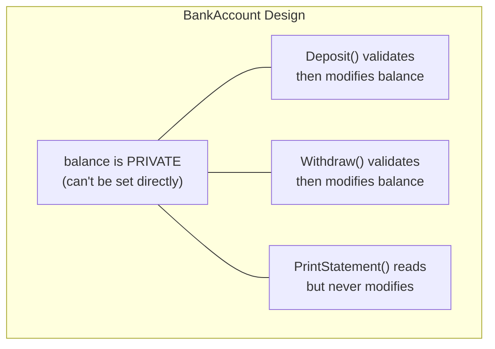

# Lecture 2: Property Validation and Object Behavior

[← Previous: Lecture 1 – Access Modifiers and Encapsulation](./lecture-1.md) | [Back to Week 8 Overview](./README.md) | [Next: Lecture 3 – Object Interaction and Design →](./lecture-3.md)

---

## Lecture Overview

| Item | Detail |
|------|--------|
| Duration | 45 minutes |
| Topics | Validation patterns in setters, adding methods as behavior, computed properties, overriding `ToString()` |
| Preparation | Completed Lecture 1 — comfortable with access modifiers and the encapsulation pattern |

---

## 1. Validation Patterns in Property Setters

In Lecture 1, you saw basic validation that prints a warning and skips the assignment. Let's explore the different strategies you can use when invalid data comes in.

### Strategy 1: Reject and Keep Old Value (Silent Guard)

```csharp
private int age;
public int Age
{
    get { return age; }
    set
    {
        if (value >= 0 && value <= 120)
        {
            age = value;  // Only set if valid
        }
        // If invalid, nothing happens — old value stays
    }
}
```

**When to use:** When silently ignoring bad input is acceptable. Simple, but the caller has no idea their value was rejected.

### Strategy 2: Reject with a Warning Message

```csharp
private int age;
public int Age
{
    get { return age; }
    set
    {
        if (value < 0 || value > 120)
        {
            Console.WriteLine($"Warning: Age {value} is invalid. Keeping current value.");
            return;
        }
        age = value;
    }
}
```

**When to use:** During development and learning. Gives visible feedback, but `Console.WriteLine` in a property isn't ideal for production code.

### Strategy 3: Clamp to Valid Range

```csharp
private int age;
public int Age
{
    get { return age; }
    set
    {
        if (value < 0) age = 0;
        else if (value > 120) age = 120;
        else age = value;
    }
}
```

**When to use:** When it's reasonable to adjust the value to the nearest valid option (e.g., volume controls, brightness settings).

### Strategy 4: Throw an Exception (Preview)

```csharp
private int age;
public int Age
{
    get { return age; }
    set
    {
        if (value < 0 || value > 120)
            throw new ArgumentOutOfRangeException(nameof(value), 
                "Age must be between 0 and 120.");
        age = value;
    }
}
```

**When to use:** In production code where invalid data is a programming error that should be caught immediately. We'll cover exceptions fully in Week 12 — for now, just know this option exists.

> 💡 **For this course**, use Strategy 2 (warning message) or Strategy 3 (clamping) in your exercises. They make it easy to see what's happening while you learn.

### Validation Pattern Summary

| Strategy | Invalid Input | Feedback | Best For |
|----------|--------------|----------|----------|
| Silent guard | Ignored | None | Simple cases |
| Warning message | Ignored | Console message | Learning/debugging |
| Clamping | Adjusted | None (or message) | Numeric ranges |
| Exception | Rejected | Error thrown | Production code |

---

## 2. Adding Behavior — Methods in Classes

So far, our classes mostly **hold data**. But objects in the real world don't just store information — they **do things**. A bank account processes deposits. A student enrolls in courses. A shopping cart calculates totals.

**Methods are how you give your objects behavior.**

### Example: A BankAccount That Does Things

```csharp
class BankAccount
{
    // Private state
    private string owner;
    private decimal balance;
    private List<string> transactionHistory;

    // Public properties
    public string Owner
    {
        get { return owner; }
        private set
        {
            if (string.IsNullOrWhiteSpace(value))
                throw new ArgumentException("Owner name cannot be empty.");
            owner = value;
        }
    }

    public decimal Balance
    {
        get { return balance; }
        private set { balance = value; }  // Only methods in this class can change it
    }

    public int TransactionCount => transactionHistory.Count;

    // Constructor
    public BankAccount(string owner, decimal initialDeposit)
    {
        Owner = owner;
        transactionHistory = new List<string>();

        if (initialDeposit > 0)
        {
            balance = initialDeposit;
            transactionHistory.Add($"Opening deposit: +{initialDeposit:C}");
        }
    }

    // Behavior — public methods
    public void Deposit(decimal amount)
    {
        if (amount <= 0)
        {
            Console.WriteLine("Deposit amount must be positive.");
            return;
        }

        balance += amount;
        transactionHistory.Add($"Deposit: +{amount:C}  |  Balance: {balance:C}");
        Console.WriteLine($"Deposited {amount:C}. New balance: {balance:C}");
    }

    public bool Withdraw(decimal amount)
    {
        if (amount <= 0)
        {
            Console.WriteLine("Withdrawal amount must be positive.");
            return false;
        }

        if (amount > balance)
        {
            Console.WriteLine($"Insufficient funds. Balance: {balance:C}, Requested: {amount:C}");
            return false;
        }

        balance -= amount;
        transactionHistory.Add($"Withdrawal: -{amount:C}  |  Balance: {balance:C}");
        Console.WriteLine($"Withdrew {amount:C}. New balance: {balance:C}");
        return true;
    }

    public void PrintStatement()
    {
        Console.WriteLine($"\n=== Account Statement for {Owner} ===");
        Console.WriteLine($"Current Balance: {Balance:C}");
        Console.WriteLine($"Total Transactions: {TransactionCount}");
        Console.WriteLine("─────────────────────────────────");

        foreach (string transaction in transactionHistory)
        {
            Console.WriteLine($"  {transaction}");
        }

        Console.WriteLine("═════════════════════════════════\n");
    }
}
```

### Using the BankAccount

```csharp
BankAccount account = new BankAccount("Alice Johnson", 500m);

account.Deposit(200m);
account.Deposit(150m);
account.Withdraw(100m);
account.Withdraw(1000m);   // Should fail — insufficient funds
account.Deposit(-50m);     // Should fail — negative amount

account.PrintStatement();
```

**Output:**
```
Deposited $200.00. New balance: $700.00
Deposited $150.00. New balance: $850.00
Withdrew $100.00. New balance: $750.00
Insufficient funds. Balance: $750.00, Requested: $1,000.00
Deposit amount must be positive.

=== Account Statement for Alice Johnson ===
Current Balance: $750.00
Total Transactions: 3
─────────────────────────────────
  Opening deposit: +$500.00
  Deposit: +$200.00  |  Balance: $700.00
  Deposit: +$150.00  |  Balance: $850.00
  Withdrawal: -$100.00  |  Balance: $750.00
═════════════════════════════════
```

### Design Observations

Notice the key design decisions:



- `Balance` has `private set` — the only way to change it is through `Deposit()` and `Withdraw()`
- `Withdraw()` returns `bool` — so the caller knows if it succeeded
- `Deposit()` returns `void` — it either works or prints a message
- `transactionHistory` is entirely private — no one outside can tamper with the records
- `TransactionCount` uses an expression-bodied property (`=>`) to expose the count without exposing the list

---

## 3. Computed Properties (Expression-Bodied Properties)

Some properties don't store a value — they **calculate** it from other data. These are called **computed properties**.

```csharp
class Rectangle
{
    public double Width { get; set; }
    public double Height { get; set; }

    // Computed properties — calculated from Width and Height
    public double Area => Width * Height;
    public double Perimeter => 2 * (Width + Height);
    public bool IsSquare => Width == Height;

    public Rectangle(double width, double height)
    {
        Width = width;
        Height = height;
    }
}
```

```csharp
Rectangle rect = new Rectangle(5, 3);
Console.WriteLine($"Area: {rect.Area}");           // 15
Console.WriteLine($"Perimeter: {rect.Perimeter}"); // 16
Console.WriteLine($"Square? {rect.IsSquare}");     // False

rect.Width = 3;
Console.WriteLine($"Area: {rect.Area}");           // 9 (automatically updated!)
Console.WriteLine($"Square? {rect.IsSquare}");     // True
```

The `=>` syntax is shorthand for a `get`-only property:

```csharp
// These are equivalent:
public double Area => Width * Height;

public double Area
{
    get { return Width * Height; }
}
```

> 💡 **When to use computed properties:** When a value is always derived from other properties and doesn't need to be stored separately. This avoids data getting out of sync.

---

## 4. Overriding `ToString()` — Controlling Object Display

Every class in C# inherits from `object`, which has a `ToString()` method. By default, it returns the class name:

```csharp
Student s = new Student("Alice", 20);
Console.WriteLine(s);           // Output: Student
Console.WriteLine(s.ToString()); // Output: Student  (same thing)
```

That's not very useful. You can **override** `ToString()` to return something meaningful:

```csharp
class Student
{
    public string Name { get; set; }
    public int Age { get; set; }
    public double Gpa { get; private set; }

    public Student(string name, int age)
    {
        Name = name;
        Age = age;
        Gpa = 0.0;
    }

    public override string ToString()
    {
        return $"{Name} (Age: {Age}, GPA: {Gpa:F2})";
    }
}
```

Now:

```csharp
Student s = new Student("Alice", 20);
Console.WriteLine(s);  // Output: Alice (Age: 20, GPA: 0.00)
```

### Why `override`?

The `override` keyword tells C# "I'm replacing the inherited `ToString()` method with my own version." We'll learn much more about `override` in Week 9 (Inheritance). For now, just know this is the pattern:

```csharp
public override string ToString()
{
    return "your custom string here";
}
```

### Where `ToString()` Gets Called Automatically

`ToString()` is called behind the scenes in several places:

```csharp
Student s = new Student("Alice", 20);

Console.WriteLine(s);               // Calls ToString() automatically
string text = $"Student: {s}";      // String interpolation calls ToString()
string added = "Info: " + s;        // String concatenation calls ToString()
```

This is extremely useful when you have a list of objects:

```csharp
List<Student> students = new List<Student>
{
    new Student("Alice", 20),
    new Student("Bob", 22),
    new Student("Carol", 19)
};

foreach (Student student in students)
{
    Console.WriteLine(student);  // Calls ToString() for each
}
```

**Output:**
```
Alice (Age: 20, GPA: 0.00)
Bob (Age: 22, GPA: 0.00)
Carol (Age: 19, GPA: 0.00)
```

---

## 5. Putting It Together: A Complete Product Class

Let's build a well-designed class that uses everything from this lecture:

```csharp
class Product
{
    // Private fields
    private string name;
    private decimal price;
    private int stock;

    // Validated properties
    public string Name
    {
        get { return name; }
        set
        {
            if (string.IsNullOrWhiteSpace(value))
            {
                Console.WriteLine("Product name cannot be empty.");
                return;
            }
            name = value.Trim();
        }
    }

    public decimal Price
    {
        get { return price; }
        set
        {
            if (value < 0)
            {
                Console.WriteLine("Price cannot be negative. Setting to 0.");
                price = 0;
                return;
            }
            price = value;
        }
    }

    public int Stock
    {
        get { return stock; }
        private set
        {
            if (value < 0) stock = 0;
            else stock = value;
        }
    }

    // Computed properties
    public decimal TotalValue => Price * Stock;
    public bool InStock => Stock > 0;

    // Constructor
    public Product(string name, decimal price, int stock)
    {
        Name = name;
        Price = price;
        Stock = stock;
    }

    // Behavior
    public bool Sell(int quantity)
    {
        if (quantity <= 0)
        {
            Console.WriteLine("Quantity must be positive.");
            return false;
        }

        if (quantity > stock)
        {
            Console.WriteLine($"Not enough stock. Available: {stock}");
            return false;
        }

        Stock -= quantity;
        Console.WriteLine($"Sold {quantity}x {Name}. Remaining: {Stock}");
        return true;
    }

    public void Restock(int quantity)
    {
        if (quantity <= 0)
        {
            Console.WriteLine("Restock quantity must be positive.");
            return;
        }

        Stock += quantity;
        Console.WriteLine($"Restocked {quantity}x {Name}. Now in stock: {Stock}");
    }

    public void ApplyDiscount(double percentage)
    {
        if (percentage <= 0 || percentage >= 100)
        {
            Console.WriteLine("Discount must be between 0 and 100.");
            return;
        }

        decimal discount = Price * (decimal)(percentage / 100);
        Price -= discount;
        Console.WriteLine($"{Name} discounted by {percentage}%. New price: {Price:C}");
    }

    // ToString override
    public override string ToString()
    {
        string availability = InStock ? $"In Stock ({Stock})" : "OUT OF STOCK";
        return $"{Name} — {Price:C} [{availability}]";
    }
}
```

### Using It

```csharp
Product laptop = new Product("Laptop Pro", 999.99m, 25);
Product mouse = new Product("Wireless Mouse", 29.99m, 100);

Console.WriteLine(laptop);  // Laptop Pro — $999.99 [In Stock (25)]
Console.WriteLine(mouse);   // Wireless Mouse — $29.99 [In Stock (100)]

laptop.Sell(3);
laptop.ApplyDiscount(10);
mouse.Sell(200);            // Not enough stock
mouse.Restock(50);

Console.WriteLine();
Console.WriteLine($"Laptop inventory value: {laptop.TotalValue:C}");
Console.WriteLine($"Mouse inventory value: {mouse.TotalValue:C}");
```

**Output:**
```
Laptop Pro — $999.99 [In Stock (25)]
Wireless Mouse — $29.99 [In Stock (100)]
Sold 3x Laptop Pro. Remaining: 22
Laptop Pro discounted by 10%. New price: $899.99
Not enough stock. Available: 100
Restocked 50x Wireless Mouse. Now in stock: 150

Laptop inventory value: $19,799.78
Mouse inventory value: $4,498.50
```

---

## Key Takeaways

- There are multiple **validation strategies** — choose based on your situation (silent, warning, clamping, exception)
- **Methods** give objects behavior — they're how objects *do things*, not just *hold data*
- Methods that modify state should **validate** their inputs before making changes
- **Computed properties** (`=>`) calculate values from other properties — they never get out of sync
- Override **`ToString()`** to control how your objects display themselves
- `ToString()` is called automatically by `Console.WriteLine()` and string interpolation
- Well-designed classes combine: private state + validated properties + meaningful methods + `ToString()`

---

## Hands-On Exercises

### Exercise 1 — Validation Strategies
Create a `Thermostat` class with a `TargetTemperature` property that clamps values between 60°F and 80°F. If someone tries to set 50, it should become 60. If they try 90, it should become 80.

### Exercise 2 — Adding Behavior
Create an `Elevator` class with:
- Private `currentFloor` (int) and `topFloor` (int)
- Public `CurrentFloor` property (read-only from outside)
- `GoUp()` and `GoDown()` methods that validate movement
- `ToString()` that returns something like `"Elevator at floor 3 of 10"`

### Exercise 3 — ToString Practice
Create a `Movie` class with `Title`, `Director`, `Year`, and `Rating` (1-10 with validation). Override `ToString()` to display like:
```
"The Matrix" (1999) — Dir. Wachowskis ★★★★★★★★★☆
```
(Generate the star display based on the rating — filled stars for the rating, empty stars for the remainder out of 10.)

---

[← Previous: Lecture 1 – Access Modifiers and Encapsulation](./lecture-1.md) | [Back to Week 8 Overview](./README.md) | [Next: Lecture 3 – Object Interaction and Design →](./lecture-3.md)
