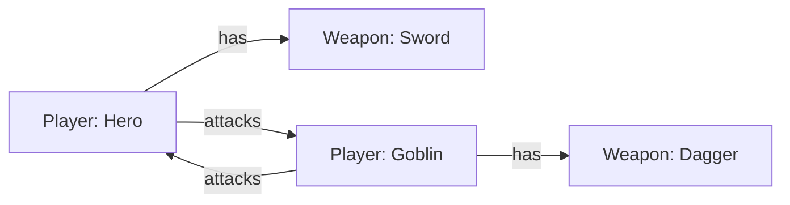
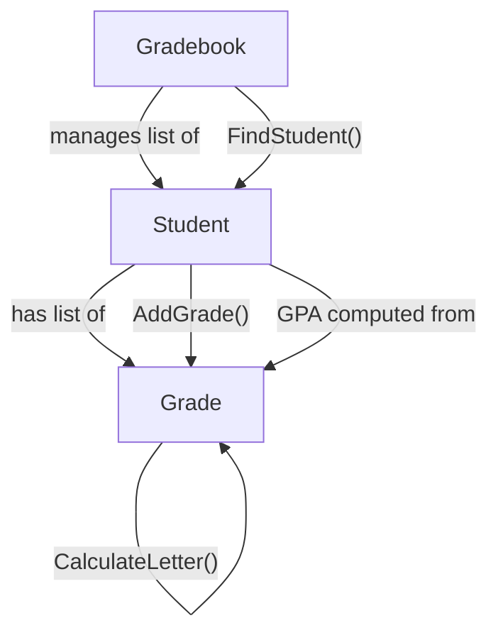

# Lecture 3: Object Interaction and Design

[← Previous: Lecture 2 – Property Validation and Object Behavior](./lecture-2.md) | [Back to Week 8 Overview](./README.md)

---

## Lecture Overview

| Item | Detail |
|------|--------|
| Duration | 45 minutes |
| Topics | Objects using other objects, designing clean interfaces, complete multi-class example |
| Preparation | Completed Lectures 1–2 — comfortable with encapsulation, validation, methods, and `ToString()` |

---

## 1. Objects That Use Other Objects

So far, our objects have been fairly isolated — each one stands on its own. But in real programs, objects **interact**. A `ShoppingCart` contains `Product` objects. A `Classroom` has a list of `Student` objects. A `Library` manages `Book` objects.

This is called **object interaction** (and it's a preview of **composition**, which we'll explore further in Week 11).

### Simple Example: A Player in a Game

```csharp
class Weapon
{
    public string Name { get; set; }
    public int Damage { get; set; }

    public Weapon(string name, int damage)
    {
        Name = name;
        Damage = damage;
    }

    public override string ToString()
    {
        return $"{Name} (Damage: {Damage})";
    }
}

class Player
{
    public string Name { get; set; }
    public int Health { get; private set; }
    public Weapon EquippedWeapon { get; private set; }  // A Player HAS a Weapon

    public Player(string name, int health)
    {
        Name = name;
        Health = health;
        EquippedWeapon = null;  // No weapon initially
    }

    public void Equip(Weapon weapon)
    {
        EquippedWeapon = weapon;
        Console.WriteLine($"{Name} equipped {weapon.Name}!");
    }

    public void Attack(Player target)
    {
        if (EquippedWeapon == null)
        {
            Console.WriteLine($"{Name} has no weapon equipped!");
            return;
        }

        Console.WriteLine($"{Name} attacks {target.Name} with {EquippedWeapon.Name} for {EquippedWeapon.Damage} damage!");
        target.TakeDamage(EquippedWeapon.Damage);
    }

    public void TakeDamage(int amount)
    {
        Health -= amount;
        if (Health < 0) Health = 0;
        Console.WriteLine($"  {Name} takes {amount} damage. Health: {Health}");
    }

    public bool IsAlive => Health > 0;

    public override string ToString()
    {
        string weapon = EquippedWeapon != null ? EquippedWeapon.Name : "None";
        return $"{Name} [HP: {Health}, Weapon: {weapon}]";
    }
}
```

```csharp
Player hero = new Player("Hero", 100);
Player goblin = new Player("Goblin", 30);

Weapon sword = new Weapon("Iron Sword", 15);
Weapon dagger = new Weapon("Rusty Dagger", 8);

hero.Equip(sword);
goblin.Equip(dagger);

Console.WriteLine(hero);
Console.WriteLine(goblin);
Console.WriteLine();

hero.Attack(goblin);
goblin.Attack(hero);
hero.Attack(goblin);

Console.WriteLine();
Console.WriteLine($"Goblin alive? {goblin.IsAlive}");
```

**Output:**
```
Hero equipped Iron Sword!
Goblin equipped Rusty Dagger!
Hero [HP: 100, Weapon: Iron Sword]
Goblin [HP: 30, Weapon: Rusty Dagger]

Hero attacks Goblin with Iron Sword for 15 damage!
  Goblin takes 15 damage. Health: 15
Goblin attacks Hero with Rusty Dagger for 8 damage!
  Hero takes 8 damage. Health: 92
Hero attacks Goblin with Iron Sword for 15 damage!
  Goblin takes 15 damage. Health: 0

Goblin alive? False
```

### What's Happening Here



Key observations:
- `Player` **has a** `Weapon` — the `EquippedWeapon` property stores a reference to a `Weapon` object
- `Attack()` uses the weapon's `Damage` property — one object reading data from another
- `Attack()` calls `target.TakeDamage()` — one object calling a method on another
- Each class handles its own responsibilities: `Weapon` knows about damage, `Player` knows about health

---

## 2. Objects Containing Collections of Objects

A very common pattern is one object managing a **list** of other objects:

```csharp
class Playlist
{
    public string Name { get; set; }
    private List<Song> songs;

    public int SongCount => songs.Count;
    public double TotalMinutes => songs.Sum(s => s.DurationMinutes);  // Preview of LINQ (Week 14)

    public Playlist(string name)
    {
        Name = name;
        songs = new List<Song>();
    }

    public void AddSong(Song song)
    {
        if (song == null)
        {
            Console.WriteLine("Cannot add a null song.");
            return;
        }

        songs.Add(song);
        Console.WriteLine($"Added \"{song.Title}\" to {Name}");
    }

    public void RemoveSong(string title)
    {
        Song found = null;
        foreach (Song song in songs)
        {
            if (song.Title.ToLower() == title.ToLower())
            {
                found = song;
                break;
            }
        }

        if (found != null)
        {
            songs.Remove(found);
            Console.WriteLine($"Removed \"{found.Title}\" from {Name}");
        }
        else
        {
            Console.WriteLine($"Song \"{title}\" not found in {Name}");
        }
    }

    public void Display()
    {
        Console.WriteLine($"\n🎵 {Name} ({SongCount} songs)");
        Console.WriteLine("──────────────────────────────");

        if (songs.Count == 0)
        {
            Console.WriteLine("  (empty playlist)");
            return;
        }

        for (int i = 0; i < songs.Count; i++)
        {
            Console.WriteLine($"  {i + 1}. {songs[i]}");
        }

        int totalSeconds = 0;
        foreach (Song song in songs)
        {
            totalSeconds += (int)(song.DurationMinutes * 60);
        }
        int mins = totalSeconds / 60;
        int secs = totalSeconds % 60;
        Console.WriteLine($"──────────────────────────────");
        Console.WriteLine($"  Total: {mins}:{secs:D2}");
    }

    public override string ToString()
    {
        return $"{Name} — {SongCount} songs";
    }
}

class Song
{
    public string Title { get; set; }
    public string Artist { get; set; }
    public double DurationMinutes { get; set; }

    public Song(string title, string artist, double durationMinutes)
    {
        Title = title;
        Artist = artist;
        DurationMinutes = durationMinutes;
    }

    public override string ToString()
    {
        int mins = (int)DurationMinutes;
        int secs = (int)((DurationMinutes - mins) * 60);
        return $"{Title} — {Artist} [{mins}:{secs:D2}]";
    }
}
```

```csharp
Playlist myPlaylist = new Playlist("Road Trip Mix");

myPlaylist.AddSong(new Song("Bohemian Rhapsody", "Queen", 5.92));
myPlaylist.AddSong(new Song("Hotel California", "Eagles", 6.53));
myPlaylist.AddSong(new Song("Stairway to Heaven", "Led Zeppelin", 8.03));

myPlaylist.Display();

myPlaylist.RemoveSong("Hotel California");
myPlaylist.Display();
```

**Output:**
```
Added "Bohemian Rhapsody" to Road Trip Mix
Added "Hotel California" to Road Trip Mix
Added "Stairway to Heaven" to Road Trip Mix

🎵 Road Trip Mix (3 songs)
──────────────────────────────
  1. Bohemian Rhapsody — Queen [5:55]
  2. Hotel California — Eagles [6:31]
  3. Stairway to Heaven — Led Zeppelin [8:01]
──────────────────────────────
  Total: 20:28

Removed "Hotel California" from Road Trip Mix

🎵 Road Trip Mix (2 songs)
──────────────────────────────
  1. Bohemian Rhapsody — Queen [5:55]
  2. Stairway to Heaven — Led Zeppelin [8:01]
──────────────────────────────
  Total: 13:57
```

---

## 3. Designing Good Class Interfaces

How do you know if your class is well designed? Here are some guidelines:

### The "Newspaper Test"

Read your class's public members out loud. Do they make sense as actions someone would naturally perform on this object?

```csharp
// ✅ Good — reads naturally
account.Deposit(100m);
account.Withdraw(50m);
player.Attack(enemy);
cart.AddItem(product);

// ❌ Bad — exposes implementation details
account.SetBalanceField(100m);
player.ReduceTargetHealthByWeaponDamage(enemy);
cart.InsertIntoInternalListAtEndPosition(product);
```

### Responsibility — Each Class Does One Thing

A class should have **one clear job**:

| Class | Responsibility | Does NOT Handle |
|-------|---------------|-----------------|
| `BankAccount` | Managing money (deposits, withdrawals, balance) | Displaying menus, reading user input |
| `Student` | Storing and computing student data (name, grades, GPA) | Printing report cards, managing a class roster |
| `ShoppingCart` | Managing items in the cart (add, remove, total) | Processing payment, managing inventory |
| `ContactManager` | Managing a list of contacts (add, search, delete) | Drawing the UI, getting user input |

> 💡 **This is the Single Responsibility Principle** — one of the most important design principles. A class should have one reason to change.

### What Should Be Public vs Private?

Ask: "Does code **outside** this class need this?"

| Make Public | Keep Private |
|------------|-------------|
| Properties the outside world needs to read | Backing fields for properties |
| Methods that represent actions others can trigger | Helper methods used only inside the class |
| `ToString()` override | Internal state management details |
| The constructor | Intermediate calculations |

---

## 4. Complete Example: Student Gradebook System

Let's bring everything together with a larger example that uses multiple interacting classes:

```csharp
// ──────────────────────────────────────────
// Grade class — represents a single grade
// ──────────────────────────────────────────
class Grade
{
    public string CourseName { get; set; }
    public double Score { get; private set; }
    public string Letter { get; private set; }

    public Grade(string courseName, double score)
    {
        CourseName = courseName;
        SetScore(score);
    }

    public void SetScore(double score)
    {
        if (score < 0) score = 0;
        if (score > 100) score = 100;
        Score = score;
        Letter = CalculateLetter(score);
    }

    private string CalculateLetter(double score)
    {
        if (score >= 90) return "A";
        if (score >= 80) return "B";
        if (score >= 70) return "C";
        if (score >= 60) return "D";
        return "F";
    }

    public override string ToString()
    {
        return $"{CourseName}: {Score:F1}% ({Letter})";
    }
}

// ──────────────────────────────────────────
// Student class — has a list of Grades
// ──────────────────────────────────────────
class Student
{
    private string name;
    private int id;
    private List<Grade> grades;

    public string Name
    {
        get { return name; }
        set
        {
            if (string.IsNullOrWhiteSpace(value))
            {
                Console.WriteLine("Name cannot be empty.");
                return;
            }
            name = value;
        }
    }

    public int Id
    {
        get { return id; }
        private set { id = value; }
    }

    public int CourseCount => grades.Count;

    public double GPA
    {
        get
        {
            if (grades.Count == 0) return 0.0;

            double total = 0;
            foreach (Grade g in grades)
            {
                total += g.Score;
            }
            return total / grades.Count;
        }
    }

    public string Standing
    {
        get
        {
            double gpa = GPA;
            if (gpa >= 90) return "Dean's List";
            if (gpa >= 70) return "Good Standing";
            if (gpa >= 60) return "Probation";
            return "Academic Warning";
        }
    }

    public Student(int id, string name)
    {
        Id = id;
        Name = name;
        grades = new List<Grade>();
    }

    public void AddGrade(string courseName, double score)
    {
        Grade grade = new Grade(courseName, score);
        grades.Add(grade);
        Console.WriteLine($"  Added grade: {grade}");
    }

    public void PrintTranscript()
    {
        Console.WriteLine($"\n╔══════════════════════════════════════╗");
        Console.WriteLine($"║  Student Transcript                  ║");
        Console.WriteLine($"╠══════════════════════════════════════╣");
        Console.WriteLine($"║  ID:   {Id,-30}║");
        Console.WriteLine($"║  Name: {Name,-30}║");
        Console.WriteLine($"╚══════════════════════════════════════╝");

        if (grades.Count == 0)
        {
            Console.WriteLine("  No courses on record.");
            return;
        }

        Console.WriteLine();
        foreach (Grade grade in grades)
        {
            Console.WriteLine($"  📘 {grade}");
        }

        Console.WriteLine();
        Console.WriteLine($"  Average: {GPA:F1}%");
        Console.WriteLine($"  Standing: {Standing}");
    }

    public override string ToString()
    {
        return $"[{Id}] {Name} — GPA: {GPA:F1}% ({Standing})";
    }
}

// ──────────────────────────────────────────
// Gradebook class — manages a list of Students
// ──────────────────────────────────────────
class Gradebook
{
    private string className;
    private List<Student> students;

    public string ClassName => className;
    public int StudentCount => students.Count;

    public Gradebook(string className)
    {
        this.className = className;
        students = new List<Student>();
    }

    public void AddStudent(Student student)
    {
        students.Add(student);
        Console.WriteLine($"Added {student.Name} to {className}");
    }

    public Student FindStudent(int id)
    {
        foreach (Student s in students)
        {
            if (s.Id == id)
                return s;
        }
        return null;
    }

    public void PrintClassRoster()
    {
        Console.WriteLine($"\n📋 {className} — Class Roster ({StudentCount} students)");
        Console.WriteLine("════════════════════════════════════════════");

        if (students.Count == 0)
        {
            Console.WriteLine("  No students enrolled.");
            return;
        }

        foreach (Student s in students)
        {
            Console.WriteLine($"  {s}");
        }
    }

    public void PrintClassStatistics()
    {
        if (students.Count == 0)
        {
            Console.WriteLine("No students to analyze.");
            return;
        }

        double totalGpa = 0;
        double highest = 0;
        double lowest = 100;
        string topStudent = "";
        int deansList = 0;

        foreach (Student s in students)
        {
            double gpa = s.GPA;
            totalGpa += gpa;

            if (gpa > highest)
            {
                highest = gpa;
                topStudent = s.Name;
            }
            if (gpa < lowest) lowest = gpa;
            if (s.Standing == "Dean's List") deansList++;
        }

        Console.WriteLine($"\n📊 {className} — Class Statistics");
        Console.WriteLine("════════════════════════════════════════════");
        Console.WriteLine($"  Students:      {StudentCount}");
        Console.WriteLine($"  Class Average: {totalGpa / students.Count:F1}%");
        Console.WriteLine($"  Highest GPA:   {highest:F1}% ({topStudent})");
        Console.WriteLine($"  Lowest GPA:    {lowest:F1}%");
        Console.WriteLine($"  Dean's List:   {deansList}");
    }
}
```

### Using the System

```csharp
// Create the gradebook
Gradebook csClass = new Gradebook("Intro to Programming — Fall 2025");

// Create students
Student alice = new Student(1001, "Alice Johnson");
Student bob = new Student(1002, "Bob Smith");
Student carol = new Student(1003, "Carol Davis");

csClass.AddStudent(alice);
csClass.AddStudent(bob);
csClass.AddStudent(carol);

// Add grades
Console.WriteLine("\nAdding grades...");
alice.AddGrade("Midterm", 92);
alice.AddGrade("Project 1", 88);
alice.AddGrade("Final", 95);

bob.AddGrade("Midterm", 75);
bob.AddGrade("Project 1", 82);
bob.AddGrade("Final", 70);

carol.AddGrade("Midterm", 98);
carol.AddGrade("Project 1", 95);
carol.AddGrade("Final", 97);

// Display everything
csClass.PrintClassRoster();
csClass.PrintClassStatistics();

// Look up a specific student
Console.WriteLine();
Student found = csClass.FindStudent(1002);
if (found != null)
{
    found.PrintTranscript();
}
```

**Output:**
```
Added Alice Johnson to Intro to Programming — Fall 2025
Added Bob Smith to Intro to Programming — Fall 2025
Added Carol Davis to Intro to Programming — Fall 2025

Adding grades...
  Added grade: Midterm: 92.0% (A)
  Added grade: Project 1: 88.0% (B)
  Added grade: Final: 95.0% (A)
  Added grade: Midterm: 75.0% (C)
  Added grade: Project 1: 82.0% (B)
  Added grade: Final: 70.0% (C)
  Added grade: Midterm: 98.0% (A)
  Added grade: Project 1: 95.0% (A)
  Added grade: Final: 97.0% (A)

📋 Intro to Programming — Fall 2025 — Class Roster (3 students)
════════════════════════════════════════════
  [1001] Alice Johnson — GPA: 91.7% (Dean's List)
  [1002] Bob Smith — GPA: 75.7% (Good Standing)
  [1003] Carol Davis — GPA: 96.7% (Dean's List)

📊 Intro to Programming — Fall 2025 — Class Statistics
════════════════════════════════════════════
  Students:      3
  Class Average: 88.0%
  Highest GPA:   96.7% (Carol Davis)
  Lowest GPA:    75.7%
  Dean's List:   2

╔══════════════════════════════════════╗
║  Student Transcript                  ║
╠══════════════════════════════════════╣
║  ID:   1002                          ║
║  Name: Bob Smith                     ║
╚══════════════════════════════════════╝

  📘 Midterm: 75.0% (C)
  📘 Project 1: 82.0% (B)
  📘 Final: 70.0% (C)

  Average: 75.7%
  Standing: Good Standing
```

### Class Interaction Diagram



### Design Observations

Look at how responsibilities are divided:

- **`Grade`** — knows how to validate a score, calculate a letter grade, and display itself
- **`Student`** — knows how to manage its own grades, compute GPA, determine standing, and print a transcript
- **`Gradebook`** — knows how to manage a list of students, find students, and calculate class-wide statistics
- **No class reaches into another's private data** — everything goes through public properties and methods

---

## 5. Looking Ahead: Inheritance

You now know how to create well-encapsulated classes that interact with each other. Next week, we'll take the next step: **inheritance** — creating new classes that build on existing ones. If a `Student` and a `Teacher` both have `Name` and `Id`, shouldn't they share that code? That's exactly what inheritance solves.

---

## Key Takeaways

- Objects interact by calling each other's **public methods** and reading each other's **public properties**
- One object can **contain** another as a property — a `Player` has a `Weapon`, a `Playlist` has `Song` objects
- One object can **manage a list** of other objects — a `Gradebook` has a `List<Student>`
- Each class should have **one clear responsibility** (Single Responsibility Principle)
- Public interfaces should read **naturally** — like actions you'd perform on the real-world thing
- Keep internal helpers **private** — only expose what the outside world needs
- `ToString()` on every class makes debugging and display much easier

---

## Hands-On Exercises

### Exercise 1 — Shopping Cart
Create a `CartItem` class (product name, unit price, quantity, `TotalPrice` computed property, `ToString()`). Create a `ShoppingCart` class with methods: `AddItem()`, `RemoveItem()`, `GetTotal()`, and `PrintReceipt()`. Build a cart with at least 4 items and print the receipt.

### Exercise 2 — Library System
Create a `Book` class (title, author, ISBN, `IsCheckedOut` status). Create a `Library` class that manages a list of books with methods: `AddBook()`, `CheckOut(string isbn)`, `Return(string isbn)`, `SearchByAuthor(string author)`, `PrintCatalog()`. Add at least 5 books, check some out, search by author, and print the catalog.

### Exercise 3 — Pet Shelter
Create a `Pet` class (name, species, age, `IsAdopted` status) and a `Shelter` class that manages pets. Include methods to add pets, adopt a pet by name, list available pets, and show shelter statistics (total, adopted, available, breakdown by species). Test with at least 6 pets.

---

[← Previous: Lecture 2 – Property Validation and Object Behavior](./lecture-2.md) | [Back to Week 8 Overview](./README.md)
