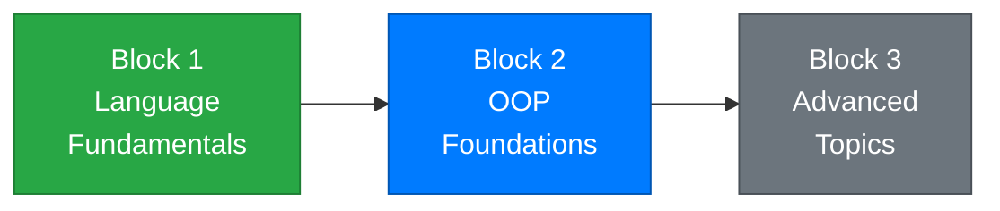

# Week 9 – Inheritance

[← Back to Course Home](../../README.md)

---

## 📋 Overview

In Week 7, you learned to create classes that bundle data and behavior. In Week 8, you learned to protect that data with encapsulation. This week, you'll learn how to **build new classes on top of existing ones** — reusing code instead of rewriting it.

Imagine you're building a school system. You have `Student` and `Teacher` classes, and they share a lot: both have a name, an email, and an ID. Without inheritance, you'd copy-paste those same fields and properties into both classes. With inheritance, you create a `Person` class once and let `Student` and `Teacher` **inherit** from it — getting all of `Person`'s features automatically, then adding their own unique ones on top.

This is the third pillar of OOP: **inheritance**. It's how professional codebases avoid duplication and build organized class hierarchies.

---

## 🎯 Learning Objectives

By the end of this week, you will be able to:

1. Explain **why inheritance exists** and the problems it solves
2. Create a **base class** and **derived classes** using the `:` syntax
3. Use **constructor chaining** with `base()` to pass data to parent constructors
4. Understand the **`protected`** access modifier and when to use it
5. **Override** methods in derived classes using `virtual` and `override`
6. Use the **`base`** keyword to call parent methods from a derived class
7. Identify **"is-a" relationships** and decide when inheritance is appropriate
8. Understand that every class in C# ultimately inherits from `object`

---

## 📚 Lectures

| # | Topic | Key Concepts |
|---|-------|-------------|
| 1 | [Why Inheritance? Base and Derived Classes](./lecture-1.md) | Code reuse problem, `:` syntax, base/derived classes, "is-a" relationship |
| 2 | [Constructors, `protected`, and the `base` Keyword](./lecture-2.md) | Constructor chaining with `base()`, `protected` modifier, accessing parent members |
| 3 | [Method Overriding and the `object` Class](./lecture-3.md) | `virtual`/`override`, calling `base` methods, the `object` class, `ToString()` override |

---

## 📝 Practice & Assessment

| Resource | Description |
|----------|-------------|
| [Exercises](./exercises.md) | 14 practice problems from basic inheritance to multi-level hierarchies |
| [Assignment](./assignment.md) | **Employee Management System** — build a class hierarchy for different employee types |

---

## 🗺️ Where Are We?



```
✅ Week 1 – Getting Started          ✅ Week 5 – Methods
✅ Week 2 – Variables & Types         ✅ Week 6 – Arrays & Collections
✅ Week 3 – Conditionals              ✅ Week 7 – Classes & Objects
✅ Week 4 – Loops                     ✅ Week 8 – Encapsulation
                                      👉 Week 9 – Inheritance ← YOU ARE HERE
                                      ⬜ Week 10 – Polymorphism
                                      ⬜ Week 11 – Interfaces
```

---

## 🔗 Prerequisites

Before starting this week, make sure you're comfortable with:

- **Classes and objects** (Week 7) — defining classes, properties, constructors, creating objects with `new`
- **Encapsulation** (Week 8) — access modifiers, private fields with public properties, validation, `ToString()` override
- **Methods** (Week 5) — parameters, return types, calling methods

---

## ✅ Week Checklist

- [ ] Complete Lecture 1 — understand why inheritance exists and create basic class hierarchies
- [ ] Complete Lecture 2 — use constructor chaining and the `protected` modifier
- [ ] Complete Lecture 3 — override methods and understand the `object` base class
- [ ] Work through the practice exercises
- [ ] Complete the **Employee Management System** assignment

---

[← Week 8: Encapsulation & Behavior](../week-08/README.md) | [Week 10: Polymorphism & Abstract Classes →](../week-10/README.md)
