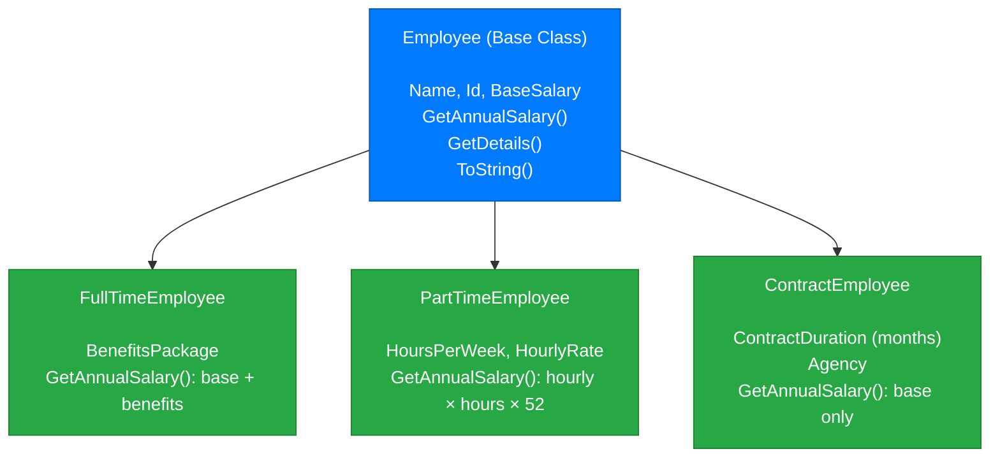
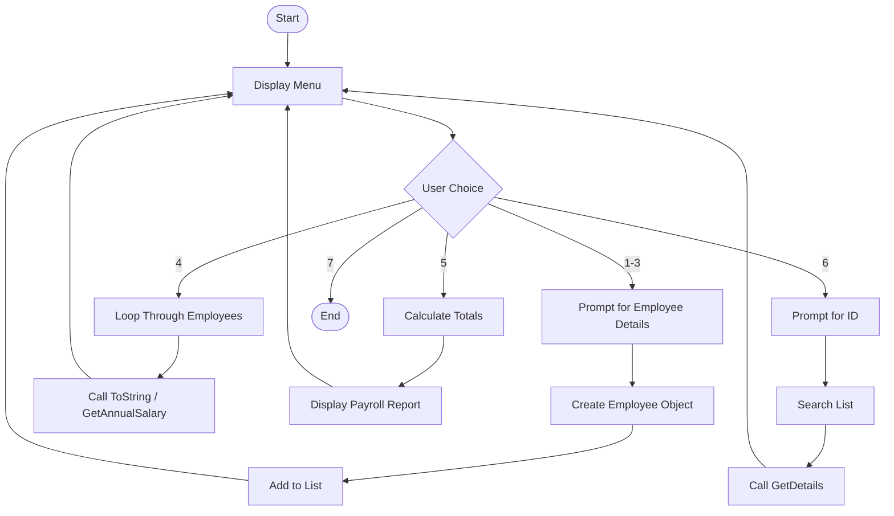

# Week 9 – Assignment: Employee Management System

[← Back to Week 9 Overview](./README.md)

---

## 📋 Overview

Build an **Employee Management System** — a console application that manages different types of employees using inheritance. The system lets users add employees, view them, and calculate payroll for the entire organization.

This assignment brings together everything from this week: base/derived classes, constructor chaining, `protected` members, method overriding, and `ToString()`.

---

## 🎯 Requirements

### Class Hierarchy

Design and implement the following class hierarchy:



### `Employee` (Base Class)

| Member | Type | Details |
|--------|------|---------|
| `Name` | `string` | Public property |
| `Id` | `int` | Public property |
| `BaseSalary` | `decimal` | Public get, **protected** set |
| Constructor | | Takes `name`, `id`, `baseSalary` |
| `GetAnnualSalary()` | `virtual decimal` | Returns `BaseSalary` |
| `GetDetails()` | `virtual string` | Returns a formatted string with employee info |
| `ToString()` | `override string` | Returns `"[Id] Name"` |

### `FullTimeEmployee` (Derived)

| Member | Type | Details |
|--------|------|---------|
| `BenefitsPackage` | `decimal` | Annual value of benefits (health insurance, etc.) |
| Constructor | | Takes `name`, `id`, `baseSalary`, `benefitsPackage` — chains to `base` |
| `GetAnnualSalary()` | `override` | Returns `BaseSalary + BenefitsPackage` |
| `GetDetails()` | `override` | Includes benefits information |
| `ToString()` | `override` | Returns `"[Id] Name (Full-Time)"` |

### `PartTimeEmployee` (Derived)

| Member | Type | Details |
|--------|------|---------|
| `HoursPerWeek` | `int` | Weekly hours worked |
| `HourlyRate` | `decimal` | Pay rate per hour |
| Constructor | | Takes `name`, `id`, `hoursPerWeek`, `hourlyRate` — chains to `base` with baseSalary = 0 |
| `GetAnnualSalary()` | `override` | Returns `HourlyRate × HoursPerWeek × 52` |
| `GetDetails()` | `override` | Includes hours and rate information |
| `ToString()` | `override` | Returns `"[Id] Name (Part-Time)"` |

### `ContractEmployee` (Derived)

| Member | Type | Details |
|--------|------|---------|
| `ContractDurationMonths` | `int` | Length of contract |
| `Agency` | `string` | Staffing agency name |
| Constructor | | Takes `name`, `id`, `baseSalary`, `duration`, `agency` — chains to `base` |
| `GetAnnualSalary()` | `override` | Returns `BaseSalary` (no adjustment) |
| `GetDetails()` | `override` | Includes contract duration and agency |
| `ToString()` | `override` | Returns `"[Id] Name (Contract)"` |

---

### Application Features

Your program should have a **menu-driven console interface** with these options:

```
═══════════════════════════════════
   EMPLOYEE MANAGEMENT SYSTEM
═══════════════════════════════════
1. Add Full-Time Employee
2. Add Part-Time Employee
3. Add Contract Employee
4. View All Employees
5. View Payroll Summary
6. Search Employee by ID
7. Exit
═══════════════════════════════════
Select an option:
```

#### Feature Details

1. **Add Employee** — Prompt for all required fields based on employee type. Auto-generate IDs (start at 1001 and increment).

2. **View All Employees** — Display all employees in a formatted table:
   ```
   ID     Name                 Type          Annual Salary
   ─────────────────────────────────────────────────────────
   1001   Sarah Johnson        Full-Time     $100,000.00
   1002   Mike Chen            Part-Time      $31,200.00
   1003   Lisa Park            Contract       $75,000.00
   ```

3. **Payroll Summary** — Show totals:
   ```
   ═══ PAYROLL SUMMARY ═══
   Total Employees:     3
   Full-Time:           1
   Part-Time:           1
   Contract:            1
   
   Total Annual Payroll: $206,200.00
   Average Salary:        $68,733.33
   Highest Paid:         Sarah Johnson ($100,000.00)
   ```

4. **Search by ID** — Find and display detailed information for a specific employee using their `GetDetails()` method.

---

## 📐 Program Flow



---

## 💡 Hints

- Store all employees in a single `List<Employee>` — derived types can be stored in a base type list
- Use `employee.GetAnnualSalary()` on each item — the correct override will be called automatically
- For search, loop through the list and compare IDs
- For the "highest paid" in the summary, track the max as you loop through
- Input validation: make sure salaries/rates are positive and hours are reasonable (1-40)

---

## 🎁 Bonus Challenges

1. **Sort by Salary:** Add a menu option to display employees sorted by annual salary (highest to lowest). Use a simple sort algorithm or `List.Sort()` with a comparison.

2. **Filter by Type:** Add an option to view only full-time, only part-time, or only contract employees. Use `if (employee is FullTimeEmployee ft)` to check types.

3. **Raise Calculator:** Add an option to give a percentage raise to an employee by ID. This will require modifying `BaseSalary` — think about how `protected set` helps here.

4. **Department Tracking:** Add a `Department` property to the base `Employee` class. Add a menu option to view employees grouped by department.

5. **Data Persistence:** Save the employee list to a text file when the user exits and load it when the program starts. Use `System.IO.File.WriteAllLines()` and `File.ReadAllLines()`.

---

## 📊 Grading Rubric

| Criteria | Points |
|----------|--------|
| **Class hierarchy** — correct inheritance, constructors chain properly | 25 |
| **Method overriding** — `GetAnnualSalary()`, `GetDetails()`, `ToString()` work correctly | 20 |
| **Protected members** — `BaseSalary` uses protected set appropriately | 10 |
| **Menu system** — all options work, input validation included | 20 |
| **Payroll calculations** — totals, averages, highest paid are correct | 15 |
| **Code quality** — clean formatting, meaningful names, no duplicate code | 10 |
| **Total** | **100** |

---

## 📦 Sample Output

Here's an example of a complete interaction:

```
═══════════════════════════════════
   EMPLOYEE MANAGEMENT SYSTEM
═══════════════════════════════════
1. Add Full-Time Employee
2. Add Part-Time Employee
3. Add Contract Employee
4. View All Employees
5. View Payroll Summary
6. Search Employee by ID
7. Exit
═══════════════════════════════════
Select an option: 1

── Add Full-Time Employee ──
Name: Sarah Johnson
Base Salary: 85000
Benefits Package Value: 15000
✅ Employee added: [1001] Sarah Johnson (Full-Time)

Select an option: 2

── Add Part-Time Employee ──
Name: Mike Chen
Hours per Week: 20
Hourly Rate: 30
✅ Employee added: [1002] Mike Chen (Part-Time)

Select an option: 4

══════════════════════════════════════════════════════════════
   ID     Name                 Type          Annual Salary
──────────────────────────────────────────────────────────────
   1001   Sarah Johnson        Full-Time     $100,000.00
   1002   Mike Chen            Part-Time      $31,200.00
══════════════════════════════════════════════════════════════

Select an option: 6

Search Employee ID: 1001

══ Employee Details ══
ID:              1001
Name:            Sarah Johnson
Type:            Full-Time
Base Salary:     $85,000.00
Benefits:        $15,000.00
Annual Salary:   $100,000.00

Select an option: 7

Goodbye! 👋
```

---

[← Back to Week 9 Overview](./README.md)
