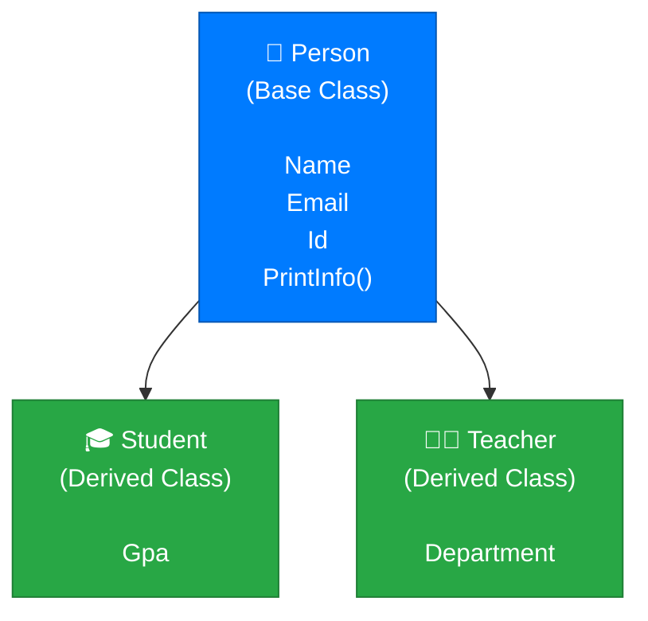
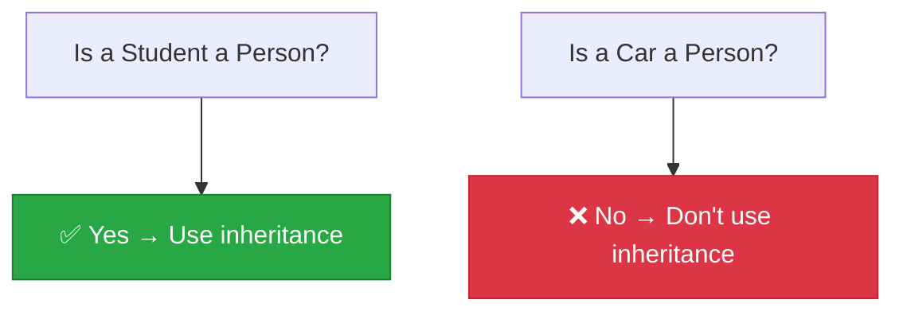
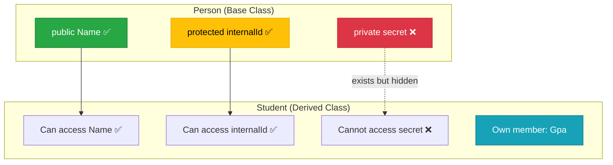
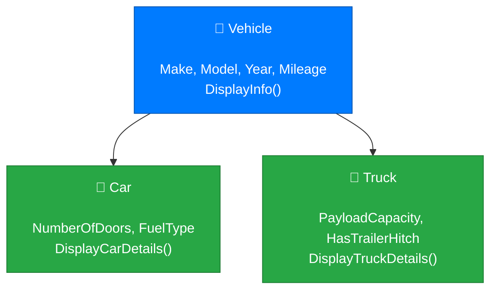

# Lecture 1: Why Inheritance? Base and Derived Classes

[Back to Week 9 Overview](./README.md) | [Next: Lecture 2 – Constructors, `protected`, and the `base` Keyword →](./lecture-2.md)

---

## Lecture Overview

| Item | Detail |
|------|--------|
| Duration | 45 minutes |
| Topics | The code duplication problem, inheritance syntax, base and derived classes, "is-a" relationships |
| Preparation | Comfortable with classes, properties, constructors, and encapsulation from Weeks 7–8 |

---

## 1. The Problem: Code Duplication Across Related Classes

Imagine you're building a system for a school. You need classes for students and teachers. Here's what you might write with what you know so far:

```csharp
class Student
{
    public string Name { get; set; }
    public string Email { get; set; }
    public int Id { get; set; }
    public double Gpa { get; set; }

    public void PrintInfo()
    {
        Console.WriteLine($"[{Id}] {Name} ({Email})");
    }
}

class Teacher
{
    public string Name { get; set; }
    public string Email { get; set; }
    public int Id { get; set; }
    public string Department { get; set; }

    public void PrintInfo()
    {
        Console.WriteLine($"[{Id}] {Name} ({Email})");
    }
}
```

Notice the problem? `Name`, `Email`, `Id`, and `PrintInfo()` are **identical** in both classes. If you later add a phone number field, you'd need to add it in *both* places. If you fix a bug in `PrintInfo()`, you'd need to fix it *twice*.

This violates a principle you've already seen with methods: **Don't Repeat Yourself (DRY)**.

> 💡 **The core question:** If `Student` and `Teacher` share common features, is there a way to define those features *once* and have both classes use them?

Yes — that's exactly what **inheritance** does.

---

## 2. What Is Inheritance?

**Inheritance** is a mechanism where a new class is built on top of an existing class. The new class automatically gets all the properties and methods of the existing class, and can add its own on top.

The terminology:

| Term | Also Called | Meaning |
|------|-----------|---------|
| **Base class** | Parent class, superclass | The class being inherited from |
| **Derived class** | Child class, subclass | The class that inherits |



The derived class **inherits** everything from the base class and can **extend** it with additional members.

---

## 3. The "Is-A" Relationship

Before using inheritance, ask yourself: **"Is a [derived class] a [base class]?"**

- Is a `Student` a `Person`? ✅ **Yes** — inheritance makes sense
- Is a `Teacher` a `Person`? ✅ **Yes** — inheritance makes sense
- Is a `Car` a `Person`? ❌ **No** — inheritance would be wrong here

This is called the **"is-a" test**. If the relationship doesn't pass this test, inheritance is the wrong tool.



> 💡 **Analogy:** Think of inheritance like a family tree. A child inherits traits from their parents — eye color, hair color — but also develops their own unique traits. In programming, a derived class inherits members from its base class but can add its own unique members.

---

## 4. Inheritance Syntax in C#

To make one class inherit from another, use a **colon (`:`)** after the class name:

```csharp
class DerivedClass : BaseClass
{
    // Additional members specific to the derived class
}
```

Let's refactor our school example:

### Step 1: Create the Base Class

```csharp
class Person
{
    public string Name { get; set; }
    public string Email { get; set; }
    public int Id { get; set; }

    public void PrintInfo()
    {
        Console.WriteLine($"[{Id}] {Name} ({Email})");
    }
}
```

### Step 2: Create Derived Classes

```csharp
class Student : Person
{
    public double Gpa { get; set; }
}

class Teacher : Person
{
    public string Department { get; set; }
}
```

That's it. `Student` and `Teacher` now **automatically have** `Name`, `Email`, `Id`, and `PrintInfo()` — they inherited them from `Person`.

### Step 3: Use the Derived Classes

```csharp
Student alice = new Student();
alice.Name = "Alice Johnson";        // Inherited from Person
alice.Email = "alice@school.edu";    // Inherited from Person
alice.Id = 1001;                     // Inherited from Person
alice.Gpa = 3.8;                     // Defined in Student

alice.PrintInfo();                   // Inherited from Person

Teacher bob = new Teacher();
bob.Name = "Bob Smith";
bob.Email = "bob@school.edu";
bob.Id = 2001;
bob.Department = "Computer Science";

bob.PrintInfo();
```

**Output:**
```
[1001] Alice Johnson (alice@school.edu)
[2001] Bob Smith (bob@school.edu)
```

> 💡 **Key point:** We wrote `Name`, `Email`, `Id`, and `PrintInfo()` only **once** in `Person`. Both `Student` and `Teacher` get them for free through inheritance.

---

## 5. What Gets Inherited?

Not everything from the base class is accessible in the derived class. Here's the rule:

| Access Modifier | Inherited? | Accessible in Derived Class? |
|----------------|-----------|------------------------------|
| `public` | ✅ Yes | ✅ Yes |
| `protected` | ✅ Yes | ✅ Yes (we'll cover this in Lecture 2) |
| `private` | ✅ Yes (exists in memory) | ❌ No (can't access directly) |
| `internal` | ✅ Yes | ✅ Yes (within the same project) |

The derived class inherits **all** members, but `private` members are hidden — they exist in the object but can't be accessed directly by the derived class code.



---

## 6. Adding Members to Derived Classes

A derived class can have its own properties and methods that don't exist in the base class:

```csharp
class Person
{
    public string Name { get; set; }
    public string Email { get; set; }
    public int Id { get; set; }

    public void PrintInfo()
    {
        Console.WriteLine($"[{Id}] {Name} ({Email})");
    }
}

class Student : Person
{
    public double Gpa { get; set; }
    public string Major { get; set; }

    public void PrintTranscript()
    {
        Console.WriteLine($"Student: {Name}");
        Console.WriteLine($"Major: {Major}");
        Console.WriteLine($"GPA: {Gpa:F2}");
    }
}

class Teacher : Person
{
    public string Department { get; set; }
    public int YearsExperience { get; set; }

    public void PrintTeacherInfo()
    {
        Console.WriteLine($"Teacher: {Name}");
        Console.WriteLine($"Department: {Department}");
        Console.WriteLine($"Experience: {YearsExperience} years");
    }
}
```

```csharp
Student alice = new Student();
alice.Name = "Alice Johnson";
alice.Id = 1001;
alice.Gpa = 3.8;
alice.Major = "Computer Science";

alice.PrintInfo();          // From Person
alice.PrintTranscript();    // From Student
```

**Output:**
```
[1001] Alice Johnson ()
Student: Alice Johnson
Major: Computer Science
GPA: 3.80
```

Notice that `PrintTranscript()` in `Student` can use `Name` — a property defined in `Person`. The derived class can access inherited `public` (and `protected`) members as if they were its own.

---

## 7. A Larger Example: Vehicle Hierarchy

Let's look at another real-world example — vehicles:

```csharp
class Vehicle
{
    public string Make { get; set; }
    public string Model { get; set; }
    public int Year { get; set; }
    public double Mileage { get; set; }

    public void DisplayInfo()
    {
        Console.WriteLine($"{Year} {Make} {Model} — {Mileage:N0} miles");
    }
}

class Car : Vehicle
{
    public int NumberOfDoors { get; set; }
    public string FuelType { get; set; }

    public void DisplayCarDetails()
    {
        DisplayInfo();  // Call inherited method
        Console.WriteLine($"  Doors: {NumberOfDoors}, Fuel: {FuelType}");
    }
}

class Truck : Vehicle
{
    public double PayloadCapacity { get; set; }
    public bool HasTrailerHitch { get; set; }

    public void DisplayTruckDetails()
    {
        DisplayInfo();  // Call inherited method
        Console.WriteLine($"  Payload: {PayloadCapacity:N0} lbs, Trailer Hitch: {(HasTrailerHitch ? "Yes" : "No")}");
    }
}
```

```csharp
Car sedan = new Car
{
    Make = "Toyota", Model = "Camry", Year = 2023,
    Mileage = 15000, NumberOfDoors = 4, FuelType = "Gasoline"
};

Truck pickup = new Truck
{
    Make = "Ford", Model = "F-150", Year = 2022,
    Mileage = 32000, PayloadCapacity = 2000, HasTrailerHitch = true
};

sedan.DisplayCarDetails();
Console.WriteLine();
pickup.DisplayTruckDetails();
```

**Output:**
```
2023 Toyota Camry — 15,000 miles
  Doors: 4, Fuel: Gasoline

2022 Ford F-150 — 32,000 miles
  Payload: 2,000 lbs, Trailer Hitch: Yes
```



---

## 8. Important Rule: Single Inheritance

C# supports **single inheritance** only — a class can inherit from **one** base class:

```csharp
// ✅ Valid — single inheritance
class Student : Person { }

// ❌ INVALID — C# does not allow multiple inheritance
class StudentTeacher : Student, Teacher { }   // Compile error!
```

> 💡 **Why?** Multiple inheritance creates ambiguity — if both `Student` and `Teacher` have a method called `GetRole()`, which one does `StudentTeacher` use? C# avoids this problem by limiting inheritance to one parent class. (In Week 11, you'll learn about **interfaces**, which provide a way for a class to adopt multiple "contracts" without the ambiguity.)

---

## 9. When to Use Inheritance vs. When Not To

Inheritance is powerful, but it's not always the right choice:

| Scenario | Use Inheritance? | Why |
|----------|-----------------|-----|
| `Student` and `Teacher` share `Person` traits | ✅ Yes | Clear "is-a" relationship |
| `Dog` and `Cat` share `Animal` traits | ✅ Yes | Clear "is-a" relationship |
| `Car` has an `Engine` | ❌ No | A car *has* an engine, it *isn't* an engine (use composition) |
| `Rectangle` and `Circle` share `Shape` traits | ✅ Yes | Clear "is-a" relationship |
| `Logger` and `Database` share some utility methods | ❌ No | No "is-a" relationship |

The guideline: **Use inheritance for "is-a" relationships. Use composition (having a field of another type) for "has-a" relationships.**

---

## Key Takeaways

- **Inheritance** lets you create new classes that reuse code from existing classes
- The **base class** defines shared members; **derived classes** inherit them and add their own
- Syntax: `class Derived : Base { }`
- Always apply the **"is-a" test** before using inheritance
- Derived classes can access `public` and `protected` members of the base class, but not `private` ones
- C# supports **single inheritance** only — one base class per derived class
- Inheritance solves the **code duplication** problem for related classes

---

## Hands-On Exercises

### Exercise 1 — Animal Hierarchy
Create a base class `Animal` with properties `Name` (string) and `Age` (int), and a method `Describe()` that prints `"[Name] is [Age] years old."`. Then create two derived classes: `Dog` with a `Breed` property and `Cat` with an `IsIndoor` (bool) property. Create one of each and call `Describe()` on both.

### Exercise 2 — Shape Base Class
Create a `Shape` class with a `Color` property and a `Describe()` method that prints `"This is a [Color] shape."`. Create `Rectangle` (with `Width` and `Height`) and `Circle` (with `Radius`) classes that inherit from `Shape`. Create instances of each and call `Describe()`.

### Exercise 3 — What Gets Inherited?
Predict the output of this code, then run it to check:

```csharp
class Base
{
    public int X = 10;
    private int Y = 20;

    public void ShowX()
    {
        Console.WriteLine($"X = {X}");
    }
}

class Derived : Base
{
    public void ShowAll()
    {
        Console.WriteLine($"X = {X}");
        // Console.WriteLine($"Y = {Y}");  // Would this work? Why or why not?
    }
}

Derived d = new Derived();
d.ShowX();
d.ShowAll();
```

---

[Back to Week 9 Overview](./README.md) | [Next: Lecture 2 – Constructors, `protected`, and the `base` Keyword →](./lecture-2.md)
