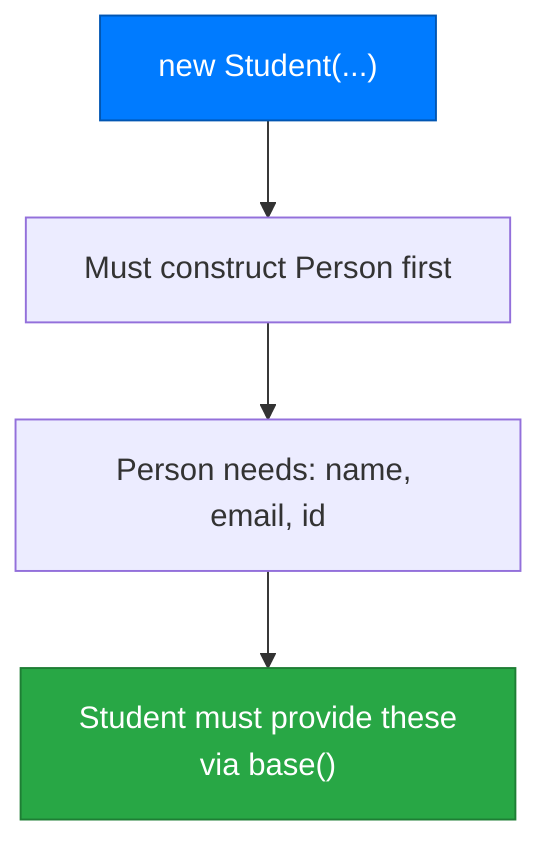
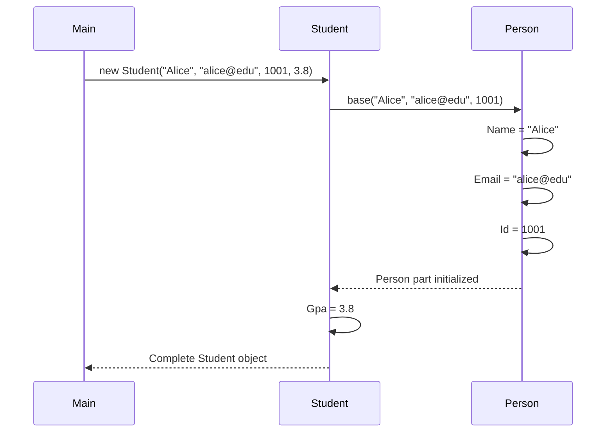
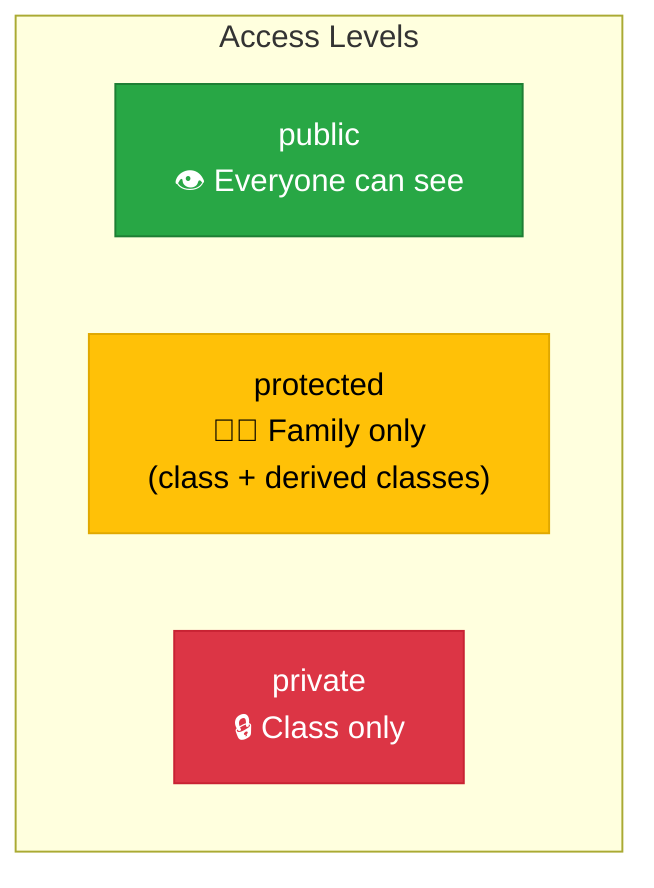

# Lecture 2: Constructors, `protected`, and the `base` Keyword

[← Previous: Lecture 1 – Why Inheritance? Base and Derived Classes](./lecture-1.md) | [Back to Week 9 Overview](./README.md) | [Next: Lecture 3 – Method Overriding and the `object` Class →](./lecture-3.md)

---

## Lecture Overview

| Item | Detail |
|------|--------|
| Duration | 45 minutes |
| Topics | Constructor chaining with `base()`, the `protected` access modifier, accessing parent members with `base` |
| Preparation | Completed Lecture 1 — comfortable creating base and derived classes with inheritance |

---

## 1. The Constructor Problem

In Lecture 1, we created objects and set properties manually:

```csharp
Student alice = new Student();
alice.Name = "Alice Johnson";
alice.Email = "alice@school.edu";
alice.Id = 1001;
alice.Gpa = 3.8;
```

From Week 7, you know that **constructors** let you set values at creation time. But with inheritance, there's a catch — the base class needs to be initialized too. Let's see what happens.

### Adding a Constructor to the Base Class

```csharp
class Person
{
    public string Name { get; set; }
    public string Email { get; set; }
    public int Id { get; set; }

    public Person(string name, string email, int id)
    {
        Name = name;
        Email = email;
        Id = id;
    }
}
```

Now try creating a derived class:

```csharp
class Student : Person    // ❌ Compile error!
{
    public double Gpa { get; set; }
}
```

This won't compile. The error says something like: **"There is no argument given that corresponds to the required formal parameter 'name' of 'Person.Person(string, string, int)'"**.

### Why Does This Happen?

When you create a `Student` object, C# must also construct the `Person` part of it. Since `Person` has a parameterized constructor (and no default constructor), C# doesn't know what values to pass. You need to tell it explicitly.



---

## 2. Constructor Chaining with `base()`

To fix this, the derived class constructor must call the base class constructor using the **`base()` keyword**:

```csharp
class Person
{
    public string Name { get; set; }
    public string Email { get; set; }
    public int Id { get; set; }

    public Person(string name, string email, int id)
    {
        Name = name;
        Email = email;
        Id = id;
    }
}

class Student : Person
{
    public double Gpa { get; set; }

    public Student(string name, string email, int id, double gpa)
        : base(name, email, id)    // Pass to Person's constructor
    {
        Gpa = gpa;                 // Handle Student-specific property
    }
}

class Teacher : Person
{
    public string Department { get; set; }

    public Teacher(string name, string email, int id, string department)
        : base(name, email, id)    // Pass to Person's constructor
    {
        Department = department;   // Handle Teacher-specific property
    }
}
```

### How It Works



The flow is:
1. You call `new Student("Alice", "alice@edu", 1001, 3.8)`
2. The `Student` constructor runs, but **first** it calls `base("Alice", "alice@edu", 1001)`
3. The `Person` constructor runs and sets `Name`, `Email`, `Id`
4. Control returns to the `Student` constructor, which sets `Gpa`

### Using the Constructors

```csharp
Student alice = new Student("Alice Johnson", "alice@school.edu", 1001, 3.8);
Teacher bob = new Teacher("Bob Smith", "bob@school.edu", 2001, "Computer Science");

Console.WriteLine($"{alice.Name} — GPA: {alice.Gpa}");
Console.WriteLine($"{bob.Name} — Dept: {bob.Department}");
```

**Output:**
```
Alice Johnson — GPA: 3.8
Bob Smith — Dept: Computer Science
```

> 💡 **Think of it like building a house:** The `Person` constructor lays the foundation (name, email, id). The `Student` constructor then builds the second floor (GPA, major). You can't build the second floor without the foundation.

---

## 3. What If the Base Class Has a Default Constructor?

If the base class has a **parameterless constructor** (or no explicit constructors at all), you don't need to call `base()` — C# does it automatically:

```csharp
class Animal
{
    public string Name { get; set; }

    // No explicit constructor → C# provides a default one
}

class Dog : Animal
{
    public string Breed { get; set; }

    public Dog(string name, string breed)
    {
        // base() is called automatically (default constructor)
        Name = name;     // Inherited property
        Breed = breed;   // Dog-specific property
    }
}
```

But if the base class only has a **parameterized** constructor, the derived class **must** call `base(...)` explicitly.

| Base Class Has... | Derived Class Must... |
|-------------------|-----------------------|
| No explicit constructors | Nothing — default `base()` is called automatically |
| A parameterless constructor | Nothing — default `base()` is called automatically |
| Only parameterized constructor(s) | Call `base(...)` explicitly in every constructor |
| Both default and parameterized | Choose which to call (default `base()` if none specified) |

---

## 4. Multiple Constructors in a Hierarchy

A derived class can have multiple constructors, each calling `base()` differently:

```csharp
class Person
{
    public string Name { get; set; }
    public string Email { get; set; }
    public int Id { get; set; }

    public Person(string name, string email, int id)
    {
        Name = name;
        Email = email;
        Id = id;
    }

    public Person(string name, int id)
    {
        Name = name;
        Email = "not provided";
        Id = id;
    }
}

class Student : Person
{
    public double Gpa { get; set; }

    // Full constructor
    public Student(string name, string email, int id, double gpa)
        : base(name, email, id)
    {
        Gpa = gpa;
    }

    // Simplified constructor (no email)
    public Student(string name, int id, double gpa)
        : base(name, id)
    {
        Gpa = gpa;
    }

    // Minimal constructor
    public Student(string name, int id)
        : base(name, id)
    {
        Gpa = 0.0;
    }
}
```

```csharp
Student s1 = new Student("Alice", "alice@edu", 1001, 3.8);
Student s2 = new Student("Bob", 1002, 3.2);
Student s3 = new Student("Charlie", 1003);

Console.WriteLine($"{s1.Name} — Email: {s1.Email}, GPA: {s1.Gpa}");
Console.WriteLine($"{s2.Name} — Email: {s2.Email}, GPA: {s2.Gpa}");
Console.WriteLine($"{s3.Name} — Email: {s3.Email}, GPA: {s3.Gpa}");
```

**Output:**
```
Alice — Email: alice@edu, GPA: 3.8
Bob — Email: not provided, GPA: 3.2
Charlie — Email: not provided, GPA: 0
```

---

## 5. The `protected` Access Modifier

You've used `public` (anyone can access) and `private` (only the class itself can access). There's a third option that becomes important with inheritance: **`protected`**.

| Modifier | Same Class | Derived Class | Outside Code |
|----------|-----------|---------------|-------------|
| `public` | ✅ | ✅ | ✅ |
| `protected` | ✅ | ✅ | ❌ |
| `private` | ✅ | ❌ | ❌ |

`protected` means: **accessible within the class and by any class that inherits from it, but not from outside code.**

### When to Use `protected`

Use `protected` for members that:
- Should **not** be accessible from outside the class hierarchy
- **Need** to be accessed by derived classes

```csharp
class BankAccount
{
    public string Owner { get; set; }
    public decimal Balance { get; protected set; }  // Read publicly, write only internally

    public BankAccount(string owner, decimal initialBalance)
    {
        Owner = owner;
        Balance = initialBalance;
    }

    public void Deposit(decimal amount)
    {
        if (amount > 0)
            Balance += amount;
    }
}

class SavingsAccount : BankAccount
{
    public decimal InterestRate { get; set; }

    public SavingsAccount(string owner, decimal initialBalance, decimal interestRate)
        : base(owner, initialBalance)
    {
        InterestRate = interestRate;
    }

    public void ApplyInterest()
    {
        decimal interest = Balance * InterestRate;  // ✅ Can access Balance (protected set)
        Balance += interest;                        // ✅ Can modify Balance (protected set)
        Console.WriteLine($"Interest applied: {interest:C}. New balance: {Balance:C}");
    }
}
```

```csharp
SavingsAccount savings = new SavingsAccount("Alice", 1000m, 0.05m);
Console.WriteLine($"Balance: {savings.Balance:C}");   // ✅ Can READ (public get)
// savings.Balance = 999999m;                          // ❌ Can't WRITE (protected set)
savings.ApplyInterest();
```

**Output:**
```
Balance: $1,000.00
Interest applied: $50.00. New balance: $1,050.00
```



---

## 6. Protected Fields vs. Protected Properties

You can make either fields or properties `protected`. The common patterns:

### Pattern 1: Protected property setter (most common)

```csharp
public decimal Balance { get; protected set; }
```

Readable by everyone, writable only by the class and its derived classes.

### Pattern 2: Protected field with public property

```csharp
class Person
{
    protected int age;  // Derived classes can access directly

    public int Age
    {
        get { return age; }
        set
        {
            if (value >= 0 && value <= 120)
                age = value;
        }
    }
}
```

The property validation still applies when setting from outside, but derived classes can access the field directly if needed.

### General Guideline

Prefer **protected property setters** over protected fields. They maintain encapsulation while giving derived classes the access they need.

---

## 7. Complete Example: Employee Hierarchy

Let's put constructor chaining and `protected` together in a realistic example:

```csharp
class Employee
{
    public string Name { get; set; }
    public int EmployeeId { get; set; }
    public decimal BaseSalary { get; protected set; }

    public Employee(string name, int employeeId, decimal baseSalary)
    {
        Name = name;
        EmployeeId = employeeId;
        BaseSalary = baseSalary;
    }

    public void PrintSummary()
    {
        Console.WriteLine($"[{EmployeeId}] {Name} — Base Salary: {BaseSalary:C}");
    }
}

class Manager : Employee
{
    public int TeamSize { get; set; }
    public decimal Bonus { get; set; }

    public Manager(string name, int id, decimal baseSalary, int teamSize, decimal bonus)
        : base(name, id, baseSalary)
    {
        TeamSize = teamSize;
        Bonus = bonus;
    }

    public decimal GetTotalCompensation()
    {
        return BaseSalary + Bonus;  // Can access BaseSalary (protected set)
    }

    public void PrintManagerInfo()
    {
        PrintSummary();  // Inherited method
        Console.WriteLine($"  Team Size: {TeamSize}, Bonus: {Bonus:C}");
        Console.WriteLine($"  Total Compensation: {GetTotalCompensation():C}");
    }
}

class Intern : Employee
{
    public string University { get; set; }
    public int DurationMonths { get; set; }

    public Intern(string name, int id, decimal baseSalary, string university, int months)
        : base(name, id, baseSalary)
    {
        University = university;
        DurationMonths = months;
    }

    public void PrintInternInfo()
    {
        PrintSummary();  // Inherited method
        Console.WriteLine($"  University: {University}, Duration: {DurationMonths} months");
    }
}
```

```csharp
Manager mgr = new Manager("Sarah Lee", 3001, 85000m, 8, 15000m);
Intern intern = new Intern("Jake Chen", 5001, 25000m, "MIT", 6);

mgr.PrintManagerInfo();
Console.WriteLine();
intern.PrintInternInfo();
```

**Output:**
```
[3001] Sarah Lee — Base Salary: $85,000.00
  Team Size: 8, Bonus: $15,000.00
  Total Compensation: $100,000.00

[5001] Jake Chen — Base Salary: $25,000.00
  University: MIT, Duration: 6 months
```

---

## Key Takeaways

- When a base class has a parameterized constructor, derived classes **must** call it using `: base(...)`
- The base constructor runs **first**, then the derived constructor completes
- `protected` members are accessible in the class and its derived classes, but not from outside
- Use **protected property setters** to let derived classes modify inherited data while keeping encapsulation
- A derived class can have **multiple constructors**, each calling a different base constructor
- Think of constructor chaining as **building floors**: foundation (base) first, then upper floors (derived)

---

## Hands-On Exercises

### Exercise 1 — Animal with Constructors
Revisit your `Animal` hierarchy from Lecture 1. Add a constructor to `Animal` that takes `name` and `age`. Then update `Dog` and `Cat` to use `: base(name, age)` in their constructors while also accepting their own parameters (`breed` for Dog, `isIndoor` for Cat).

### Exercise 2 — Protected Balance
Create a `BankAccount` class with a `protected` `Balance` property setter. Create a `CheckingAccount` derived class with a `Withdraw(decimal amount)` method that reduces the balance (with validation — can't go below 0). Test depositing and withdrawing.

### Exercise 3 — Constructor Chain Trace
Trace through this code and predict the output. Then run it to verify:

```csharp
class A
{
    public A()
    {
        Console.WriteLine("A constructor");
    }
}

class B : A
{
    public B() 
    {
        Console.WriteLine("B constructor");
    }
}

class C : B
{
    public C()
    {
        Console.WriteLine("C constructor");
    }
}

C obj = new C();
```

---

[← Previous: Lecture 1 – Why Inheritance? Base and Derived Classes](./lecture-1.md) | [Back to Week 9 Overview](./README.md) | [Next: Lecture 3 – Method Overriding and the `object` Class →](./lecture-3.md)
