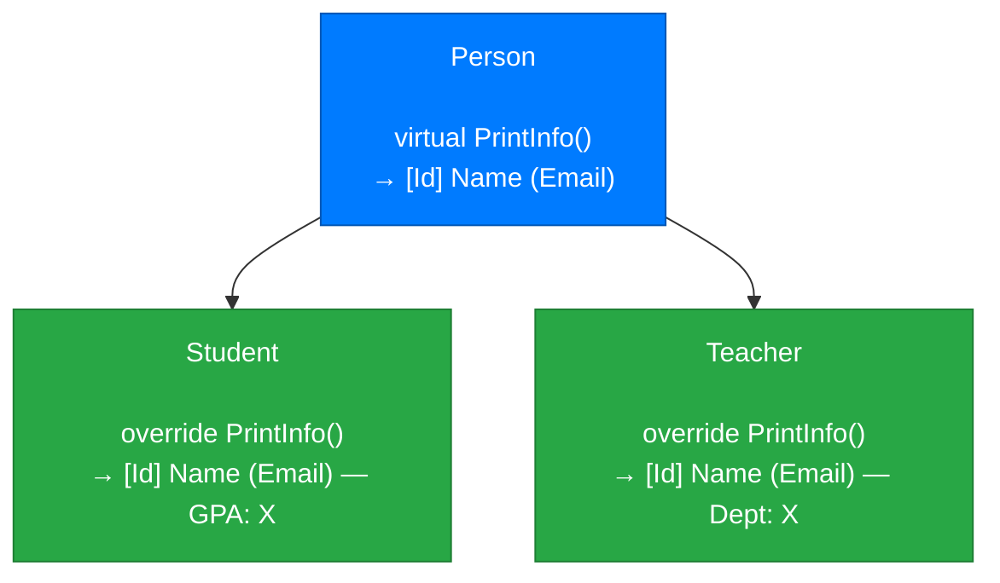
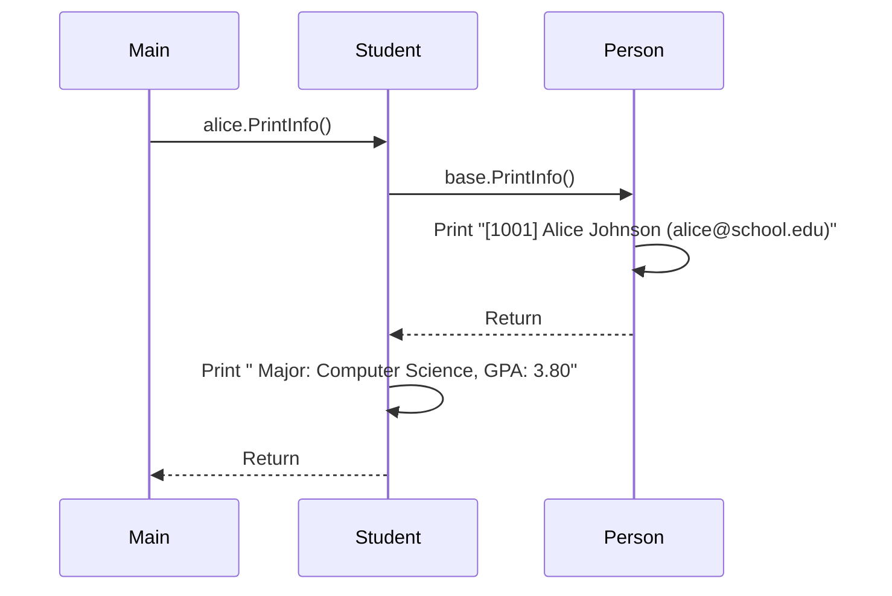
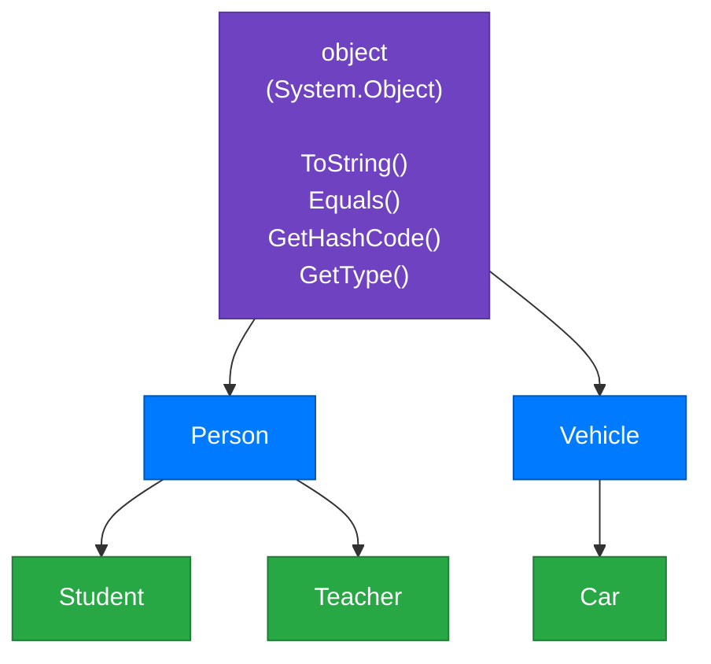
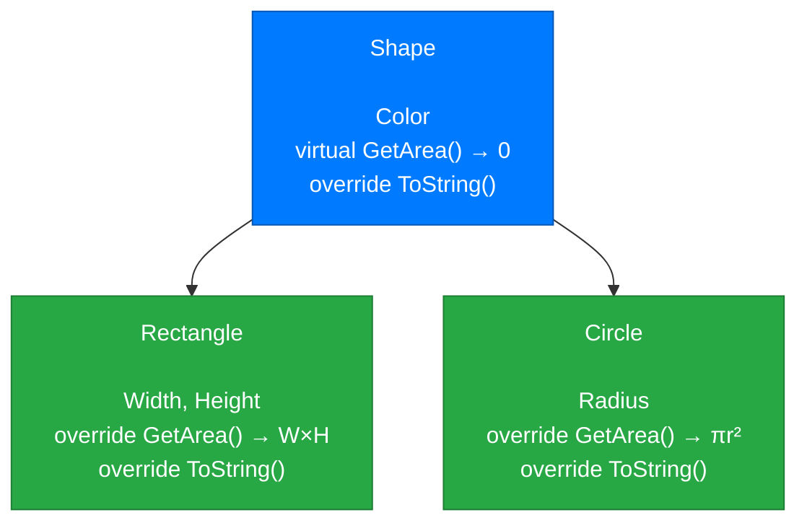

# Lecture 3: Method Overriding and the `object` Class

[← Previous: Lecture 2 – Constructors, `protected`, and the `base` Keyword](./lecture-2.md) | [Back to Week 9 Overview](./README.md)

---

## Lecture Overview

| Item | Detail |
|------|--------|
| Duration | 45 minutes |
| Topics | `virtual` and `override` keywords, calling base methods, the `object` class, overriding `ToString()` |
| Preparation | Completed Lectures 1 & 2 — comfortable with inheritance, constructor chaining, and `protected` |

---

## 1. The Problem: Inherited Methods Don't Always Fit

In Lecture 1, we had a `Person` class with a `PrintInfo()` method:

```csharp
class Person
{
    public string Name { get; set; }
    public string Email { get; set; }
    public int Id { get; set; }

    public Person(string name, string email, int id)
    {
        Name = name;
        Email = email;
        Id = id;
    }

    public void PrintInfo()
    {
        Console.WriteLine($"[{Id}] {Name} ({Email})");
    }
}
```

When `Student` inherits from `Person`, it gets `PrintInfo()` — but this method doesn't show the student's GPA. You might want `Student` to print something different:

```
[1001] Alice Johnson (alice@school.edu) — GPA: 3.80
```

How do you **change** the behavior of an inherited method? That's what **method overriding** does.

---

## 2. Method Overriding: `virtual` and `override`

To allow a derived class to change the behavior of an inherited method, you need two keywords:

1. **`virtual`** — on the base class method: "This method **can** be overridden by derived classes"
2. **`override`** — on the derived class method: "I'm **replacing** the base class version of this method"

```csharp
class Person
{
    public string Name { get; set; }
    public string Email { get; set; }
    public int Id { get; set; }

    public Person(string name, string email, int id)
    {
        Name = name;
        Email = email;
        Id = id;
    }

    public virtual void PrintInfo()    // virtual = "can be overridden"
    {
        Console.WriteLine($"[{Id}] {Name} ({Email})");
    }
}

class Student : Person
{
    public double Gpa { get; set; }

    public Student(string name, string email, int id, double gpa)
        : base(name, email, id)
    {
        Gpa = gpa;
    }

    public override void PrintInfo()    // override = "replacing the base version"
    {
        Console.WriteLine($"[{Id}] {Name} ({Email}) — GPA: {Gpa:F2}");
    }
}

class Teacher : Person
{
    public string Department { get; set; }

    public Teacher(string name, string email, int id, string department)
        : base(name, email, id)
    {
        Department = department;
    }

    public override void PrintInfo()    // Different override for Teacher
    {
        Console.WriteLine($"[{Id}] {Name} ({Email}) — Dept: {Department}");
    }
}
```

```csharp
Person p = new Person("Generic Person", "person@email.com", 0);
Student alice = new Student("Alice Johnson", "alice@school.edu", 1001, 3.8);
Teacher bob = new Teacher("Bob Smith", "bob@school.edu", 2001, "Computer Science");

p.PrintInfo();
alice.PrintInfo();
bob.PrintInfo();
```

**Output:**
```
[0] Generic Person (person@email.com)
[1001] Alice Johnson (alice@school.edu) — GPA: 3.80
[2001] Bob Smith (bob@school.edu) — Dept: Computer Science
```

Each class has its **own version** of `PrintInfo()`. The correct version is called based on the object's actual type.



---

## 3. The Rules of Overriding

Method overriding has strict rules:

| Rule | Description |
|------|-------------|
| Base method must be `virtual` | You can only override methods that are marked as `virtual` |
| Derived method must use `override` | Forgetting `override` creates a *new* method instead of replacing the old one |
| Same signature required | The overriding method must have the **same name, return type, and parameters** |
| Access level must match | Can't change `public` to `private` when overriding |

### Common Mistake: Forgetting `virtual`

```csharp
class Person
{
    public void PrintInfo() { ... }     // NOT virtual
}

class Student : Person
{
    public override void PrintInfo() { ... }    // ❌ Compile error!
}
```

### Common Mistake: Forgetting `override`

```csharp
class Person
{
    public virtual void PrintInfo() { ... }
}

class Student : Person
{
    public void PrintInfo() { ... }    // ⚠️ Warning: this HIDES the base method
}
```

Without `override`, you're creating a completely separate method that happens to have the same name. C# will give you a warning about this. The behavior you'd see would be confusing — which version gets called depends on the variable type, not the object type. Always use `override` when you intend to replace.

---

## 4. Calling the Base Method with `base`

Sometimes you don't want to completely replace the base method — you want to **extend** it. Use `base.MethodName()` to call the parent's version:

```csharp
class Person
{
    public string Name { get; set; }
    public string Email { get; set; }
    public int Id { get; set; }

    public Person(string name, string email, int id)
    {
        Name = name;
        Email = email;
        Id = id;
    }

    public virtual void PrintInfo()
    {
        Console.WriteLine($"[{Id}] {Name} ({Email})");
    }
}

class Student : Person
{
    public double Gpa { get; set; }
    public string Major { get; set; }

    public Student(string name, string email, int id, double gpa, string major)
        : base(name, email, id)
    {
        Gpa = gpa;
        Major = major;
    }

    public override void PrintInfo()
    {
        base.PrintInfo();    // Call Person's PrintInfo() first
        Console.WriteLine($"  Major: {Major}, GPA: {Gpa:F2}");  // Then add Student details
    }
}
```

```csharp
Student alice = new Student("Alice Johnson", "alice@school.edu", 1001, 3.8, "Computer Science");
alice.PrintInfo();
```

**Output:**
```
[1001] Alice Johnson (alice@school.edu)
  Major: Computer Science, GPA: 3.80
```

This pattern is very useful: **reuse the base behavior, then add to it**.



> 💡 **Analogy:** Think of `base.PrintInfo()` like calling your parent for the family recipe, then adding your own twist to it. You get the foundation and build on top.

---

## 5. The `object` Class: The Root of Everything

In C#, **every class inherits from `object`**, whether you write `: object` or not. The `object` class sits at the top of every inheritance hierarchy:



This means **every object** in C# has these methods:

| Method | Purpose |
|--------|---------|
| `ToString()` | Returns a string representation of the object |
| `Equals(object)` | Checks if two objects are equal |
| `GetHashCode()` | Returns a hash code (used in dictionaries/sets) |
| `GetType()` | Returns the type of the object |

### The Default `ToString()`

By default, `ToString()` returns the fully qualified class name:

```csharp
Student alice = new Student("Alice", "alice@edu", 1001, 3.8, "CS");
Console.WriteLine(alice.ToString());
Console.WriteLine(alice);    // Console.WriteLine calls ToString() automatically
```

**Output:**
```
Student
Student
```

Not very useful. That's why you'll want to **override** it.

---

## 6. Overriding `ToString()` — The Most Common Override

Since `ToString()` is defined as `virtual` in the `object` class, any class can override it:

```csharp
class Person
{
    public string Name { get; set; }
    public string Email { get; set; }
    public int Id { get; set; }

    public Person(string name, string email, int id)
    {
        Name = name;
        Email = email;
        Id = id;
    }

    public override string ToString()
    {
        return $"[{Id}] {Name} ({Email})";
    }
}

class Student : Person
{
    public double Gpa { get; set; }

    public Student(string name, string email, int id, double gpa)
        : base(name, email, id)
    {
        Gpa = gpa;
    }

    public override string ToString()
    {
        return $"{base.ToString()} — GPA: {Gpa:F2}";
    }
}
```

```csharp
Student alice = new Student("Alice Johnson", "alice@school.edu", 1001, 3.8);

Console.WriteLine(alice);                      // Calls ToString() automatically
Console.WriteLine($"Student info: {alice}");   // Also calls ToString() in interpolation
```

**Output:**
```
[1001] Alice Johnson (alice@school.edu) — GPA: 3.80
Student info: [1001] Alice Johnson (alice@school.edu) — GPA: 3.80
```

> 💡 **Why `ToString()` matters:** `Console.WriteLine()`, string interpolation (`$"...{object}..."`), and many other parts of C# automatically call `ToString()`. By overriding it, your objects "know how to describe themselves" wherever they're used.

### Best Practice: Always Override `ToString()`

For any class you create, override `ToString()` to return a meaningful description. This makes debugging much easier and makes your objects work naturally with `Console.WriteLine()` and string formatting.

---

## 7. Complete Example: Shape Hierarchy with Overrides

Let's put everything together with a more complex example:

```csharp
class Shape
{
    public string Color { get; set; }

    public Shape(string color)
    {
        Color = color;
    }

    public virtual double GetArea()
    {
        return 0;  // Base shapes have no area
    }

    public override string ToString()
    {
        return $"{Color} Shape (Area: {GetArea():F2})";
    }
}

class Rectangle : Shape
{
    public double Width { get; set; }
    public double Height { get; set; }

    public Rectangle(string color, double width, double height)
        : base(color)
    {
        Width = width;
        Height = height;
    }

    public override double GetArea()
    {
        return Width * Height;
    }

    public override string ToString()
    {
        return $"{Color} Rectangle ({Width} × {Height}, Area: {GetArea():F2})";
    }
}

class Circle : Shape
{
    public double Radius { get; set; }

    public Circle(string color, double radius)
        : base(color)
    {
        Radius = radius;
    }

    public override double GetArea()
    {
        return Math.PI * Radius * Radius;
    }

    public override string ToString()
    {
        return $"{Color} Circle (Radius: {Radius}, Area: {GetArea():F2})";
    }
}
```

```csharp
Rectangle rect = new Rectangle("Blue", 5, 3);
Circle circle = new Circle("Red", 4);

Console.WriteLine(rect);
Console.WriteLine(circle);
Console.WriteLine();
Console.WriteLine($"Rectangle area: {rect.GetArea():F2}");
Console.WriteLine($"Circle area: {circle.GetArea():F2}");
```

**Output:**
```
Blue Rectangle (5 × 3, Area: 15.00)
Red Circle (Radius: 4, Area: 50.27)

Rectangle area: 15.00
Circle area: 50.27
```



---

## 8. Multi-Level Inheritance and Override Chains

Overrides can chain across multiple levels:

```csharp
class Animal
{
    public string Name { get; set; }

    public Animal(string name) { Name = name; }

    public virtual string Speak()
    {
        return $"{Name} makes a sound";
    }

    public override string ToString()
    {
        return $"{Name} ({GetType().Name})";
    }
}

class Dog : Animal
{
    public string Breed { get; set; }

    public Dog(string name, string breed) : base(name)
    {
        Breed = breed;
    }

    public override string Speak()
    {
        return $"{Name} barks: Woof!";
    }
}

class GuideDog : Dog
{
    public string Handler { get; set; }

    public GuideDog(string name, string breed, string handler) 
        : base(name, breed)
    {
        Handler = handler;
    }

    public override string Speak()
    {
        return $"{base.Speak()} (quietly — working dog)";
    }
}
```

```csharp
Animal generic = new Animal("Generic Animal");
Dog rex = new Dog("Rex", "German Shepherd");
GuideDog buddy = new GuideDog("Buddy", "Labrador", "Sarah");

Console.WriteLine(generic.Speak());
Console.WriteLine(rex.Speak());
Console.WriteLine(buddy.Speak());
Console.WriteLine();
Console.WriteLine(generic);
Console.WriteLine(rex);
Console.WriteLine(buddy);
```

**Output:**
```
Generic Animal makes a sound
Rex barks: Woof!
Rex barks: Woof! (quietly — working dog)

Generic Animal (Animal)
Rex (Dog)
Buddy (GuideDog)
```

Notice how `GuideDog.Speak()` calls `base.Speak()` (which is `Dog.Speak()`), building on top of it. And `GetType().Name` returns the actual runtime type of the object.

---

## Key Takeaways

- Mark base class methods as **`virtual`** to allow overriding
- Use **`override`** in derived classes to replace the base implementation
- The overriding method must have the **same signature** as the virtual method
- Use **`base.MethodName()`** to call the parent's version from within an override
- **Every class inherits from `object`**, giving it `ToString()`, `Equals()`, `GetHashCode()`, and `GetType()`
- Always **override `ToString()`** in your classes to provide meaningful string representations
- Overrides can chain across **multiple levels** of inheritance
- `Console.WriteLine()` and string interpolation automatically call `ToString()`

---

## Hands-On Exercises

### Exercise 1 — Animal Sounds
Create an `Animal` base class with a `virtual` method `MakeSound()` that returns `"..."`. Create `Dog` (returns `"Woof!"`), `Cat` (returns `"Meow!"`), and `Bird` (returns `"Tweet!"`) derived classes that override `MakeSound()`. Create one of each and print their sounds.

### Exercise 2 — ToString() Practice
Add `ToString()` overrides to the `Dog` and `Cat` classes from Exercise 1. The output should be: `"Rex the German Shepherd says: Woof!"` and `"Whiskers the Indoor Cat says: Meow!"`.

### Exercise 3 — base.Method() Chain
Create this hierarchy and predict the output:
```csharp
class A
{
    public virtual string Greet() { return "Hello from A"; }
}

class B : A
{
    public override string Greet() { return base.Greet() + " → and B"; }
}

class C : B
{
    public override string Greet() { return base.Greet() + " → and C"; }
}

C obj = new C();
Console.WriteLine(obj.Greet());
```

---

[← Previous: Lecture 2 – Constructors, `protected`, and the `base` Keyword](./lecture-2.md) | [Back to Week 9 Overview](./README.md)
