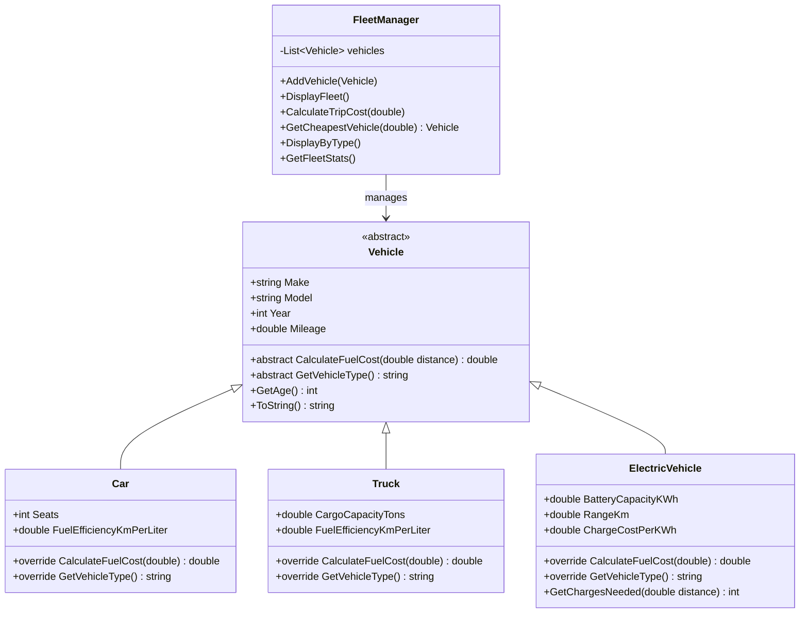

# Week 10 – Assignment: Vehicle Fleet Manager

[← Back to Week 10 Overview](./README.md)

---

## 📋 Overview

Build a **Vehicle Fleet Manager** — a console application that manages a fleet of different vehicle types using abstract classes, polymorphism, and type checking. The application lets you add vehicles, display the fleet, calculate costs, and filter by vehicle type.

This assignment brings together everything from Weeks 7–10: classes, encapsulation, inheritance, polymorphism, abstract classes, and type checking.

---

## 🎯 Requirements

### The Class Hierarchy



### 1. Abstract `Vehicle` Class

| Member | Type | Description |
|--------|------|-------------|
| `Make` | `string` property | Vehicle manufacturer |
| `Model` | `string` property | Vehicle model name |
| `Year` | `int` property | Year of manufacture |
| `Mileage` | `double` property | Current mileage in km |
| Constructor | parameterized | Sets all four properties |
| `CalculateFuelCost(double distance)` | abstract method | Returns the cost to travel `distance` km |
| `GetVehicleType()` | abstract method | Returns a string like `"Car"`, `"Truck"`, `"Electric"` |
| `GetAge()` | concrete method | Returns `2026 - Year` |
| `ToString()` | override | Returns `"[Type] Year Make Model (Mileage km)"` |

### 2. `Car` Class (inherits `Vehicle`)

| Member | Description |
|--------|-------------|
| `Seats` | Number of passenger seats |
| `FuelEfficiencyKmPerLiter` | How many km per liter of fuel |
| `CalculateFuelCost()` | `(distance / FuelEfficiencyKmPerLiter) * fuelPricePerLiter` — use **$1.80** per liter |
| `GetVehicleType()` | Returns `"Car"` |

### 3. `Truck` Class (inherits `Vehicle`)

| Member | Description |
|--------|-------------|
| `CargoCapacityTons` | Maximum cargo weight in tons |
| `FuelEfficiencyKmPerLiter` | How many km per liter of fuel |
| `CalculateFuelCost()` | Same formula as `Car` but use **$1.95** per liter (diesel) |
| `GetVehicleType()` | Returns `"Truck"` |

### 4. `ElectricVehicle` Class (inherits `Vehicle`)

| Member | Description |
|--------|-------------|
| `BatteryCapacityKWh` | Battery capacity in kilowatt-hours |
| `RangeKm` | Range on a full charge |
| `ChargeCostPerKWh` | Cost per kWh to charge |
| `CalculateFuelCost()` | `GetChargesNeeded(distance) * BatteryCapacityKWh * ChargeCostPerKWh` |
| `GetChargesNeeded(double distance)` | Returns `(int)Math.Ceiling(distance / RangeKm)` |
| `GetVehicleType()` | Returns `"Electric"` |

### 5. `FleetManager` Class

This class manages a `List<Vehicle>` and provides these methods:

| Method | Description |
|--------|-------------|
| `AddVehicle(Vehicle v)` | Adds a vehicle to the fleet |
| `DisplayFleet()` | Prints all vehicles using `ToString()` |
| `CalculateTripCost(double distance)` | Prints the fuel cost for each vehicle to travel the given distance |
| `GetCheapestVehicle(double distance)` | Returns the vehicle with the lowest fuel cost for the distance |
| `DisplayByType()` | Groups vehicles by type using `is` pattern matching and displays type-specific info |
| `GetFleetStats()` | Prints: total vehicles, average age, average mileage, count by type |

### 6. Menu-Driven Console Application

```
=== Vehicle Fleet Manager ===

1. Add a Vehicle
2. Display Fleet
3. Calculate Trip Cost
4. Find Cheapest Vehicle for Trip
5. Display by Type
6. Fleet Statistics
0. Exit

Choose an option:
```

When adding a vehicle, prompt for the type first, then the appropriate details.

---

## 📤 Sample Output

```
=== Vehicle Fleet Manager ===

1. Add a Vehicle
2. Display Fleet
...

Choose an option: 2

=== Fleet ===
[Car] 2022 Toyota Camry (35000 km)
[Car] 2023 Honda Civic (12000 km)
[Truck] 2021 Ford F-150 (68000 km)
[Electric] 2024 Tesla Model 3 (8000 km)

Choose an option: 3

Enter trip distance (km): 500

=== Trip Cost for 500 km ===
2022 Toyota Camry: $60.00
2023 Honda Civic: $50.00
2021 Ford F-150: $81.25
2024 Tesla Model 3: $24.00

Choose an option: 4

Enter trip distance (km): 500

Cheapest vehicle for 500 km: 2024 Tesla Model 3 at $24.00

Choose an option: 5

=== Cars (2) ===
  Toyota Camry — 5 seats, 15.0 km/L
  Honda Civic — 5 seats, 18.0 km/L

=== Trucks (1) ===
  Ford F-150 — 2.5 ton capacity, 12.0 km/L

=== Electric Vehicles (1) ===
  Tesla Model 3 — 60.0 kWh battery, 450 km range
  Charges needed for 500 km: 2

Choose an option: 6

=== Fleet Statistics ===
Total vehicles: 4
Average age: 3.5 years
Average mileage: 30750.0 km
Cars: 2 | Trucks: 1 | Electric: 1

Choose an option: 0

Goodbye!
```

---

## 🏗️ Starter Template

Use this as your starting point:

```csharp
using System;
using System.Collections.Generic;

// ============================================
// STEP 1: Abstract Vehicle class
// ============================================
abstract class Vehicle
{
    public string Make { get; set; }
    public string Model { get; set; }
    public int Year { get; set; }
    public double Mileage { get; set; }

    public Vehicle(string make, string model, int year, double mileage)
    {
        Make = make;
        Model = model;
        Year = year;
        Mileage = mileage;
    }

    public abstract double CalculateFuelCost(double distance);
    public abstract string GetVehicleType();

    public int GetAge()
    {
        return 2026 - Year;
    }

    public override string ToString()
    {
        return $"[{GetVehicleType()}] {Year} {Make} {Model} ({Mileage} km)";
    }
}

// ============================================
// STEP 2: Car class
// ============================================
// TODO: Create Car class inheriting from Vehicle
//       - Add Seats and FuelEfficiencyKmPerLiter properties
//       - Override CalculateFuelCost() using $1.80 per liter
//       - Override GetVehicleType() to return "Car"

// ============================================
// STEP 3: Truck class
// ============================================
// TODO: Create Truck class inheriting from Vehicle
//       - Add CargoCapacityTons and FuelEfficiencyKmPerLiter properties
//       - Override CalculateFuelCost() using $1.95 per liter
//       - Override GetVehicleType() to return "Truck"

// ============================================
// STEP 4: ElectricVehicle class
// ============================================
// TODO: Create ElectricVehicle class inheriting from Vehicle
//       - Add BatteryCapacityKWh, RangeKm, ChargeCostPerKWh properties
//       - Add GetChargesNeeded(double distance) method
//       - Override CalculateFuelCost()
//       - Override GetVehicleType() to return "Electric"

// ============================================
// STEP 5: FleetManager class
// ============================================
// TODO: Create FleetManager class
//       - Private List<Vehicle> field
//       - AddVehicle(), DisplayFleet(), CalculateTripCost()
//       - GetCheapestVehicle(), DisplayByType(), GetFleetStats()

// ============================================
// STEP 6: Program with menu
// ============================================
class Program
{
    static void Main()
    {
        FleetManager fleet = new FleetManager();

        // TODO: Pre-load some sample vehicles for testing
        // fleet.AddVehicle(new Car("Toyota", "Camry", 2022, 35000, 5, 15.0));
        // fleet.AddVehicle(new Truck("Ford", "F-150", 2021, 68000, 2.5, 12.0));
        // fleet.AddVehicle(new ElectricVehicle("Tesla", "Model 3", 2024, 8000, 60.0, 450, 0.20));

        bool running = true;
        while (running)
        {
            Console.WriteLine("\n=== Vehicle Fleet Manager ===\n");
            Console.WriteLine("1. Add a Vehicle");
            Console.WriteLine("2. Display Fleet");
            Console.WriteLine("3. Calculate Trip Cost");
            Console.WriteLine("4. Find Cheapest Vehicle for Trip");
            Console.WriteLine("5. Display by Type");
            Console.WriteLine("6. Fleet Statistics");
            Console.WriteLine("0. Exit");
            Console.Write("\nChoose an option: ");

            string choice = Console.ReadLine();

            switch (choice)
            {
                case "1":
                    // TODO: Prompt for vehicle type and details, then add
                    break;
                case "2":
                    fleet.DisplayFleet();
                    break;
                case "3":
                    // TODO: Prompt for distance, then call CalculateTripCost()
                    break;
                case "4":
                    // TODO: Prompt for distance, then call GetCheapestVehicle()
                    break;
                case "5":
                    fleet.DisplayByType();
                    break;
                case "6":
                    fleet.GetFleetStats();
                    break;
                case "0":
                    running = false;
                    Console.WriteLine("\nGoodbye!");
                    break;
                default:
                    Console.WriteLine("Invalid option. Try again.");
                    break;
            }
        }
    }
}
```

---

## 📊 Grading Rubric

| Criteria | Points |
|----------|--------|
| **Vehicle class** — abstract class with all required members, abstract methods, `GetAge()`, and `ToString()` | 10 |
| **Car class** — correct inheritance, constructor with `base()`, fuel cost calculation | 10 |
| **Truck class** — correct inheritance, constructor with `base()`, diesel fuel cost | 10 |
| **ElectricVehicle class** — correct inheritance, `GetChargesNeeded()`, charge-based cost | 15 |
| **FleetManager class** — `List<Vehicle>`, all six methods working correctly | 20 |
| **Polymorphism** — uses `List<Vehicle>` and processes all types through base type references | 10 |
| **Type checking** — uses `is` pattern matching in `DisplayByType()` and `GetFleetStats()` | 10 |
| **Menu system** — all options work, input validation, clean output | 10 |
| **Code quality** — clean formatting, meaningful names, comments on non-obvious logic | 5 |
| **Total** | **100** |

---

## 💡 Hints

1. **Start with the classes.** Get `Vehicle`, `Car`, `Truck`, and `ElectricVehicle` compiling before writing `FleetManager`.

2. **Test polymorphism early.** Before building the menu, create a few vehicles and put them in a `List<Vehicle>` to make sure `ToString()` and `CalculateFuelCost()` work polymorphically.

3. **`GetCheapestVehicle()` approach:** Loop through all vehicles, track the one with the lowest `CalculateFuelCost(distance)`.

4. **`DisplayByType()` approach:** Loop through all vehicles and use `is` with pattern matching:
   ```csharp
   if (vehicle is Car car)
       // print car-specific info
   else if (vehicle is Truck truck)
       // print truck-specific info
   else if (vehicle is ElectricVehicle ev)
       // print EV-specific info
   ```

5. **Input validation for "Add a Vehicle":** Use `int.TryParse()` and `double.TryParse()` to handle invalid input gracefully.

---

## 🌟 Bonus Challenges

1. **Maintenance Cost:** Add a `virtual CalculateMaintenanceCost()` method to `Vehicle` that estimates annual maintenance based on age and mileage. Override it in each derived class with different formulas (EVs are cheaper to maintain, trucks are more expensive).

2. **Fleet Comparison:** Add a `CompareVehicles(double distance)` method that displays all vehicles sorted by fuel cost for the given distance (cheapest first).

3. **Vehicle Search:** Add search functionality — find vehicles by make, by year range, or by mileage range.

4. **Trip Planner:** Add a `PlanTrip(double distance, double maxBudget)` method that shows which vehicles can make the trip within budget.

5. **Hybrid Vehicle:** Add a `HybridVehicle` class that has both `FuelEfficiencyKmPerLiter` and `BatteryRangeKm`. For short trips (within battery range), it uses electric mode (cheaper). For longer trips, it switches to fuel mode for the remaining distance.

---

[← Back to Week 10 Overview](./README.md)
