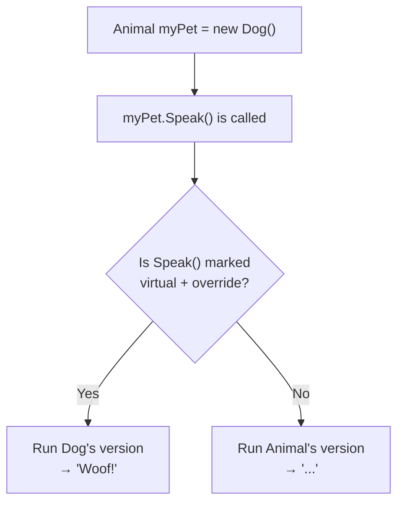
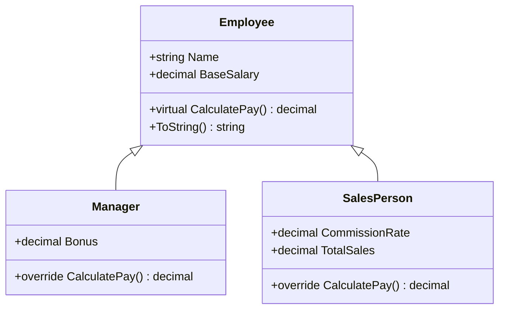

# Lecture 1: Polymorphism — One Type, Many Forms

[← Back to Week 10 Overview](./README.md) | [Next: Lecture 2 – Abstract Classes and Abstract Methods →](./lecture-2.md)

---

## Lecture Overview

| Item | Detail |
|------|--------|
| Duration | 45 minutes |
| Topics | What polymorphism is, base type references, virtual/override in action, polymorphic collections, the power of polymorphism |
| Preparation | Completed Week 9 — comfortable with inheritance, `virtual`, `override`, and `base()` |

---

## 1. Quick Recap: Where We Left Off

In Week 9, you learned that a derived class can **inherit** from a base class and **override** its behavior:

```csharp
class Animal
{
    public virtual string Speak()
    {
        return "...";
    }
}

class Dog : Animal
{
    public override string Speak()
    {
        return "Woof!";
    }
}

class Cat : Animal
{
    public override string Speak()
    {
        return "Meow!";
    }
}
```

You created `Dog` and `Cat` objects and called `Speak()` on each. But there's something much more powerful you can do with this setup — and that's what this week is all about.

---

## 2. What is Polymorphism?

**Polymorphism** comes from Greek: "poly" (many) + "morph" (form). In C#, it means a single variable of a base type can hold objects of **any** derived type, and when you call a method on it, the **correct version runs automatically**.

Here's the key insight:

```csharp
Animal myPet = new Dog();    // Base type variable, derived type object
Console.WriteLine(myPet.Speak());  // Output: Woof!
```

Wait — `myPet` is declared as `Animal`, but it holds a `Dog`. When we call `Speak()`, we get `"Woof!"` — not `"..."`. That's polymorphism. The variable type says `Animal`, but the **actual object** determines which method runs.

Let's see this more clearly:

```csharp
Animal pet1 = new Dog();
Animal pet2 = new Cat();
Animal pet3 = new Dog();

Console.WriteLine(pet1.Speak());  // Woof!
Console.WriteLine(pet2.Speak());  // Meow!
Console.WriteLine(pet3.Speak());  // Woof!
```

All three variables are type `Animal`, but each one behaves differently based on what object it actually holds.

### Why Does This Work?

This works because of the `virtual` and `override` keywords you learned in Week 9:



The rule is simple: if the method is `virtual` in the base class and `override` in the derived class, C# looks at the **actual object type** at runtime to decide which version to call. This is called **runtime polymorphism** or **late binding**.

---

## 3. Why Polymorphism Matters

You might think: "Why not just declare `Dog myPet = new Dog()`?" Great question. Polymorphism becomes essential when you need to work with **multiple different types through one common type**.

### The Problem Without Polymorphism

Imagine an animal shelter application. Without polymorphism, you'd need separate lists and separate logic for each type:

```csharp
// Without polymorphism — messy and hard to maintain
List<Dog> dogs = new List<Dog>();
List<Cat> cats = new List<Cat>();
List<Bird> birds = new List<Bird>();

// Separate loops for each type
foreach (Dog d in dogs)
    Console.WriteLine(d.Speak());
foreach (Cat c in cats)
    Console.WriteLine(c.Speak());
foreach (Bird b in birds)
    Console.WriteLine(b.Speak());
```

Every time you add a new animal type (Fish, Hamster, Snake), you need to add another list and another loop. This doesn't scale.

### The Solution With Polymorphism

```csharp
// With polymorphism — clean and extensible
List<Animal> shelter = new List<Animal>();
shelter.Add(new Dog());
shelter.Add(new Cat());
shelter.Add(new Bird());

// One loop handles them all
foreach (Animal animal in shelter)
{
    Console.WriteLine(animal.Speak());
}
```

**Output:**
```
Woof!
Meow!
Tweet!
```

One list. One loop. And if you add a new animal type next month, you don't change this code at all — you just add the new class and it works.

> **Key insight:** Polymorphism lets you write code once that works with any current or future derived type.

---

## 4. Polymorphic Collections in Practice

Let's build a more complete example. Here's an employee payroll system:

```csharp
class Employee
{
    public string Name { get; set; }
    public decimal BaseSalary { get; set; }

    public Employee(string name, decimal baseSalary)
    {
        Name = name;
        BaseSalary = baseSalary;
    }

    public virtual decimal CalculatePay()
    {
        return BaseSalary;
    }

    public override string ToString()
    {
        return $"{Name}: {CalculatePay():C}";
    }
}
```

```csharp
class Manager : Employee
{
    public decimal Bonus { get; set; }

    public Manager(string name, decimal baseSalary, decimal bonus)
        : base(name, baseSalary)
    {
        Bonus = bonus;
    }

    public override decimal CalculatePay()
    {
        return BaseSalary + Bonus;
    }
}
```

```csharp
class SalesPerson : Employee
{
    public decimal CommissionRate { get; set; }
    public decimal TotalSales { get; set; }

    public SalesPerson(string name, decimal baseSalary, decimal commissionRate, decimal totalSales)
        : base(name, baseSalary)
    {
        CommissionRate = commissionRate;
        TotalSales = totalSales;
    }

    public override decimal CalculatePay()
    {
        return BaseSalary + (CommissionRate * TotalSales);
    }
}
```

Now the payroll code is beautifully simple:

```csharp
List<Employee> employees = new List<Employee>();
employees.Add(new Employee("Alice", 3000m));
employees.Add(new Manager("Bob", 4000m, 1500m));
employees.Add(new SalesPerson("Carol", 2500m, 0.10m, 20000m));

decimal totalPayroll = 0;

foreach (Employee emp in employees)
{
    Console.WriteLine(emp);             // Calls ToString(), which calls CalculatePay()
    totalPayroll += emp.CalculatePay(); // Each type calculates differently
}

Console.WriteLine($"\nTotal Payroll: {totalPayroll:C}");
```

**Output:**
```
Alice: $3,000.00
Bob: $5,500.00
Carol: $4,500.00

Total Payroll: $13,000.00
```

### What's Happening Here



The `foreach` loop doesn't know or care whether each `Employee` is a `Manager`, a `SalesPerson`, or a regular `Employee`. It calls `CalculatePay()`, and each object does the right thing. That's polymorphism.

---

## 5. Polymorphism with Method Parameters

Polymorphism isn't just for collections. It works anywhere you use a base type — including method parameters:

```csharp
static void PrintPaySlip(Employee emp)
{
    Console.WriteLine("=== Pay Slip ===");
    Console.WriteLine($"Name: {emp.Name}");
    Console.WriteLine($"Pay:  {emp.CalculatePay():C}");
    Console.WriteLine();
}
```

You can pass any `Employee` subtype to this method:

```csharp
Manager bob = new Manager("Bob", 4000m, 1500m);
SalesPerson carol = new SalesPerson("Carol", 2500m, 0.10m, 20000m);

PrintPaySlip(bob);    // Works — Manager is an Employee
PrintPaySlip(carol);  // Works — SalesPerson is an Employee
```

The method accepts `Employee`, but it works correctly with any derived type. This is why inheritance uses the **"is-a"** relationship: a `Manager` **is an** `Employee`, so it can be used anywhere an `Employee` is expected.

---

## 6. What Happens Without `virtual` and `override`?

It's critical to understand what happens if you forget these keywords. Let's see:

```csharp
class Animal
{
    public string Speak()  // NOT virtual
    {
        return "...";
    }
}

class Dog : Animal
{
    public new string Speak()  // 'new' hides the base method
    {
        return "Woof!";
    }
}
```

```csharp
Dog rex = new Dog();
Console.WriteLine(rex.Speak());       // Woof! — called on Dog variable

Animal animal = rex;
Console.WriteLine(animal.Speak());    // ...  — called on Animal variable!
```

Without `virtual`/`override`, C# uses the **declared variable type** to decide which method to call — not the actual object type. The `new` keyword hides the base method instead of overriding it. This is almost always a bug.

> **Rule of thumb:** If you want polymorphism, always use `virtual` in the base class and `override` in derived classes. Avoid the `new` keyword on methods unless you have a very specific reason.

---

## 7. Complete Example — Shape Calculator

Let's put everything together with the classic Shape example:

```csharp
class Shape
{
    public string Color { get; set; }

    public Shape(string color)
    {
        Color = color;
    }

    public virtual double CalculateArea()
    {
        return 0;
    }

    public override string ToString()
    {
        return $"{GetType().Name} ({Color}) — Area: {CalculateArea():F2}";
    }
}

class Circle : Shape
{
    public double Radius { get; set; }

    public Circle(string color, double radius) : base(color)
    {
        Radius = radius;
    }

    public override double CalculateArea()
    {
        return Math.PI * Radius * Radius;
    }
}

class Rectangle : Shape
{
    public double Width { get; set; }
    public double Height { get; set; }

    public Rectangle(string color, double width, double height) : base(color)
    {
        Width = width;
        Height = height;
    }

    public override double CalculateArea()
    {
        return Width * Height;
    }
}

class Triangle : Shape
{
    public double Base { get; set; }
    public double Height { get; set; }

    public Triangle(string color, double baseLength, double height) : base(color)
    {
        Base = baseLength;
        Height = height;
    }

    public override double CalculateArea()
    {
        return 0.5 * Base * Height;
    }
}
```

```csharp
// Using polymorphism
List<Shape> shapes = new List<Shape>
{
    new Circle("Red", 5),
    new Rectangle("Blue", 4, 6),
    new Triangle("Green", 3, 8),
    new Circle("Yellow", 2.5)
};

Console.WriteLine("=== Shape Report ===\n");

double totalArea = 0;
foreach (Shape shape in shapes)
{
    Console.WriteLine(shape);  // Each shape prints its own info
    totalArea += shape.CalculateArea();
}

Console.WriteLine($"\nTotal Area: {totalArea:F2}");
```

**Output:**
```
=== Shape Report ===

Circle (Red) — Area: 78.54
Rectangle (Blue) — Area: 24.00
Triangle (Green) — Area: 12.00
Circle (Yellow) — Area: 19.63

Total Area: 134.17
```

Notice how `GetType().Name` in `ToString()` automatically shows the correct type name — another benefit of polymorphism.

---

## Key Takeaways

- **Polymorphism** means a base type variable can hold any derived type object, and method calls resolve to the actual object's version at runtime
- This requires `virtual` in the base class and `override` in derived classes
- Polymorphic collections (`List<BaseType>`) can store mixed derived types and process them uniformly
- Methods that accept a base type parameter work with any derived type — this is the "is-a" relationship in action
- Without `virtual`/`override`, method resolution uses the declared variable type (not what you want)
- Polymorphism makes code **extensible** — new derived types work with existing code without changes

---

## Hands-On Exercises

### Exercise 1 — Polymorphic Animal Sounds

Create an `Animal` base class with `Name` and a `virtual Speak()` method. Create `Dog`, `Cat`, and `Duck` derived classes that override `Speak()`. Store all three in a `List<Animal>` and loop through them, calling `Speak()` on each.

### Exercise 2 — Payment Processor

Create a `Payment` base class with `Amount` and a `virtual ProcessPayment()` method that returns a string. Create `CreditCardPayment` (adds a 2.5% fee), `BankTransfer` (no fee), and `CryptoPayment` (adds a 1% fee). Process a list of mixed payments and display the total including fees.

### Exercise 3 — Polymorphic Method Parameter

Write a method `static void DescribeShape(Shape shape)` that takes a `Shape` parameter and prints its type name, color, and area. Call it with `Circle`, `Rectangle`, and `Triangle` objects.

---

[Back to Week 10 Overview](./README.md) | [Next: Lecture 2 – Abstract Classes and Abstract Methods →](./lecture-2.md)
