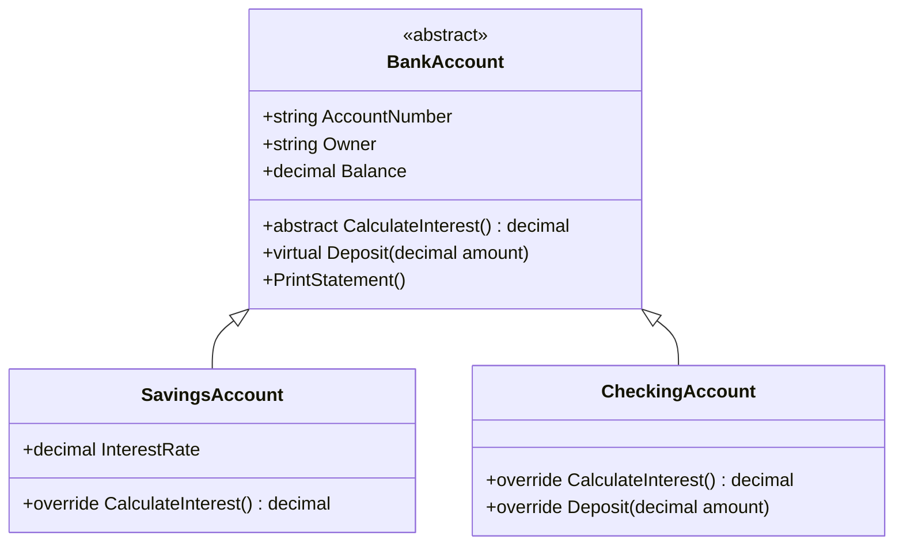
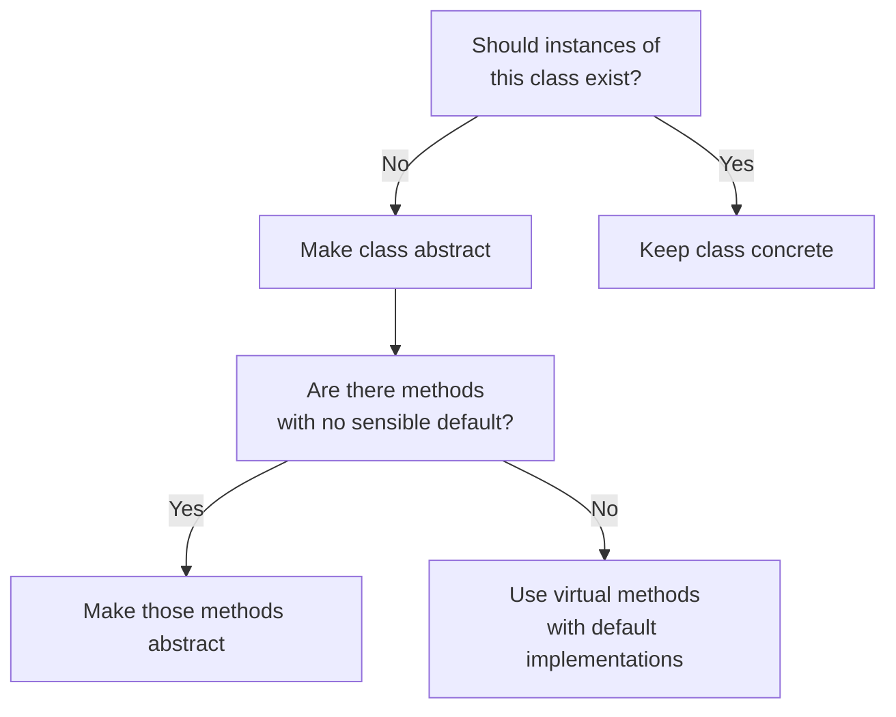

# Lecture 2: Abstract Classes and Abstract Methods

[← Previous: Lecture 1 – Polymorphism](./lecture-1.md) | [Back to Week 10 Overview](./README.md) | [Next: Lecture 3 – Type Checking, Casting, and Real-World Modeling →](./lecture-3.md)

---

## Lecture Overview

| Item | Detail |
|------|--------|
| Duration | 45 minutes |
| Topics | The problem with regular base classes, abstract classes, abstract methods, designing with abstraction, when to use abstract vs concrete base classes |
| Preparation | Completed Lecture 1 — comfortable with polymorphism and virtual/override |

---

## 1. The Problem with Our Current Approach

In Lecture 1, we wrote this `Shape` base class:

```csharp
class Shape
{
    public string Color { get; set; }

    public Shape(string color)
    {
        Color = color;
    }

    public virtual double CalculateArea()
    {
        return 0;  // What does this even mean?
    }
}
```

This works, but it has two problems:

**Problem 1: You can create a plain `Shape` object.**

```csharp
Shape s = new Shape("Red");  // What is this? A shape of what?
Console.WriteLine(s.CalculateArea());  // 0 — meaningless
```

A "shape" with no specific form doesn't make sense. You should only be able to create circles, rectangles, triangles — not a generic "shape."

**Problem 2: A derived class can forget to override `CalculateArea()`.**

```csharp
class Hexagon : Shape
{
    public Hexagon(string color) : base(color) { }

    // Oops — forgot to override CalculateArea()
    // It silently returns 0 from the base class
}
```

No error, no warning. The program runs, but the hexagon's area is always 0. This is a bug waiting to happen.

---

## 2. Abstract Classes to the Rescue

An **abstract class** solves both problems. It's a class that:

1. **Cannot be instantiated** — you can't create an object of an abstract class directly
2. **Can define abstract methods** — methods with no body that derived classes **must** implement

Here's the syntax:

```csharp
abstract class Shape
{
    public string Color { get; set; }

    public Shape(string color)
    {
        Color = color;
    }

    // Abstract method — no body, no curly braces
    public abstract double CalculateArea();

    public override string ToString()
    {
        return $"{GetType().Name} ({Color}) — Area: {CalculateArea():F2}";
    }
}
```

Two changes from before:

1. The class is marked `abstract`
2. `CalculateArea()` is marked `abstract` and has **no method body** — just a semicolon

### What Changes for Derived Classes?

Nothing much — derived classes still use `override`:

```csharp
class Circle : Shape
{
    public double Radius { get; set; }

    public Circle(string color, double radius) : base(color)
    {
        Radius = radius;
    }

    public override double CalculateArea()
    {
        return Math.PI * Radius * Radius;
    }
}

class Rectangle : Shape
{
    public double Width { get; set; }
    public double Height { get; set; }

    public Rectangle(string color, double width, double height) : base(color)
    {
        Width = width;
        Height = height;
    }

    public override double CalculateArea()
    {
        return Width * Height;
    }
}
```

### Problem 1 Solved — Can't Create Abstract Objects

```csharp
Shape s = new Shape("Red");  // ❌ Compile error: Cannot create an instance of the abstract type 'Shape'
```

The compiler blocks you. You must create a specific shape:

```csharp
Shape s = new Circle("Red", 5);  // ✅ This is fine
```

### Problem 2 Solved — Must Implement Abstract Methods

```csharp
class Hexagon : Shape
{
    public Hexagon(string color) : base(color) { }

    // ❌ Compile error: 'Hexagon' does not implement inherited abstract member 'Shape.CalculateArea()'
}
```

The compiler forces you to provide an implementation. No more silent bugs:

```csharp
class Hexagon : Shape
{
    public double SideLength { get; set; }

    public Hexagon(string color, double sideLength) : base(color)
    {
        SideLength = sideLength;
    }

    public override double CalculateArea()
    {
        // Area of regular hexagon: (3√3 / 2) × s²
        return (3 * Math.Sqrt(3) / 2) * SideLength * SideLength;
    }
}
```

---

## 3. Abstract Methods vs Virtual Methods

These two concepts are related but different. Here's a comparison:

| Feature | `virtual` Method | `abstract` Method |
|---------|-----------------|-------------------|
| Has a body? | Yes — provides a default implementation | No — just a declaration with `;` |
| Must be overridden? | No — derived classes *can* override | Yes — derived classes *must* override |
| Where can it exist? | In any class | Only in an `abstract` class |
| Keyword in derived class | `override` | `override` |

### When to Use Each

Use **`virtual`** when the base class has a reasonable default behavior that derived classes *might* want to change:

```csharp
class Notification
{
    public virtual string GetChannel()
    {
        return "Email";  // Reasonable default — most notifications go by email
    }
}
```

Use **`abstract`** when there's no sensible default and every derived class *must* provide its own version:

```csharp
abstract class Notification
{
    public abstract string GetChannel();  // No default makes sense — each type has its own channel
}
```

---

## 4. Mixing Abstract and Concrete Members

An abstract class can have a mix of:

- **Abstract methods** — no body, must be overridden
- **Virtual methods** — has a body, can be overridden
- **Regular methods** — has a body, cannot be overridden (unless marked virtual)
- **Properties** — both abstract and concrete
- **Constructors** — yes, abstract classes can have constructors!

```csharp
abstract class BankAccount
{
    public string AccountNumber { get; set; }
    public string Owner { get; set; }
    public decimal Balance { get; protected set; }

    // Constructor — called by derived classes via base()
    public BankAccount(string accountNumber, string owner, decimal initialBalance)
    {
        AccountNumber = accountNumber;
        Owner = owner;
        Balance = initialBalance;
    }

    // Abstract — each account type calculates interest differently
    public abstract decimal CalculateInterest();

    // Virtual — has a default, but can be overridden
    public virtual void Deposit(decimal amount)
    {
        if (amount <= 0)
            throw new ArgumentException("Deposit must be positive.");
        Balance += amount;
    }

    // Concrete — same logic for all account types
    public void PrintStatement()
    {
        Console.WriteLine($"Account: {AccountNumber}");
        Console.WriteLine($"Owner:   {Owner}");
        Console.WriteLine($"Balance: {Balance:C}");
        Console.WriteLine($"Interest: {CalculateInterest():C}");
    }
}
```

```csharp
class SavingsAccount : BankAccount
{
    public decimal InterestRate { get; set; }

    public SavingsAccount(string accountNumber, string owner, decimal balance, decimal rate)
        : base(accountNumber, owner, balance)
    {
        InterestRate = rate;
    }

    public override decimal CalculateInterest()
    {
        return Balance * InterestRate;
    }
}

class CheckingAccount : BankAccount
{
    public CheckingAccount(string accountNumber, string owner, decimal balance)
        : base(accountNumber, owner, balance)
    {
    }

    public override decimal CalculateInterest()
    {
        return 0;  // Checking accounts earn no interest
    }

    public override void Deposit(decimal amount)
    {
        base.Deposit(amount);  // Call the base validation + logic
        Console.WriteLine($"Deposited {amount:C} to checking account.");
    }
}
```

```csharp
List<BankAccount> accounts = new List<BankAccount>
{
    new SavingsAccount("SAV-001", "Alice", 5000m, 0.03m),
    new CheckingAccount("CHK-001", "Bob", 2500m),
    new SavingsAccount("SAV-002", "Carol", 10000m, 0.045m)
};

foreach (BankAccount account in accounts)
{
    account.PrintStatement();
    Console.WriteLine();
}
```

**Output:**
```
Account: SAV-001
Owner:   Alice
Balance: $5,000.00
Interest: $150.00

Account: CHK-001
Owner:   Bob
Balance: $2,500.00
Interest: $0.00

Account: SAV-002
Owner:   Carol
Balance: $10,000.00
Interest: $450.00
```

### What's Happening in the Diagram



Notice how `PrintStatement()` calls `CalculateInterest()` — even though `PrintStatement()` is defined in the abstract base class, it calls the correct derived version at runtime. That's polymorphism working together with abstraction.

---

## 5. Abstract Classes Cannot Be Instantiated

This is worth repeating because students often find it confusing:

```csharp
BankAccount account = new BankAccount("X", "Y", 100m);  // ❌ Compile error
```

But you **can** use the abstract type as a variable type:

```csharp
BankAccount account = new SavingsAccount("SAV-001", "Alice", 5000m, 0.03m);  // ✅
```

Think of it this way: an abstract class is like a **contract** or a **template**. It says "here's what every bank account must be able to do," but it's not complete enough to be a real thing on its own. You need a specific, concrete type to fill in the blanks.

### Quick Check — What Can You Do?

| Statement | Valid? |
|-----------|--------|
| `new Shape("Red")` | ❌ — Shape is abstract |
| `Shape s = new Circle("Red", 5);` | ✅ — Circle is concrete |
| `List<Shape> shapes = new List<Shape>();` | ✅ — list of base type is fine |
| `shapes.Add(new Rectangle("Blue", 3, 4));` | ✅ — adding derived objects |

---

## 6. Designing with Abstract Classes — A Thought Process

When should you make a class abstract? Ask these questions:

1. **Does creating an instance of this class make sense?** If "an Employee" or "a Shape" without specifics is meaningless → make it abstract.

2. **Are there methods where every subclass must provide its own implementation?** If there's no sensible default → make the method abstract.

3. **Is there shared state or behavior?** Abstract classes are great for holding common properties and methods that all derived classes share.

Here's a decision flowchart:



---

## 7. Complete Example — Media Library

Let's design a media library with different types of media:

```csharp
abstract class MediaItem
{
    public string Title { get; set; }
    public int Year { get; set; }

    public MediaItem(string title, int year)
    {
        Title = title;
        Year = year;
    }

    // Every media type has a different way to describe its length
    public abstract string GetDuration();

    // Every media type has a category
    public abstract string GetCategory();

    public override string ToString()
    {
        return $"[{GetCategory()}] {Title} ({Year}) — {GetDuration()}";
    }
}

class Movie : MediaItem
{
    public int RuntimeMinutes { get; set; }
    public string Director { get; set; }

    public Movie(string title, int year, int runtime, string director)
        : base(title, year)
    {
        RuntimeMinutes = runtime;
        Director = director;
    }

    public override string GetDuration()
    {
        int hours = RuntimeMinutes / 60;
        int mins = RuntimeMinutes % 60;
        return $"{hours}h {mins}m";
    }

    public override string GetCategory()
    {
        return "Movie";
    }
}

class Book : MediaItem
{
    public int PageCount { get; set; }
    public string Author { get; set; }

    public Book(string title, int year, int pages, string author)
        : base(title, year)
    {
        PageCount = pages;
        Author = author;
    }

    public override string GetDuration()
    {
        return $"{PageCount} pages";
    }

    public override string GetCategory()
    {
        return "Book";
    }
}

class Podcast : MediaItem
{
    public int Episodes { get; set; }
    public int AvgLengthMinutes { get; set; }

    public Podcast(string title, int year, int episodes, int avgLength)
        : base(title, year)
    {
        Episodes = episodes;
        AvgLengthMinutes = avgLength;
    }

    public override string GetDuration()
    {
        return $"{Episodes} episodes (~{AvgLengthMinutes} min each)";
    }

    public override string GetCategory()
    {
        return "Podcast";
    }
}
```

```csharp
List<MediaItem> library = new List<MediaItem>
{
    new Movie("Inception", 2010, 148, "Christopher Nolan"),
    new Book("Clean Code", 2008, 464, "Robert C. Martin"),
    new Podcast("Syntax", 2017, 800, 45),
    new Movie("The Matrix", 1999, 136, "Wachowskis"),
    new Book("The Pragmatic Programmer", 1999, 352, "Hunt & Thomas")
};

Console.WriteLine("=== My Media Library ===\n");
foreach (MediaItem item in library)
{
    Console.WriteLine(item);
}
```

**Output:**
```
=== My Media Library ===

[Movie] Inception (2010) — 2h 28m
[Book] Clean Code (2008) — 464 pages
[Podcast] Syntax (2017) — 800 episodes (~45 min each)
[Movie] The Matrix (1999) — 2h 16m
[Book] The Pragmatic Programmer (1999) — 352 pages
```

---

## Key Takeaways

- An **abstract class** cannot be instantiated — it serves as a contract and shared base for derived classes
- **Abstract methods** have no body and must be overridden in every concrete derived class — the compiler enforces this
- Abstract classes can have a mix of abstract methods, virtual methods, regular methods, properties, and constructors
- Use abstract classes when creating an instance of the base class doesn't make sense and when there's no sensible default for certain behaviors
- **Virtual methods** provide a default that *can* be overridden; **abstract methods** provide no default and *must* be overridden
- Abstract classes are great for defining shared state (properties) alongside required behaviors (abstract methods)

---

## Hands-On Exercises

### Exercise 4 — Abstract Shape

Convert the `Shape` class from Lecture 1's complete example to an abstract class with an abstract `CalculateArea()` method. Verify that `new Shape("Red")` now causes a compile error, and that all derived classes still work correctly.

### Exercise 5 — Appliance Hierarchy

Create an abstract `Appliance` class with properties `Brand` and `Model`, and an abstract method `GetPowerUsage()` that returns a string. Create `WashingMachine` (returns watts based on load size), `Refrigerator` (returns constant watts), and `Microwave` (returns watts based on power level). Store them in a list and display each appliance's power usage.

### Exercise 6 — Notification System

Create an abstract `Notification` class with `Recipient` and `Message` properties and an abstract `Send()` method. Create `EmailNotification` (prints "Sending email to..."), `SmsNotification` (prints "Sending SMS to..."), and `PushNotification` (prints "Sending push to..."). Process a list of mixed notifications.

---

[Back to Week 10 Overview](./README.md) | [Next: Lecture 3 – Type Checking, Casting, and Real-World Modeling →](./lecture-3.md)
