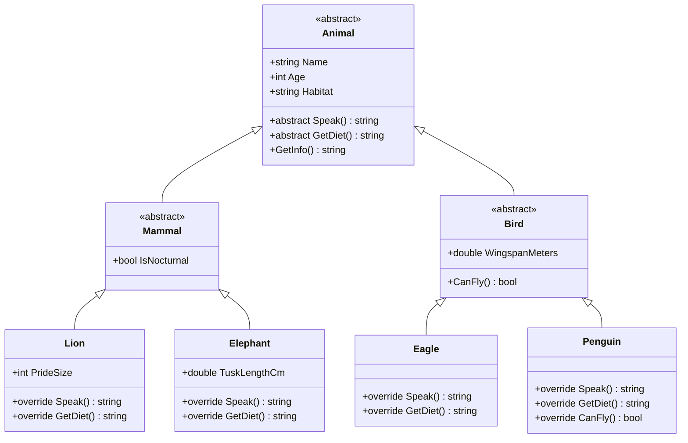

# Lecture 3: Type Checking, Casting, and Real-World Modeling

[← Previous: Lecture 2 – Abstract Classes and Abstract Methods](./lecture-2.md) | [Back to Week 10 Overview](./README.md)

---

## Lecture Overview

| Item | Detail |
|------|--------|
| Duration | 45 minutes |
| Topics | Type checking with `is`, safe casting with `as`, pattern matching, when you need type-specific behavior, complete real-world modeling exercise |
| Preparation | Completed Lectures 1–2 — comfortable with polymorphism and abstract classes |

---

## 1. When Polymorphism Isn't Enough

Polymorphism is powerful — you can loop through a `List<Animal>` and call `Speak()` on each item without caring about the specific type. But sometimes you *do* need to know the specific type:

- Displaying type-specific details (a `Dog` has a `Breed` property that `Cat` doesn't)
- Calling a method that only exists on a specific derived class
- Performing different actions based on the actual type

For these situations, C# gives you **type checking** and **casting** tools.

---

## 2. The `is` Keyword — Checking Type

The `is` keyword checks whether an object is a specific type and returns `true` or `false`:

```csharp
Animal myPet = new Dog("Rex", "German Shepherd");

if (myPet is Dog)
{
    Console.WriteLine("It's a dog!");
}

if (myPet is Cat)
{
    Console.WriteLine("It's a cat!");  // This won't print
}
```

**Output:**
```
It's a dog!
```

### `is` with Pattern Matching (Recommended)

Modern C# lets you check the type *and* create a typed variable in one step:

```csharp
Animal myPet = new Dog("Rex", "German Shepherd");

if (myPet is Dog dog)
{
    // 'dog' is now a Dog variable — you can access Dog-specific members
    Console.WriteLine($"Dog breed: {dog.Breed}");
}
```

This is called **pattern matching** and it's the preferred approach. The variable `dog` only exists inside the `if` block, and it's already the correct type — no casting needed.

Here's a practical example with our employee hierarchy:

```csharp
foreach (Employee emp in employees)
{
    Console.WriteLine($"{emp.Name}: {emp.CalculatePay():C}");

    if (emp is Manager mgr)
    {
        Console.WriteLine($"  Bonus: {mgr.Bonus:C}");
    }
    else if (emp is SalesPerson sp)
    {
        Console.WriteLine($"  Commission: {sp.CommissionRate:P0} on {sp.TotalSales:C}");
    }
}
```

**Output:**
```
Alice: $3,000.00
Bob: $5,500.00
  Bonus: $1,500.00
Carol: $4,500.00
  Commission: 10% on $20,000.00
```

---

## 3. The `as` Keyword — Safe Casting

The `as` keyword tries to cast an object to a specific type. If it succeeds, you get the typed object. If it fails, you get `null` instead of an error:

```csharp
Animal myPet = new Dog("Rex", "German Shepherd");

Dog dog = myPet as Dog;       // Succeeds — dog is a Dog object
Cat cat = myPet as Cat;       // Fails — cat is null

if (dog != null)
{
    Console.WriteLine($"Breed: {dog.Breed}");
}

if (cat != null)
{
    Console.WriteLine("This won't print");
}
```

### Direct Casting (Risky)

You can also cast directly using parentheses:

```csharp
Dog dog = (Dog)myPet;  // Direct cast — throws InvalidCastException if myPet isn't a Dog
```

This throws an exception if the cast fails. Use this only when you're absolutely sure of the type.

### Comparison of Approaches

| Approach | Syntax | On Failure | Best For |
|----------|--------|------------|----------|
| `is` with pattern matching | `if (obj is Dog d)` | Doesn't enter block | Conditional type-specific logic |
| `as` | `Dog d = obj as Dog;` | Returns `null` | When you need the result later |
| Direct cast | `Dog d = (Dog)obj;` | Throws exception | When failure = bug |

> **Recommended:** Use `is` with pattern matching in most cases. It's the cleanest and safest option.

---

## 4. Type Checking in Practice

### Example: Shape Details Report

```csharp
abstract class Shape
{
    public string Color { get; set; }

    public Shape(string color) { Color = color; }

    public abstract double CalculateArea();
    public abstract string GetDetails();

    public override string ToString()
    {
        return $"{GetType().Name} ({Color}) — Area: {CalculateArea():F2}";
    }
}

class Circle : Shape
{
    public double Radius { get; set; }

    public Circle(string color, double radius) : base(color)
    {
        Radius = radius;
    }

    public override double CalculateArea() => Math.PI * Radius * Radius;

    public override string GetDetails() => $"Radius: {Radius}";
}

class Rectangle : Shape
{
    public double Width { get; set; }
    public double Height { get; set; }

    public Rectangle(string color, double width, double height) : base(color)
    {
        Width = width;
        Height = height;
    }

    public override double CalculateArea() => Width * Height;

    public override string GetDetails() => $"Width: {Width}, Height: {Height}";

    // Rectangle-specific method
    public bool IsSquare() => Width == Height;
}
```

```csharp
List<Shape> shapes = new List<Shape>
{
    new Circle("Red", 5),
    new Rectangle("Blue", 4, 4),
    new Rectangle("Green", 3, 7)
};

foreach (Shape shape in shapes)
{
    Console.WriteLine(shape);
    Console.WriteLine($"  Details: {shape.GetDetails()}");

    // Type-specific behavior
    if (shape is Rectangle rect && rect.IsSquare())
    {
        Console.WriteLine("  ★ This is a square!");
    }

    Console.WriteLine();
}
```

**Output:**
```
Circle (Red) — Area: 78.54
  Details: Radius: 5

Rectangle (Blue) — Area: 16.00
  Details: Width: 4, Height: 4
  ★ This is a square!

Rectangle (Green) — Area: 21.00
  Details: Width: 3, Height: 7
```

Notice how we combined `is Rectangle rect` with `rect.IsSquare()` using `&&`. The pattern matching variable `rect` is available for the rest of that condition.

---

## 5. A Word of Caution — Don't Overuse Type Checking

Type checking is useful, but if you find yourself writing long chains of `if (obj is TypeA) ... else if (obj is TypeB) ...`, that's a sign you should add a virtual or abstract method to the base class instead.

```csharp
// ❌ Bad — checking types manually defeats the purpose of polymorphism
foreach (Shape shape in shapes)
{
    if (shape is Circle c)
        Console.WriteLine($"Circle area: {Math.PI * c.Radius * c.Radius}");
    else if (shape is Rectangle r)
        Console.WriteLine($"Rectangle area: {r.Width * r.Height}");
    else if (shape is Triangle t)
        Console.WriteLine($"Triangle area: {0.5 * t.Base * t.Height}");
}

// ✅ Good — let polymorphism do the work
foreach (Shape shape in shapes)
{
    Console.WriteLine($"{shape.GetType().Name} area: {shape.CalculateArea()}");
}
```

> **Rule of thumb:** Use polymorphism for behavior that every derived class has. Use type checking only for behavior specific to a particular derived class.

---

## 6. Real-World Modeling Exercise — Zoo Management System

Let's bring everything together with a complete example that uses inheritance, abstract classes, polymorphism, and type checking.

### Step 1: Design the Hierarchy



### Step 2: Implement the Classes

```csharp
abstract class Animal
{
    public string Name { get; set; }
    public int Age { get; set; }
    public string Habitat { get; set; }

    public Animal(string name, int age, string habitat)
    {
        Name = name;
        Age = age;
        Habitat = habitat;
    }

    public abstract string Speak();
    public abstract string GetDiet();

    public virtual string GetInfo()
    {
        return $"{Name} (Age: {Age}) — Habitat: {Habitat}";
    }

    public override string ToString()
    {
        return $"[{GetType().Name}] {GetInfo()}";
    }
}

abstract class Mammal : Animal
{
    public bool IsNocturnal { get; set; }

    public Mammal(string name, int age, string habitat, bool isNocturnal)
        : base(name, age, habitat)
    {
        IsNocturnal = isNocturnal;
    }

    public override string GetInfo()
    {
        string activity = IsNocturnal ? "Nocturnal" : "Diurnal";
        return $"{base.GetInfo()} [{activity}]";
    }
}

abstract class Bird : Animal
{
    public double WingspanMeters { get; set; }

    public Bird(string name, int age, string habitat, double wingspan)
        : base(name, age, habitat)
    {
        WingspanMeters = wingspan;
    }

    public virtual bool CanFly() => true;

    public override string GetInfo()
    {
        string flight = CanFly() ? "Can fly" : "Flightless";
        return $"{base.GetInfo()} [Wingspan: {WingspanMeters}m, {flight}]";
    }
}
```

```csharp
class Lion : Mammal
{
    public int PrideSize { get; set; }

    public Lion(string name, int age, int prideSize)
        : base(name, age, "Savanna", false)
    {
        PrideSize = prideSize;
    }

    public override string Speak() => "Roar!";
    public override string GetDiet() => "Carnivore — hunts zebras, wildebeest";
}

class Elephant : Mammal
{
    public double TuskLengthCm { get; set; }

    public Elephant(string name, int age, double tuskLength)
        : base(name, age, "Savanna/Forest", false)
    {
        TuskLengthCm = tuskLength;
    }

    public override string Speak() => "Trumpet!";
    public override string GetDiet() => "Herbivore — grasses, bark, roots";
}

class Eagle : Bird
{
    public Eagle(string name, int age, double wingspan)
        : base(name, age, "Mountains/Forest", wingspan)
    {
    }

    public override string Speak() => "Screech!";
    public override string GetDiet() => "Carnivore — fish, small mammals";
}

class Penguin : Bird
{
    public Penguin(string name, int age, double wingspan)
        : base(name, age, "Antarctic/Coastal", wingspan)
    {
    }

    public override string Speak() => "Honk!";
    public override string GetDiet() => "Carnivore — fish, krill";
    public override bool CanFly() => false;
}
```

### Step 3: Use Polymorphism

```csharp
List<Animal> zoo = new List<Animal>
{
    new Lion("Simba", 8, 12),
    new Elephant("Dumbo", 15, 95.5),
    new Eagle("Freedom", 5, 2.1),
    new Penguin("Skipper", 3, 0.5),
    new Lion("Nala", 7, 12),
    new Elephant("Ellie", 20, 80.0)
};

// Polymorphic loop — works with any animal
Console.WriteLine("=== Zoo Directory ===\n");
foreach (Animal animal in zoo)
{
    Console.WriteLine(animal);
    Console.WriteLine($"  Sound: {animal.Speak()}");
    Console.WriteLine($"  Diet:  {animal.GetDiet()}");
    Console.WriteLine();
}

// Type-specific queries using is
Console.WriteLine("=== Mammal Report ===\n");
foreach (Animal animal in zoo)
{
    if (animal is Mammal mammal)
    {
        Console.Write($"{mammal.Name}: ");
        Console.WriteLine(mammal.IsNocturnal ? "Active at night" : "Active during the day");

        if (mammal is Lion lion)
        {
            Console.WriteLine($"  Pride size: {lion.PrideSize}");
        }
        else if (mammal is Elephant elephant)
        {
            Console.WriteLine($"  Tusk length: {elephant.TuskLengthCm} cm");
        }
    }
}

Console.WriteLine("\n=== Flight Check ===\n");
foreach (Animal animal in zoo)
{
    if (animal is Bird bird)
    {
        string status = bird.CanFly() ? "✓ Can fly" : "✗ Cannot fly";
        Console.WriteLine($"{bird.Name}: {status} (Wingspan: {bird.WingspanMeters}m)");
    }
}
```

**Output:**
```
=== Zoo Directory ===

[Lion] Simba (Age: 8) — Habitat: Savanna [Diurnal]
  Sound: Roar!
  Diet:  Carnivore — hunts zebras, wildebeest

[Elephant] Dumbo (Age: 15) — Habitat: Savanna/Forest [Diurnal]
  Sound: Trumpet!
  Diet:  Herbivore — grasses, bark, roots

[Eagle] Freedom (Age: 5) — Habitat: Mountains/Forest [Wingspan: 2.1m, Can fly]
  Sound: Screech!
  Diet:  Carnivore — fish, small mammals

[Penguin] Skipper (Age: 3) — Habitat: Antarctic/Coastal [Wingspan: 0.5m, Flightless]
  Sound: Honk!
  Diet:  Carnivore — fish, krill

[Lion] Nala (Age: 7) — Habitat: Savanna [Diurnal]
  Sound: Roar!
  Diet:  Carnivore — hunts zebras, wildebeest

[Elephant] Ellie (Age: 20) — Habitat: Savanna/Forest [Diurnal]
  Sound: Trumpet!
  Diet:  Herbivore — grasses, bark, roots

=== Mammal Report ===

Simba: Active during the day
  Pride size: 12
Dumbo: Active during the day
  Tusk length: 95.5 cm
Nala: Active during the day
  Pride size: 12
Ellie: Active during the day
  Tusk length: 80 cm

=== Flight Check ===

Freedom: ✓ Can fly (Wingspan: 2.1m)
Skipper: ✗ Cannot fly (Wingspan: 0.5m)
```

### What This Example Demonstrates

| Concept | Where It Appears |
|---------|-----------------|
| Abstract classes | `Animal`, `Mammal`, `Bird` |
| Abstract methods | `Speak()`, `GetDiet()` |
| Virtual methods | `GetInfo()`, `CanFly()` |
| Method overriding | Every concrete class overrides abstract methods |
| Calling `base` methods | `GetInfo()` chains to parent's `GetInfo()` |
| Multi-level hierarchy | `Animal` → `Mammal` → `Lion` |
| Polymorphic collection | `List<Animal>` holds all types |
| Type checking | `is Mammal`, `is Lion`, `is Bird` |
| Pattern matching | `if (animal is Bird bird)` |

---

## Key Takeaways

- Use `is` to check an object's type at runtime — prefer `is Type variable` pattern matching syntax
- Use `as` for safe casting that returns `null` on failure — good when you need the result later
- Use direct casting `(Type)obj` only when you're certain of the type
- Don't overuse type checking — if every type needs the same behavior, add it as a virtual or abstract method
- Real-world modeling combines abstract classes (for shared structure), virtual methods (for defaults), abstract methods (for required implementations), polymorphic collections (for processing mixed types), and type checking (for type-specific details)

---

## Hands-On Exercises

### Exercise 7 — Expression-Bodied Override Review

Rewrite the `Shape` hierarchy from Lecture 2 so that `CalculateArea()` and `GetDetails()` in each derived class use expression-bodied syntax (`=>`). Verify the program produces the same output.

### Exercise 8 — Type-Specific Summary

Using the `Employee` hierarchy from Lecture 1, write a method `PrintDetailedReport(List<Employee> employees)` that prints each employee's name and pay, then uses `is` pattern matching to print bonus for managers and commission details for salespeople.

### Exercise 9 — Multi-Level Hierarchy

Create a hierarchy: abstract `Vehicle` → abstract `MotorVehicle` (has `EngineSize`) → `Car` and `Motorcycle`; and abstract `Vehicle` → `Bicycle` (has `GearCount`). Each must override an abstract `GetDescription()` method. Create a `List<Vehicle>`, add mixed types, and loop through them printing descriptions. Use `is MotorVehicle` to also print engine sizes.

---

[Back to Week 10 Overview](./README.md)
