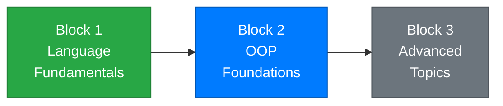

# Week 11 – Interfaces and Object Composition

[← Back to Course Home](../../README.md)

---

## 📋 Overview

Over the last few weeks, you've learned to build class hierarchies using inheritance — a `Dog` **is a** `Animal`, a `SavingsAccount` **is a** `BankAccount`. Inheritance is powerful, but it's not the only way to design flexible code. This week introduces two complementary ideas: **interfaces** and **composition**.

An **interface** defines a contract — a set of methods and properties that a class promises to implement. Unlike inheritance, which says what something **is**, an interface says what something **can do**. A `Dog` can be `IComparable` (it can be compared), a `Document` can be `IPrintable` (it can be printed), and a `Player` can be `ISaveable` (its state can be saved). A single class can implement multiple interfaces, something C# doesn't allow with inheritance.

**Composition** takes a different angle entirely: instead of building tall inheritance trees, you build objects that **contain** other objects. A `Car` isn't a type of `Engine` — it **has** an `Engine`. This "has-a" thinking often leads to more flexible, maintainable designs than deep inheritance chains.

Together, interfaces and composition give you a complete design toolkit alongside inheritance. By the end of this week, you'll be able to choose the right approach for any design problem.

---

## 🎯 Learning Objectives

By the end of this week, you will be able to:

1. Explain what an interface is and how it differs from an abstract class
2. Define interfaces and implement them in classes
3. Implement **multiple interfaces** in a single class
4. Distinguish between "is-a" (inheritance) and "can-do" (interface) relationships
5. Use **composition** to build objects from other objects ("has-a" relationships)
6. Decide when to use interfaces vs inheritance vs composition
7. Work with built-in interfaces like `IComparable<T>`

---

## 📚 Materials

| # | Material | Topic |
|---|----------|-------|
| 1 | [Lecture 1 – What Are Interfaces?](./lecture-1.md) | Interfaces defined, syntax, implementing interfaces, interfaces vs abstract classes |
| 2 | [Lecture 2 – Multiple Interfaces and Interface-Based Design](./lecture-2.md) | Multiple interfaces, interface-based thinking, practical patterns, `IComparable<T>` |
| 3 | [Lecture 3 – Composition and Choosing the Right Design](./lecture-3.md) | Composition over inheritance, "has-a" relationships, design decision guide |
| 4 | [Exercises](./exercises.md) | Practice problems for each lecture |
| 5 | [Assignment](./assignment.md) | 📝 Smart Home System — mini-project |

---

## 🗺️ Where Are We?



```
✅ Week 1 – Getting Started          ✅ Week 7 – Classes & Objects
✅ Week 2 – Variables & Types         ✅ Week 8 – Encapsulation
✅ Week 3 – Conditionals              ✅ Week 9 – Inheritance
✅ Week 4 – Loops                     ✅ Week 10 – Polymorphism & Abstract Classes
✅ Week 5 – Methods                   👉 Week 11 – Interfaces & Composition ← YOU ARE HERE
✅ Week 6 – Arrays & Collections      ⬜ Week 12 – Exception Handling
```

---

## 🔗 Prerequisites

Before starting this week, make sure you're comfortable with:

- **Classes and Objects** (Week 7) — defining classes, creating instances, properties, constructors
- **Encapsulation** (Week 8) — access modifiers, private fields with public properties, methods as behavior
- **Inheritance** (Week 9) — base and derived classes, `virtual`/`override`, constructor chaining with `base()`
- **Polymorphism and Abstract Classes** (Week 10) — treating derived objects as base type, abstract classes/methods, `is` and `as`

---

## ✅ Week Checklist

- [ ] Complete Lecture 1 — understand interfaces, define and implement them
- [ ] Complete Lecture 2 — implement multiple interfaces, use `IComparable<T>`
- [ ] Complete Lecture 3 — use composition, choose between interfaces/inheritance/composition
- [ ] Work through the practice exercises
- [ ] Complete the **Smart Home System** assignment

---

[← Week 10: Polymorphism & Abstract Classes](../week-10/README.md) | [Week 12: Exception Handling →](../week-12/README.md)
