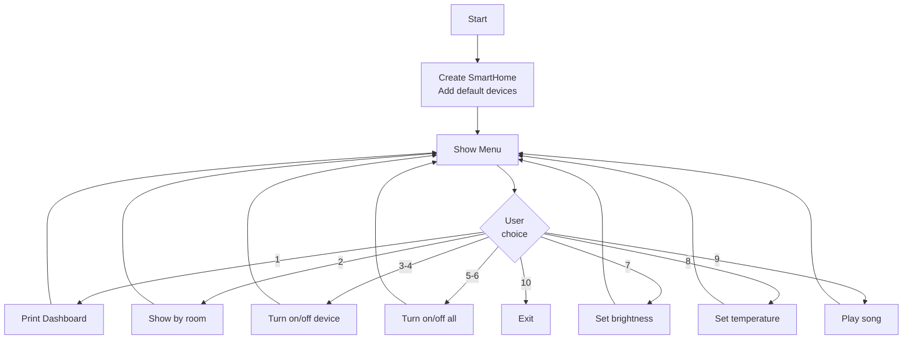

# Week 11 – Assignment: Smart Home System

[← Back to Week 11 Overview](./README.md)

---

## Overview

Build a **Smart Home System** console application that manages various smart devices in a home. This project integrates interfaces, composition, and (optionally) inheritance to model a realistic system where different devices share capabilities but have different behaviors.

---

## Requirements

### Interfaces

Define the following interfaces:

| Interface | Members |
|-----------|---------|
| `ISwitch` | `bool IsOn { get; }`, `void TurnOn()`, `void TurnOff()` |
| `IDimmable` | `int Brightness { get; }`, `void SetBrightness(int level)` — level 0–100 |
| `ITemperatureControl` | `double TargetTemperature { get; }`, `void SetTemperature(double temp)`, `double CurrentTemperature { get; }` |
| `ISchedulable` | `string Schedule { get; }`, `void SetSchedule(string schedule)` — e.g., "06:00-22:00" |

### Device Classes

Create the following device classes. Each implements the interfaces listed:

| Device | Implements | Special Behavior |
|--------|-----------|-----------------|
| `SmartLight` | `ISwitch`, `IDimmable`, `ISchedulable` | Default brightness 100 when turned on; turning off sets brightness to 0 |
| `SmartThermostat` | `ISwitch`, `ITemperatureControl`, `ISchedulable` | Validates temperature range 10°C–35°C; current temp simulated as target ± random(0–2) |
| `SmartPlug` | `ISwitch` | Simple on/off only; tracks `WattageUsed` (double) |
| `SmartSpeaker` | `ISwitch` | Has `Volume` (0–100) property; `void PlayMusic(string song)` prints now playing |

Each device must have:
- A `Name` property (e.g., "Living Room Light", "Kitchen Thermostat")
- A `Location` property (e.g., "Living Room", "Kitchen", "Bedroom")
- A `ToString()` override showing the device name, status, and key info

### Composition: The SmartHome Class

Create a `SmartHome` class that **has** a `List` of devices and provides:

| Method | Description |
|--------|-------------|
| `void AddDevice(...)` | Add a device to the home |
| `void RemoveDevice(string name)` | Remove a device by name |
| `void TurnOnAll()` | Turn on all `ISwitch` devices |
| `void TurnOffAll()` | Turn off all `ISwitch` devices |
| `void DimAll(int level)` | Set brightness on all `IDimmable` devices |
| `void SetAllTemperatures(double temp)` | Set temperature on all `ITemperatureControl` devices |
| `List<T> GetDevicesByType<T>()` | Return all devices that implement interface `T` (use `is` checks) |
| `void GetDevicesByRoom(string room)` | Print all devices in a given room |
| `void PrintDashboard()` | Print a formatted overview of all devices |

> **Note on `GetDevicesByType<T>()`:** This method uses **generics** which we'll cover in detail in Week 13. For now, here's the pattern:
> ```csharp
> public List<T> GetDevicesByType<T>()
> {
>     List<T> result = new List<T>();
>     foreach (var device in _devices)
>     {
>         if (device is T match)
>         {
>             result.Add(match);
>         }
>     }
>     return result;
> }
> ```

### Console Menu

Create a menu-driven console application:

```
============================
  🏠 Smart Home Dashboard
============================
1. View all devices
2. View devices by room
3. Turn on a device
4. Turn off a device
5. Turn on all devices
6. Turn off all devices
7. Adjust light brightness
8. Set thermostat temperature
9. Play music on speaker
10. Exit

Choose an option:
```

---

## Program Flow



---

## Expected Output

### Dashboard View
```
============================
  🏠 Smart Home Dashboard
============================

Living Room:
  💡 Living Room Light — ON, Brightness: 75%
  🔌 TV Plug — ON, 120W
  🔊 Living Room Speaker — ON, Volume: 50

Kitchen:
  💡 Kitchen Light — OFF
  🌡️ Kitchen Thermostat — ON, Target: 22.0°C, Current: 22.8°C

Bedroom:
  💡 Bedroom Light — ON, Brightness: 30%
  🌡️ Bedroom Thermostat — ON, Target: 19.0°C, Current: 19.4°C

Total devices: 7 (5 on, 2 off)
```

### Turn On a Device
```
Choose a device to turn on:
1. Living Room Light (OFF)
2. Kitchen Light (OFF)

Choice: 2
✅ Kitchen Light turned on.
```

### Set Brightness
```
Dimmable lights:
1. Living Room Light — Brightness: 75%
2. Kitchen Light — Brightness: 100%
3. Bedroom Light — Brightness: 30%
4. [All lights]

Choice: 3
Enter brightness (0-100): 50
💡 Bedroom Light brightness set to 50%.
```

---

## Starter Template

```csharp
// === Interfaces ===

interface ISwitch
{
    bool IsOn { get; }
    void TurnOn();
    void TurnOff();
}

interface IDimmable
{
    int Brightness { get; }
    void SetBrightness(int level);
}

interface ITemperatureControl
{
    double TargetTemperature { get; }
    void SetTemperature(double temp);
    double CurrentTemperature { get; }
}

interface ISchedulable
{
    string Schedule { get; }
    void SetSchedule(string schedule);
}

// === Device Classes ===
// TODO: Implement SmartLight, SmartThermostat, SmartPlug, SmartSpeaker

// === SmartHome Class ===
// TODO: Implement SmartHome with device management methods

// === Program ===
// TODO: Create menu-driven console app
```

---

## Grading Rubric

| Criteria | Points |
|----------|--------|
| All 4 interfaces defined correctly | 10 |
| `SmartLight` implements `ISwitch`, `IDimmable`, `ISchedulable` correctly | 15 |
| `SmartThermostat` implements interfaces with validation | 15 |
| `SmartPlug` and `SmartSpeaker` implemented correctly | 10 |
| `SmartHome` class with all required methods | 20 |
| Console menu works with proper input handling | 15 |
| `ToString()` overrides provide clear device status | 5 |
| Code organization and naming conventions | 10 |
| **Total** | **100** |

---

## Hints

1. **Common base:** All devices need `Name` and `Location`. You could use a base class for these shared properties, or just put them in each class independently. Both approaches are valid — consider which fits better.

2. **Storing mixed devices:** Since devices implement different interfaces, store them as a `List<ISwitch>` (since all devices can be switched) or as `List<object>` and use `is` checks for specific capabilities.

3. **Temperature simulation:** For `CurrentTemperature`, you can use:
   ```csharp
   private Random _random = new Random();
   public double CurrentTemperature => TargetTemperature + (_random.NextDouble() * 4 - 2);
   ```

4. **Menu loops:** Use a `while` loop with a `switch` statement for the menu — same pattern from the Week 7 Contact Manager assignment.

5. **Finding devices by name:** Use a loop or LINQ (preview of Week 14):
   ```csharp
   // Loop approach
   foreach (var device in _devices)
   {
       if (device.Name.ToLower() == name.ToLower())
           return device;
   }
   ```

---

## Bonus Challenges

1. **Device Groups:** Add a `DeviceGroup` class that holds a list of `ISwitch` devices and itself implements `ISwitch`. Turning the group on/off turns all its devices on/off. This is the **Composite Pattern** — a design pattern you'll encounter in later courses.

2. **Energy Report:** Track power usage for each device and add a `PrintEnergyReport()` method to `SmartHome` that shows total wattage, cost estimate (at $0.12/kWh), and which room uses the most power.

3. **Scenes:** Add a `Scene` class (e.g., "Movie Night", "Good Morning") that stores a set of device actions. When activated, it applies all actions — dimming lights, setting temperatures, turning devices on/off.

4. **Device Discovery:** Add a method `PrintCapabilities()` to `SmartHome` that lists all devices grouped by capability (all dimmable devices, all temperature-controlled devices, all schedulable devices).

5. **Automation Rules:** Add simple rules like "If thermostat temperature > 25°C, turn on the fan plug" using composition with a `Rule` class that checks conditions and triggers actions.

---

## Recommended File Structure

```
SmartHome/
├── Program.cs              ← Main program with menu loop
├── ISwitch.cs              ← Interface definitions (all 4 can go in one file)
├── IDimmable.cs
├── ITemperatureControl.cs
├── ISchedulable.cs
├── SmartLight.cs           ← Device classes
├── SmartThermostat.cs
├── SmartPlug.cs
├── SmartSpeaker.cs
├── SmartHome.cs            ← SmartHome manager class
└── SmartHome.csproj
```

---

[← Back to Week 11 Overview](./README.md)
