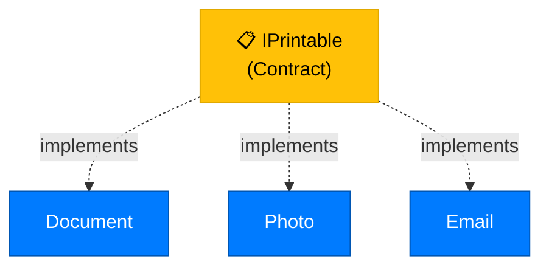
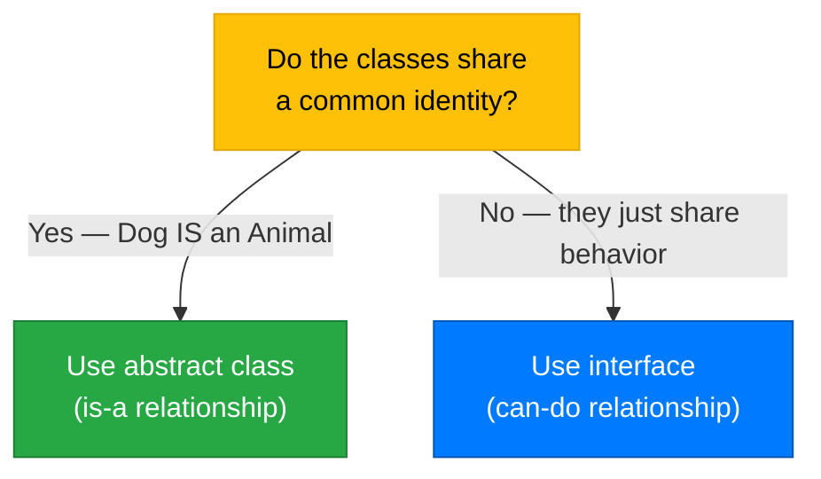

# Lecture 1: What Are Interfaces?

[Back to Week 11 Overview](./README.md) | [Next: Lecture 2 – Multiple Interfaces and Interface-Based Design →](./lecture-2.md)

---

## Lecture Overview

| Item | Detail |
|------|--------|
| Duration | 45 minutes |
| Topics | What interfaces are, interface syntax, implementing interfaces, interfaces vs abstract classes |
| Preparation | Comfortable with inheritance, abstract classes, and polymorphism from Weeks 9–10 |

---

## 1. The Limitation of Inheritance

In Week 9, you learned that inheritance models an "is-a" relationship. A `Dog` **is an** `Animal`. A `SavingsAccount` **is a** `BankAccount`. This works well when classes truly share a common identity.

But what happens when classes need to share **behavior** without sharing an **identity**?

Consider these classes:

```csharp
class Document { }
class Photo { }
class Email { }
```

All three can be **printed**. But they're not related by inheritance — a `Document` is not a type of `Photo`, and an `Email` is not a type of `Document`. You can't create a single base class that makes sense for all three.

You might think: "I'll create an abstract class `Printable`!" But C# only allows a class to inherit from **one** base class. If `Document` already inherits from `File`, it can't also inherit from `Printable`.

This is the problem interfaces solve.

---

## 2. What Is an Interface?

An **interface** defines a **contract** — a set of members that a class **promises** to implement. It says *what* a class can do, not *how* it does it.

Think of it like a job posting. The posting says "must be able to drive, must speak English, must have first aid certification." It doesn't care about your background, your education, or your family tree. It only cares about **what you can do**.



---

## 3. Defining an Interface

Here's how you define an interface in C#:

```csharp
interface IPrintable
{
    void Print();
    int PageCount { get; }
}
```

Key rules:

- Interface names start with **`I`** by convention (e.g., `IPrintable`, `ISearchable`, `ISaveable`)
- Interface members have **no access modifiers** — everything is implicitly public
- Interface members have **no implementation** — no method bodies, no field values
- Interfaces can contain: methods, properties, indexers, and events (but **not fields**)

> **Think of it this way:** An interface is like a checklist. It says "any class that claims to be `IPrintable` must have a `Print()` method and a `PageCount` property." It doesn't say how to print or how to count pages — that's up to each class.

---

## 4. Implementing an Interface

A class implements an interface using the same `:` syntax as inheritance:

```csharp
interface IPrintable
{
    void Print();
    int PageCount { get; }
}

class Document : IPrintable
{
    public string Title { get; set; }
    public string Content { get; set; }

    // Must implement Print() — required by IPrintable
    public void Print()
    {
        Console.WriteLine($"--- Document: {Title} ---");
        Console.WriteLine(Content);
    }

    // Must implement PageCount — required by IPrintable
    public int PageCount
    {
        get { return Content.Length / 2000 + 1; } // Rough estimate
    }
}

class Photo : IPrintable
{
    public string FileName { get; set; }
    public int Width { get; set; }
    public int Height { get; set; }

    public void Print()
    {
        Console.WriteLine($"[Printing photo: {FileName} ({Width}x{Height})]");
    }

    public int PageCount
    {
        get { return 1; } // Photos are always 1 page
    }
}
```

**What happens if you forget a member?** The compiler gives an error. If `Document` doesn't implement `Print()`, you'll see:

```
Error: 'Document' does not implement interface member 'IPrintable.Print()'
```

This is the **contract** at work — the compiler enforces it.

---

## 5. Using Interfaces as Types

Just like you can use a base class as a variable type (polymorphism from Week 10), you can use an **interface** as a type:

```csharp
IPrintable item1 = new Document { Title = "Report", Content = "Quarterly results..." };
IPrintable item2 = new Photo { FileName = "vacation.jpg", Width = 1920, Height = 1080 };

// Works on any IPrintable — doesn't matter what the actual type is
item1.Print();
item2.Print();

Console.WriteLine($"Pages: {item1.PageCount}");
Console.WriteLine($"Pages: {item2.PageCount}");
```

**Output:**
```
--- Document: Report ---
Quarterly results...
[Printing photo: vacation.jpg (1920x1080)]
Pages: 1
Pages: 1
```

You can also create collections of interface types:

```csharp
List<IPrintable> printQueue = new List<IPrintable>();
printQueue.Add(new Document { Title = "Memo", Content = "Meeting notes..." });
printQueue.Add(new Photo { FileName = "chart.png", Width = 800, Height = 600 });
printQueue.Add(new Document { Title = "Invoice", Content = "Amount due: $500" });

// Print everything in the queue
foreach (IPrintable item in printQueue)
{
    item.Print();
    Console.WriteLine($"  ({item.PageCount} page(s))");
    Console.WriteLine();
}
```

This is incredibly powerful. The `foreach` loop doesn't know or care whether it's printing a document, a photo, or an email. It just knows each item **can** be printed.

---

## 6. Interfaces vs Abstract Classes

Students often ask: "When do I use an interface and when do I use an abstract class?" Here's a clear comparison:

| Feature | Abstract Class | Interface |
|---------|---------------|-----------|
| Can have implemented methods | ✅ Yes | ❌ No (just contracts) |
| Can have fields | ✅ Yes | ❌ No |
| Can have constructors | ✅ Yes | ❌ No |
| A class can inherit/implement multiple | ❌ One base class only | ✅ Multiple interfaces |
| Relationship type | "is-a" (identity) | "can-do" (capability) |
| Access modifiers on members | ✅ Yes | ❌ No (all public) |

The simplest way to decide:



**Example — When to use an abstract class:**

```csharp
// Dog, Cat, and Bird ARE all Animals
// They share identity, fields (Name, Age), and some behavior
abstract class Animal
{
    public string Name { get; set; }
    public int Age { get; set; }
    
    public abstract void MakeSound();
    
    public void Sleep()
    {
        Console.WriteLine($"{Name} is sleeping...");
    }
}
```

**Example — When to use an interface:**

```csharp
// Documents, Photos, and Emails CAN all be printed
// They don't share identity — they just share a capability
interface IPrintable
{
    void Print();
    int PageCount { get; }
}
```

---

## 7. A Complete Example: Logging System

Let's build a more realistic example. Many applications need to **log** messages — save them to a file, display them on screen, or send them to a remote server. Each destination is completely different, but they all share the same capability: they can log a message.

```csharp
interface ILogger
{
    void Log(string message);
}

class ConsoleLogger : ILogger
{
    public void Log(string message)
    {
        Console.WriteLine($"[CONSOLE] {DateTime.Now}: {message}");
    }
}

class FileLogger : ILogger
{
    public string FilePath { get; set; }
    
    public FileLogger(string filePath)
    {
        FilePath = filePath;
    }
    
    public void Log(string message)
    {
        // In a real app, you'd write to a file
        Console.WriteLine($"[FILE → {FilePath}] {DateTime.Now}: {message}");
    }
}

class DatabaseLogger : ILogger
{
    public void Log(string message)
    {
        // In a real app, you'd insert into a database
        Console.WriteLine($"[DATABASE] {DateTime.Now}: {message}");
    }
}
```

Now any code that needs logging can work with `ILogger` without knowing the specific type:

```csharp
class Application
{
    private ILogger logger;
    
    public Application(ILogger logger)
    {
        this.logger = logger;
    }
    
    public void Start()
    {
        logger.Log("Application started");
        logger.Log("Loading configuration...");
        logger.Log("Ready");
    }
}

// Usage — swap loggers without changing Application
Application app1 = new Application(new ConsoleLogger());
app1.Start();

Console.WriteLine();

Application app2 = new Application(new FileLogger("app.log"));
app2.Start();
```

**Output:**
```
[CONSOLE] 2/26/2026 10:00:00 AM: Application started
[CONSOLE] 2/26/2026 10:00:00 AM: Loading configuration...
[CONSOLE] 2/26/2026 10:00:00 AM: Ready

[FILE → app.log] 2/26/2026 10:00:00 AM: Application started
[FILE → app.log] 2/26/2026 10:00:00 AM: Loading configuration...
[FILE → app.log] 2/26/2026 10:00:00 AM: Ready
```

The `Application` class doesn't know or care *how* logging works. It just knows the logger **can** log. This is the power of programming to an interface.

---

## Key Takeaways

- An **interface** defines a contract — a set of members a class must implement
- Interface names start with **`I`** by convention
- Interfaces contain **no implementation** — just method signatures and property declarations
- A class implements an interface with `:` and must provide all members
- You can use an interface as a **variable type**, enabling polymorphism across unrelated classes
- **Abstract classes** model "is-a" relationships (shared identity); **interfaces** model "can-do" relationships (shared capability)
- If you forget to implement an interface member, the **compiler catches it** — this is the contract in action

---

## Hands-On Exercises

### Exercise 1 — IDescribable
Define an interface `IDescribable` with a single method `string GetDescription()`. Create three classes — `Book`, `Movie`, and `City` — that each implement the interface. Create a list of `IDescribable` items and print each description.

### Exercise 2 — IResizable
Define an interface `IResizable` with a method `void Resize(double factor)` and a property `double Area { get; }`. Implement it in `Circle` and `Rectangle` classes. Write a method that takes any `IResizable`, resizes it by 2x, and prints the new area.

### Exercise 3 — Interface vs Abstract Class
You're designing a system with `Dog`, `Cat`, `Robot`, and `Car`. Some can move, some can make sounds, and some are alive. Draw out which would use inheritance (abstract class) and which would use interfaces. Then implement your design in code.

---

[Back to Week 11 Overview](./README.md) | [Next: Lecture 2 – Multiple Interfaces and Interface-Based Design →](./lecture-2.md)
