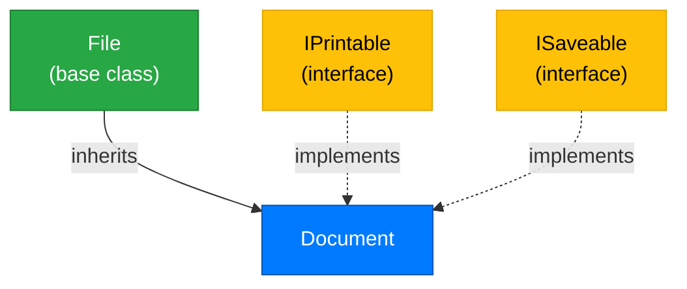

# Lecture 2: Multiple Interfaces and Interface-Based Design

[← Previous: Lecture 1 – What Are Interfaces?](./lecture-1.md) | [Back to Week 11 Overview](./README.md) | [Next: Lecture 3 – Composition and Choosing the Right Design →](./lecture-3.md)

---

## Lecture Overview

| Item | Detail |
|------|--------|
| Duration | 45 minutes |
| Topics | Multiple interface implementation, interface-based thinking, `IComparable<T>`, practical design patterns |
| Preparation | Completed Lecture 1 — comfortable defining and implementing a single interface |

---

## 1. One Class, Multiple Interfaces

In Week 9, you learned that C# allows a class to inherit from only **one** base class. Interfaces don't have this restriction — a class can implement as many interfaces as it needs.

Think of it like a person's skills. You might be a driver, a swimmer, and a first-aid responder. These aren't your *identity* — they're your *capabilities*. Similarly, a class can have multiple capabilities:

```csharp
interface IPrintable
{
    void Print();
}

interface ISaveable
{
    void Save(string filePath);
}

interface ISearchable
{
    bool Contains(string keyword);
}
```

A `Document` class can implement all three:

```csharp
class Document : IPrintable, ISaveable, ISearchable
{
    public string Title { get; set; }
    public string Content { get; set; }

    public void Print()
    {
        Console.WriteLine($"--- {Title} ---");
        Console.WriteLine(Content);
    }

    public void Save(string filePath)
    {
        Console.WriteLine($"Saving '{Title}' to {filePath}...");
        // In a real app: File.WriteAllText(filePath, Content);
    }

    public bool Contains(string keyword)
    {
        return Content.Contains(keyword, StringComparison.OrdinalIgnoreCase);
    }
}
```

Notice the syntax: multiple interfaces are separated by commas after the `:`.

---

## 2. Combining Inheritance and Interfaces

If a class inherits from a base class **and** implements interfaces, the base class must come first:

```csharp
// Base class first, then interfaces
class Document : File, IPrintable, ISaveable
{
    // ...
}
```

This is a common pattern in real applications:



The `Document` **is a** `File` (identity via inheritance) and it **can** be printed and saved (capabilities via interfaces).

---

## 3. Interface-Based Thinking: "Can-Do" vs "Is-A"

When you're designing classes, ask yourself two different questions:

| Question | Tool | Example |
|----------|------|---------|
| **What is it?** | Inheritance (abstract class) | A `Dog` **is an** `Animal` |
| **What can it do?** | Interface | A `Dog` **can be** `ITrainable` |

Here's a practical example. You're building a game with different entities:

```csharp
// Identity — what things ARE
abstract class GameEntity
{
    public string Name { get; set; }
    public int X { get; set; }
    public int Y { get; set; }
    
    public abstract void Update();
}

// Capabilities — what things CAN DO
interface IDamageable
{
    int Health { get; set; }
    void TakeDamage(int amount);
}

interface IMovable
{
    void MoveTo(int x, int y);
    double Speed { get; }
}

interface IAttacker
{
    int AttackPower { get; }
    void Attack(IDamageable target);
}
```

Now different game entities mix and match capabilities:

```csharp
// Player: is a GameEntity, can move, can attack, can take damage
class Player : GameEntity, IMovable, IAttacker, IDamageable
{
    public int Health { get; set; } = 100;
    public double Speed { get; } = 5.0;
    public int AttackPower { get; } = 15;
    
    public override void Update()
    {
        Console.WriteLine($"{Name} is ready for action! HP: {Health}");
    }
    
    public void MoveTo(int x, int y)
    {
        X = x;
        Y = y;
        Console.WriteLine($"{Name} moved to ({X}, {Y})");
    }
    
    public void Attack(IDamageable target)
    {
        Console.WriteLine($"{Name} attacks for {AttackPower} damage!");
        target.TakeDamage(AttackPower);
    }
    
    public void TakeDamage(int amount)
    {
        Health -= amount;
        Console.WriteLine($"{Name} takes {amount} damage! HP: {Health}");
    }
}

// Wall: is a GameEntity, can take damage, but CANNOT move or attack
class Wall : GameEntity, IDamageable
{
    public int Health { get; set; } = 200;
    
    public override void Update()
    {
        Console.WriteLine($"Wall at ({X}, {Y}) — HP: {Health}");
    }
    
    public void TakeDamage(int amount)
    {
        Health -= amount;
        Console.WriteLine($"Wall takes {amount} damage! HP: {Health}");
    }
}

// Turret: is a GameEntity, can attack, but CANNOT move or take damage
class Turret : GameEntity, IAttacker
{
    public int AttackPower { get; } = 25;
    
    public override void Update()
    {
        Console.WriteLine($"Turret scanning for targets at ({X}, {Y})...");
    }
    
    public void Attack(IDamageable target)
    {
        Console.WriteLine($"Turret fires for {AttackPower} damage!");
        target.TakeDamage(AttackPower);
    }
}
```

Using interfaces this way lets you write flexible code:

```csharp
// Attack anything that's damageable — could be a Player, a Wall, anything
void DamageAllInRange(List<IDamageable> targets, int damage)
{
    foreach (IDamageable target in targets)
    {
        target.TakeDamage(damage);
    }
}

// Move everything that can move
void MoveAllToSafety(List<IMovable> movers, int safeX, int safeY)
{
    foreach (IMovable mover in movers)
    {
        mover.MoveTo(safeX, safeY);
    }
}
```

---

## 4. The Built-In `IComparable<T>` Interface

C# comes with several built-in interfaces. One of the most useful is `IComparable<T>`, which lets you define how objects of your class are **compared** and **sorted**.

Here's what the interface looks like (simplified):

```csharp
// This already exists in C# — you don't write this
interface IComparable<T>
{
    int CompareTo(T other);
}
```

The `CompareTo` method returns:

| Return Value | Meaning |
|-------------|---------|
| Negative number | This object comes **before** `other` |
| Zero | They are **equal** |
| Positive number | This object comes **after** `other` |

Let's implement it in a `Student` class to sort students by GPA:

```csharp
class Student : IComparable<Student>
{
    public string Name { get; set; }
    public double Gpa { get; set; }
    
    public Student(string name, double gpa)
    {
        Name = name;
        Gpa = gpa;
    }
    
    // Sort by GPA in descending order (highest first)
    public int CompareTo(Student other)
    {
        return other.Gpa.CompareTo(this.Gpa);
    }
    
    public override string ToString()
    {
        return $"{Name} (GPA: {Gpa:F1})";
    }
}
```

Now you can use `Sort()` on a list of students:

```csharp
List<Student> students = new List<Student>
{
    new Student("Alice", 3.8),
    new Student("Bob", 3.2),
    new Student("Charlie", 3.9),
    new Student("Diana", 3.5)
};

students.Sort(); // Uses our CompareTo method!

foreach (Student s in students)
{
    Console.WriteLine(s);
}
```

**Output:**
```
Charlie (GPA: 3.9)
Alice (GPA: 3.8)
Diana (GPA: 3.5)
Bob (GPA: 3.2)
```

Without `IComparable<T>`, calling `Sort()` on a list of custom objects would throw an error. By implementing the interface, you tell C# **how** to compare your objects.

---

## 5. Another Built-In: The Concept of `IDisposable`

Another common interface you'll encounter is `IDisposable`. We'll explore this more in Week 12 (Exception Handling), but the concept is worth understanding now.

Some objects hold onto **resources** — file handles, database connections, network streams. When you're done with them, those resources need to be released. `IDisposable` defines a single method:

```csharp
// Already exists in C# — you don't write this
interface IDisposable
{
    void Dispose();
}
```

You don't need to implement this yourself yet — just know that it exists and that it's the reason `using` statements work:

```csharp
// The 'using' statement automatically calls Dispose() when done
using (StreamReader reader = new StreamReader("data.txt"))
{
    // Read the file...
} // reader.Dispose() is called automatically here
```

We'll revisit this properly in Week 12.

---

## 6. Methods That Accept Interfaces

One of the most powerful patterns with interfaces is writing methods that accept an **interface type** as a parameter. This makes your methods work with any class that implements the interface — even classes that don't exist yet.

```csharp
interface INotifiable
{
    string ContactInfo { get; }
    void SendNotification(string message);
}

class EmailUser : INotifiable
{
    public string ContactInfo { get; set; }
    
    public EmailUser(string email)
    {
        ContactInfo = email;
    }
    
    public void SendNotification(string message)
    {
        Console.WriteLine($"📧 Email to {ContactInfo}: {message}");
    }
}

class SmsUser : INotifiable
{
    public string ContactInfo { get; set; }
    
    public SmsUser(string phoneNumber)
    {
        ContactInfo = phoneNumber;
    }
    
    public void SendNotification(string message)
    {
        Console.WriteLine($"📱 SMS to {ContactInfo}: {message}");
    }
}

// This method works with ANY INotifiable — current or future
static void NotifyAll(List<INotifiable> recipients, string message)
{
    foreach (INotifiable recipient in recipients)
    {
        recipient.SendNotification(message);
    }
}
```

```csharp
List<INotifiable> people = new List<INotifiable>
{
    new EmailUser("alice@example.com"),
    new SmsUser("+1-555-0123"),
    new EmailUser("bob@example.com")
};

NotifyAll(people, "System maintenance at 10 PM tonight.");
```

**Output:**
```
📧 Email to alice@example.com: System maintenance at 10 PM tonight.
📱 SMS to +1-555-0123: System maintenance at 10 PM tonight.
📧 Email to bob@example.com: System maintenance at 10 PM tonight.
```

If someone later creates a `PushNotificationUser` class that implements `INotifiable`, the `NotifyAll` method works with it **without any changes**. This is what "programming to an interface" means.

---

## Key Takeaways

- A class can implement **multiple interfaces**, separated by commas: `class Foo : IBar, IBaz`
- If combining inheritance and interfaces, the **base class comes first**: `class Foo : BaseClass, IBar`
- Use the "is-a" vs "can-do" test to decide between abstract classes and interfaces
- `IComparable<T>` lets you define how your objects are sorted — implement `CompareTo()` and `Sort()` works
- `IDisposable` is a built-in interface for resource cleanup (more in Week 12)
- Writing methods that accept **interface parameters** makes your code flexible and extensible
- "Programming to an interface" means depending on capabilities, not specific classes

---

## Hands-On Exercises

### Exercise 1 — Multiple Interfaces
Create interfaces `IPlayable` (with `void Play()`) and `IRecordable` (with `void Record()`). Create a `Song` class that implements both. Create a `Podcast` class that implements both. Create a `LiveStream` class that implements only `IPlayable`. Test them in a list.

### Exercise 2 — IComparable
Create an `Employee` class with `Name` and `Salary` properties that implements `IComparable<Employee>`. Sort employees by salary (lowest to highest). Create a list of 5 employees, sort them, and display the results.

### Exercise 3 — Notification System
Extend the `INotifiable` example from this lecture by adding a `SlackUser` class. Create a mixed list and notify everyone. Then write a method `FindByContact` that searches a `List<INotifiable>` by `ContactInfo` and returns the match (or null).

---

[← Previous: Lecture 1 – What Are Interfaces?](./lecture-1.md) | [Back to Week 11 Overview](./README.md) | [Next: Lecture 3 – Composition and Choosing the Right Design →](./lecture-3.md)
