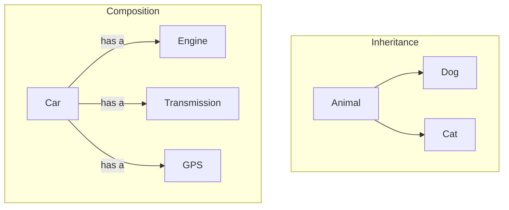
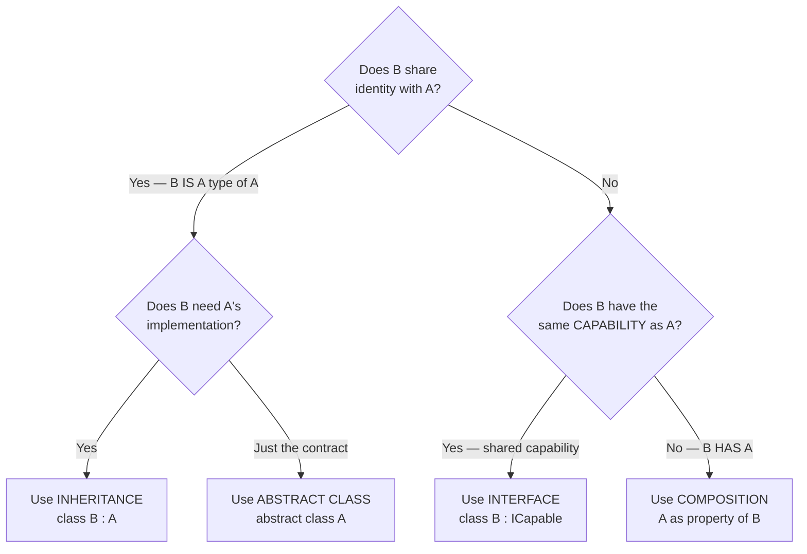

# Lecture 3: Composition and Choosing the Right Design

[← Previous: Lecture 2 – Multiple Interfaces and Interface-Based Design](./lecture-2.md) | [Back to Week 11 Overview](./README.md)

---

## Lecture Overview

| Item | Detail |
|------|--------|
| Duration | 45 minutes |
| Topics | Composition over inheritance, "has-a" relationships, building objects from parts, when to use inheritance vs interfaces vs composition |
| Preparation | Completed Lectures 1 & 2 — comfortable with interfaces, multiple implementation, `IComparable<T>` |

---

## 1. The Problem with Deep Inheritance

So far in the OOP block, we've been building class hierarchies. They work well for clear "is-a" relationships:

```
Animal → Dog → GoldenRetriever
Shape → Circle
Employee → Manager
```

But what happens when you try to model something more complex?

```csharp
class Robot : ???
{
    // A robot can move (like an Animal?)
    // A robot has a battery (like an ElectronicDevice?)
    // A robot can clean (like a CleaningTool?)
}
```

In C#, a class can only inherit from **one** base class. You can't write `class Robot : Animal, ElectronicDevice, CleaningTool`. This is called the **single inheritance limitation**.

Interfaces help — you could do `class Robot : IMovable, IPowered, ICleanable`. But interfaces only define **what** a robot can do, they don't provide the **how**. You'd have to write all the movement code, power management code, and cleaning code from scratch inside `Robot`.

There's a third option: **composition**.

---

## 2. What Is Composition?

**Composition** means building objects that **contain** other objects as properties. Instead of inheriting behavior, you **delegate** to contained objects.

Think of it like building with LEGO blocks. Instead of creating one massive specialized piece, you snap together smaller, reusable pieces.



### The "Has-A" Test

Just like inheritance uses the "is-a" test, composition uses the **"has-a" test**:

| Relationship | Test | Example | Design |
|-------------|------|---------|--------|
| Inheritance | "Is a" | A Dog **is a** Animal | `class Dog : Animal` |
| Composition | "Has a" | A Car **has a** Engine | `Engine` as a property of `Car` |

---

## 3. Composition in Code

Let's model a `Computer` using composition. A computer **has** a processor, memory, and a hard drive — it doesn't **inherit** from any of them.

### Step 1: Define the Parts

```csharp
class Processor
{
    public string Model { get; set; }
    public double SpeedGhz { get; set; }

    public Processor(string model, double speedGhz)
    {
        Model = model;
        SpeedGhz = speedGhz;
    }

    public string GetSpecs()
    {
        return $"{Model} @ {SpeedGhz} GHz";
    }
}

class Memory
{
    public int SizeGb { get; set; }
    public string Type { get; set; }

    public Memory(int sizeGb, string type)
    {
        SizeGb = sizeGb;
        Type = type;
    }

    public string GetSpecs()
    {
        return $"{SizeGb} GB {Type}";
    }
}

class HardDrive
{
    public int SizeGb { get; set; }
    public string DriveType { get; set; } // "SSD" or "HDD"

    public HardDrive(int sizeGb, string driveType)
    {
        SizeGb = sizeGb;
        DriveType = driveType;
    }

    public string GetSpecs()
    {
        return $"{SizeGb} GB {DriveType}";
    }
}
```

### Step 2: Compose the Computer

```csharp
class Computer
{
    public string Name { get; set; }
    public Processor Cpu { get; set; }
    public Memory Ram { get; set; }
    public HardDrive Storage { get; set; }

    public Computer(string name, Processor cpu, Memory ram, HardDrive storage)
    {
        Name = name;
        Cpu = cpu;
        Ram = ram;
        Storage = storage;
    }

    public void PrintSpecs()
    {
        Console.WriteLine($"=== {Name} ===");
        Console.WriteLine($"  CPU:     {Cpu.GetSpecs()}");
        Console.WriteLine($"  RAM:     {Ram.GetSpecs()}");
        Console.WriteLine($"  Storage: {Storage.GetSpecs()}");
    }
}
```

### Step 3: Build and Use

```csharp
Processor cpu = new Processor("Intel i7-13700K", 5.4);
Memory ram = new Memory(32, "DDR5");
HardDrive ssd = new HardDrive(1000, "SSD");

Computer myPc = new Computer("Dev Machine", cpu, ram, ssd);
myPc.PrintSpecs();
```

**Output:**
```
=== Dev Machine ===
  CPU:     Intel i7-13700K @ 5.4 GHz
  RAM:     32 GB DDR5
  Storage: 1000 GB SSD
```

Notice how the `Computer` class **delegates** to its parts. It doesn't know how `Processor.GetSpecs()` works — it just calls it. Each part is responsible for its own behavior.

---

## 4. Composition vs Inheritance: A Comparison

Let's look at the same problem solved both ways.

### Scenario: A Game Character with Equipment

**Inheritance approach (problematic):**

```csharp
class Character { }
class ArmoredCharacter : Character { } // has armor
class ArmedCharacter : Character { }    // has a weapon
class ArmoredArmedCharacter : ??? { }   // has both — can't inherit from two classes!
```

**Composition approach (flexible):**

```csharp
class Weapon
{
    public string Name { get; set; }
    public int Damage { get; set; }

    public Weapon(string name, int damage)
    {
        Name = name;
        Damage = damage;
    }

    public override string ToString() => $"{Name} (DMG: {Damage})";
}

class Armor
{
    public string Name { get; set; }
    public int Defense { get; set; }

    public Armor(string name, int defense)
    {
        Name = name;
        Defense = defense;
    }

    public override string ToString() => $"{Name} (DEF: {Defense})";
}

class Character
{
    public string Name { get; set; }
    public Weapon EquippedWeapon { get; set; }
    public Armor EquippedArmor { get; set; }

    public Character(string name)
    {
        Name = name;
    }

    public void ShowStatus()
    {
        Console.WriteLine($"Character: {Name}");
        Console.WriteLine($"  Weapon: {EquippedWeapon?.ToString() ?? "None"}");
        Console.WriteLine($"  Armor:  {EquippedArmor?.ToString() ?? "None"}");
    }
}
```

```csharp
Character hero = new Character("Aldric");
hero.EquippedWeapon = new Weapon("Iron Sword", 25);
hero.EquippedArmor = new Armor("Leather Vest", 10);
hero.ShowStatus();

// Swap equipment at runtime!
hero.EquippedWeapon = new Weapon("Fire Staff", 40);
hero.ShowStatus();
```

**Output:**
```
Character: Aldric
  Weapon: Iron Sword (DMG: 25)
  Armor:  Leather Vest (DEF: 10)
Character: Aldric
  Weapon: Fire Staff (DMG: 40)
  Armor:  Leather Vest (DEF: 10)
```

The composition approach lets you:
- Give a character **any combination** of equipment
- **Swap** equipment at runtime
- Add new equipment types without changing the `Character` class
- Reuse `Weapon` and `Armor` in other contexts (NPCs, shops, inventory)

---

## 5. Combining Interfaces and Composition

The real power comes from combining all three approaches. Here's a more complete example:

```csharp
// Interface — defines capability
interface IAttackable
{
    int Health { get; }
    void TakeDamage(int amount);
    bool IsAlive { get; }
}

// Component class — reusable part
class HealthSystem
{
    public int MaxHealth { get; }
    public int CurrentHealth { get; private set; }
    public bool IsAlive => CurrentHealth > 0;

    public HealthSystem(int maxHealth)
    {
        MaxHealth = maxHealth;
        CurrentHealth = maxHealth;
    }

    public void TakeDamage(int amount)
    {
        CurrentHealth = Math.Max(0, CurrentHealth - amount);
    }

    public void Heal(int amount)
    {
        CurrentHealth = Math.Min(MaxHealth, CurrentHealth + amount);
    }
}

// Character uses COMPOSITION for health, IMPLEMENTS interface for contract
class Player : IAttackable
{
    public string Name { get; set; }
    private HealthSystem _health;

    public int Health => _health.CurrentHealth;
    public bool IsAlive => _health.IsAlive;

    public Player(string name, int maxHealth)
    {
        Name = name;
        _health = new HealthSystem(maxHealth);
    }

    public void TakeDamage(int amount)
    {
        _health.TakeDamage(amount);  // Delegate to the component
        Console.WriteLine($"{Name} takes {amount} damage! HP: {Health}");
    }

    public void Heal(int amount)
    {
        _health.Heal(amount);
        Console.WriteLine($"{Name} heals {amount}! HP: {Health}");
    }
}

// Enemy also uses the same HealthSystem component
class Enemy : IAttackable
{
    public string Name { get; set; }
    private HealthSystem _health;

    public int Health => _health.CurrentHealth;
    public bool IsAlive => _health.IsAlive;

    public Enemy(string name, int maxHealth)
    {
        Name = name;
        _health = new HealthSystem(maxHealth);
    }

    public void TakeDamage(int amount)
    {
        _health.TakeDamage(amount);
        Console.WriteLine($"[Enemy] {Name} takes {amount} damage! HP: {Health}");
    }
}
```

```csharp
Player hero = new Player("Aldric", 100);
Enemy goblin = new Enemy("Goblin", 30);

// Both can be treated as IAttackable
List<IAttackable> targets = new List<IAttackable> { hero, goblin };

foreach (IAttackable target in targets)
{
    target.TakeDamage(15);
}
```

**Output:**
```
Aldric takes 15 damage! HP: 85
[Enemy] Goblin takes 15 damage! HP: 15
```

Here's what's happening:
- `HealthSystem` is a **composition component** — reusable health logic
- `IAttackable` is an **interface** — defines the contract for anything that can take damage
- `Player` and `Enemy` **compose** `HealthSystem` and **implement** `IAttackable`
- The health logic is written **once** in `HealthSystem` and reused by both classes

---

## 6. The Design Decision Guide

Here's a practical guide for choosing between the three approaches:



### Quick Reference Table

| Ask Yourself | If Yes → | Example |
|-------------|----------|---------|
| Is B a *type of* A? | **Inheritance** | Dog is an Animal |
| Should A force subclasses to implement specific methods? | **Abstract class** | Shape forces CalculateArea() |
| Does B have a *capability* shared by unrelated classes? | **Interface** | Dog, Robot, and Car can all Move |
| Does B *contain* or *use* A? | **Composition** | Car has an Engine |

### Common Combinations

| Pattern | Description |
|---------|-------------|
| Inheritance + Interface | `class Dog : Animal, ITrainable` — Dog is an Animal that can be trained |
| Composition + Interface | `class Player : IAttackable` with a `HealthSystem` property — Player can be attacked, delegates to composed health system |
| All three | Base class for shared identity, interfaces for capabilities, composition for reusable parts |

---

## 7. Complete Example: A Notification System

Let's build a practical example that uses all three concepts:

```csharp
// INTERFACE — the capability contract
interface INotificationSender
{
    string SenderType { get; }
    bool Send(string recipient, string message);
}

// COMPOSITION COMPONENT — reusable logging
class NotificationLogger
{
    private List<string> _log = new List<string>();

    public void Log(string entry)
    {
        _log.Add($"[{DateTime.Now:HH:mm:ss}] {entry}");
    }

    public void PrintLog()
    {
        foreach (string entry in _log)
        {
            Console.WriteLine(entry);
        }
    }

    public int Count => _log.Count;
}

// CONCRETE CLASSES — implement interface, compose logger
class EmailSender : INotificationSender
{
    public string SenderType => "Email";
    private NotificationLogger _logger = new NotificationLogger();

    public bool Send(string recipient, string message)
    {
        Console.WriteLine($"📧 Sending email to {recipient}: {message}");
        _logger.Log($"Email sent to {recipient}");
        return true;
    }

    public void ShowHistory() => _logger.PrintLog();
}

class SmsSender : INotificationSender
{
    public string SenderType => "SMS";
    private NotificationLogger _logger = new NotificationLogger();

    public bool Send(string recipient, string message)
    {
        if (message.Length > 160)
        {
            Console.WriteLine($"❌ SMS too long for {recipient}");
            _logger.Log($"SMS failed — message too long for {recipient}");
            return false;
        }
        Console.WriteLine($"📱 Sending SMS to {recipient}: {message}");
        _logger.Log($"SMS sent to {recipient}");
        return true;
    }

    public void ShowHistory() => _logger.PrintLog();
}

// SERVICE CLASS — works with any INotificationSender
class NotificationService
{
    private List<INotificationSender> _senders = new List<INotificationSender>();

    public void AddSender(INotificationSender sender)
    {
        _senders.Add(sender);
    }

    public void NotifyAll(string recipient, string message)
    {
        foreach (INotificationSender sender in _senders)
        {
            bool success = sender.Send(recipient, message);
            Console.WriteLine($"  [{sender.SenderType}] {(success ? "✓" : "✗")}");
        }
    }
}
```

```csharp
NotificationService service = new NotificationService();
service.AddSender(new EmailSender());
service.AddSender(new SmsSender());

service.NotifyAll("alice@example.com", "Your order has shipped!");
```

**Output:**
```
📧 Sending email to alice@example.com: Your order has shipped!
  [Email] ✓
📱 Sending SMS to alice@example.com: Your order has shipped!
  [SMS] ✓
```

This example demonstrates:
- **Interface** (`INotificationSender`) — defines the capability contract
- **Composition** (`NotificationLogger`) — reusable logging inside each sender
- **Polymorphism** — `NotificationService` works with any sender type via the interface

---

## Key Takeaways

- **Composition** means building objects that **contain** other objects as properties ("has-a")
- Use the "has-a" test: a Car **has an** Engine, so Engine should be a property, not a base class
- Composition provides **flexibility** — you can swap parts at runtime and reuse them across unrelated classes
- The **three tools** for OOP design: inheritance ("is-a"), interfaces ("can-do"), composition ("has-a")
- Real-world designs typically **combine** all three approaches
- **Favor composition over inheritance** when the relationship isn't clearly "is-a"
- Deep inheritance hierarchies (more than 2–3 levels) are a warning sign — consider composition instead

---

## Hands-On Exercises

### Exercise 1 — Computer Builder
Using the `Computer` example from this lecture, add a `GraphicsCard` class with `Model` and `MemoryGb` properties. Update `Computer` to include an **optional** `GraphicsCard` (can be `null`). Print "(Integrated)" when no graphics card is present.

### Exercise 2 — Music Player
Create a composition-based music player: a `Song` class (Title, Artist, DurationSeconds), a `Playlist` class that contains a `List<Song>`, and a `MusicPlayer` class that has a `Playlist` and a `CurrentSongIndex`. The player should support `Play()`, `Next()`, `Previous()`, and `ShowQueue()`.

### Exercise 3 — Design Decision
For each scenario, decide whether to use inheritance, an interface, composition, or a combination. Then implement your choice:
- A `University` that has multiple `Department` objects
- A `Smartphone` that can make calls, send texts, and browse the web
- `ElectricCar` and `GasCar` that are both types of `Car`

---

[← Previous: Lecture 2 – Multiple Interfaces and Interface-Based Design](./lecture-2.md) | [Back to Week 11 Overview](./README.md)
