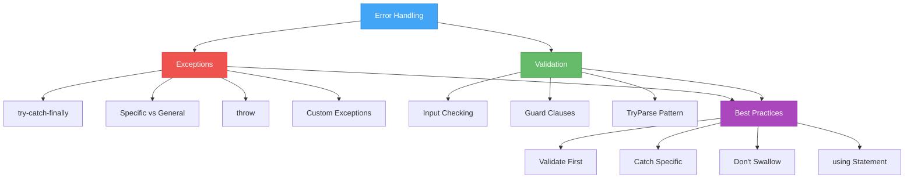
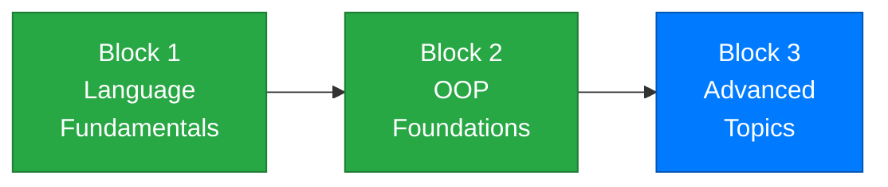

# Week 12 – Exception Handling and Defensive Programming

[← Back to Course Home](../../README.md) | [← Previous: Week 11 – Interfaces and Composition](../week-11/README.md) | [Next: Week 13 – Generics, Enums, and Nullable Types →](../week-13/README.md)

---

## 📋 Overview

Welcome to **Block 3: Advanced Language Topics**. You've built a solid foundation in OOP — classes, inheritance, polymorphism, interfaces. Now it's time to make your programs **robust**.

Until now, when something goes wrong in your program — a user types "abc" when you expect a number, a file doesn't exist, or you divide by zero — your program crashes. That's fine for practice exercises, but real software can't just crash. It needs to **handle problems gracefully**, tell the user what went wrong, and keep running.

This week you'll learn about **exceptions** — C#'s built-in mechanism for dealing with errors at runtime. You'll learn how to catch them, throw them, create your own, and most importantly, when to use them versus simple validation checks.

> **Analogy:** Think of exception handling like a safety net under a tightrope walker. You don't *plan* to fall (that's validation — keeping your balance), but if something unexpected happens, the net catches you instead of letting you crash to the ground.

---

## 🎯 Learning Objectives

By the end of this week, you will be able to:

1. Explain what exceptions are and how they differ from regular errors
2. Use `try-catch-finally` to handle exceptions gracefully
3. Catch **specific** exceptions and understand why ordering matters
4. **Throw** exceptions to signal error conditions in your own code
5. Create **custom exception classes** for domain-specific errors
6. Distinguish between **validation** (preventing errors) and **exception handling** (recovering from errors)
7. Use the `using` statement for resource management

---

## 📚 Materials

| # | Material | Topics |
|---|----------|--------|
| 1 | [Lecture 1 – What Are Exceptions? try-catch-finally](./lecture-1.md) | Exception basics, try-catch-finally, catching specific exceptions, exception hierarchy |
| 2 | [Lecture 2 – Throwing Exceptions and Custom Exception Classes](./lecture-2.md) | `throw`, guard clauses, designing custom exceptions, when to throw |
| 3 | [Lecture 3 – Defensive Programming and Validation Strategies](./lecture-3.md) | Validation vs exception handling, input validation patterns, `using` statement, best practices |
| 4 | [Exercises – Practice Problems](./exercises.md) | Progressive exercises covering exception handling and defensive programming |
| 5 | [Assignment – Robust Bank Account System](./assignment.md) | Capstone mini-project integrating all Week 12 concepts |

---

## 🔑 Key Concepts This Week



---

## 🗺️ How This Week Fits Into the Course



```
✅ Week 7  – Classes & Objects        ✅ Week 10 – Polymorphism
✅ Week 8  – Encapsulation             ✅ Week 11 – Interfaces & Composition
✅ Week 9  – Inheritance               👉 Week 12 – Exception Handling ← YOU ARE HERE
                                       ⬜ Week 13 – Generics, Enums, Nullables
                                       ⬜ Week 14 – LINQ & Lambdas
                                       ⬜ Week 15 – Integration
```

> 🎉 **Welcome to Block 3!** You've completed OOP Foundations. Now you'll learn the advanced features that make your OOP code production-ready. Exception handling is the first step — making your programs robust enough to handle the unexpected.

---

## 🔗 Prerequisites

Before starting this week, make sure you're comfortable with:

- **Classes and objects** (Week 7) — exceptions are objects; custom exceptions are classes
- **Inheritance** (Week 9) — all exceptions inherit from `System.Exception`
- **Methods** (Week 5) — you'll throw exceptions from methods and catch them in calling code

---

## ✅ Week Checklist

- [ ] Complete Lecture 1 — understand exceptions, write try-catch-finally blocks
- [ ] Complete Lecture 2 — throw exceptions, create custom exception classes
- [ ] Complete Lecture 3 — master validation strategies, understand when to use what
- [ ] Work through the practice exercises
- [ ] Complete the **Robust Bank Account System** assignment

---

[← Week 11: Interfaces & Composition](../week-11/README.md) | [Week 13: Generics, Enums, and Nullable Types →](../week-13/README.md)
