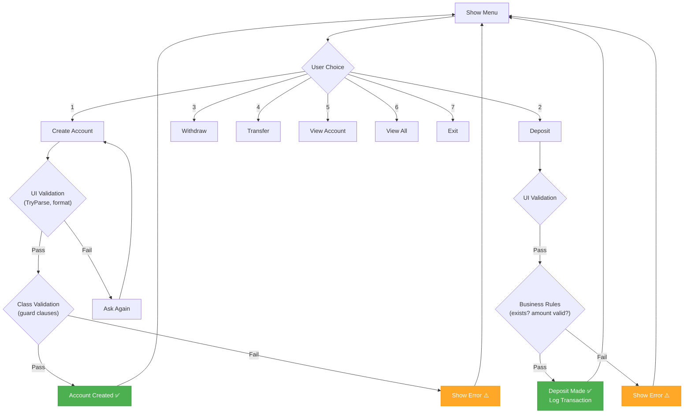

# Week 12 – Assignment: Robust Bank Account System

[← Back to Week 12 Overview](./README.md)

---

## 📋 Overview

Build a **Robust Bank Account System** — a console application that manages bank accounts with proper exception handling and input validation at every level. This assignment brings together everything from Week 12: try-catch, throwing exceptions, custom exceptions, guard clauses, TryParse validation, and the `using` statement.

---

## 🎯 Requirements

### 1. Custom Exception Classes

Create the following custom exceptions:

| Exception | Properties | When Thrown |
|-----------|-----------|------------|
| `InsufficientFundsException` | `Balance`, `AttemptedAmount` | Withdrawing more than the balance |
| `AccountNotFoundException` | `AccountNumber` | Looking up an account that doesn't exist |
| `DuplicateAccountException` | `AccountNumber` | Creating an account with an existing number |
| `InvalidTransactionException` | `TransactionType`, `Amount` | Depositing/withdrawing a negative or zero amount |

Each custom exception should:
- Inherit from `Exception`
- Include a descriptive message (via `base(...)`)
- Have the relevant context properties

### 2. BankAccount Class

Create a `BankAccount` class with:

| Member | Details |
|--------|---------|
| `AccountNumber` | `string`, read-only, set in constructor. Must be exactly 6 digits. |
| `OwnerName` | `string`, validated — not null/empty, max 100 characters |
| `Balance` | `decimal`, read-only from outside. Initial balance must be ≥ 0 |
| `Deposit(decimal amount)` | Throws `InvalidTransactionException` if amount ≤ 0 |
| `Withdraw(decimal amount)` | Throws `InvalidTransactionException` if amount ≤ 0, `InsufficientFundsException` if amount > balance |
| `ToString()` | Returns formatted string: `"[123456] Alice Johnson — $1,250.00"` |

All parameters must be validated with **guard clauses** that throw the appropriate exception types.

### 3. Bank Class

Create a `Bank` class that manages a collection of accounts:

| Method | Details |
|--------|---------|
| `CreateAccount(string accountNumber, string ownerName, decimal initialBalance)` | Throws `DuplicateAccountException` if account number already exists |
| `GetAccount(string accountNumber)` | Returns the account, throws `AccountNotFoundException` if not found |
| `Deposit(string accountNumber, decimal amount)` | Finds the account and deposits |
| `Withdraw(string accountNumber, decimal amount)` | Finds the account and withdraws |
| `Transfer(string fromAccount, string toAccount, decimal amount)` | Withdraws from one, deposits to another. If withdrawal fails, deposit shouldn't happen |
| `GetAllAccounts()` | Returns a list of all accounts |

### 4. Console Interface

Build a menu-driven console program:

```
╔═══════════════════════════════════╗
║     SECURE BANK SYSTEM v1.0      ║
╠═══════════════════════════════════╣
║  1. Create Account                ║
║  2. Deposit                       ║
║  3. Withdraw                      ║
║  4. Transfer                      ║
║  5. View Account                  ║
║  6. View All Accounts             ║
║  7. Exit                          ║
╚═══════════════════════════════════╝
```

**The console interface must:**
- Use `TryParse` for all numeric inputs (no try-catch for input conversion)
- Validate string inputs (non-empty, correct format)
- Catch and display all custom exceptions with user-friendly messages
- Never crash — every possible error must be handled gracefully
- Allow the user to return to the menu after any error

### 5. Transaction Log (using Statement)

Add a `TransactionLogger` class that:
- Writes each transaction to a file (`transactions.txt`)
- Uses the `using` statement for file operations
- Logs format: `[2024-03-15 14:30:22] DEPOSIT $500.00 → Account 123456 (Balance: $1,500.00)`
- Handles `IOException` gracefully if the file can't be written

---

## 📊 Program Flow



---

## 💡 Sample Output

```
╔═══════════════════════════════════╗
║     SECURE BANK SYSTEM v1.0      ║
╠═══════════════════════════════════╣
║  1. Create Account                ║
║  2. Deposit                       ║
║  3. Withdraw                      ║
║  4. Transfer                      ║
║  5. View Account                  ║
║  6. View All Accounts             ║
║  7. Exit                          ║
╚═══════════════════════════════════╝

Choice: 1
Account Number (6 digits): 12345
⚠️ Account number must be exactly 6 digits.
Account Number (6 digits): 123456
Owner Name: Alice Johnson
Initial Balance: $500
✅ Account created: [123456] Alice Johnson — $500.00

Choice: 3
Account Number: 123456
Withdrawal Amount: $800
⚠️ Insufficient funds. Balance: $500.00, Attempted: $800.00

Choice: 4
From Account: 123456
To Account: 999999
Transfer Amount: $100
⚠️ Account '999999' not found.

Choice: 2
Account Number: 123456
Deposit Amount: abc
⚠️ Please enter a valid amount.
Deposit Amount: -50
⚠️ Invalid transaction: Deposit amount must be positive.
Deposit Amount: 200
✅ Deposited $200.00. New balance: $700.00

Choice: 7
Goodbye! Transaction log saved to transactions.txt.
```

---

## 📁 Required Classes

| Class | File | Responsibility |
|-------|------|---------------|
| `BankAccount` | BankAccount.cs | Single account with validated operations |
| `Bank` | Bank.cs | Manages collection of accounts |
| `TransactionLogger` | TransactionLogger.cs | Writes transaction log to file |
| `InsufficientFundsException` | Exceptions.cs | Custom exception for insufficient balance |
| `AccountNotFoundException` | Exceptions.cs | Custom exception for missing accounts |
| `DuplicateAccountException` | Exceptions.cs | Custom exception for duplicate accounts |
| `InvalidTransactionException` | Exceptions.cs | Custom exception for invalid amounts |
| `Program` | Program.cs | Console UI with input validation |

---

## 🧪 Test Scenarios

Make sure your program handles all of these without crashing:

| Scenario | Expected Behavior |
|----------|-------------------|
| Create account with "ABC" as number | Error: must be 6 digits |
| Create duplicate account number | Error: DuplicateAccountException message |
| Deposit negative amount | Error: InvalidTransactionException message |
| Deposit to nonexistent account | Error: AccountNotFoundException message |
| Withdraw more than balance | Error: InsufficientFundsException with balance details |
| Transfer between valid accounts | Success: both balances updated, logged |
| Transfer from nonexistent account | Error: AccountNotFoundException |
| Enter "abc" for any numeric field | Validation: ask again (TryParse) |
| Enter empty string for name | Validation: ask again |
| View nonexistent account | Error: AccountNotFoundException message |

---

## ⭐ Grading Rubric

| Criteria | Points |
|----------|--------|
| **Custom Exceptions** — All 4 defined correctly with properties and messages | 20 |
| **BankAccount Class** — All guard clauses, correct exception types thrown | 20 |
| **Bank Class** — All operations work, correct exceptions for each failure | 15 |
| **Input Validation** — TryParse for numbers, string checks, no crashes | 15 |
| **Transaction Logger** — Uses `using`, logs correct format, handles IOException | 10 |
| **Console UI** — Clean menu, catches all exceptions, user-friendly messages | 10 |
| **Code Quality** — Readable, consistent naming, appropriate comments | 10 |
| **Total** | **100** |

---

## 🧩 Starter Template

```csharp
// --- Exceptions.cs ---
public class InsufficientFundsException : Exception
{
    // TODO: Properties for Balance and AttemptedAmount
    // TODO: Constructor that builds a descriptive message
}

// TODO: AccountNotFoundException, DuplicateAccountException, InvalidTransactionException

// --- BankAccount.cs ---
public class BankAccount
{
    // TODO: Properties with validation
    // TODO: Constructor with guard clauses
    // TODO: Deposit and Withdraw methods that throw appropriate exceptions
    // TODO: ToString override
}

// --- Bank.cs ---
public class Bank
{
    private List<BankAccount> _accounts = new List<BankAccount>();

    // TODO: CreateAccount, GetAccount, Deposit, Withdraw, Transfer
}

// --- TransactionLogger.cs ---
public class TransactionLogger
{
    private string _filePath;

    public TransactionLogger(string filePath)
    {
        _filePath = filePath;
    }

    public void Log(string message)
    {
        // TODO: Use 'using' statement to append to file
        // TODO: Handle IOException
    }
}

// --- Program.cs ---
class Program
{
    static Bank bank = new Bank();
    static TransactionLogger logger = new TransactionLogger("transactions.txt");

    static void Main()
    {
        // TODO: Menu loop
        // TODO: Input validation with TryParse
        // TODO: Catch custom exceptions with user-friendly messages
    }

    // TODO: Helper methods for input validation
}
```

---

## 🏆 Bonus Challenges

1. **Account Types:** Create `SavingsAccount` and `CheckingAccount` subclasses. Savings accounts charge a $5 fee for withdrawals after 3 per month. Checking accounts allow overdraft up to -$100. Use inheritance (Week 9) and throw appropriate exceptions.

2. **Transaction History:** Store a `List<Transaction>` in each account, where `Transaction` has `Type`, `Amount`, `Date`, and `BalanceAfter`. Add a method to print transaction history.

3. **Interest Calculation:** Add a `CalculateInterest(decimal annualRate)` method to `BankAccount`. Throw `ArgumentOutOfRangeException` if rate is negative or above 0.5 (50%).

4. **Batch Operations:** Add a `Bank.ProcessBatch(List<(string accountNumber, string operation, decimal amount)>)` method that processes multiple operations. If one fails, continue with the rest and return a summary of successes and failures.

5. **Account Locking:** Add the ability to lock/unlock accounts. Locked accounts should throw `InvalidOperationException` for any deposit or withdrawal attempt.

---

[← Back to Week 12 Overview](./README.md)
