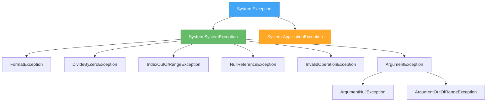
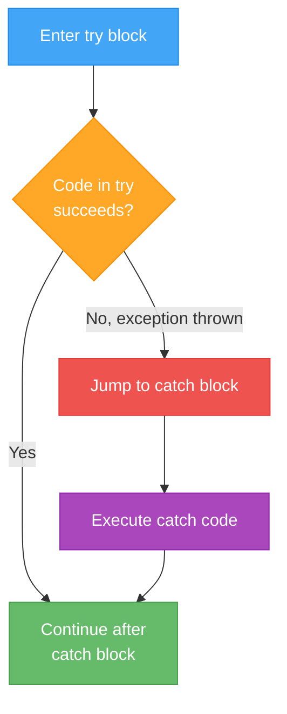
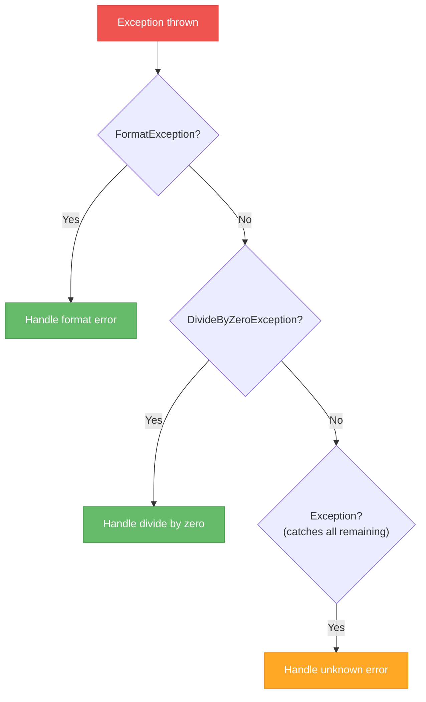

# Lecture 1: What Are Exceptions? try-catch-finally

[← Back to Week 12 Overview](./README.md) | [Next: Lecture 2 – Throwing Exceptions and Custom Exception Classes →](./lecture-2.md)

---

## Lecture Overview

| Item | Detail |
|------|--------|
| Duration | 45 minutes |
| Topics | What exceptions are, try-catch-finally, catching specific exceptions, exception hierarchy |
| Preparation | Comfortable with classes, inheritance, and methods |

---

## 1. When Things Go Wrong

Every program you've written so far assumes things will go well. The user enters a number when you ask for a number. The list isn't empty when you access the first element. The divisor is never zero.

But in the real world, things go wrong all the time. Let's see what happens:

```csharp
Console.Write("Enter a number: ");
int number = int.Parse(Console.ReadLine());
Console.WriteLine($"Double: {number * 2}");
```

If the user types `"hello"`, the program crashes:

```
Unhandled exception. System.FormatException: The input string 'hello' was not in a correct format.
   at System.Number.ThrowFormatException...
```

The program didn't just give a wrong answer — it **stopped completely**. That crash message? That's an **exception**.

---

## 2. What Is an Exception?

An exception is an **object** that represents an error that occurs during program execution. When something goes wrong, C# **throws** an exception. If nothing catches it, the program crashes.

Key points:

- Exceptions are **objects** — they're instances of classes (just like everything else in C#)
- All exception classes inherit from `System.Exception`
- Exceptions carry information: a **message**, a **type**, and a **stack trace** (where the error happened)
- You've already seen exceptions — `FormatException`, `IndexOutOfRangeException`, `DivideByZeroException`



> **Key insight:** Since exceptions are objects that use inheritance, everything you learned about OOP applies here. A `FormatException` **is a** `SystemException`, which **is an** `Exception`. This hierarchy matters when catching exceptions.

---

## 3. The try-catch Block

Instead of letting your program crash, you can **catch** exceptions and handle them:

```csharp
try
{
    Console.Write("Enter a number: ");
    int number = int.Parse(Console.ReadLine());
    Console.WriteLine($"Double: {number * 2}");
}
catch (Exception ex)
{
    Console.WriteLine($"Something went wrong: {ex.Message}");
}
```

**Output when user types "hello":**
```
Enter a number: hello
Something went wrong: The input string 'hello' was not in a correct format.
```

The program didn't crash. It caught the error and told the user what happened.

### How It Works



1. Code inside `try` runs normally
2. If an exception occurs, execution **immediately jumps** to the `catch` block — remaining lines in `try` are skipped
3. The `catch` block handles the error
4. Execution continues after the catch block

### Important: Code After the Error Is Skipped

```csharp
try
{
    Console.WriteLine("Step 1");        // ✅ Runs
    int result = 10 / 0;               // ❌ Exception here!
    Console.WriteLine("Step 2");        // ⏭️ SKIPPED
    Console.WriteLine("Step 3");        // ⏭️ SKIPPED
}
catch (Exception ex)
{
    Console.WriteLine("Caught an error!");  // ✅ Runs
}
Console.WriteLine("Program continues");     // ✅ Runs
```

**Output:**
```
Step 1
Caught an error!
Program continues
```

---

## 4. The Exception Object

When you catch an exception, you get access to the exception object. It has useful properties:

| Property | Description |
|----------|-------------|
| `Message` | Human-readable description of the error |
| `GetType().Name` | The exception type name (e.g., "FormatException") |
| `StackTrace` | Shows where the error occurred (method calls leading to the error) |
| `InnerException` | The exception that caused this one (if any) |

```csharp
try
{
    int[] numbers = { 1, 2, 3 };
    Console.WriteLine(numbers[10]);
}
catch (Exception ex)
{
    Console.WriteLine($"Type:    {ex.GetType().Name}");
    Console.WriteLine($"Message: {ex.Message}");
    Console.WriteLine($"Stack:   {ex.StackTrace}");
}
```

**Output:**
```
Type:    IndexOutOfRangeException
Message: Index was outside the bounds of the array.
Stack:   at Program.Main(String[] args) in Program.cs:line 4
```

---

## 5. Catching Specific Exceptions

Catching the general `Exception` type works, but it's like using a fishing net that catches *everything* — including fish you didn't want. It's better to catch **specific** exception types:

```csharp
try
{
    Console.Write("Enter a number: ");
    int number = int.Parse(Console.ReadLine());
    int result = 100 / number;
    Console.WriteLine($"100 / {number} = {result}");
}
catch (FormatException)
{
    Console.WriteLine("That's not a valid number.");
}
catch (DivideByZeroException)
{
    Console.WriteLine("You can't divide by zero.");
}
```

**Output for "hello":**
```
Enter a number: hello
That's not a valid number.
```

**Output for "0":**
```
Enter a number: 0
You can't divide by zero.
```

Each exception type gets its own tailored message. Much better for the user.

### Ordering Matters — Specific Before General

Because exceptions use inheritance, you must catch **specific** exceptions before **general** ones:

```csharp
// ✅ CORRECT — specific first
try { /* ... */ }
catch (FormatException ex) { /* handles format errors */ }
catch (Exception ex) { /* catches everything else */ }

// ❌ WRONG — general first catches everything
try { /* ... */ }
catch (Exception ex) { /* catches ALL exceptions — FormatException never reached */ }
catch (FormatException ex) { /* ⚠️ Compiler error: unreachable code */ }
```

Think of it like a funnel — put the narrow catches at the top, the wide catch at the bottom:



---

## 6. The finally Block

Sometimes you need code to run **regardless** of whether an exception occurred — for example, closing a file or releasing a resource. That's what `finally` is for:

```csharp
try
{
    Console.WriteLine("Opening connection...");
    // Simulate some operation that might fail
    int result = int.Parse("not a number");
    Console.WriteLine("Operation succeeded");
}
catch (FormatException ex)
{
    Console.WriteLine($"Error: {ex.Message}");
}
finally
{
    Console.WriteLine("Closing connection...");  // ALWAYS runs
}
```

**Output:**
```
Opening connection...
Error: The input string 'not a number' was not in a correct format.
Closing connection...
```

The `finally` block runs in **all** scenarios:

| Scenario | try runs? | catch runs? | finally runs? |
|----------|-----------|-------------|---------------|
| No exception | ✅ | ❌ | ✅ |
| Exception caught | Partially | ✅ | ✅ |
| Exception not caught | Partially | ❌ | ✅ |

> **When do you need `finally`?** Most of the time, you won't. It's primarily useful when you're managing resources (database connections, file handles, network connections) that need to be cleaned up no matter what. You'll see this more in the Web App course.

---

## 7. Common Exception Types You'll Encounter

Here's a reference of the exceptions you're most likely to see:

| Exception | When It Happens | Example |
|-----------|----------------|---------|
| `FormatException` | String can't be converted to the target type | `int.Parse("abc")` |
| `DivideByZeroException` | Integer division by zero | `10 / 0` |
| `IndexOutOfRangeException` | Array/string index is invalid | `arr[100]` when array has 5 elements |
| `NullReferenceException` | Using a variable that is `null` | `string s = null; s.Length;` |
| `ArgumentException` | Method receives an invalid argument | Passing a negative number when positive is required |
| `ArgumentNullException` | Method receives `null` when it shouldn't | Passing `null` to a method expecting a string |
| `ArgumentOutOfRangeException` | Argument is outside the allowed range | Passing month = 13 |
| `InvalidOperationException` | Operation is invalid for the object's current state | Calling `Dequeue()` on an empty queue |
| `OverflowException` | Arithmetic overflow in a `checked` context | `checked { int x = int.MaxValue + 1; }` |
| `FileNotFoundException` | File doesn't exist at the specified path | `File.ReadAllText("missing.txt")` |

---

## 8. Multiple Operations in One try Block

A common pattern is wrapping a sequence of operations that might fail:

```csharp
try
{
    Console.Write("Enter the numerator: ");
    int numerator = int.Parse(Console.ReadLine());

    Console.Write("Enter the denominator: ");
    int denominator = int.Parse(Console.ReadLine());

    int result = numerator / denominator;
    Console.WriteLine($"{numerator} / {denominator} = {result}");
}
catch (FormatException)
{
    Console.WriteLine("Please enter valid whole numbers.");
}
catch (DivideByZeroException)
{
    Console.WriteLine("The denominator cannot be zero.");
}
catch (Exception ex)
{
    Console.WriteLine($"Unexpected error: {ex.Message}");
}
```

This is clean and readable — all the "happy path" code is together in `try`, and each potential error is handled separately.

---

## 9. try-catch in a Loop — Retry Pattern

One of the most practical uses of try-catch is letting users retry after an error:

```csharp
int age;
while (true)
{
    try
    {
        Console.Write("Enter your age: ");
        age = int.Parse(Console.ReadLine());

        if (age < 0 || age > 150)
            throw new ArgumentOutOfRangeException();

        break;  // Valid input — exit the loop
    }
    catch (FormatException)
    {
        Console.WriteLine("That's not a number. Try again.");
    }
    catch (ArgumentOutOfRangeException)
    {
        Console.WriteLine("Age must be between 0 and 150. Try again.");
    }
}

Console.WriteLine($"Your age is {age}.");
```

**Sample run:**
```
Enter your age: abc
That's not a number. Try again.
Enter your age: -5
Age must be between 0 and 150. Try again.
Enter your age: 25
Your age is 25.
```

> **Note:** We used `throw` here to signal an out-of-range value. You'll learn all about throwing exceptions in the next lecture.

---

## 10. What NOT to Do with Exceptions

### ❌ Don't Swallow Exceptions Silently

```csharp
// BAD — hides errors completely
try
{
    int result = int.Parse(input);
}
catch (Exception)
{
    // Empty catch block — the error disappears silently
}
```

This is one of the worst things you can do. The error happened, but nobody knows about it. The program continues with wrong data or missing values.

### ❌ Don't Use Exceptions for Normal Flow Control

```csharp
// BAD — using exceptions as if/else
try
{
    int number = int.Parse(input);
    // process number...
}
catch (FormatException)
{
    // Not a number, so treat as a name
    Console.WriteLine($"Hello, {input}!");
}
```

Exceptions should be for **exceptional** situations, not routine branching logic. Use `int.TryParse()` instead (we'll cover this in Lecture 3).

### ❌ Don't Catch Exception When You Can Be Specific

```csharp
// BAD — too broad
catch (Exception ex)
{
    Console.WriteLine("Something went wrong");
}

// BETTER — targeted response
catch (FormatException)
{
    Console.WriteLine("Please enter a valid number");
}
```

---

## Key Takeaways

- **Exceptions** are objects that represent runtime errors — they follow the OOP hierarchy you already know
- **try-catch** lets you handle errors gracefully instead of crashing
- Always catch **specific** exceptions before general ones — ordering matters
- **finally** runs no matter what — useful for cleanup code
- Don't swallow exceptions silently or use them for normal flow control
- The try-catch-in-a-loop pattern is a practical way to handle invalid user input

---

## Hands-On Exercises

### Exercise 1 — Safe Division
Write a program that asks the user for two numbers and divides them. Use try-catch to handle both `FormatException` and `DivideByZeroException` with appropriate messages.

### Exercise 2 — Exception Inspector
Write a program that deliberately causes three different exceptions (your choice). Catch each one and print the exception's type name, message, and the first line of the stack trace.

### Exercise 3 — Robust Input Loop
Write a method `static double GetValidDouble(string prompt)` that keeps asking the user for input until they enter a valid `double`. Use try-catch inside a loop.

---

[← Back to Week 12 Overview](./README.md) | [Next: Lecture 2 – Throwing Exceptions and Custom Exception Classes →](./lecture-2.md)
