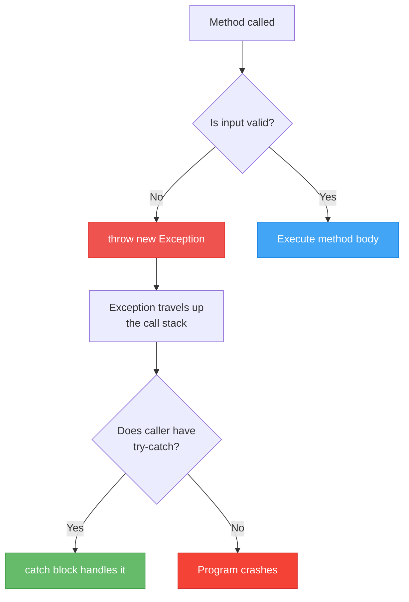
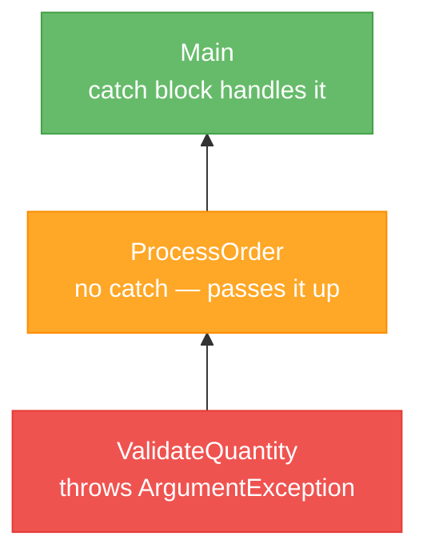

# Lecture 2: Throwing Exceptions and Custom Exception Classes

[← Previous: Lecture 1 – What Are Exceptions? try-catch-finally](./lecture-1.md) | [Back to Week 12 Overview](./README.md) | [Next: Lecture 3 – Defensive Programming and Validation Strategies →](./lecture-3.md)

---

## Lecture Overview

| Item | Detail |
|------|--------|
| Duration | 45 minutes |
| Topics | Throwing exceptions with `throw`, guard clauses, designing custom exception classes, when to throw |
| Preparation | Comfortable with try-catch from Lecture 1, inheritance from Week 9 |

---

## 1. Why Would You Throw an Exception?

In Lecture 1, you caught exceptions that C# threw for you — `FormatException`, `DivideByZeroException`, and so on. But what about errors that C# doesn't know about?

Consider a `BankAccount` class:

```csharp
public class BankAccount
{
    public string Owner { get; set; }
    public decimal Balance { get; private set; }

    public void Withdraw(decimal amount)
    {
        Balance -= amount;  // No checks at all!
    }
}
```

What if someone calls `Withdraw(-500)`? Or `Withdraw(1000000)` when the balance is only $100? C# won't throw an exception — there's no syntax error or type mismatch. But your **business logic** says this is wrong.

This is where **you** throw exceptions.

---

## 2. The throw Statement

You throw exceptions using the `throw` keyword:

```csharp
public void Withdraw(decimal amount)
{
    if (amount <= 0)
        throw new ArgumentException("Withdrawal amount must be positive.");

    if (amount > Balance)
        throw new InvalidOperationException("Insufficient funds.");

    Balance -= amount;
}
```

Now let's use it:

```csharp
BankAccount account = new BankAccount { Owner = "Alice", Balance = 500 };

try
{
    account.Withdraw(700);
}
catch (InvalidOperationException ex)
{
    Console.WriteLine($"Error: {ex.Message}");
}
```

**Output:**
```
Error: Insufficient funds.
```

The method **detected** an invalid situation and **signaled** it by throwing an exception. The calling code **caught** it and handled it gracefully.

### How throw Works



When you `throw`, the current method **stops immediately** (just like a `return`), and the exception travels up through the methods that called it until someone catches it — or the program crashes.

---

## 3. Guard Clauses — Check First, Execute Second

A **guard clause** is a pattern where you check for invalid conditions at the **beginning** of a method and throw immediately if something is wrong. This keeps the "happy path" code clean and unindented:

```csharp
// WITHOUT guard clauses — deeply nested
public void SetAge(int age)
{
    if (age >= 0)
    {
        if (age <= 150)
        {
            Age = age;
        }
        else
        {
            throw new ArgumentOutOfRangeException(nameof(age), "Age cannot exceed 150.");
        }
    }
    else
    {
        throw new ArgumentOutOfRangeException(nameof(age), "Age cannot be negative.");
    }
}

// WITH guard clauses — flat and clean
public void SetAge(int age)
{
    if (age < 0)
        throw new ArgumentOutOfRangeException(nameof(age), "Age cannot be negative.");
    if (age > 150)
        throw new ArgumentOutOfRangeException(nameof(age), "Age cannot exceed 150.");

    Age = age;
}
```

The guard clause version is easier to read. All the checks are at the top, and the actual work is at the bottom.

> **The `nameof` keyword:** `nameof(age)` produces the string `"age"`. This tells the caller which parameter was invalid. If you rename the parameter later, `nameof` updates automatically — no hardcoded strings to maintain.

---

## 4. Choosing the Right Exception Type

Don't just throw `Exception` for everything. C# has specific exception types, and choosing the right one helps the caller handle it appropriately:

| Situation | Exception to Throw | Example |
|-----------|-------------------|---------|
| Argument is invalid | `ArgumentException` | Name is empty |
| Argument is `null` | `ArgumentNullException` | Passing `null` for a required string |
| Argument is out of range | `ArgumentOutOfRangeException` | Age is negative, quantity is -1 |
| Operation isn't valid right now | `InvalidOperationException` | Withdrawing from a closed account |
| Something isn't implemented | `NotImplementedException` | Placeholder for future code |
| Something isn't supported | `NotSupportedException` | Calling a method on a read-only collection |

```csharp
public class Student
{
    private string _name;

    public string Name
    {
        get => _name;
        set
        {
            if (value == null)
                throw new ArgumentNullException(nameof(value), "Name cannot be null.");
            if (string.IsNullOrWhiteSpace(value))
                throw new ArgumentException("Name cannot be empty or whitespace.", nameof(value));

            _name = value.Trim();
        }
    }

    public void EnrollInCourse(string courseName)
    {
        if (string.IsNullOrWhiteSpace(courseName))
            throw new ArgumentException("Course name is required.", nameof(courseName));

        Console.WriteLine($"{Name} enrolled in {courseName}.");
    }
}
```

---

## 5. Custom Exception Classes

Sometimes the built-in exception types aren't specific enough. If you're building a banking system, `InvalidOperationException` for "insufficient funds" is vague — the same exception type could mean dozens of different problems.

You can create your own exception class:

```csharp
public class InsufficientFundsException : Exception
{
    public decimal Balance { get; }
    public decimal AttemptedAmount { get; }

    public InsufficientFundsException(decimal balance, decimal attemptedAmount)
        : base($"Insufficient funds. Balance: {balance:C}, Attempted: {attemptedAmount:C}")
    {
        Balance = balance;
        AttemptedAmount = attemptedAmount;
    }
}
```

### Breaking It Down

- **Inherits from `Exception`** — this is what makes it an exception (remember Week 9: inheritance)
- **Custom properties** — `Balance` and `AttemptedAmount` carry extra context about the error
- **Calls `base(...)`** — passes a formatted message to the parent `Exception` class (remember constructor chaining from Week 7)
- **Naming convention** — always ends with `Exception`

### Using the Custom Exception

```csharp
public class BankAccount
{
    public string Owner { get; set; }
    public decimal Balance { get; private set; }

    public BankAccount(string owner, decimal initialBalance)
    {
        Owner = owner;
        Balance = initialBalance;
    }

    public void Withdraw(decimal amount)
    {
        if (amount <= 0)
            throw new ArgumentException("Amount must be positive.", nameof(amount));

        if (amount > Balance)
            throw new InsufficientFundsException(Balance, amount);

        Balance -= amount;
        Console.WriteLine($"Withdrew {amount:C}. New balance: {Balance:C}");
    }
}
```

Now the caller can handle this specific situation:

```csharp
BankAccount account = new BankAccount("Alice", 500);

try
{
    account.Withdraw(700);
}
catch (InsufficientFundsException ex)
{
    Console.WriteLine($"Cannot withdraw: {ex.Message}");
    Console.WriteLine($"You're short by {ex.AttemptedAmount - ex.Balance:C}");
}
catch (ArgumentException ex)
{
    Console.WriteLine($"Invalid amount: {ex.Message}");
}
```

**Output:**
```
Cannot withdraw: Insufficient funds. Balance: $500.00, Attempted: $700.00
You're short by $200.00
```

### The Custom Exception Recipe

Here's a template you can follow for any custom exception:

```csharp
public class YourDomainException : Exception
{
    // Optional: extra properties for context
    public string RelevantInfo { get; }

    // Constructor with message
    public YourDomainException(string message)
        : base(message)
    {
    }

    // Constructor with message and extra context
    public YourDomainException(string message, string relevantInfo)
        : base(message)
    {
        RelevantInfo = relevantInfo;
    }

    // Constructor with message and inner exception (for wrapping)
    public YourDomainException(string message, Exception innerException)
        : base(message, innerException)
    {
    }
}
```

---

## 6. Exceptions Travel Up the Call Stack

When a method throws an exception, it doesn't have to be caught in the same method. The exception travels **up the call stack** until someone catches it:

```csharp
static void Main(string[] args)
{
    try
    {
        ProcessOrder(0);
    }
    catch (ArgumentException ex)
    {
        Console.WriteLine($"Order failed: {ex.Message}");
    }
}

static void ProcessOrder(int quantity)
{
    ValidateQuantity(quantity);  // Exception thrown here
    Console.WriteLine($"Processing {quantity} items...");
}

static void ValidateQuantity(int quantity)
{
    if (quantity <= 0)
        throw new ArgumentException("Quantity must be positive.");
    // Exception thrown — method exits immediately
}
```



**Output:**
```
Order failed: Quantity must be positive.
```

The exception was thrown in `ValidateQuantity`, passed through `ProcessOrder` (which has no try-catch), and caught in `Main`. This is normal — **the method that throws doesn't have to be the one that catches**.

> **Principle:** Throw where the problem is detected. Catch where you can actually handle it meaningfully.

---

## 7. Re-throwing Exceptions

Sometimes you want to catch an exception, do something (like log it), and then let it continue traveling up:

```csharp
try
{
    ProcessData();
}
catch (Exception ex)
{
    Console.WriteLine($"Logging error: {ex.Message}");
    throw;  // Re-throw the same exception — preserves the stack trace
}
```

> **Important:** Use `throw;` (not `throw ex;`). Using `throw;` preserves the original stack trace, making debugging easier. Using `throw ex;` resets it, which loses information about where the error originally happened.

---

## 8. When Should You Throw Exceptions?

| Scenario | Throw an exception? | Why |
|----------|---------------------|-----|
| Method receives an invalid argument | ✅ Yes | The caller made a mistake — signal it clearly |
| Object is in a wrong state for the operation | ✅ Yes | "You can't do this right now" |
| An operation that should work doesn't | ✅ Yes | Something unexpected happened |
| User enters bad input | ❓ Maybe | Validation (Lecture 3) is usually better |
| A condition you check regularly | ❌ No | Use if-else for expected conditions |
| Controlling program flow | ❌ No | Exceptions are for exceptional situations |

> **Rule of thumb:** If the problem is in the **calling code** (wrong arguments, wrong sequence of operations), throw an exception. If the problem is in the **user input**, prefer validation (Lecture 3).

---

## 9. Complete Example — Product Inventory

Let's put it all together with a realistic example:

```csharp
// Custom exception
public class OutOfStockException : Exception
{
    public string ProductName { get; }
    public int Requested { get; }
    public int Available { get; }

    public OutOfStockException(string productName, int requested, int available)
        : base($"'{productName}' is out of stock. Requested: {requested}, Available: {available}")
    {
        ProductName = productName;
        Requested = requested;
        Available = available;
    }
}

// Product class with exception handling
public class Product
{
    public string Name { get; }
    public decimal Price { get; }
    public int Stock { get; private set; }

    public Product(string name, decimal price, int initialStock)
    {
        if (string.IsNullOrWhiteSpace(name))
            throw new ArgumentException("Product name is required.", nameof(name));
        if (price < 0)
            throw new ArgumentOutOfRangeException(nameof(price), "Price cannot be negative.");
        if (initialStock < 0)
            throw new ArgumentOutOfRangeException(nameof(initialStock), "Stock cannot be negative.");

        Name = name;
        Price = price;
        Stock = initialStock;
    }

    public void Sell(int quantity)
    {
        if (quantity <= 0)
            throw new ArgumentException("Quantity must be positive.", nameof(quantity));
        if (quantity > Stock)
            throw new OutOfStockException(Name, quantity, Stock);

        Stock -= quantity;
        Console.WriteLine($"Sold {quantity}x {Name}. Remaining stock: {Stock}");
    }

    public override string ToString()
    {
        return $"{Name} - {Price:C} ({Stock} in stock)";
    }
}
```

**Using it:**

```csharp
try
{
    Product laptop = new Product("Laptop", 999.99m, 5);
    Console.WriteLine(laptop);

    laptop.Sell(3);
    laptop.Sell(10);  // This will fail
}
catch (OutOfStockException ex)
{
    Console.WriteLine($"\n⚠️ {ex.Message}");
    Console.WriteLine($"   You can order up to {ex.Available} units.");
}
catch (ArgumentException ex)
{
    Console.WriteLine($"\n❌ Invalid input: {ex.Message}");
}
```

**Output:**
```
Laptop - $999.99 (5 in stock)
Sold 3x Laptop. Remaining stock: 2
⚠️ 'Laptop' is out of stock. Requested: 10, Available: 2
   You can order up to 2 units.
```

---

## Key Takeaways

- Use `throw new ExceptionType(message)` to signal errors in your own code
- **Guard clauses** at the top of methods keep code clean — check, throw, then do the work
- Choose the **right exception type** — `ArgumentException` for bad arguments, `InvalidOperationException` for wrong state
- **Custom exceptions** let you carry domain-specific context (like balance and amount for banking)
- Exceptions travel **up the call stack** — throw where detected, catch where you can handle it
- Use `throw;` (not `throw ex;`) to re-throw while preserving the stack trace

---

## Hands-On Exercises

### Exercise 1 — Validated Student Class
Create a `Student` class where the constructor throws appropriate exceptions for: null/empty name, age below 16 or above 100, GPA below 0.0 or above 4.0. Test by catching each type.

### Exercise 2 — Custom OverdrawnException
Create an `OverdrawnException` with properties for `AccountId`, `Balance`, and `AttemptedWithdrawal`. Use it in a simple bank account scenario.

### Exercise 3 — Exception Propagation
Write three methods: `Main` calls `ProcessOrder` which calls `ValidateItem`. Have `ValidateItem` throw an `ArgumentException`. Observe and explain which method catches it.

---

[← Previous: Lecture 1 – What Are Exceptions? try-catch-finally](./lecture-1.md) | [Back to Week 12 Overview](./README.md) | [Next: Lecture 3 – Defensive Programming and Validation Strategies →](./lecture-3.md)
